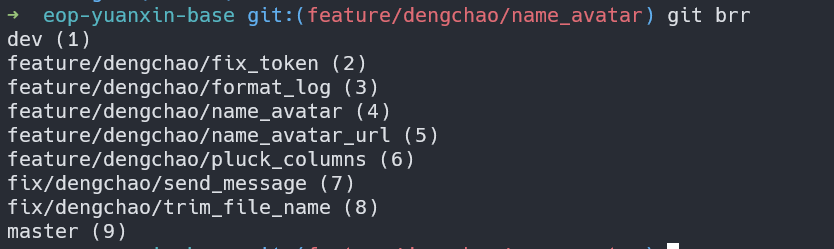

有时需要根据自己的工作场合去扩展 git 命令,比如
1. 推送到仓库后自动打开浏览器跳转到发起合并求页面
2. 分支命名比较长其相似度比较大时，自动补全不那么有效率，给每个分支编号，输入指定编号即可切换对应的分支

我最推荐的一种方式是利用 shell 脚本的特性，将脚本命名为 `git-xxxx`  方式，在终端就可以通过 git xxx 的方式运行该命令


下面是两个例子：
### 给每个分支编码
在 /usr/lcoal/bin 先新建 `git-brr` 文件,输入下面脚本： 
```bash
#!/bin/bash
git branch --no-color | cat -n | sed 's/*/ /' | awk '{print $2 " ("$1")"}'
```

`sudo chomd +x ./git-brr` 赋予可执行权限

然后到一个项目下执行  `git brr`


### 指定编号切换分支
在 /usr/lcoal/bin 先新建 `git-coo` 文件,输入下面脚本

```bash
#!/bin/bash
git checkout $( git brr | egrep "\($1)$" |  egrep -o '.+ ')
```
然后 `sudo chomd +x ./git-coo` 赋予可执行权限

此时就可已通过  git coo 4 切换对应的分支了