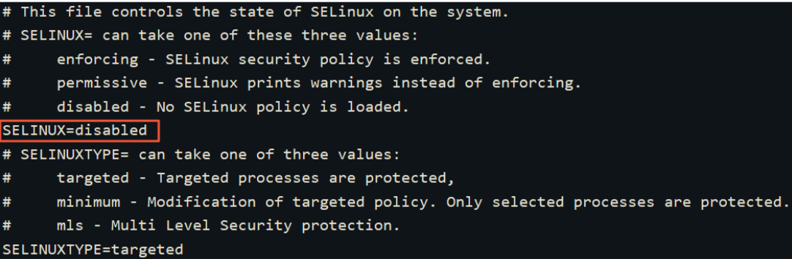
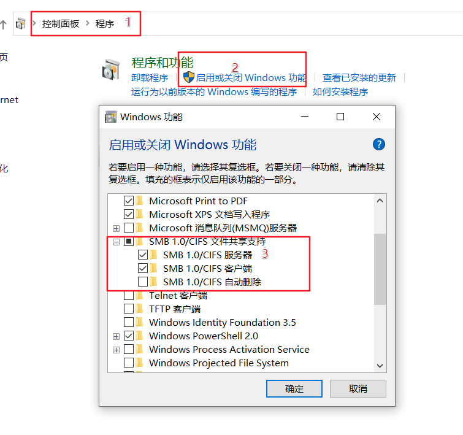
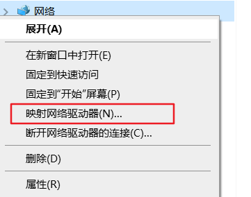
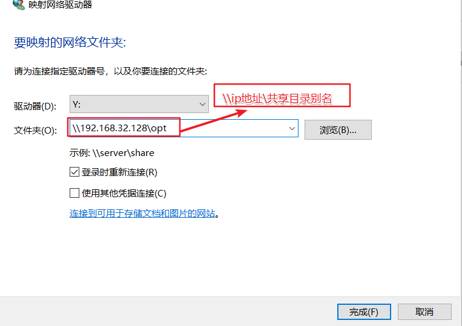

## 安装 samba

```shell
yum install samba
```

## 修改配置文件
修改配置文件 `vim  /etc/samba/smb.conf` 添加要共享的目录
```yml
[opt]   # 被共享目录的别名
        path = /home/dccmmtop/opt # 要共享的目录
        browseable = yes
        writable = yes # 可以写入
        valid users = dccmmtop # 用户，该用户要有目录的权限
        create mode=0777
        directory mode=0777
        force create mode=0777
        force directory mode=0777
```

## 添加用户
将用户 dccmmtop 设置为可以登录 samba
```shell
smbpasswd -a dccmmtop    // 设置 dccmmtop 的samba服务密码，可与用户密码相同
smbpasswd -e dccmmtop    // 启用samba用户，显示Enable则成功
```
## 关闭网络防火墙或添加端口

```shell
sudo systemctl stop firewalld.service
```
或者开放端口
```shell
sudo firewall-cmd --zone=public --add-port=139/tcp --permanent
sudo firewall-cmd --zone=public --add-port=445/tcp --permanent
sudo firewall-cmd --zone=public --add-port=137/udp --permanent
sudo firewall-cmd --zone=public --add-port=138/udp --permanent

sudo firewall-cmd --reload
sudo systemctl restart firewalld.service
```
## 关闭SELinux
安全增强型Linux（SELinux）是一个Linux内核的功能，它提供支持访问控制的安全政策保护机制
打开 `/etc/selinux/config` ,将 `SELINUX` 设置为 disabled


重启生效

### 临时修改

执行命令 `setenforce 0` 临时关闭SELinux

运行命令getenforce，验证SELinux状态为disabled，表明SELinux已关闭。
## 重启服务
```shell
systemctl restart smb.service // 不报错说明没问题
```


## windows 挂载

开启windows SMB 服务，如下

映射网络位置


之后输入上面设置的用户名密码就可以了