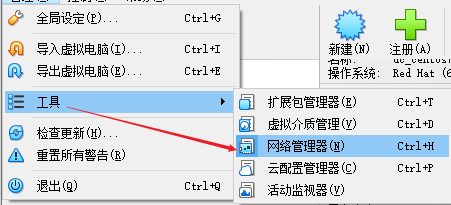
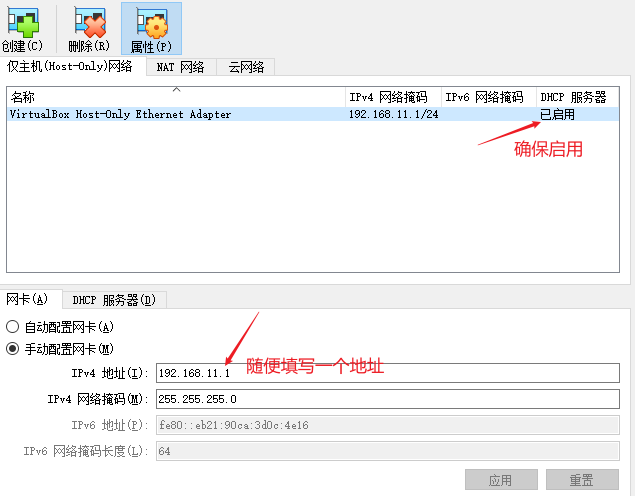
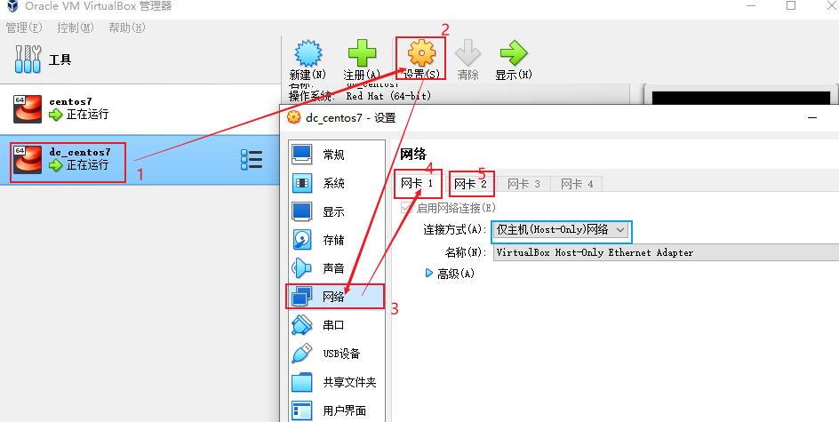
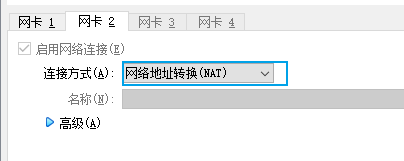
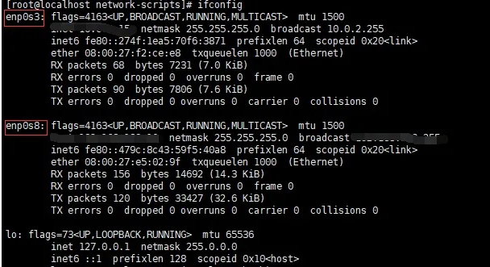
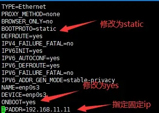

## 虚拟机中常用网络连接类型

- **网络地址转换 (NAT):** 连接这个网络可以访问外部网络，但是外部网络不可访问虚拟机
- **桥接网卡：** 这个网络完全可以共享主机网络，主机网络发生变化时，也跟随变化，ip 也随之变动
- **仅主机 (Host-Only) 网络：** 这个网络也可以用来主机访问虚拟机以及虚拟机上 web 服务，但是虚拟机不可访问外网

## 网络的选择

最简单的就是：选择桥接网卡，直接共享主机网络，主机、虚拟机之间访问都没有问题

但是我们家用或者公司使用，都不会固定 ip 的，主机随时变化，那么虚拟机的 ip 也随时变化，很不方便，我们希望虚拟机的 ip 是固定的，方便我们连接和访问服务使用

所以最终的选择是：网络地址转换 (NAT) + 仅主机 (Host-Only) 网络 的组合

## 实施步骤

### 1. 新增 仅主机 (Host-Only) 网络

操作步骤：管理 -> 工具 -> 网络管理器 -> 创建



创建：



### 2. 配置虚拟机网络





### 3. 虚拟机内部设置

启动 Centos7 执行 `ip a` 得到如下结果：



进入网络配置文件的路径 `cd /etc/sysconfig/network-scripts/` 可以看到 ifcfg-enp0s3 （仅主机 (Host-Only) 对应的配置）

`vi ifcfg-enp0s3`



修改完毕之后，需要重新启动网路 `systemctl restart network`

到这里就可以 执行 `ip a` 查看了，已经设置成固定 ip 了 同时 ping http://www.baidu.com 也是可以联网的

### 4. 防火墙配置
CentOS 7 的防火墙默认是 firewall 而不是之前的 iptables， 所以需要确定防火墙是否已经关闭，如果没有安装 iptables 的话， 只需要通过

```shell
systemctl stop firewalld.service  ## 关闭 firewall 防火墙
systemctl disable firewalld.service  ## 禁止开机启动
```
然后通过`firewall-cmd --state` 可以查看防火墙状态（关闭显示 notrunning，开启显示 running）。


**参考链接**
https://zhuanlan.zhihu.com/p/363202714