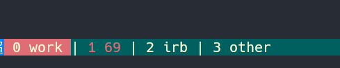

## 为什么要使用tmux?

对我个人而言，tmux 对我最大的吸引力就是 多窗口，以及会话的保持与恢复，我可以很方便的切换窗口，以及快速恢复工作环境



## 安装
我使用的是源码安装，
1. 下载源码 [下载链接](https://github.com/tmux/tmux/releases/tag/3.1c)
2. 解压
3. 进入到解压目录，执行 `./configure --prefix=/usr/local/tmux3.1c && make`  然后执行 `sudo make install`
   我个人喜欢指定目录，方便日后卸载，或切换版本,中间可能会有缺少依赖包的错误，根据错误提示信息取网上搜索对应的包安装即可，其实linux发展到现在，很多错误提示信息都非常详细，英语不好的可以翻译下，就知道失败的原因了，有时反而比直接复制错误信息取网上搜索快的多。
4. 此时已经安装完毕，可执行文件在 `/usr/lcoal/tmux3.1c/bin/tmux`,
5. 可以在 `/usr/bin/` 下创建 tmux 的软链，或者直接在 `~/.bash_profile` 文件中编写  `alias tmux='/usr/local/tmux3.1c/tmux'` 然后在终端执行
    `source ~/.bash_profile` 就可以让配置文件生效了。
## 配置及安装插件
下面是我的配置文件,以及说明
```bash
##-- bindkeys --#
### 修改前缀键为  ctrl a
set -g prefix ^a
unbind ^b
bind a send-prefix

# 窗口切换 我设置的键位和 vim 相通 
# ctrl + j 上一个窗口
bind -n C-j previous-window
# ctrl + k 下一个窗口
bind -n C-k next-window


# 设置松开鼠标不会自动跳到屏幕底部，这个特性需要稍微高一点的版本才支持
set -g mouse on
unbind -T copy-mode-vi MouseDragEnd1Pane


# 快速加载配置文件，不用重启 tmux
bind-key r source-file ~/.tmux.conf \; display-message "tmux.conf reloaded"

# 下面是底部状态栏的配置，个人不喜欢花里胡哨，简单够用即可
set -g message-style "bg=#00346e, fg=#ffffd7"        # tomorrow night blue, base3

set -g status-style "bg=#00346e, fg=#ffffd7"   # tomorrow night blue, base3
set -g status-left "#[bg=#0087ff] ❐ Hi!"       # blue
set -g status-left-length 400
set -g status-right ""
#set -g status-right "#[bg=red] %Y-%m-%d %H:%M "
#set -g status-right-length 600

set -wg window-status-format " #I #W "
set -wg window-status-current-format " #I #W "
set -wg window-status-separator "|"
set -wg window-status-current-style "bg=red" # red
set -wg window-status-last-style "fg=red"


# split window
unbind %
# 水平分隔窗口 快捷键是 prefix \ (我的前缀是 ctrl + A)
bind \\ split-window -h
unbind '"'
# 垂直分隔窗口 快捷键是 prefix -
bind - split-window -v

# select pane 面板之间跳转
bind k selectp -U # above (prefix k)
bind j selectp -D # below (prefix j)
bind h selectp -L # left (prefix h)
bind l selectp -R # right (prefix l)


# 下面是插件部分
# 用来保存会话 和 回复会话的 
# 保存会话快捷键是 prefix + ctrl + s (对应我的就是   ctrl + A ctrl + s 中间不要松开 ctrl 键)
# 恢复会话： prefix + ctrl + r
set -g @plugin 'tmux-plugins/tmux-resurrect'
set -g @continuum-restore 'on'
set -g @resurrect-save-bash-history 'on'
set -g @resurrect-capture-pane-contents 'on'
# 设置保存 vim 的工作状态
set -g @resurrect-strategy-vim 'session'
# 每隔60秒自动保存一次
set -g @continuum-save-interval '60'

# 鼠标选中即复制的插件
set -g @plugin 'tmux-plugins/tmux-yank'
set -g @yank_action 'copy-pipe'
set -g @yank_with_mouse on

#  安装插件的插件
# ctrl + I   即自动下载插件安装。
run '~/.tmux/plugins/tpm/tpm' 
```

### 结束！

有任何问题，欢迎下面留言，或者加我好友讨论哟！或者请我吃个糖果 (*^_^*)

