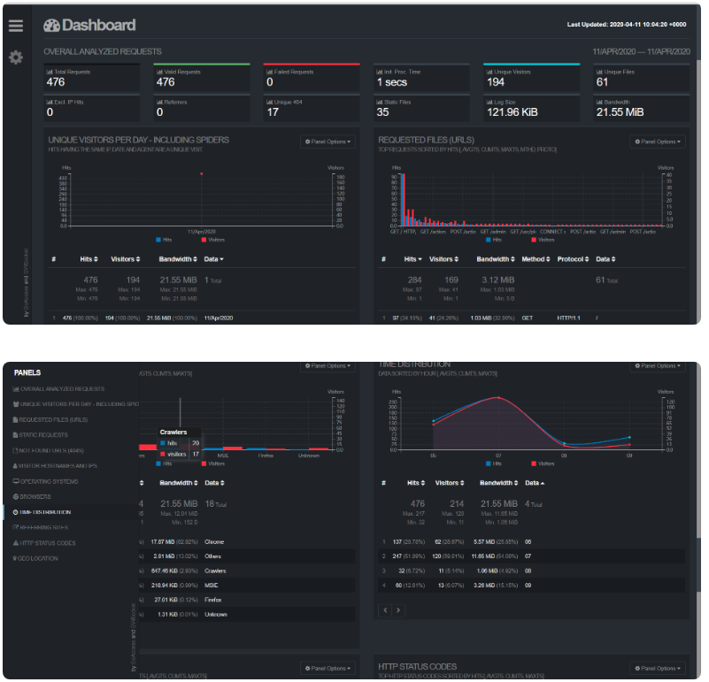

GoAccess的多种展示方式
goaccess有多种数据可视化的方式,分别为:

命令行输出格式化数据
利用access.log生成静态的可视化数据
生成实时可视化数据
注意，如果是编译安装且选择了 –enable-geoip=mmdb的话需要编辑配置文件，并在使用命令的时候带上参数 –config-file=/usr/local/etc/goaccess/goaccess.conf，如果是用包管理器安装的话则不需要

命令行输出GoAccess
goaccess /var/log/nginx/access.log -c，会先询问你数据的格式，我这里的日志使用的是第一种。


解析accesslog生成静态html
GoAccess还可以解析access.log生成静态html，以更加直观的方式来展示数据。

goaccess /var/log/nginx/access.log -o report.html --log-format=COMBINED，之后再使用浏览器访问report.html即可查看报告，各种数据一应俱全。



实时解析访问日志
GoAccess除了可以生成静态的html文件，还可以生成实时网站访问数据！

goaccess /var/log/nginx/access.log -o /var/www/html/report.html --log-format=COMBINED --real-time-html --config-file=/usr/local/etc/goaccess/goaccess.conf


添加中文支持
Goaccess 1.3之后的版本提供了多语言支持，先在命令行中执行 apt install language-pack-zh-hans 安装中文包，再使用export LANG=zh_CN.UTF-8修改环境变量，再次使用 goaccess /var/log/nginx/access.log -o /var/www/html/report.html --log-format=COMBINED --real-time-html --config-file=/usr/local/etc/goaccess/goaccess.conf启动GoAccess可以发现已经是中文界面了。

关于实时模式，可以查看官网的demo https://rt.goaccess.io/?20200209201008

异常退出
如果实时模式没有正常退出，可能无法再次正常启动，GoAccess默认使用7890 websocket端口，所以使用lsof -i:7890查看占用该端口的进程号并kill即可。

ssl支持
如果需要在加密连接上输出实时数据，则需要使用 --ssl-cert= 和 --ssl-key=,我在设置之后访问report.html发现数据依旧是静态的，突然想起我用了cloudflare cdn，而7890端口并不在cloudflare的支持端口列表里面，所以我使用参数 --ws-url=wss://服务器域名(我们的浏览器会尝试与该域名的8443端口见了ws连接):8443 --port=8443 把端口改成了8443。令人没想到的是，此时的report.html使用代理链接的时候是可以连接的，并可以查看实时信息，而直接连接的时候依旧是静态数据，tcping一看。


去cloudflare的官网可以发现如下内容

只有端口 80 和 443 可兼容以下服务：

对于启用了中国网络的域名的中国境内数据中心 HTTP/HTTPS 流量，
也就是说，国内是没办法通过cloudflare连接非80/443端口的…

反向代理
但是也不是没有办法连接，最后我想到了反向代理的方案。

将启动参数改为--ws-url=wss://你的域名.com/goaccess --port=7890

修改nginx站点配置文件 /etc/nginx/site-available/default,添加下面内容

    location /goaccess {
        proxy_redirect off;
        proxy_pass https://127.0.0.1:7890;
        proxy_http_version 1.1;
        proxy_set_header Upgrade $http_upgrade;
        proxy_set_header Connection "upgrade";
        proxy_set_header Host $http_host;
    }
注意，如果你的站点配置文件里面开启了url重写，为了避免 /goaccess 受到影响，我们需要把该路径排除重写。

# 把重写规则都放到location / 里面去
```shell
location / { 
    if (-f $request_filename/index.html){
    rewrite (.*) $1/index.html break;
    }
    if (-f $request_filename/index.php){
    rewrite (.*) $1/index.php;
    }
    if (!-f $request_filename){
    rewrite (.*) /index.php;
    }
} 
```
#下面什么都不需要做
```shell
location /goaccess/ {
}
```

之后重启nginx，再访问report.html，发现左边齿轮处终于显示connect了。


如果你只是自己看或者不在意ip暴露，其实直接使用ip直接连接不走cdn就没那么麻烦了。
