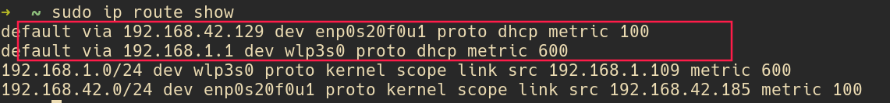
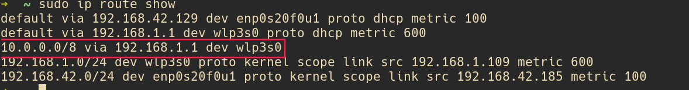
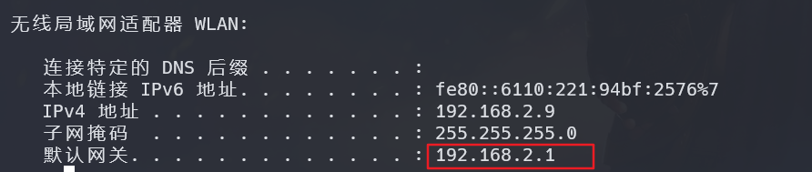

笔记本可以同时连接无线和有线，如果可以指定哪些ip使用无线，哪些ip地址可以使用有线，

假设无线连接的是内网， 有线连接的是外网，可以设置静态路由，使访问不同的地址使用不同的网络

## 首先确定 本机 无线和有线 的网关：

```shell
sudo ip route show
```


如上图 wlp3s0 是我的无线设备，enp0s20f0u1 是有线设备， 可以把网线拔了来确定哪个是什么设备
无线设备使用 192.168.1.1 作为网关
有线设备使用 192.168.42.129 作为网关

## 设置路由
假设 某公司的内网都是 10 开头的，

```shell
ip route add 10.0.0.0/8 via 192.168.1.1 dev wlp3s0
```
10.0.0.0/8 是DICP表示法，不懂可以使用 [站长工具](https://tool.chinaz.com/tools/subnetmask) 计算

此时在使用 `sudo ip route show` 查看路由表



### 永久生效

上述方法只能临时生效，可以写成脚本开机自启[arch 添加rc.local 实现开机自启](arch%20添加rc.local%20实现开机自启.md) 

本方法已在 arch 中验证 其他系统 大同小异，寻找 代替 ip route 的命令即可


# win 下设置方法
1. 使用管理员打开 powershell
2. `ipconfig` 查看优先和无线的网关



3. 
`route -p add 40.0.0.0 mask 255.0.0.0 192.168.2.1` 添加 40 开头的ip 走内网

`route -p add 10.0.0.0 mask 255.0.0.0 192.168.2.1` 添加 10 开头的ip 走内网