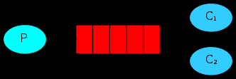

## 概念

MQ 全称 Message Queue（消息队列），是在消息的传输过程中保存消息的容器。**多用于分布式系统之间进行通信。**

**无 MQ:**


**有 MQ:**


## 优势
### 应用解耦

系统的耦合性越高，容错性就越低，可维护性就越低


### 异步提速


如图所示，在没有 MQ 的情况下，订单系统需要等待其他下游系统的反馈。总耗时： 20 + 300 + 300 + 300 = 920ms
加入 MQ 后，只需把任务交给 MQ, 然后让 MQ 给下游系统分发任务：


用户点击完下单按钮后，只需等待 25ms 就能得到下单响应 (20 + 5 = 25ms)。
提升用户体验和系统吞吐量（单位时间内处理请求的数目）。

### 削峰填谷

假设系统每秒最大能接受 1000 个请求，突然来了 5000 个请求，高并发下可能会导致服务不可用：


在用户请求和服务器之间加入一层 MQ:


使用了 MQ 之后，限制消费消息的速度为 1000，这样一来，高峰期产生的数据势必会被积压在 MQ 中，高峰就被“削”掉了，但是因为消息积压，在高峰期过后的一段时间内，消费消息的速度还是会维持在 1000，直到消费完积压的消息，这就叫做“填谷”。

**使用 MQ 后，可以提高系统稳定性。**

## 劣势
### 降低系统的可用性
系统引入的外部依赖越多，系统的稳定性越差，一旦MQ宕机，机会对业务造成影响，需要额外可虑MQ的高可用
### 提高系统的复杂性
MQ 的加入大大增加了系统的复杂度，以前系统间是同步的远程调用，现在是通过 MQ 进行异步调用。需要考虑消息丢失的情况


## 常见的 MQ 产品


## RabbitMQ 简介
2007年，Rabbit 技术公司基于 AMQP 标准开发的 RabbitMQ 1.0 发布。RabbitMQ 采用 Erlang 语言开发。Erlang 语言由 Ericson 设计，专门为开发高并发和分布式系统的一种语言，在电信领域使用广泛。

AMQP 即 Advanced Message Queuing Protocol（高级消息队列协议），是一个网络协议，是应用层协议的一个开放标准，为面向消息的中间件设计。基于此协议的客户端与消息中间件可传递消息，并不受客户端/中间件不同产品，不同的开发语言等条件的限制


### 架构图


图中涉及的几个概念:

#### Broker
接收和分发消息的应用，RabbitMQ Server 就是 Message Broker

#### Virtual host
**虚拟机**
出于多租户和安全因素考虑而设计的，把 AMQP 的基本组件划分到一个虚拟的分组中，类似与网络中的 namespace 概念，当不同的用户使用同一个 MQ 服务时，可以划分多个 vhost

#### Connection
就是生产者和消费者与MQ服务器之间的TCP链接

#### Channel
如果每一次访问都建立一个 connection, 在消息量大的时候建立TCP 链接对系统资源的消耗将是巨大的，Channel 是Connection 内部建立的逻辑链接，通常每个线程会单独创建 Channel与消息队列服务器进行通讯，每个channel 都有唯一标识，他们之间是完全隔离的，可以把channel 理解为轻量级的 connection。极大的减少了操作系统建立TCP链接的开销。

#### Exchange
**交换器**

是消息到达消息队列服务的第一站，可以根据分发规则把消息分发不同的队列中去。

交换器不像队列那样有真实的进程， **它只是一张名称与队列进程PID的关系表**

当你将消息发布到交换器时，实际上是由你所连接到的信道将消息上的路由键同交换器的绑定列表进行比较，然后路由消息。正是信道（channel）按照绑定匹配的结果，将消息路由到队列。 **信道才是真正的路由器**

由于交换器只是一张表，因此将交换器在整个集群中进行复制，更加简单

举例来说，当创建一个新的交换器时，RabbitMQ所要做的是将查询表添加到集群中的所有节点上。这时，每个节点上的每条信道都可以访问到新的交换器了。因此，相对于默认情况下队列的完整信息存在于集群中的单一节点来说，**集群中的每个节点拥有每个交换器的所有信息**。就可用性来讲，这非常棒，因为这意味着你不用担心在节点故障时重新声明交换器。**只需让故障节点上的生产者重新连接到集群上，它们立即就能开始往交换器上发布消息了**。

#### Queue
**队列**
消息最终被送达到这里，等待被消费者取走。

#### Binding
**绑定**
交换器和队列之间的虚拟连接，其实就是这两者之间的对应关系。

## 常用的五工作模式

### 简单模式
最简单的工作模式，值包含一个生产者，一个消费者。这种模式下不要指定交换器，使用默认的即可，如下图：


java 代码展示:

**依赖**
```xml
<dependencies>
    <dependency>
        <groupId>com.rabbitmq</groupId>
        <artifactId>amqp-client</artifactId>
        <version>5.3.0</version>
    </dependency>
</dependencies>
```

**生产者**

```java
import com.rabbitmq.client.Channel;
import com.rabbitmq.client.Connection;
import org.example.util.RabbitUtils;

import java.io.IOException;
import java.util.concurrent.TimeoutException;

/**
 * 生产者
 */
public class Producer {
    public static void main(String[] args) throws IOException, TimeoutException, InterruptedException {
        // 获得连接
        Connection connection = RabbitUtils.getConnection();
        // 获得 channel
        Channel channel = connection.createChannel();
        String queueName = "hello";
        // 声明队列并创建一个队列
        // 第一个参数： 队列名称
        // 第二个参数: 是否持久化队列, 不持久化队列时，MQ 重启后，队列中的消息会丢失
        // 第三个参数: 是否私有化队列，false 代表所有消费者都可以访问，true 代表只有第一次拥有它的消费者才能访问
        // 第四个参数: 是否自动删除，false 代表连接停掉后不自动删除这个队列
        // 其他额外参数： null
        channel.queueDeclare(queueName,false,false,false, null);
        // 发送消息
        String msg = "你好 dc";
        // 交换机： 简单模式下用不到, 后面的发布订阅模式下用到
        // 队列名称
        // 额外的参数
        // 发送的消息，字节形式
        channel.basicPublish("", queueName,null,msg.getBytes());
        System.out.println("消息已发送");
        channel.close();
        // 关闭连接
        connection.close();
    }
}
```

**消费者**
```java
import com.rabbitmq.client.*;
import org.example.util.RabbitUtils;

import java.io.IOException;

/**
 * 消费者
 */
public class Consumer {
    public static void main(String[] args) throws IOException {
        // 获取连接
        Connection connection = RabbitUtils.getConnection();
        // 获取chanel
        Channel channel = connection.createChannel();
        // 要绑定的队列, 参数同消费者
        String queueName = "hello";
        channel.queueDeclare(queueName,false,false,false,null);
        // 接受并处理消息
        // 队列名称
        // 是否自动确认收到消息, false 代表需要编程手动来确认，这是MQ推荐的做法
        // 用来处理接收到的消息，是 DefaultConsumer 的实现类
        channel.basicConsume(queueName,false,new Reciver(channel));
        // 不要关闭连接，要持续等待消息的到来
    }
}

class Reciver extends DefaultConsumer {

    private Channel channel;
    public Reciver(Channel channel) {
        super(channel);
        this.channel = channel;
    }

    @Override
    public void handleDelivery(String consumerTag, Envelope envelope, AMQP.BasicProperties properties, byte[] body) throws IOException {
        String msg = new String(body);
        System.out.println("消费者收到消息: " + msg);
        System.out.println("消息的TagId: " + envelope.getDeliveryTag());
        // 第二个参数： false 代表只确认签收当前的消息，true: 代表签收该消费者所有未签收的消息
        channel.basicAck(envelope.getDeliveryTag(),false);
    }
}
```

### woker queues
工作队列



与简单模式相比消费从单个变成了多个，当单个消费者能力不足时，可以增加多个消费者同时去处理队列中的任务。

消息队列服务对任务的分发有两种方式：1. 轮询机制，挨个给每个消费者分发任务，100 个任务，2个消费者，每个消费者依次处理50个任务。 2. 公平模式： 消费者处理完一个任务时立刻派发新的任务，不关系上个任务是不是该消费者处理。也就是能者多劳。

**展示**

**生产者:**
```java

import com.rabbitmq.client.Channel;
import com.rabbitmq.client.Connection;
import org.example.util.RabbitUtils;

import java.io.IOException;
import java.util.concurrent.TimeoutException;

/**
 * 生产者
 */
public class Producer {
    public static void main(String[] args) throws IOException, TimeoutException, InterruptedException {
        // 获得连接
        Connection connection = RabbitUtils.getConnection();
        // 获得 channel
        Channel channel = connection.createChannel();
        String queueName = "hello";
        // 声明队列并创建一个队列
        // 第一个参数： 队列名称
        // 第二个参数: 是否持久化队列, 不持久化队列时，MQ 重启后，队列中的消息会丢失
        // 第三个参数: 是否私有化队列，false 代表所有消费者都可以访问，true 代表只有第一次拥有它的消费者才能访问
        // 第四个参数: 是否自动删除，false 代表连接停掉后不自动删除这个队列
        // 其他额外参数： null
        channel.queueDeclare(queueName,false,false,false, null);
        // 发送消息
        String msg = "你好 dc";
        // 交换机： 简单模式下用不到, 后面的发布订阅模式下用到
        // 队列名称
        // 额外的参数
        // 发送的消息，字节形式
        for (int i = 0; i < 100; i++) {
            String m1 = msg + i;
            channel.basicPublish("", queueName,null,m1.getBytes());
        }
        System.out.println("消息已发送");
        channel.close();
        // 关闭连接
        connection.close();
    }

}
```


**消费者1**
```java
import com.rabbitmq.client.*;
import org.example.util.RabbitUtils;

import java.io.IOException;

/**
 * 消费者
 */
public class Consumer1 {
    public static void main(String[] args) throws IOException {
        // 获取连接
        Connection connection = RabbitUtils.getConnection();
        // 获取chanel
        Channel channel = connection.createChannel();
        // 要绑定的队列, 参数同消费者
        String queueName = "hello";
        channel.queueDeclare(queueName,false,false,false,null);
        // 处理完一个再取一个。公平模式, 默认是轮询机制
//        channel.basicQos(1);
        // 接受并处理消息
        // 队列名称
        // 是否自动确认收到消息, false 代表需要编程手动来确认，这是MQ推荐的做法
        // 用来处理接收到的消息
        channel.basicConsume(queueName, false, new DefaultConsumer(channel){
            @Override
            public void handleDelivery(String consumerTag, Envelope envelope, AMQP.BasicProperties properties, byte[] body) throws IOException {
                String msg = new String(body);
                System.out.println("消费者1收到消息: " + msg + "。TagId: " + envelope.getDeliveryTag());
                try {
                    // 模拟处理任务的耗时
                    Thread.sleep(100);
                } catch (InterruptedException e) {
                    throw new RuntimeException(e);
                }
                // 第二个参数： false 代表只确认签收当前的消息，true: 代表签收该消费者所有未签收的消息
                channel.basicAck(envelope.getDeliveryTag(),false);
            }
        });
        // 不要关闭连接，要持续等待消息的到来
    }
}

```

**消费者2**
```java
import com.rabbitmq.client.*;
import org.example.util.RabbitUtils;

import java.io.IOException;

/**
 * 消费者
 */
public class Consumer2 {
    public static void main(String[] args) throws IOException {
        // 获取连接
        Connection connection = RabbitUtils.getConnection();
        // 获取chanel
        Channel channel = connection.createChannel();
        // 要绑定的队列, 参数同消费者
        String queueName = "hello";
        channel.queueDeclare(queueName,false,false,false,null);
        // 处理完一个再取一个。公平模式, 默认是轮询机制
//        channel.basicQos(1);
        // 接受并处理消息
        // 队列名称
        // 是否自动确认收到消息, false 代表需要编程手动来确认，这是MQ推荐的做法
        // 用来处理接收到的消息
        channel.basicConsume(queueName, false, new DefaultConsumer(channel){
            @Override
            public void handleDelivery(String consumerTag, Envelope envelope, AMQP.BasicProperties properties, byte[] body) throws IOException {
                String msg = new String(body);
                System.out.println("消费者2收到消息: " + msg + "。TagId: " + envelope.getDeliveryTag());
                try {
                    // 模拟处理任务的耗时
                    Thread.sleep(500);
                } catch (InterruptedException e) {
                    throw new RuntimeException(e);
                }
                // 第二个参数： false 代表只确认签收当前的消息，true: 代表签收该消费者所有未签收的消息
                channel.basicAck(envelope.getDeliveryTag(),false);
            }
        });
        // 不要关闭连接，要持续等待消息的到来
    }
}
```

**轮询机制输出结果:**

不管两个消费者处理消息能力的强弱，被分配的任务一样多:
```txt
消费者1收到消息: 你好 dc0。TagId: 1
消费者1收到消息: 你好 dc2。TagId: 2
消费者1收到消息: 你好 dc4。TagId: 3
消费者1收到消息: 你好 dc6。TagId: 4
消费者1收到消息: 你好 dc8。TagId: 5
消费者1收到消息: 你好 dc10。TagId: 6
消费者1收到消息: 你好 dc12。TagId: 7
消费者1收到消息: 你好 dc14。TagId: 8
消费者1收到消息: 你好 dc16。TagId: 9
消费者1收到消息: 你好 dc18。TagId: 10
```

```txt
消费者2收到消息: 你好 dc1。TagId: 1
消费者2收到消息: 你好 dc3。TagId: 2
消费者2收到消息: 你好 dc5。TagId: 3
消费者2收到消息: 你好 dc7。TagId: 4
消费者2收到消息: 你好 dc9。TagId: 5
消费者2收到消息: 你好 dc11。TagId: 6
消费者2收到消息: 你好 dc13。TagId: 7
消费者2收到消息: 你好 dc15。TagId: 8
消费者2收到消息: 你好 dc17。TagId: 9
消费者2收到消息: 你好 dc19。TagId: 10
```

**公平模式下的输出结果:**

消费者1处理能力强，单位时间内处理任务数多
```txt
消费者1收到消息: 你好 dc0。TagId: 1
消费者1收到消息: 你好 dc2。TagId: 2
消费者1收到消息: 你好 dc3。TagId: 3
消费者1收到消息: 你好 dc4。TagId: 4
消费者1收到消息: 你好 dc5。TagId: 5
消费者1收到消息: 你好 dc7。TagId: 6
消费者1收到消息: 你好 dc8。TagId: 7
消费者1收到消息: 你好 dc9。TagId: 8
消费者1收到消息: 你好 dc10。TagId: 9
消费者1收到消息: 你好 dc11。TagId: 10
消费者1收到消息: 你好 dc13。TagId: 11
消费者1收到消息: 你好 dc14。TagId: 12
消费者1收到消息: 你好 dc15。TagId: 13
消费者1收到消息: 你好 dc16。TagId: 14
消费者1收到消息: 你好 dc17。TagId: 15
消费者1收到消息: 你好 dc19。TagId: 16
消费者1收到消息: 你好 dc20。TagId: 17
```

消费者2处理能力弱，单位时间内处理任务数少
```txt
消费者2收到消息: 你好 dc1。TagId: 1
消费者2收到消息: 你好 dc6。TagId: 2
消费者2收到消息: 你好 dc12。TagId: 3
消费者2收到消息: 你好 dc18。TagId: 4
消费者2收到消息: 你好 dc23。TagId: 5
消费者2收到消息: 你好 dc29。TagId: 6
消费者2收到消息: 你好 dc35。TagId: 7
消费者2收到消息: 你好 dc40。TagId: 8
消费者2收到消息: 你好 dc46。TagId: 9
消费者2收到消息: 你好 dc52。TagId: 10
消费者2收到消息: 你好 dc58。TagId: 11
消费者2收到消息: 你好 dc63。TagId: 12
消费者2收到消息: 你好 dc69。TagId: 13
消费者2收到消息: 你好 dc75。TagId: 14
消费者2收到消息: 你好 dc81。TagId: 15
消费者2收到消息: 你好 dc86。TagId: 16
消费者2收到消息: 你好 dc92。TagId: 17
```

### Publish/Subscribe
发布订阅模式
TODO
### Routing
TODO
### Topics
TODO