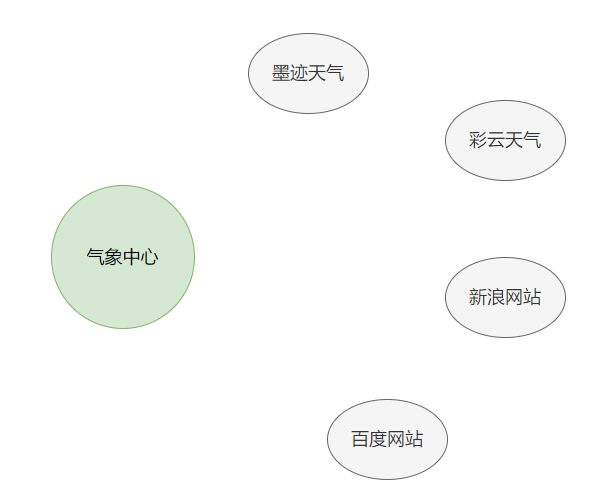
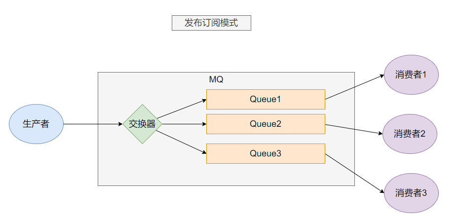

## 概念

MQ 全称 Message Queue（消息队列），是在消息的传输过程中保存消息的容器。**多用于分布式系统之间进行通信。**

**无 MQ**


**有 MQ**


## 优势
### 应用解耦

系统的耦合性越高，容错性就越低，可维护性就越低


### 异步提速


如图所示，在没有 MQ 的情况下，订单系统需要等待其他下游系统的反馈。总耗时： 20 + 300 + 300 + 300 = 920ms
加入 MQ 后，只需把任务交给 MQ, 然后让 MQ 给下游系统分发任务：


用户点击完下单按钮后，只需等待 25ms 就能得到下单响应 (20 + 5 = 25ms)。
提升用户体验和系统吞吐量（单位时间内处理请求的数目）。

### 削峰填谷

假设系统每秒最大能接受 1000 个请求，突然来了 5000 个请求，高并发下可能会导致服务不可用：


在用户请求和服务器之间加入一层 MQ:


使用了 MQ 之后，限制消费消息的速度为 1000，这样一来，高峰期产生的数据势必会被积压在 MQ 中，高峰就被“削”掉了，但是因为消息积压，在高峰期过后的一段时间内，消费消息的速度还是会维持在 1000，直到消费完积压的消息，这就叫做“填谷”。

**使用 MQ 后，可以提高系统稳定性。**

## 劣势
### 降低系统的可用性
系统引入的外部依赖越多，系统的稳定性越差，一旦 MQ 宕机，机会对业务造成影响，需要额外可虑 MQ 的高可用
### 提高系统的复杂性
MQ 的加入大大增加了系统的复杂度，以前系统间是同步的远程调用，现在是通过 MQ 进行异步调用。需要考虑消息丢失的情况

## 常见的 MQ 产品


## RabbitMQ 简介
2007 年，Rabbit 技术公司基于 AMQP 标准开发的 RabbitMQ 1.0 发布。RabbitMQ 采用 Erlang 语言开发。Erlang 语言由 Ericson 设计，专门为开发高并发和分布式系统的一种语言，在电信领域使用广泛。

AMQP 即 Advanced Message Queuing Protocol（高级消息队列协议），是一个网络协议，是应用层协议的一个开放标准，为面向消息的中间件设计。基于此协议的客户端与消息中间件可传递消息，并不受客户端/中间件不同产品，不同的开发语言等条件的限制

### 架构图


图中涉及的几个概念：
#### Broker
接收和分发消息的应用，RabbitMQ Server 就是 Message Broker

#### Virtual host
**虚拟机**
出于多租户和安全因素考虑而设计的，把 AMQP 的基本组件划分到一个虚拟的分组中，类似与网络中的 namespace 概念，当不同的用户使用同一个 MQ 服务时，可以划分多个 vhost

#### Connection
就是生产者和消费者与 MQ 服务器之间的 TCP 链接

#### Channel
如果每一次访问都建立一个 connection, 在消息量大的时候建立 TCP 链接对系统资源的消耗将是巨大的，Channel 是 Connection 内部建立的逻辑链接，通常每个线程会单独创建 Channel 与消息队列服务器进行通讯，每个 channel 都有唯一标识，他们之间是完全隔离的，可以把 channel 理解为轻量级的 connection。极大的减少了操作系统建立 TCP 链接的开销。

#### Exchange
**交换器**

是消息到达消息队列服务的第一站，可以根据分发规则把消息分发不同的队列中去。

> 交换器不像队列那样有真实的进程， **它只是一张名称与队列进程 PID 的关系表**
> 当你将消息发布到交换器时，实际上是由你所连接到的信道将消息上的路由键同交换器的绑定列表进行比较，然后路由消息。正是信道（channel）按照绑定匹配的结果，将消息路由到队列。 **信道才是真正的路由器**
>由于交换器只是一张表，因此将交换器在整个集群中进行复制，更加简单
>举例来说，当创建一个新的交换器时，RabbitMQ 所要做的是将查询表添加到集群中的所有节点上。这时，每个节点上的每条信道都可以访问到新的交换器了。因此，相对于默认情况下队列的完整信息存在于集群中的单一节点来说，**集群中的每个节点拥有每个交换器的所有信息**。就可用性来讲，这非常棒，因为这意味着你不用担心在节点故障时重新声明交换器。**只需让故障节点上的生产者重新连接到集群上，它们立即就能开始往交换器上发布消息了**。

#### Queue
**队列**
消息最终被送达到这里，等待被消费者取走。

#### Binding
**绑定**
交换器和队列之间的虚拟连接，其实就是这两者之间的对应关系。

## 常用的五工作模式

### 简单模式
最简单的工作模式，只包含一个生产者，一个消费者。这种模式下不要指定交换器，使用默认的即可，如下图：


java 代码展示：
**依赖**
```xml
<dependencies>
    <dependency>
        <groupId>com.rabbitmq</groupId>
        <artifactId>amqp-client</artifactId>
        <version>5.3.0</version>
    </dependency>
</dependencies>
```

**rabbitmq 连接工具类**
```java

import com.rabbitmq.client.Connection;
import com.rabbitmq.client.ConnectionFactory;

public class RabbitUtils {
    private static ConnectionFactory connectionFactory  = new ConnectionFactory();
    static {
        connectionFactory.setHost("127.0.0.1");
        // 默认端口号
        connectionFactory.setPort(5672);
        connectionFactory.setUsername("dc");
        connectionFactory.setPassword("Aa111111");
        // 设置要连接的虚机
        connectionFactory.setVirtualHost("/dc0407");
    }

    public static Connection getConnection(){
        Connection connection = null;
        try {
            connection = connectionFactory.newConnection();
            return connection;
        } catch (Exception e) {
            throw new RuntimeException(e);
        }
    }

}

```

**生产者**

```java
import com.rabbitmq.client.Channel;
import com.rabbitmq.client.Connection;
import org.example.util.RabbitUtils;

import java.io.IOException;
import java.util.concurrent.TimeoutException;

/**
 * 生产者
 */
public class Producer {
    public static void main(String[] args) throws IOException, TimeoutException, InterruptedException {
        // 获得连接
        Connection connection = RabbitUtils.getConnection();
        // 获得 channel
        Channel channel = connection.createChannel();
        String queueName = "hello";
        // 声明队列并创建一个队列
        // 第一个参数： 队列名称
        // 第二个参数：是否持久化队列，不持久化队列时，MQ 重启后，队列中的消息会丢失
        // 第三个参数：是否私有化队列，false 代表所有消费者都可以访问，true 代表只有第一次拥有它的消费者才能访问
        // 第四个参数：是否自动删除，false 代表连接停掉后不自动删除这个队列
        // 其他额外参数： null
        channel.queueDeclare(queueName,false,false,false, null);
        // 发送消息
        String msg = "你好 dc";
        // 交换机： 简单模式下用不到，后面的发布订阅模式下用到
        // 队列名称
        // 额外的参数
        // 发送的消息，字节形式
        channel.basicPublish("", queueName,null,msg.getBytes());
        System.out.println("消息已发送");
        channel.close();
        // 关闭连接
        connection.close();
    }
}
```

**消费者**
```java
import com.rabbitmq.client.*;
import org.example.util.RabbitUtils;

import java.io.IOException;

/**
 * 消费者
 */
public class Consumer {
    public static void main(String[] args) throws IOException {
        // 获取连接
        Connection connection = RabbitUtils.getConnection();
        // 获取 chanel
        Channel channel = connection.createChannel();
        // 要绑定的队列，参数同消费者
        String queueName = "hello";
        channel.queueDeclare(queueName,false,false,false,null);
        // 接受并处理消息
        // 队列名称
        // 是否自动确认收到消息，false 代表需要编程手动来确认，这是 MQ 推荐的做法
        // 用来处理接收到的消息，是 DefaultConsumer 的实现类
        channel.basicConsume(queueName,false,new Reciver(channel));
        // 不要关闭连接，要持续等待消息的到来
    }
}

class Reciver extends DefaultConsumer {

    private Channel channel;
    public Reciver(Channel channel) {
        super(channel);
        this.channel = channel;
    }

    @Override
    public void handleDelivery(String consumerTag, Envelope envelope, AMQP.BasicProperties properties, byte[] body) throws IOException {
        String msg = new String(body);
        System.out.println("消费者收到消息：" + msg);
        System.out.println("消息的 TagId: " + envelope.getDeliveryTag());
        // 第二个参数： false 代表只确认签收当前的消息，true: 代表签收该消费者所有未签收的消息
        channel.basicAck(envelope.getDeliveryTag(),false);
    }
}
```

### woker queues
工作队列


与简单模式相比消费从单个变成了多个，当单个消费者能力不足时，可以增加多个消费者同时去处理队列中的任务。

消息队列服务对任务的分发有两种方式：1. 轮询机制，挨个给每个消费者分发任务，100 个任务，2 个消费者，每个消费者依次处理 50 个任务。 2. 公平模式： 消费者处理完一个任务时立刻派发新的任务，不关系上个任务是不是该消费者处理。也就是能者多劳。

**展示**

**生产者：**
```java

import com.rabbitmq.client.Channel;
import com.rabbitmq.client.Connection;
import org.example.util.RabbitUtils;

import java.io.IOException;
import java.util.concurrent.TimeoutException;

/**
 * 生产者
 */
public class Producer {
    public static void main(String[] args) throws IOException, TimeoutException, InterruptedException {
        // 获得连接
        Connection connection = RabbitUtils.getConnection();
        // 获得 channel
        Channel channel = connection.createChannel();
        String queueName = "hello";
        // 声明队列并创建一个队列
        // 第一个参数： 队列名称
        // 第二个参数：是否持久化队列，不持久化队列时，MQ 重启后，队列中的消息会丢失
        // 第三个参数：是否私有化队列，false 代表所有消费者都可以访问，true 代表只有第一次拥有它的消费者才能访问
        // 第四个参数：是否自动删除，false 代表连接停掉后不自动删除这个队列
        // 其他额外参数： null
        channel.queueDeclare(queueName,false,false,false, null);
        // 发送消息
        String msg = "你好 dc";
        // 交换机： 简单模式下用不到，后面的发布订阅模式下用到
        // 队列名称
        // 额外的参数
        // 发送的消息，字节形式
        for (int i = 0; i < 100; i++) {
            String m1 = msg + i;
            channel.basicPublish("", queueName,null,m1.getBytes());
        }
        System.out.println("消息已发送");
        channel.close();
        // 关闭连接
        connection.close();
    }

}
```

**消费者 1**
```java
import com.rabbitmq.client.*;
import org.example.util.RabbitUtils;

import java.io.IOException;

/**
 * 消费者
 */
public class Consumer1 {
    public static void main(String[] args) throws IOException {
        // 获取连接
        Connection connection = RabbitUtils.getConnection();
        // 获取 chanel
        Channel channel = connection.createChannel();
        // 要绑定的队列，参数同消费者
        String queueName = "hello";
        channel.queueDeclare(queueName,false,false,false,null);
        // 处理完一个再取一个。公平模式，默认是轮询机制
//        channel.basicQos(1);
        // 接受并处理消息
        // 队列名称
        // 是否自动确认收到消息，false 代表需要编程手动来确认，这是 MQ 推荐的做法
        // 用来处理接收到的消息
        channel.basicConsume(queueName, false, new DefaultConsumer(channel){
            @Override
            public void handleDelivery(String consumerTag, Envelope envelope, AMQP.BasicProperties properties, byte[] body) throws IOException {
                String msg = new String(body);
                System.out.println("消费者 1 收到消息：" + msg + "。TagId: " + envelope.getDeliveryTag());
                try {
                    // 模拟处理任务的耗时
                    Thread.sleep(100);
                } catch (InterruptedException e) {
                    throw new RuntimeException(e);
                }
                // 第二个参数： false 代表只确认签收当前的消息，true: 代表签收该消费者所有未签收的消息
                channel.basicAck(envelope.getDeliveryTag(),false);
            }
        });
        // 不要关闭连接，要持续等待消息的到来
    }
}

```

**消费者 2**
```java
import com.rabbitmq.client.*;
import org.example.util.RabbitUtils;

import java.io.IOException;

/**
 * 消费者
 */
public class Consumer2 {
    public static void main(String[] args) throws IOException {
        // 获取连接
        Connection connection = RabbitUtils.getConnection();
        // 获取 chanel
        Channel channel = connection.createChannel();
        // 要绑定的队列，参数同消费者
        String queueName = "hello";
        channel.queueDeclare(queueName,false,false,false,null);
        // 处理完一个再取一个。公平模式，默认是轮询机制
//        channel.basicQos(1);
        // 接受并处理消息
        // 队列名称
        // 是否自动确认收到消息，false 代表需要编程手动来确认，这是 MQ 推荐的做法
        // 用来处理接收到的消息
        channel.basicConsume(queueName, false, new DefaultConsumer(channel){
            @Override
            public void handleDelivery(String consumerTag, Envelope envelope, AMQP.BasicProperties properties, byte[] body) throws IOException {
                String msg = new String(body);
                System.out.println("消费者 2 收到消息：" + msg + "。TagId: " + envelope.getDeliveryTag());
                try {
                    // 模拟处理任务的耗时
                    Thread.sleep(500);
                } catch (InterruptedException e) {
                    throw new RuntimeException(e);
                }
                // 第二个参数： false 代表只确认签收当前的消息，true: 代表签收该消费者所有未签收的消息
                channel.basicAck(envelope.getDeliveryTag(),false);
            }
        });
        // 不要关闭连接，要持续等待消息的到来
    }
}
```

**轮询机制输出结果：**

不管两个消费者处理消息能力的强弱，被分配的任务一样多：
```txt
消费者 1 收到消息：你好 dc0。TagId: 1
消费者 1 收到消息：你好 dc2。TagId: 2
消费者 1 收到消息：你好 dc4。TagId: 3
消费者 1 收到消息：你好 dc6。TagId: 4
消费者 1 收到消息：你好 dc8。TagId: 5
消费者 1 收到消息：你好 dc10。TagId: 6
消费者 1 收到消息：你好 dc12。TagId: 7
消费者 1 收到消息：你好 dc14。TagId: 8
消费者 1 收到消息：你好 dc16。TagId: 9
消费者 1 收到消息：你好 dc18。TagId: 10
```

```txt
消费者 2 收到消息：你好 dc1。TagId: 1
消费者 2 收到消息：你好 dc3。TagId: 2
消费者 2 收到消息：你好 dc5。TagId: 3
消费者 2 收到消息：你好 dc7。TagId: 4
消费者 2 收到消息：你好 dc9。TagId: 5
消费者 2 收到消息：你好 dc11。TagId: 6
消费者 2 收到消息：你好 dc13。TagId: 7
消费者 2 收到消息：你好 dc15。TagId: 8
消费者 2 收到消息：你好 dc17。TagId: 9
消费者 2 收到消息：你好 dc19。TagId: 10
```

**公平模式下的输出结果：**

消费者 1 处理能力强，单位时间内处理任务数多
```txt
消费者 1 收到消息：你好 dc0。TagId: 1
消费者 1 收到消息：你好 dc2。TagId: 2
消费者 1 收到消息：你好 dc3。TagId: 3
消费者 1 收到消息：你好 dc4。TagId: 4
消费者 1 收到消息：你好 dc5。TagId: 5
消费者 1 收到消息：你好 dc7。TagId: 6
消费者 1 收到消息：你好 dc8。TagId: 7
消费者 1 收到消息：你好 dc9。TagId: 8
消费者 1 收到消息：你好 dc10。TagId: 9
消费者 1 收到消息：你好 dc11。TagId: 10
消费者 1 收到消息：你好 dc13。TagId: 11
消费者 1 收到消息：你好 dc14。TagId: 12
消费者 1 收到消息：你好 dc15。TagId: 13
消费者 1 收到消息：你好 dc16。TagId: 14
消费者 1 收到消息：你好 dc17。TagId: 15
消费者 1 收到消息：你好 dc19。TagId: 16
消费者 1 收到消息：你好 dc20。TagId: 17
```

消费者 2 处理能力弱，单位时间内处理任务数少
```txt
消费者 2 收到消息：你好 dc1。TagId: 1
消费者 2 收到消息：你好 dc6。TagId: 2
消费者 2 收到消息：你好 dc12。TagId: 3
消费者 2 收到消息：你好 dc18。TagId: 4
消费者 2 收到消息：你好 dc23。TagId: 5
消费者 2 收到消息：你好 dc29。TagId: 6
消费者 2 收到消息：你好 dc35。TagId: 7
消费者 2 收到消息：你好 dc40。TagId: 8
消费者 2 收到消息：你好 dc46。TagId: 9
消费者 2 收到消息：你好 dc52。TagId: 10
消费者 2 收到消息：你好 dc58。TagId: 11
消费者 2 收到消息：你好 dc63。TagId: 12
消费者 2 收到消息：你好 dc69。TagId: 13
消费者 2 收到消息：你好 dc75。TagId: 14
消费者 2 收到消息：你好 dc81。TagId: 15
消费者 2 收到消息：你好 dc86。TagId: 16
消费者 2 收到消息：你好 dc92。TagId: 17
```

### Publish/Subscribe

**发布订阅模式**

目前为止，系统中只出现了一个队列，队列中的消息一般只能被消费一次，当一个消费者从队列中取出消息后，其他消费者便无法再次处理该消息了。

假如有一个天气预报发布系统，有一个气象发布中心以及各大气象软件和门户网站，这些软件和网站都要从气象中心获取天气信息。如下图：


气象发布中心不可能一个个去对接不同的展示平台，他们是把天气信息按照一定的格式发布到某个地方，其他各大展示平台都从这里获取。现在我们用 RabbitMQ 来设计这套系统，上面介绍的工作队列模式就无法适用了，因为如果一个地方的天气信息被“墨迹天气”取走后，这条消息就没了，肯定不合适。我们自然想到每个天气展示平台都去绑定一个队列，各自从队列中接收气象中发布的消息。而气象中心每次都要向这些队列中依次发布消息。就像下面这样：


这样是可行，只不过在生产者一端增加了几行代码而已，但是这样做大大的增加了系统的耦合度。每当新增加一个展示平台时，气象中心都要修改代码新增一个推送消息的队列。

这种一端发布，多端都能收到的场景很像广播站与收音机的关系。只要用户把收音机调到固定频道，就都可以接收到来自该频道的信息。在 RabbitMQ 中也有这种广播模式，而这种广播模式就是依靠`交换器`来实现的。 如下图：


这种模式下，生产者只需把消息发送指定交换器上，消费者绑定队列的时候，声明一下队列与交换器的关系即可。生产者在发布消息时，交换器会根据这种绑定关系把消息向所有队列都发送一遍。

下面来看一下代码实现：

需要先在RabbitMQ 管理端创建``weather_routing_exchange`交换器 , 类型是 fanout

**气象站**
```java
import com.rabbitmq.client.Channel;
import com.rabbitmq.client.Connection;
import org.example.util.RabbitUtils;

import java.io.IOException;
import java.util.concurrent.TimeoutException;

/**
 * 气象站
 */
public class WeatherStation {
    public static void main(String[] args) throws IOException, TimeoutException {
        Connection connection = RabbitUtils.getConnection();
        Channel channel = connection.createChannel();

        String weather= "{'date': '2023-04-10','location':'郑州','text': '晴，16℃~28℃'}";
        // 第一个参数：指定交换器
        // 第二个参数：路由 key, 暂时用不到。
        // 第三个参数：额外信息
        // 第四个参数：消息内容，字节形式
        // 与工作队列模式不同，这里直接发布消息了，没有指定发布到哪个队列中，这是由 RabbitMQ 中的交换器来决定的
        channel.basicPublish("weather_exchange","",null,weather.getBytes());

        weather= "{'date': '2023-04-10','location':'新乡','text': '多云，10℃~26℃'}";
        channel.basicPublish("weather_exchange","",null,weather.getBytes());

        channel.close();
        connection.close();
    }
}

```

**墨迹 APP**
```java
import com.rabbitmq.client.*;
import org.example.util.RabbitUtils;

import java.io.IOException;

/**
 * 墨迹 APP
 */
public class MoJiApp {
    public static void main(String[] args) throws IOException {
        Connection connection = RabbitUtils.getConnection();
        Channel channel = connection.createChannel();
        String queueName = "moji";
        // 声明一个队列
        channel.queueDeclare(queueName,false,false,false, null);
        // 绑定队列与交换器的关系
        channel.queueBind(queueName,"weather_exchange","");
        channel.basicQos(1);
        // 监听消息
        channel.basicConsume(queueName,false, new DefaultConsumer(channel){
            @Override
            public void handleDelivery(String consumerTag, Envelope envelope, AMQP.BasicProperties properties, byte[] body) throws IOException {
                System.out.println("墨迹 APP 收到天气信息：" + new String(body));
                channel.basicAck(envelope.getDeliveryTag(),false);
            }
        });

    }
}

```

**彩云 APP**
```java
import com.rabbitmq.client.*;
import org.example.util.RabbitUtils;

import java.io.IOException;

/**
 * 彩云 APP
 */
public class CaiYunApp {
    public static void main(String[] args) throws IOException {
        Connection connection = RabbitUtils.getConnection();
        Channel channel = connection.createChannel();
        String queueName = "caiyun";
        // 声明一个队列
        channel.queueDeclare(queueName,false,false,false, null);
        // 绑定队列与交换器的关系
        channel.queueBind(queueName,"weather_exchange","");
        channel.basicQos(1);
        // 监听消息
        channel.basicConsume(queueName,false, new DefaultConsumer(channel){
            @Override
            public void handleDelivery(String consumerTag, Envelope envelope, AMQP.BasicProperties properties, byte[] body) throws IOException {
                System.out.println("彩云 APP 收到天气信息：" + new String(body));
                channel.basicAck(envelope.getDeliveryTag(),false);
            }
        });

    }
}
```

输出：
```txt
墨迹 APP 收到天气信息：{'date': '2023-04-10','location':'郑州','text': '晴，16℃~28℃'}
墨迹 APP 收到天气信息：{'date': '2023-04-10','location':'新乡','text': '多云，10℃~26℃'}
```

```txt
彩云 APP 收到天气信息：{'date': '2023-04-10','location':'郑州','text': '晴，16℃~28℃'}
彩云 APP 收到天气信息：{'date': '2023-04-10','location':'新乡','text': '多云，10℃~26℃'}
```

这种发布订阅模式实现了一端发布，多端订阅的功能，一旦客户端绑定了队列与交换器的关系，只要发布在交换器上的消息，该客户端都可以收到。假如墨迹 APP 用户只想关注郑州的天气，彩云 APP 用户只想关注新乡的天气。这又该如何做呢？最先想到的可能就是让气象站按照地区给交换器分类，郑州的天气往郑州的交换器上发，新乡的天气往新乡的交换器上发，等等。但是这样会很麻烦，假如以后国家多了一个省，或者行政区域有变动，岂不是又要气象站修改代码。

### Routing
这时候交换器的路由模式，就派上用场了，生产者在发布一条消息时，可以给该消息指定一个`路由 key`, 消费者在绑定队列与交换器的关系时，可以指定具有哪一种的`路由 key`的消息应该发布到该队列里面，而不是一股脑的全部接收该交换器的所有消息。如下图；


下面看一下代码实现；
需要先在RabbitMQ 管理端创建``weather_routing_exchange`交换器 , 类型是 direct


**气象站**

```java
import com.rabbitmq.client.Channel;
import com.rabbitmq.client.Connection;
import org.example.util.RabbitUtils;

import java.io.IOException;
import java.util.ArrayList;
import java.util.List;
import java.util.concurrent.TimeoutException;

/**
 * 气象站
 */
public class WeatherStation {
    public static void main(String[] args) throws IOException, TimeoutException {
        Connection connection = RabbitUtils.getConnection();
        Channel channel = connection.createChannel();

        List<Weather> weatherList = new ArrayList<>();
        weatherList.add(new Weather("zhengzhou","郑州晴，16℃~28℃"));
        weatherList.add(new Weather("xinxiang","新乡多云，10℃~26℃"));

        for (Weather weather : weatherList) {
            // 指定了路由key， 路由key的格式是地区
            channel.basicPublish("weather_routing_exchange",weather.getKey(),null,weather.getMsg().getBytes());
        }

        channel.close();
        connection.close();
    }
}

class Weather{
    private String key;
    private String msg;

    public Weather(String key, String msg) {
        this.key = key;
        this.msg = msg;
    }

    public String getKey() {
        return key;
    }

    public String getMsg() {
        return msg;
    }
}

```

**墨迹APP**

```java
import com.rabbitmq.client.*;
import org.example.util.RabbitUtils;

import java.io.IOException;

/**
 * 墨迹APP
 */
public class MoJiApp {
    public static void main(String[] args) throws IOException {
        Connection connection = RabbitUtils.getConnection();
        Channel channel = connection.createChannel();
        String queueName = "moji";
        // 声明一个队列
        channel.queueDeclare(queueName,false,false,false, null);
        // 绑定队列与交换器的关系,同时指定了路由key是郑州
        channel.queueBind(queueName,"weather_routing_exchange","zhengzhou");
        channel.basicQos(1);
        // 监听消息
        channel.basicConsume(queueName,false, new DefaultConsumer(channel){
            @Override
            public void handleDelivery(String consumerTag, Envelope envelope, AMQP.BasicProperties properties, byte[] body) throws IOException {
                System.out.println("墨迹APP 收到天气信息: " + new String(body));
                channel.basicAck(envelope.getDeliveryTag(),false);
            }
        });

    }
}

```

**彩云APP**
```java
import com.rabbitmq.client.*;
import org.example.util.RabbitUtils;

import java.io.IOException;

/**
 * 彩云APP
 */
public class CaiYunApp {
    public static void main(String[] args) throws IOException {
        Connection connection = RabbitUtils.getConnection();
        Channel channel = connection.createChannel();
        String queueName = "caiyun";
        // 声明一个队列
        channel.queueDeclare(queueName,false,false,false, null);
        // 绑定队列与交换器的关系
        channel.queueBind(queueName,"weather_routing_exchange","xinxiang");
        channel.basicQos(1);
        // 监听消息
        channel.basicConsume(queueName,false, new DefaultConsumer(channel){
            @Override
            public void handleDelivery(String consumerTag, Envelope envelope, AMQP.BasicProperties properties, byte[] body) throws IOException {
                System.out.println("彩云APP 收到天气信息: " + new String(body));
                channel.basicAck(envelope.getDeliveryTag(),false);
            }
        });
    }
}
```


**输出内容**
```txt
墨迹APP 收到天气信息: 郑州晴，16℃~28℃
```

```txt
彩云APP 收到天气信息: 新乡多云，10℃~26℃
```

### Topics

这种模式就比较好理解了，上面的 Routing 模式是要求key完全一致，消息才能被交换器投递到队列。而Topics 模式支持统配符的key，在设计key的时候，一般由多个关键词组成，并用.连接，而通配符支持两种模式:

1. `#`: 匹配一个或者多个单词  
2. `*`: 只匹配一个单词

例如 item.# 可以匹配 item.insert  item.insert.abc
     item.* 只能匹配 item.insert
     
这种模式最灵活，用的最多


## 总结

- 简单模式: 一个生产者，一个队列，一个消费者。
- 工作队列模式: 一个队列，多个消费者。队列种的消息只能被消费一次，可以增加消费者的数量快速处理队列中的任务。队列中的任务派发给消费者的模式有两种: 1. 轮询。 2. 能者多劳
- 发布订阅模式: 引入交换器，多个队列，多个消费者。实现一端发布，多端都能收到消息
- 路由模式: 在发布订阅的基础上，给消费者增加了自由选择消息的能力。通过全值匹配路由key实现的
- Topics 模式: 在路由模式的基础上，路由key采用通配符的匹配方式， 这种模式最灵活，使用最多

## 消息的可靠投递

RabbitMQ 通过两个回调方法来让生产者确认消息是否正确投递到队列中，
1. 消息是否投递到交换器中，调用 confirmListener
2. 消息是否投递到队列中，调用 returnListener

### confirmListener

示例代码:

```java
//测试 Confirm 模式
@Test
public void testConfirm() {
    //定义回调
    rabbitTemplate.setConfirmCallback(new RabbitTemplate.ConfirmCallback() {
        /**
            *
            * @param correlationData 相关配置信息
            * @param ack   exchange交换机 是否成功收到了消息。true 成功，false代表失败
            * @param cause 失败原因
            */
        @Override
        public void confirm(CorrelationData correlationData, boolean ack, String cause) {
            System.out.println("confirm方法被执行了....");

                //ack 为  true表示 消息已经到达交换机
            if (ack) {
                //接收成功
                System.out.println("接收成功消息" + cause);
            } else {
                //接收失败
                System.out.println("接收失败消息" + cause);
                //做一些处理，让消息再次发送。
            }
        }
    });

        //进行消息发送
    rabbitTemplate.convertAndSend("test_exchange_confirm","confirm","message Confirm...");
}
```

### returnListener

```java
//测试 return模式
@Test
public void testReturn() {

    //设置交换机处理失败消息的模式   为true的时候，消息达到不了 队列时，会将消息重新返回给生产者
    rabbitTemplate.setMandatory(true);

    //定义回调
    rabbitTemplate.setReturnCallback(new RabbitTemplate.ReturnCallback() {
        /**
            *
            * @param message   消息对象
            * @param replyCode 错误码
            * @param replyText 错误信息
            * @param exchange  交换机
            * @param routingKey 路由键
            */
        @Override
        public void returnedMessage(Message message, int replyCode, String replyText, String exchange, String routingKey) {
            System.out.println("return 执行了....");

            System.out.println("message:"+message);
            System.out.println("replyCode:"+replyCode);
            System.out.println("replyText:"+replyText);
            System.out.println("exchange:"+exchange);
            System.out.println("routingKey:"+routingKey);

            //处理
        }
    });
    //进行消息发送
    rabbitTemplate.convertAndSend("test_exchange_confirm","confirm","message return...");
}
```
