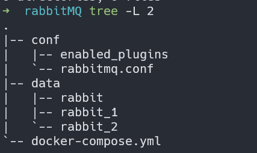

本文采用docker-compose 的方式部署 rabbitMQ集群

### docker-compose.yml
```yml
version: "3"
services:
  rabbitmq:
    restart: always
    container_name: rabbitMQ
    image: rabbitmq:3.7.7-management
    # 注意 hostname（本地域名）, rabbitMQ集群之间的通信就是靠此寻址的。物理机部署时也可以使用固定IP
    hostname: rabbitmq
    environment:
      RABBITMQ_NODE_PORT: 5672
      # 指定虚拟主机的名称
      RABBITMQ_DEFAULT_VHOST: my_vhost
      RABBITMQ_DEFAULT_USER: admin
      RABBITMQ_DEFAULT_PASS: admin
      # 指定 erlang_cookie, 集群中的所有节点的值必须保持一致， erlang 使用该值作为通信的密钥
      RABBITMQ_ERLANG_COOKIE: rabbitmq_erlang_cookie
    ports:
      - 15672:15672
    volumes:
      - ./data/rabbit:/var/lib/rabbitmq
      - ./conf:/etc/rabbitmq
  rabbitmq1:
    restart: always
    container_name: rabbitMQ_1
    image: rabbitmq:3.7.7-management
    hostname: rabbitmq1
    environment:
      RABBITMQ_NODE_PORT: 5672
      RABBITMQ_DEFAULT_VHOST: my_vhost
      RABBITMQ_DEFAULT_USER: admin
      RABBITMQ_DEFAULT_PASS: admin
      RABBITMQ_ERLANG_COOKIE: rabbitmq_erlang_cookie
    ports:
      - 15673:15672
    volumes:
      - ./data/rabbit_1:/var/lib/rabbitmq
      - ./conf:/etc/rabbitmq
  rabbitmq2:
    restart: always
    container_name: rabbitMQ_2
    image: rabbitmq:3.7.7-management
    hostname: rabbitmq2
    environment:
      RABBITMQ_NODE_PORT: 5672
      RABBITMQ_DEFAULT_VHOST: my_vhost
      RABBITMQ_DEFAULT_USER: admin
      RABBITMQ_DEFAULT_PASS: admin
      RABBITMQ_ERLANG_COOKIE: rabbitmq_erlang_cookie
    ports:
      - 15674:15672
    volumes:
      - ./data/rabbit_2:/var/lib/rabbitmq
      - ./conf:/etc/rabbitmq
```

#### 集群节点之间如何通信
 如上配置所示，我们并没有像之前的服务那样，使用 link 明确的标识与其他服务的链接关系。那么这是如何让 3 个节点互相通信的呢？

原来docker 1.0 版本之后，会内置一个域名服务器，可以进入容器内部查看 `/etc/reslv.conf` 文件，会发现 `nameserver 127.0.0.11` 配置。
这就是默认域名解析服务器的地址。我们在配置文件中指定了 `hostname` 的值,在容器启动的时候，就会向域名服务器注册信息，域名服务器会记域名与该机器ip的对应关系，后面我们在容器中使用 hostname 去访问其他服务时，便会通过域名服务器找到对应的IP是什么，从而访问该服务


### 目录结构

如上配置所示， 分别使用 `./data/rabbit` `./data/rabbit_1` `./data/rabbit_2` 作为每个节点的数据卷
使用 `./conf` 作为配置文件的卷
所以有如下目录结构



其中 `rabbitmq.conf` 配置如下

```conf
loopback_users.guest = false
listeners.tcp.default = 5672
default_pass = admin
default_user = admin
default_vhost = my_vhost
hipe_compile = false
management.listener.port = 15672
management.listener.ssl = false

# 下面配置针对 rabbitmq-mqtt 插件, 没有开启mqtt插件的，忽略
mqtt.default_user = mqtt_user
mqtt.default_pass = Aa111111
mqtt.allow_anonymous = true
mqtt.vhost = my_vhost
```

enabled_plugins 配置如下

```txt
[rabbitmq_management,rabbitmq_mqtt,rabbitmq_web_mqtt].
```

开启了 web 端管理界面，mqtt 、 mqtt_web 插件

### 启动容器

检查配置正确后，启动容器
```shell
docker-compose up -d
```

### 集群配置

可以分别进入三个容器内部检查容器日志，确定全部启动成功后，进入 rabbitMQ_1 容器中，执行
```shell
rabbitmqctl stop_app
```

该命令会停止当前容器中的rabbitMQ 服务，rabbitMQ 是使用 erlang 语言编写的， rabbitMQ 自然要运行在 erlang 虚拟中，就像 java class 运行在 jvm 虚拟机中一样的道理。 所以上面的命令只是停止 rabbitMQ服务，erlang 虚拟机仍然在运行着。

现在我们将 rabbitMQ 作为主节点， rabbitMQ_1, rabbitMQ_2 作为从节点，把 rabbtitMQ_1 加入 rabbitMQ 中:

```shell
rabbitmqctl join_cluster rabbit@rabbitmq # rabbitmq 就是你的域名或ip地址, 前面的 rabbit@ 是固定写法
```

等待命令成功执行后，再执行如下命令启动 rabbit 服务

```shell
rabbitmqctl start_app
```

然后可以执行 `rabbitmqctl cluser_status` 查看节点运行状态， rabbitMQ_2 容器中重复上述步骤即可

集群状态如下:


可以看到集群中已经由三个磁盘节点了。

至于为什么叫磁盘节点，期待后续！