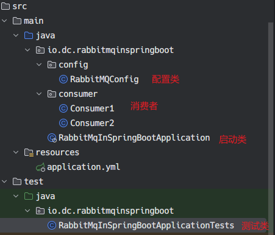
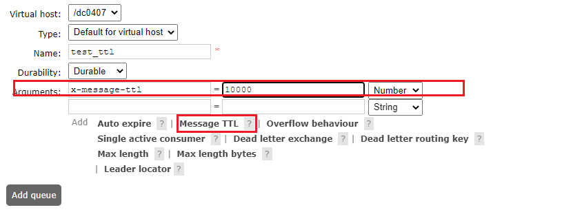
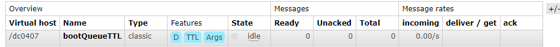

- [简单示例](#简单示例)
  - [项目结构](#项目结构)
  - [依赖](#依赖)
  - [配置](#配置)
  - [生产者](#生产者)
  - [消费者](#消费者)
- [消息的可靠投递示例](#消息的可靠投递示例)
  - [confirm](#confirm)
  - [return](#return)
- [消费者确认机制](#消费者确认机制)
- [消费端限流](#消费端限流)
- [TTL](#ttl)
  - [单条消息](#单条消息)
  - [整个队列设置 TTL](#整个队列设置-ttl)
- [死信队列](#死信队列)
- [延迟队列](#延迟队列)
- [消息幂等设计](#消息幂等设计)


## 简单示例
### 项目结构


### 依赖
```xml
<dependencies>
    <dependency>
        <groupId>org.springframework.boot</groupId>
        <artifactId>spring-boot-starter-amqp</artifactId>
    </dependency>

    <dependency>
        <groupId>org.springframework.boot</groupId>
        <artifactId>spring-boot-starter-test</artifactId>
    </dependency>
    <dependency>
        <groupId>org.springframework.boot</groupId>
        <artifactId>spring-boot-starter-test</artifactId>
    </dependency>
    <dependency>
        <groupId>junit</groupId>
        <artifactId>junit</artifactId>
        <version>RELEASE</version>
        <scope>compile</scope>
    </dependency>
</dependencies>
```

### 配置

```yml
spring:
  rabbitmq:
    host: 127.0.0.1
    port: 5672
    username: dc
    password: Aa111111
    virtual-host: /dc0407
    # 让发布者可以收到消息是否投递成功的回调
    # 默认是 false
    publisher-confirms: true

    listener:
      simple:
        # 消费者开启手动确认模式，默认是 none 
        acknowledge-mode: manual
        # 每次消费一个
        prefetch: 1
```

```java
package io.dc.rabbitmqinspringboot.config;

import org.springframework.amqp.core.*;
import org.springframework.amqp.rabbit.config.SimpleRabbitListenerContainerFactory;
import org.springframework.amqp.rabbit.connection.CachingConnectionFactory;
import org.springframework.amqp.rabbit.connection.ConnectionFactory;
import org.springframework.beans.factory.annotation.Qualifier;
import org.springframework.beans.factory.annotation.Value;
import org.springframework.context.annotation.Bean;
import org.springframework.context.annotation.Configuration;

@Configuration
public class RabbitMQConfig {
    public static final String EXCHANGE_NAME = "boot_topic_exchange";
    public static final String QUEUE_NAME = "boot_queue";

    // 1. 声明交换机
    @Bean("bootTopicExchange")
    public Exchange bootExchange(){
        return ExchangeBuilder.topicExchange(EXCHANGE_NAME).durable(false).build();
    }

    // 2. 声明队列
    @Bean("bootQueue")
    public Queue bootQueue(){
        return QueueBuilder.durable(QUEUE_NAME).build();
    }

    // 3. 将队列与交换器进行绑定
    @Bean
    public Binding bindQueueExchange(@Qualifier("bootQueue") Queue queue, @Qualifier("bootTopicExchange") Exchange exchange){
        return BindingBuilder.bind(queue).to(exchange).with("boot.#").noargs();
    }

    // 自定义连接工厂，自由程度高，本次演示没用到
    @Bean("customConnectionFactory")
    public ConnectionFactory connectionFactory(
            @Value("${spring.rabbitmq.host}") String host,
            @Value("${spring.rabbitmq.port}") int port,
            @Value("${spring.rabbitmq.username}") String username,
            @Value("${spring.rabbitmq.password}") String password,
            @Value("${spring.rabbitmq.virtual-host}") String vhost
    ){
        CachingConnectionFactory factory = new CachingConnectionFactory();
        factory.setHost(host);
        factory.setPort(port);
        factory.setUsername(username);
        factory.setPassword(password);
        factory.setVirtualHost(vhost);

        return factory;
    }

    // 自定义消息监听器工厂，自由程度高
    @Bean(name = "customListenFactory")
    public SimpleRabbitListenerContainerFactory listenerContainerFactory(@Qualifier("customConnectionFactory") ConnectionFactory connectionFactory){
        SimpleRabbitListenerContainerFactory factory = new SimpleRabbitListenerContainerFactory();
        factory.setConnectionFactory(connectionFactory);
        // 设置手动签收
        factory.setAcknowledgeMode(AcknowledgeMode.MANUAL);
        // 设置预处理数量，同时没有确认的消息不能超过 N 个，起到消费者限流的作用，详细解释见下
        factory.setPrefetchCount(5);
        return factory;
    }
}

```

### 生产者

在测试类中发消息
```java

package io.dc.rabbitmqinspringboot;

import io.dc.rabbitmqinspringboot.config.RabbitMQConfig;
import org.junit.Test;
import org.junit.runner.RunWith;
import org.springframework.amqp.core.Message;
import org.springframework.amqp.rabbit.connection.CorrelationData;
import org.springframework.amqp.rabbit.core.RabbitTemplate;
import org.springframework.beans.factory.annotation.Autowired;
import org.springframework.boot.test.context.SpringBootTest;
import org.springframework.test.context.junit4.SpringJUnit4ClassRunner;

@SpringBootTest
@RunWith(SpringJUnit4ClassRunner.class)
public class RabbitMqInSpringBootApplicationTests {

    @Autowired
    RabbitTemplate rabbitTemplate;

   // 发一次消息
    @Test
    public void sendMsg() {
        rabbitTemplate.convertAndSend(RabbitMQConfig.EXCHANGE_NAME,"boot.dc","你好 rabbitMQ");
    }
    // 批量发消息
    @Test
    public void sendBatchMsg() {
        for (int i = 0; i < 10; i++) {
            rabbitTemplate.convertAndSend(RabbitMQConfig.EXCHANGE_NAME,"boot.dc","你好 rabbitMQ");
        }
    }
}
```

### 消费者

简单版，自动 ack

```java
package io.dc.rabbitmqinspringboot.consumer;

import io.dc.rabbitmqinspringboot.config.RabbitMQConfig;
import org.springframework.amqp.rabbit.annotation.RabbitListener;
import org.springframework.stereotype.Component;
import org.springframework.amqp.core.Message;

@Component
public class Consumer1 {
    @RabbitListener(queues = RabbitMQConfig.QUEUE_NAME)
    public void listenerQueue(Message message){
        System.out.println("消费者 1 接收到消息："+ message);
    }
}
```

手动 ack:
需要在配置文件中额外设置为手动确认：manual

```java
package io.dc.rabbitmqinspringboot.consumer;

import com.rabbitmq.client.Channel;
import io.dc.rabbitmqinspringboot.config.RabbitMQConfig;
import org.springframework.amqp.core.Message;
import org.springframework.amqp.rabbit.annotation.RabbitListener;
import org.springframework.amqp.rabbit.listener.api.ChannelAwareMessageListener;
import org.springframework.stereotype.Component;

@Component
public class Consumer2 {
    // 也可以采用自定义监听工厂
    // @RabbitListener(queues = RabbitMQConfig.QUEUE_NAME, containerFactory = "customListenFactory")
    @RabbitListener(queues = RabbitMQConfig.QUEUE_NAME)
    public void onMessage(Message message, Channel channel) throws Exception {
        System.out.println("消费者 2 收到消息：" + new String(message.getBody()));
        long deliveryTag = message.getMessageProperties().getDeliveryTag();
        System.out.println("消息 Id: " + deliveryTag);
        // 进行消息签收，如果不签收，将只会收到 ${listener.simple.prefetch} 个消息，因为设置了手动签收模式
        channel.basicAck(deliveryTag, true);
        
        // 拒绝签收
        // 最后一个参数： 是否重回队列
//        channel.basicNack(deliveryTag,false, false);
    }
}

```

## 消息的可靠投递示例

在 [RabbitMQ 的基本概念和五种模式使用示例](https://blog.csdn.net/a141210104/article/details/130022768) 中已经介绍了两种实现可靠投递的机制，这里仅作为一个完整的补充：
### confirm

```java
@Test
public void testConfirm(){
    rabbitTemplate.setConfirmCallback(new RabbitTemplate.ConfirmCallback() {
        @Override
        public void confirm(CorrelationData correlationData, boolean b, String s) {
            System.out.println("执行了 confirm 方法。..");
            if(b){
                System.out.println("发送成功");
            }else{
                System.out.println("发送失败：" + s);
            }
        }
    });

    // 正常
    rabbitTemplate.convertAndSend(RabbitMQConfig.EXCHANGE_NAME,"boot.dc","你好 rabbitMQ");
    // 错误的交换器。会打印发送失败
    rabbitTemplate.convertAndSend(RabbitMQConfig.EXCHANGE_NAME + "111","boot.dc","你好 rabbitMQ");
    try {
        Thread.sleep(5000);
    } catch (InterruptedException e) {
        throw new RuntimeException(e);
    }
}

```

### return

```java
@Test
public void testReturn(){
    // 只有设置 true，消息无法到达队列时，才会退回给生产者
    rabbitTemplate.setMandatory(true);
    rabbitTemplate.setReturnCallback(new RabbitTemplate.ReturnCallback() {
        /**
        *
        * @param message the returned message.
        * @param replyCode the reply code.
        * @param replyText the reply text.
        * @param exchange the exchange.
        * @param routingKey the routing key.
        */
        @Override
        public void returnedMessage(Message message, int replyCode, String replyText, String exchange, String routingKey) {
            System.out.println("消息退回了~");
            System.out.println("message: " + message.toString());
            System.out.println("replyCode: " + replyCode);
            System.out.println("replyText: " + replyText);
            System.out.println("exchange: " + exchange);
            System.out.println("routingKey: " + routingKey);
        }
    });
    // 正常
    rabbitTemplate.convertAndSend(RabbitMQConfig.EXCHANGE_NAME,"boot.dc","你好 rabbitMQ");
    // 错误的路由 key。消息会被退回
    rabbitTemplate.convertAndSend(RabbitMQConfig.EXCHANGE_NAME,"1111_boot.dc","你好 rabbitMQ");
    try {
        Thread.sleep(5000);
    } catch (InterruptedException e) {
        throw new RuntimeException(e);
    }
}
```

## 消费者确认机制
Ack 指的是 ack 指 Acknowledge，确认。 表示消费端收到消息后的确认方式。

有三种确认方式：
- 自动确认 acknowledge = none
- 手动确认 acknowledge = manual
- 根据异常情况确认 acknowledge = auto 这种情况使用麻烦，一般不用
  
其中自动确认是指，当消息一旦被 Consumer 接收到，则自动确认收到，并将相应 message 从 RabbitMQ 的消息缓存中移除。但是在实际业务处理中，很可能消息接收到，业务处理出现异常，那么该消息就会丢失。如果设置了手动确认方式，则需要在业务处理成功后，调用 channel.basicAck()，手动签收，如果出现异常，则调用 channel.basicNack() 方法，让其自动重新发送消息。

消费者调用 `basicAck` 或者 `basicNack` 签收或拒绝

消息可靠性总结：
1. 持久化： exchange 要持久化，queue 要持久化， message 要持久化
2. 生产者要 confirm
3. 消费者要 ack
4. Broker 要高可用

## 消费端限流

假设有一个场景：服务端挤压了大量的消息消息，此时启动消费者客户端，大量的消息会瞬间流入该客户端，可能会让客户端宕机。

当数据量特别大的时候，对生产者限制肯定是不科学的，这是用户的行为，我们应该对消费端限流。

RabbitMQ 提供了一种 qos（服务质量保证）功能，在非自动确认消息的前提下，如果一定数目的消息未被确认前，不消费新得消息

设置方法：

```java
/**
    * Request specific "quality of service" settings.
    *
    * These settings impose limits on the amount of data the server
    * will deliver to consumers before requiring acknowledgements.
    * Thus they provide a means of consumer-initiated flow control.
    * @see com.rabbitmq.client.AMQP.Basic.Qos
    * @param prefetchSize maximum amount of content (measured in
    * octets) that the server will deliver, 0 if unlimited
    * @param prefetchCount maximum number of messages that the server
    * will deliver, 0 if unlimited
    * @param global true if the settings should be applied to the
    * entire channel rather than each consumer
    * @throws java.io.IOException if an error is encountered
    */
void basicQos(int prefetchSize, int prefetchCount, boolean global) throws IOException;
```

- prefetchSize: 每条消息得大小。0： 不限制 **注意： RabbitMQ 没有实现这个功能**
- prefetchCount: 一次性消费消息得数量，会告诉 RabbitMQ 不要同时个同一个客户端推送对于 N 个消息，也就是一旦超过 N 个消息美欧被 ack，则该客户端就会阻塞，知道有消息 ack
- global: true / false 是否将上面得设置应用到 channel，简单得说上面得限制是 channel 级别还是某个消费者客户端级别。设置 false 的时候生效，**因为 rabbitmq 没有实现 channel 级别的控制**

在 sprinBoot 中，对客户端限流只需配置 `prefetch` 即可。和调用 `basicQos(0, N, false)` 效果一样

## TTL

TTL 全称是 Time To Live （存活时间）, 当消息到达存活时间后还没有被消费就会自动清除，这与 redis 中的过期时间概念类似，我们应该合理应用 TTL，可以有效的处理过期的垃圾信息，从而降低服务器的负载。

RabbitMQ 既可以对单条消息设置存活时间，也可以对整个队列设置

### 单条消息
```java
@Test
public void sendMsgWithTtl() {

    MessageProperties properties1 = new MessageProperties();
    properties1.setExpiration("6000");
    Message message = new Message("你好".getBytes(),properties1);

    rabbitTemplate.convertAndSend(RabbitMQConfig.EXCHANGE_NAME,"boot.dc",message);
}
```

### 整个队列设置 TTL
可以在后管设置：



也可以在代码中设置：
```java
// 2. 声明队列
@Bean("bootQueueTTL")
public Queue bootQueue(){
    Map<String, Object> arg = new HashMap<>();
    arg.put("x-message-ttl",10000);
    return QueueBuilder.durable("bootQueueTTL").withArguments(arg).build();
}
```
后管查看结果：


**如果两者都设置了 TTL 以短的时间为准**

## 死信队列
TODO

## 延迟队列
TODO

## 消息幂等设计
TODO