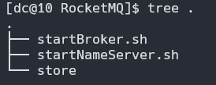

- [介绍](#介绍)
- [快速安装](#快速安装)
- [验证](#验证)
- [基本使用](#基本使用)
- [RocketMQ 的编程模型](#rocketmq-的编程模型)
- [RocketMQ 的消息样例](#rocketmq-的消息样例)
  - [基本样例](#基本样例)
  - [顺序消息](#顺序消息)
  - [广播消息](#广播消息)
  - [延迟消息](#延迟消息)
  - [批量消息](#批量消息)
  - [过滤消息](#过滤消息)
  - [事务消息](#事务消息)
  - [ACL 权限控制](#acl-权限控制)

## 介绍

在 [RabbitMQ 的基本概念和五种模式使用示例](https://blog.csdn.net/a141210104/article/details/130022768) 前半部分介绍了 MQ 的应用场景，以及多个 MQ 产品的对比，那时说到 RocketMQ 的客户端版本只有 Java , 现在 Apache RocketMQ 社区中也增加了 C++  NodeJS  Python Go 的客户端。

RocketMQ 是阿里巴巴开源的一个消息中间件，在阿里内部历经了双十一等很多高并发场景的考验，能够处理**亿万级别**的消息。2016 年开源后捐赠给 Apache，现在是 Apache 的一个顶级项目。 目前 RocketMQ 在阿里云上有一个购买即可用的商业版本，商业版本集成了阿里内部一些更深层次的功能及运维定制。我们这里学习的是 Apache 的开源版本。开源版本相对于阿里云上的商业版本，功能上略有缺失，但是大体上功能是一样

## 快速安装

RocketMQ 的安装时非常简单的，可以参见官网，这里我选择了 docker 的安装方式，简单的记录一下：
新建一个目录，目录中有如下结构：


1. 部署 nameserver

新建 `startNameServer.sh`, 写入如下命令：

```shell
sudo docker run  -d --net=host apache/rocketmq ./mqnamesrv
```

运行 `sh ./startNameServer.sh`

2. 部署 Broker

新建 `startBroker.sh`, 写入如下命令：

```shell
sudo docker run -d --net=host --mount type=bind,source=/tmp/,target=/home/dc/code/RocketMQ/store apache/rocketmq ./mqbroker -n localhost:9876
```

记得把对应的目录改成自己的

启动后可以进入容器内查看日志，出现 `The broker[10.0.3.15, 10.0.3.15:10911] boot success. serializeType=JSON and name server is localhost:9876` 代表已经启动完成

## 验证

RocketMQ 部署包在 bin 目录下提供了测试工具，进入运行的容器内，进入到 `/home/rocketmq/rocketmq-4.9.4/bin` 目录下

1. 首先需要配置一个环境变量 NAMESRV_ADDR 指向我们启动的 NameServer 服务。 执行 `export NAMESRV_ADDR='localhost:9876'`
2. 然后启动消息生产者发送消息：默认会发 1000 条消息 `./tools.sh org.apache.rocketmq.example.quickstart.Producer`, 这时在控制台可以看到发送消息的日志
3. 启动消息消费者接收消息：`./tools.sh org.apache.rocketmq.example.quickstart.Consumer`, 这时可以在控制台看到消费接受消息日志，这个消费者接受完消息后并不会停止，他会继续等待新的消息，可以按 CTRL + C 停止该进程
   
## 基本使用

## RocketMQ 的编程模型

## RocketMQ 的消息样例

### 基本样例

### 顺序消息
### 广播消息
### 延迟消息
### 批量消息
### 过滤消息
### 事务消息
### ACL 权限控制