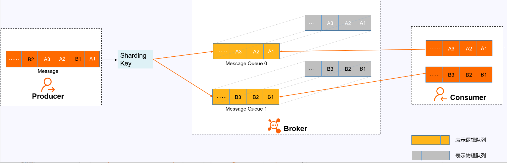
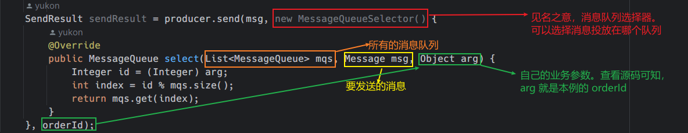

- [介绍](#介绍)
- [快速安装](#快速安装)
  - [下载包](#下载包)
  - [配置环境变量](#配置环境变量)
  - [启动 NameServer](#启动-nameserver)
  - [启动 Borker](#启动-borker)
- [验证](#验证)
- [部署后台管理页面](#部署后台管理页面)
- [基本使用](#基本使用)
- [RocketMQ 的编程模型](#rocketmq-的编程模型)
  - [生产者的步骤](#生产者的步骤)
  - [消费者步骤](#消费者步骤)
- [RocketMQ 的消息样例](#rocketmq-的消息样例)
  - [基本样例](#基本样例)
    - [同步发送](#同步发送)
    - [异步发送](#异步发送)
    - [单向发送消息](#单向发送消息)
    - [消费者消费消息](#消费者消费消息)
    - [推模式](#推模式)
    - [拉模式](#拉模式)
  - [顺序消息](#顺序消息)
    - [分区顺序消息](#分区顺序消息)
      - [Shareding Key](#shareding-key)
    - [原理](#原理)
    - [代码样例](#代码样例)
    - [全局顺序消息](#全局顺序消息)
  - [广播消息](#广播消息)
  - [延迟消息](#延迟消息)
  - [批量消息](#批量消息)
  - [过滤消息](#过滤消息)
    - [标签过滤](#标签过滤)
    - [sql 过滤](#sql-过滤)
    - [SQL92 标准](#sql92-标准)
  - [事务消息](#事务消息)
  - [ACL 权限控制](#acl-权限控制)
- [參考资料](#參考资料)

## 介绍

在 [RabbitMQ 的基本概念和五种模式使用示例](https://blog.csdn.net/a141210104/article/details/130022768) 前半部分介绍了 MQ 的应用场景，以及多个 MQ 产品的对比，那时说到 RocketMQ 的客户端版本只有 Java , 现在 Apache RocketMQ 社区中也增加了 C++  NodeJS  Python Go 的客户端。

RocketMQ 是阿里巴巴开源的一个消息中间件，在阿里内部历经了双十一等很多高并发场景的考验，能够处理**亿万级别**的消息。2016 年开源后捐赠给 Apache，现在是 Apache 的一个顶级项目。 目前 RocketMQ 在阿里云上有一个购买即可用的商业版本，商业版本集成了阿里内部一些更深层次的功能及运维定制。这里学习的是 Apache 的开源版本。开源版本相对于阿里云上的商业版本，功能上略有缺失，但是大体上功能是一样

## 快速安装

以 linux 环境为例

### 下载包

```shell
# Download release from the Apache mirror
$ wget https://dist.apache.org/repos/dist/release/rocketmq/5.1.0/rocketmq-all-5.1.0-bin-release.zip

# Unpack the release
$ unzip rocketmq-all-5.1.0-bin-release.zip
```

### 配置环境变量
```shell
export JAVA_HOME=/home/dc/jdk1.8.0_371
PATH=$PATH:$JAVA_HOME/bin
export ROCKETMQ_HOME=/home/dc/code/RocketMQ/rocketmq-all-5.1.0-bin-release
```

### 启动 NameServer

RocketMQ 默认预设的 JVM 内存是 4G，这是 RocketMQ 给我们的最佳配置。但是通常我用虚拟机不够 4G 内存，所以需要调整下 JVM 内存大小。修改的方式是直接修改 runserver.sh。 用 vi runserver.sh 编辑这个脚本，在脚本中找到这一行调整内存大小为 512M, 修改如下：
```shell
JAVA_OPT="${JAVA_OPT} -server -Xms512m -Xmx512m -XX:MetaspaceSize=128m -XX:MaxMetaspaceSize=320m"
```

然后用静默启动的方式启动 NameServer 服务：
```shell
nohup bin/mqnamesrv &
```

启动完成后，在 nohup.out 里看到这一条关键日志就是启动成功了。并且使用 jps 指令可以看到有一个 NamesrvStartup 进程。
```txt
Java HotSpot(TM) 64-Bit Server VM warning: Using the DefNew young collector
with the CMS
collector is deprecated and will likely be removed in a future release
Java HotSpot(TM) 64-Bit Server VM warning: UseCMSCompactAtFullCollection is
deprecated and
will likely be removed in a future release.
The Name Server boot success. serializeType=JSON
```

### 启动 Borker
启动 Broker 的脚本是 runbroker.sh。Broker 的默认预设内存是 8G，启动前，如果内存不够，同样需要调整下 JVM 内存。vi runbroker.sh，找到这一行，进行内存调整

```shell
JAVA_OPT="${JAVA_OPT} -server -Xms512m -Xmx512m"
```
然后找到$ROCKETMQ_HOME/conf/broker.conf， vi 指令进行编辑，在最下面加入一个配置，可以自动创建 topic:
```txt
autoCreateTopicEnable=true
```

**【注意】**
> 如果你的机器有多个 ip 地址，有的是 10 开头的内网地址。要在配置文件中添加下面这行，明确指定该 broker 的地址，否则该 broker 会自动识别成内网地址，可能导致应用无法访问，同时还需要注意防火墙的配置，看看一些必要的端口是否开放了，
> 
> 默认的端口有： nameserver 默认使用 9876 , master 默认使用 10911,  slave 默认使用 11011 

```txt
brokerIP1=192.168.11.11
```

然后也以静默启动的方式启动 runbroker.sh
```shell
nohup ./bin/mqbroker -c ./conf/broker.conf &
```
启动完成后，同样是检查 nohup.out 日志，有这一条关键日志就标识启动成功了。 并且 jps 指令可以看到一个 BrokerStartup 进程。
```txt
The broker[worker1, 192.168.11.11:10911] boot success. serializeType=JSON
```

```txt
[dc@10 rocketmq-all-5.1.0-bin-release]$ jps
16969 Jps
15818 NamesrvStartup
16511 BrokerStartup
```

## 验证

RocketMQ 部署包在 bin 目录下提供了测试工具，进入运行的容器内，进入到 `bin` 目录下

1. 首先需要配置一个环境变量 NAMESRV_ADDR 指向我们启动的 NameServer 服务。 执行 `export NAMESRV_ADDR='localhost:9876'`
2. 然后启动消息生产者发送消息：默认会发 1000 条消息 `./tools.sh org.apache.rocketmq.example.quickstart.Producer`, 这时在控制台可以看到发送消息的日志
3. 启动消息消费者接收消息：`./tools.sh org.apache.rocketmq.example.quickstart.Consumer`, 这时可以在控制台看到消费接受消息日志，这个消费者接受完消息后并不会停止，他会继续等待新的消息，可以按 CTRL + C 停止该进程

## 部署后台管理页面

[开源项目](https://github.com/apache/rocketmq-dashboard )提供了一套完善的 RocketMQ 后台管理看板， 详情请查看该仓库的说明

该项目使用 springboot 框架编写，把代码克隆到本地，执行 `mvn clean package -Dmaven.test.skip=true ` 生成一个 jar 包。然后执行 `java -jar target/rocketmq-dashboard-1.0.1-SNAPSHOT.jar`, 默认使用`8080`端口

   
## 基本使用

## RocketMQ 的编程模型
RocketMQ 的生产者和消费者的编程模型都是固定的步骤的，也就常用的套路，掌握这几个固定的步骤很重要

### 生产者的步骤
1. 创建消息的生产者 Producer, 并指定生产者的组名
2. 指定 nameserve 地址
3. 启动 producer
4. 创建消息对象，指定 topic、tag 和消息体
5. 发送消息
6. 关闭生产者 Producer

### 消费者步骤
1. 创建消费者 Consumer, 并指定消费者组名
2. 指定 nameserver 地址
3. 订阅主题 Topic 和 tag
4. 设置回调函数处理消息
5. 启动消费者 consumer

## RocketMQ 的消息样例
**【注意】**
下面的样例基本都可以在 rocketMQ 的源码仓库 `org.apache.rocetmq.example` 包中找到，或基于其有所轻微改动

### 基本样例
基本样例中演示 3 中生产者： 同步发送，异步发送，单向发送

#### 同步发送

代码样例： `org.apache.rocketmq.example.simple.Producer`

```java
package org.apache.rocketmq.example.simple;

import org.apache.rocketmq.client.exception.MQClientException;
import org.apache.rocketmq.client.producer.DefaultMQProducer;
import org.apache.rocketmq.client.producer.SendResult;
import org.apache.rocketmq.common.message.Message;
import java.nio.charset.StandardCharsets;

public class Producer {

    public static final String PRODUCER_GROUP = "ProducerGroupName";
    public static final String DEFAULT_NAMESRVADDR = "192.168.11.11:9876";
    public static final String TOPIC = "TopicTest";
    public static final String TAG = "TagA";

    public static void main(String[] args) throws MQClientException, InterruptedException {

        DefaultMQProducer producer = new DefaultMQProducer(PRODUCER_GROUP);

        // Uncomment the following line while debugging, namesrvAddr should be set to your local address
        producer.setNamesrvAddr(DEFAULT_NAMESRVADDR);

        producer.start();
        for (int i = 0; i < 128; i++) {
            try {
                Message msg = new Message(TOPIC, TAG, "OrderID188", "Hello world".getBytes(StandardCharsets.UTF_8));
                SendResult sendResult = producer.send(msg);
                System.out.printf("%s%n", sendResult);
            } catch (Exception e) {
                e.printStackTrace();
            }
        }

        producer.shutdown();
    }
}

```

见名之意，拿到发送消息的返回结果后在记性下一步操作

#### 异步发送

代码样例： `org.apache.rocketmq.example.simple.AsyncProducer`
```java
package org.apache.rocketmq.example.simple;

import java.io.UnsupportedEncodingException;
import java.util.concurrent.CountDownLatch;
import java.util.concurrent.TimeUnit;
import org.apache.rocketmq.client.exception.MQClientException;
import org.apache.rocketmq.client.producer.DefaultMQProducer;
import org.apache.rocketmq.client.producer.SendCallback;
import org.apache.rocketmq.client.producer.SendResult;
import org.apache.rocketmq.common.message.Message;
import org.apache.rocketmq.remoting.common.RemotingHelper;

public class AsyncProducer {
    public static void main(
        String[] args) throws MQClientException, InterruptedException, UnsupportedEncodingException {

        DefaultMQProducer producer = new DefaultMQProducer("Jodie_Daily_test");
        producer.setNamesrvAddr("192.168.11.11:9876");
        producer.start();
        // suggest to on enableBackpressureForAsyncMode in heavy traffic, default is false
        producer.setEnableBackpressureForAsyncMode(true);
        producer.setRetryTimesWhenSendAsyncFailed(0);

        int messageCount = 100;
        // 注意学习 CountDownLatch 的使用，设置了 100 个信号量
        final CountDownLatch countDownLatch = new CountDownLatch(messageCount);
        for (int i = 0; i < messageCount; i++) {
            try {
                final int index = i;
                Message msg = new Message("Jodie_topic_1023",
                    "TagA",
                    "OrderID188",
                    "Hello world".getBytes(RemotingHelper.DEFAULT_CHARSET));
                producer.send(msg, new SendCallback() {
                    @Override
                    public void onSuccess(SendResult sendResult) {
                        // 消息发送成功的回调，此时告知有一个线程已经成功运行完了
                        countDownLatch.countDown();
                        System.out.printf("%-10d OK %s %n", index, sendResult.getMsgId());
                    }

                    @Override
                    public void onException(Throwable e) {
                        // 消息发送失败的回调，此时告知有一个线程已经运行完了
                        countDownLatch.countDown();
                        System.out.printf("%-10d Exception %s %n", index, e);
                        e.printStackTrace();
                    }
                });
            } catch (Exception e) {
                e.printStackTrace();
            }
        }
        // 这里会阻塞，等待所有的线程执行成功后，在继续向下走
        countDownLatch.await(5, TimeUnit.SECONDS);
        producer.shutdown();
    }
}
```

这个示例有个知识点，引入了一个 countDownLatch 来保证所有消息回调方法都执行 完了再关闭 Producer。 所以从这里可以看出，RocketMQ 的 Producer 也是一个服务端，在往 Broker 发送消息的时候也要作为服务端提供服务。

#### 单向发送消息

见名之意， 只管发送消息，没有返回值，也没有回调

代码样例： `org/apache/rocketmq/example/simple/OnewayProducer.java`
```java
package org.apache.rocketmq.example.simple;

import org.apache.rocketmq.client.producer.DefaultMQProducer;
import org.apache.rocketmq.common.message.Message;

import java.nio.charset.StandardCharsets;

public class OnewayProducer {
    public static void main(String[] args) throws Exception {
        //Instantiate with a producer group name.
        DefaultMQProducer producer = new DefaultMQProducer("please_rename_unique_group_name");
        // Specify name server addresses.
        producer.setNamesrvAddr("192.168.11.11:9876");
        //Launch the instance.
        producer.start();
        for (int i = 0; i < 100; i++) {
            //Create a message instance, specifying topic, tag and message body.
            Message msg = new Message("TopicTest" /* Topic */,
                    "TagA" /* Tag */,
                    ("Hello RocketMQ " +
                            i).getBytes(StandardCharsets.UTF_8) /* Message body */
            );
            System.out.println("发送第 " + i + "条消息");
            //Call send message to deliver message to one of brokers.
            producer.sendOneway(msg);
        }
        //Wait for sending to complete
        Thread.sleep(5000);
        producer.shutdown();
    }
}

```

#### 消费者消费消息

消费者消费消息有两种模式，一种是消费者主动去 Broker 上拉去消息的拉模式，另一种是消费者等待 Broker 把消息推过来的推模式

#### 推模式

代码样例： `org.apache.rocketmq.example.simple.PushConsumer`

```java
package org.apache.rocketmq.example.simple;

import java.util.List;
import org.apache.rocketmq.client.consumer.DefaultMQPushConsumer;
import org.apache.rocketmq.client.consumer.listener.ConsumeConcurrentlyContext;
import org.apache.rocketmq.client.consumer.listener.ConsumeConcurrentlyStatus;
import org.apache.rocketmq.client.consumer.listener.MessageListenerConcurrently;
import org.apache.rocketmq.client.exception.MQClientException;
import org.apache.rocketmq.common.consumer.ConsumeFromWhere;
import org.apache.rocketmq.common.message.MessageExt;

public class PushConsumer {
    public static final String TOPIC = "TopicTest";
    public static final String CONSUMER_GROUP = "CID_JODIE_1";
    public static final String NAMESRV_ADDR = "192.168.11.11:9876";
    public static void main(String[] args) throws InterruptedException, MQClientException {

        DefaultMQPushConsumer consumer = new DefaultMQPushConsumer(CONSUMER_GROUP);

        // Uncomment the following line while debugging, namesrvAddr should be set to your local address
        consumer.setNamesrvAddr(NAMESRV_ADDR);

        consumer.subscribe(TOPIC, "*");
        consumer.setConsumeFromWhere(ConsumeFromWhere.CONSUME_FROM_FIRST_OFFSET);
        //wrong time format 2017_0422_221800
        consumer.setConsumeTimestamp("20181109221800");
        consumer.registerMessageListener(new MessageListenerConcurrently() {

            @Override
            public ConsumeConcurrentlyStatus consumeMessage(List<MessageExt> msgs, ConsumeConcurrentlyContext context) {
                System.out.printf("%s Receive New Messages: %s %n", Thread.currentThread().getName(), msgs);
                return ConsumeConcurrentlyStatus.CONSUME_SUCCESS;
            }
        });
        consumer.start();
        System.out.printf("Consumer Started.%n");
    }
}

```

#### 拉模式

代码样例： `org.apache.rocketmq.example.simple.PullConsumer`

通常情况下，用推模式比较简单。 实际上 RocketMQ 的推模式也是由拉模式封装出来的。

### 顺序消息
顺序消息可以保证消息的消费顺序和发送的顺序一致，即**先发送的先消费，后发送的后消费**，常用于金融证券、电商业务等对消息指令顺序有严格要求的场景。

顺序消息分为**分区顺序**消息和**全局顺序**消息。

#### 分区顺序消息

**官方定义**
对于指定的一个 Topic，所有消息根据 Sharding Key 进行区块分区，同一个分区内的消息按照严格的先进先出（FIFO）原则进行发布和消费。同一分区内的消息保证顺序，不同分区之间的消息顺序不做要求。

**适用场景**
适用于性能要求高，以 Sharding Key 作为分区字段，在同一个区块中严格地按照先进先出（FIFO）原则进行消息发布和消费的场景。

**示例** 
用户注册需要发送验证码，以用户 ID 作为 Sharding Key，那么同一个用户发送的消息都会按照发布的先后顺序来消费。 电商的订单创建，以订单 ID 作为 Sharding Key，那么同一个订单相关的创建订单消息、订单支付消息、订单退款消息、订单物流消息都会按照发布的先后顺序来消费。

##### Shareding Key

先介绍一下什么是 Shareding Key：

> Sharding Key 是一种用于数据分片的键，通常用于将数据分散存储到多个节点或分区中，以便实现更好的性能和可扩展性。在分布式系统中，Sharding Key 可以作为路由键，用于将请求路由到正确的节点或分区中。
> 
> 在数据库中，Sharding Key 通常是指用于将数据分散存储到多个数据库或表中的键。例如，如果你有一个包含用户信息的表，可以将用户 ID 作为 Sharding Key，将不同的用户信息分散存储到不同的数据库或表中。这样可以实现更好的性能和可扩展性，因为查询操作只需要在一个数据库或表中进行，而不需要扫描整个表。
>
> 在消息中间件中，Sharding Key 通常是指用于将消息分散存储到多个消息队列中的键。例如，在 RocketMQ 中，可以将消息的业务 ID 或其他唯一标识符作为 Sharding Key，将不同的消息分散存储到不同的消息队列中。这样可以实现更好的消息顺序和一致性，因为具有相同 Sharding Key 的消息总是会被路由到同一个消息队列中，从而保证了消息的顺序性和一致性。
> 
> 在分布式系统中，Sharding Key 的选择对于系统的性能和可靠性都非常重要。如果选择不当，可能会导致数据分布不均衡，从而影响查询和操作的性能。因此，在选择 Sharding Key 时需要根据具体业务场景进行综合考虑和测试，以确保系统具有良好的性能和可靠性。

用自己不太严谨的话翻译一下就是： **每条消息都可以计算出一个 Shareding Key，对于有相同 Shareding Key 的消息将会被投递到相同的队列中。如果我们想让某些消息按照发送的顺序消费，就可以把这些消息的 Shareding Key 设置成相同的。** 如果消息的 Sharding Key 不同，则不能保证消息的有序性, 不过RocketMQ 中可以直接指定消息被投放到哪个队列中。

#### 原理



在消息队列 RocketMQ 版中，消息的顺序需要由以下三个阶段保证：
**消息发送:**

如上图所示，A1、B1、A2、A3、B2、B3 是订单 A 和订单 B 的消息产生的顺序，业务上要求同一订单的消息保持顺序，例如订单 A 的消息发送和消费都按照 A1、A2、A3 的顺序。如果是普通消息，订单 A 的消息可能会被轮询发送到不同的队列中，不同队列的消息将无法保持顺序，而顺序消息发送时消息队列 RocketMQ 版支持将 Sharding Key 相同（例如同一订单号）的消息序路由到一个队列中。

消息队列 RocketMQ 版服务端判定消息产生的顺序性是参照同一生产者发送消息的时序。不同生产者、不同线程并发产生的消息，消息队列 RocketMQ 版服务端无法判定消息的先后顺序。

**消息存储:**

如上图所示，顺序消息的 Topic 中，每个逻辑队列对应一个物理队列，当消息按照顺序发送到 Topic 中的逻辑队列时，每个分区的消息将按照同样的顺序存储到对应的物理队列中。

**消息消费:**

消息队列 RocketMQ 版按照存储的顺序将消息投递给 Consumer，Consumer 收到消息后也不对消息顺序做任何处理，按照接收到的顺序进行消费。

Consumer 消费消息时，同一 Sharding Key 的消息使用单线程消费，保证消息消费顺序和存储顺序一致，最终实现消费顺序和发布顺序的一致。

#### 代码样例

**生产者** `org.apache.rocketmq.example.order.Producer`

```java
package org.apache.rocketmq.example.ordermessage;

import org.apache.rocketmq.client.exception.MQClientException;
import org.apache.rocketmq.client.producer.DefaultMQProducer;
import org.apache.rocketmq.client.producer.MessageQueueSelector;
import org.apache.rocketmq.client.producer.SendResult;
import org.apache.rocketmq.common.message.Message;
import org.apache.rocketmq.common.message.MessageQueue;
import org.apache.rocketmq.remoting.common.RemotingHelper;

import java.util.List;

public class Producer {
    public static void main(String[] args) throws MQClientException {
        try {
            DefaultMQProducer producer = new DefaultMQProducer("please_rename_unique_group_name");
            producer.setNamesrvAddr("192.168.11.12:9876");
            producer.start();

            String msgStr = "";
            for (int i = 0; i < 30; i++) {
                int orderId = i % 6;
                if(orderId == 0) {
                    msgStr = "我是发给张三的消息，id 是： " + i ;
                }
                if(orderId == 1) {
                    msgStr = "我是发给李四的消息，id 是： " + i ;
                }
                if(orderId == 2) {
                    msgStr = "我是发给王二的消息，id 是： " + i ;
                }
                if(orderId == 3) {
                    msgStr = "我是发给李华的消息，id 是： " + i ;
                }
                if(orderId == 4) {
                    msgStr = "我是发给赵明的消息，id 是： " + i ;
                }
                if(orderId == 5) {
                    msgStr = "我是发给周三的消息，id 是： " + i ;
                }

                Message msg =
                    new Message("TopicTest", "tag_A", "KEY" + i,
                        (msgStr).getBytes(RemotingHelper.DEFAULT_CHARSET));
                SendResult sendResult = producer.send(msg, new MessageQueueSelector() {
                    @Override
                    public MessageQueue select(List<MessageQueue> mqs, Message msg, Object arg) {
                        // 查看源码可知，arg 就是第三个参数： orderId 
                        Integer id = (Integer) arg;
                        // orderId 对 队列的个数取余，保证 orderId 相同的， index 肯定就是一样的
                        int index = id % mqs.size();
                        return mqs.get(index);
                    }
                }, orderId);
            }

            producer.shutdown();
        } catch (Exception e) {
            e.printStackTrace();
            throw new MQClientException(e.getMessage(), null);
        }
    }
}

```

如何选择消息队列的关键代码解释如下图：



**消费者** `org.apache.rocketmq.example.order.Consumer`

消费者的实现还是比较简单的，只需要注册一个 `MessageListenerOrderly ` 即可：

```java
package org.apache.rocketmq.example.ordermessage;

import org.apache.rocketmq.client.consumer.DefaultMQPushConsumer;
import org.apache.rocketmq.client.consumer.listener.ConsumeOrderlyContext;
import org.apache.rocketmq.client.consumer.listener.ConsumeOrderlyStatus;
import org.apache.rocketmq.client.consumer.listener.MessageListenerOrderly;
import org.apache.rocketmq.client.exception.MQClientException;
import org.apache.rocketmq.common.consumer.ConsumeFromWhere;
import org.apache.rocketmq.common.message.MessageExt;

import java.util.List;

public class Consumer {

    public static void main(String[] args) throws MQClientException {
        DefaultMQPushConsumer consumer = new DefaultMQPushConsumer("please_rename_unique_group_name_3");
        consumer.setNamesrvAddr("192.168.11.12:9876");

        consumer.setConsumeFromWhere(ConsumeFromWhere.CONSUME_FROM_FIRST_OFFSET);

        consumer.subscribe("TopicTest", "*");

        // 只需注册一个 MessageListenerOrderly 即可实现按照顺序消费消息
        // 该类会把某个队列的消息取完再取下一个队列
        consumer.registerMessageListener(new MessageListenerOrderly() {
            @Override
            public ConsumeOrderlyStatus consumeMessage(List<MessageExt> msgs, ConsumeOrderlyContext context) {
                context.setAutoCommit(true);
                for (MessageExt msg : msgs) {
                    String msgStr =  new String(msg.getBody());
                    System.out.println("有消息：");
                    if(msgStr.contains("张三")){
                        System.out.printf("线程：%s 收到消息：%s \n", Thread.currentThread().getName(),msgStr);
                    }

                }
                return ConsumeOrderlyStatus.SUCCESS;
            }
        });

        consumer.start();
        System.out.printf("Consumer Started.%n");
    }
}
```

#### 全局顺序消息 
对于指定的一个 Topic，所有消息按照严格的先入先出（FIFO）的顺序来发布和消费。 

**适用场景：** 

适用于性能要求不高，所有的消息严格按照 FIFO 原则来发布和消费的场景。 

**示例：** 

在证券处理中，以人民币兑换美元为 Topic，在价格相同的情况下，先出价者优先处理，则可以按照 FIFO 的方式发布和消费全局顺序消息。 

**说明：** 

全局顺序消息实际上是一种特殊的分区顺序消息，即 Topic 中只有一个分区，因此全局顺序和分区顺序的实现原理相同。因为分区顺序消息有多个分区，所以分区顺序消息比全局顺序消息的并发度和性能更高。

### 广播消息
广播消息的消息生产者样例见：org.apache.rocketmq.example.broadcast.PushConsumer

广播消息并没有特定的消息消费者样例，这是因为这涉及到消费者的集群消费模式。在集群状态 (MessageModel.CLUSTERING) 下，每一条消息只会被同一个消费者组中的一个实例消费到（这跟 kafka 和 rabbitMQ 的集群模式是一样的）。而广播模式则是把消息发给了所有订阅了对应主题的消 费者，而不管消费者是不是同一个消费者组。

### 延迟消息

生产者代码样例：`org.apache.rocketmq.example.schedule.ScheduledMessageProducer`

```java
package org.apache.rocketmq.example.schedule;

import org.apache.rocketmq.client.producer.DefaultMQProducer;
import org.apache.rocketmq.client.producer.SendResult;
import org.apache.rocketmq.common.message.Message;

import java.nio.charset.StandardCharsets;

public class ScheduledMessageProducer {

    public static final String PRODUCER_GROUP = "ExampleProducerGroup";
    public static final String DEFAULT_NAMESRVADDR = "192.168.11.12:9876";
    public static final String TOPIC = "TestTopic";

    public static void main(String[] args) throws Exception {
        // Instantiate a producer to send scheduled messages
        DefaultMQProducer producer = new DefaultMQProducer(PRODUCER_GROUP);

        // Uncomment the following line while debugging, namesrvAddr should be set to your local address
        producer.setNamesrvAddr(DEFAULT_NAMESRVADDR);

        // Launch producer
        producer.start();
        String msg = "我 10 秒后才会被消费， 现在的时间是：" + System.currentTimeMillis();
        Message message = new Message(TOPIC, (msg).getBytes(StandardCharsets.UTF_8));
        // This message will be delivered to consumer 10 seconds later.
        message.setDelayTimeLevel(3);
        // Send the message
        SendResult result = producer.send(message);
        System.out.println(result);
        System.out.println("发送消息：" + msg);

        // Shutdown producer after use.
        producer.shutdown();
    }

}
```

消费者代码样例：`org.apache.rocketmq.example.schedule.ScheduledMessageConsumer`

```java
package org.apache.rocketmq.example.schedule;

import org.apache.rocketmq.client.consumer.DefaultMQPushConsumer;
import org.apache.rocketmq.client.consumer.listener.ConsumeConcurrentlyStatus;
import org.apache.rocketmq.client.consumer.listener.MessageListenerConcurrently;
import org.apache.rocketmq.common.message.MessageExt;

public class ScheduledMessageConsumer {

    public static final String CONSUMER_GROUP = "ExampleConsumer";
    public static final String DEFAULT_NAMESRVADDR = "192.168.11.12:9876";
    public static final String TOPIC = "TestTopic";

    public static void main(String[] args) throws Exception {
        // Instantiate message consumer
        DefaultMQPushConsumer consumer = new DefaultMQPushConsumer(CONSUMER_GROUP);

        // Uncomment the following line while debugging, namesrvAddr should be set to your local address
        consumer.setNamesrvAddr(DEFAULT_NAMESRVADDR);

        // Subscribe topics
        consumer.subscribe(TOPIC, "*");
        // Register message listener
        consumer.registerMessageListener((MessageListenerConcurrently) (messages, context) -> {
            for (MessageExt message : messages) {
                System.out.println("收到消息 ["+ System.currentTimeMillis() + "]：" + new String(message.getBody()));
            }
            return ConsumeConcurrentlyStatus.CONSUME_SUCCESS;
        });
        consumer.start();
    }
}
```

消费者控制台打印信息：
```txt
收到消息 [1684659475529]：我 10 秒后才会被消费， 现在的时间是：1684659465229
```
可以看到消息的发送时间和接收时间确实查了 10 秒。

在生产者代码中： `message.setDelayTimeLevel(3);` 设置了消息的延迟时长，开源版本的 RocketMQ 中，对延迟消息并不支持任意时间的延迟设定（商业版本中支持），而是只支 持 18 个固定的延迟级别，1 到 18 分别对应 messageDelayLevel=1s 5s 10s 30s 1m 2m 3m 4m 5m 6m 7m 8m 9m 10m 20m 30m 1h 2h。而这 18 个延迟级别也支持自行定义，不过一般情况下最好不要自定义修改。底层有 18 个延迟队列实现

### 批量消息

批量消息是指将多条消息合并成一个批量消息，一次发送出去。这样的好处是可以减少网络 IO，提升吞吐量。

生产者样例代码： `org.apache.rocketmq.example.batch.SimpleBatchProducer`

代码中有一个关键的注释：如果批量消息大于 1MB 就不要用一个批次 发送，而要拆分成多个批次消息发送。也就是说，一个批次消息的大小不要超过 1MB 实际使用时，这个 1MB 的限制可以稍微扩大点，实际最大的限制是 4194304 字节，大概 4MB。 但是使用批量消息时，这个消息长度确实是必须考虑的一个问题。 如果超过了这个限制，要手动再次分批。 这些消息应该有相同的 Topic，相同的 waitStoreMsgOK。而且不能是延迟消息、事务消息等。 

```java
package org.apache.rocketmq.example.batch;

import org.apache.rocketmq.client.producer.DefaultMQProducer;
import org.apache.rocketmq.client.producer.SendResult;
import org.apache.rocketmq.common.message.Message;

import java.nio.charset.StandardCharsets;
import java.util.ArrayList;
import java.util.List;

public class SimpleBatchProducer {

    public static final String PRODUCER_GROUP = "BatchProducerGroupName";
    public static final String DEFAULT_NAMESRVADDR = "192.168.11.12:9876";
    public static final String TOPIC = "BatchTest";
    public static final String TAG = "Tag";

    public static void main(String[] args) throws Exception {
        DefaultMQProducer producer = new DefaultMQProducer(PRODUCER_GROUP);
        producer.setNamesrvAddr(DEFAULT_NAMESRVADDR);
        producer.start();

        // 如果只是一次发送不超过 1MiB 的消息，使用 batch 还是很容易的
        // 同一批次的消息应该有：相同的 topic，相同的 waitStoreMsgOK，不支持 schedule
        List<Message> messages = new ArrayList<>();
        messages.add(new Message(TOPIC, TAG, "OrderID001", "Hello world 0".getBytes(StandardCharsets.UTF_8)));
        messages.add(new Message(TOPIC, TAG, "OrderID002", "Hello world 1".getBytes(StandardCharsets.UTF_8)));
        messages.add(new Message(TOPIC, TAG, "OrderID003", "Hello world 2".getBytes(StandardCharsets.UTF_8)));

        SendResult sendResult = producer.send(messages);
        System.out.printf("%s", sendResult);
    }
}

```

### 过滤消息

在大多数情况下，可以使用 Message 的 Tag 属性来简单快速的过滤信息。

#### 标签过滤

主要是看消息消费者。`consumer.subscribe("TagFilterTest", "TagA || TagC");` 只订阅 TagA 和 TagC 的消息。 TAG 是 RocketMQ 中特有的一个消息属性。RocketMQ 的最佳实践中就建议，使用 RocketMQ 时， **一个应用可以就用一个 Topic，而应用中的不同业务就用 TAG 来区分。**

使用 Tag 过滤消息的消息生产者案例见：`org.apache.rocketmq.example.filter.TagFilterProducer`
```java
package org.apache.rocketmq.example.filter;

import org.apache.rocketmq.client.producer.DefaultMQProducer;
import org.apache.rocketmq.client.producer.SendResult;
import org.apache.rocketmq.common.message.Message;
import org.apache.rocketmq.remoting.common.RemotingHelper;

public class TagFilterProducer {

    public static void main(String[] args) throws Exception {

        DefaultMQProducer producer = new DefaultMQProducer("please_rename_unique_group_name");
        producer.setNamesrvAddr("192.168.11.12:9876");
        producer.start();

        String[] tags = new String[] {"TagA", "TagB", "TagC"};

        for (int i = 0; i < 60; i++) {
            String tag = tags[i % tags.length];
            Message msg = new Message("TagFilterTest", tag , ("我是一条消息，我的标签是：" + tag).getBytes(RemotingHelper.DEFAULT_CHARSET));

            SendResult sendResult = producer.send(msg);
            System.out.printf("%s%n", sendResult);
        }

        producer.shutdown();
    }
}

```

使用 Tag 过滤消息的消息消费者案例见：`org.apache.rocketmq.example.filter.TagFilterConsumer`

```java
package org.apache.rocketmq.example.filter;

import org.apache.rocketmq.client.consumer.DefaultMQPushConsumer;
import org.apache.rocketmq.client.consumer.listener.ConsumeConcurrentlyContext;
import org.apache.rocketmq.client.consumer.listener.ConsumeConcurrentlyStatus;
import org.apache.rocketmq.client.consumer.listener.MessageListenerConcurrently;
import org.apache.rocketmq.client.exception.MQClientException;
import org.apache.rocketmq.common.message.MessageExt;

import java.util.List;

public class TagFilterConsumer {

    public static void main(String[] args) throws MQClientException {

        DefaultMQPushConsumer consumer = new DefaultMQPushConsumer("please_rename_unique_group_name");
        consumer.setNamesrvAddr("192.168.11.12:9876");

        // 使用标签过滤消息，效率更高
        consumer.subscribe("TagFilterTest", "TagA || TagC");

        consumer.registerMessageListener(new MessageListenerConcurrently() {

            @Override
            public ConsumeConcurrentlyStatus consumeMessage(List<MessageExt> msgs,
                ConsumeConcurrentlyContext context) {
                for (MessageExt msg : msgs) {

                    System.out.println("收到了一条消息：" + new String(msg.getBody()));
                }
                return ConsumeConcurrentlyStatus.CONSUME_SUCCESS;
            }
        });

        consumer.start();

        System.out.printf("Consumer Started.%n");
    }
}

```
但是，这种方式有一个很大的限制，就是一个消息只能有一个 TAG，这在一些比较复杂的场景就有点不足了。 这时候，可以使用 SQL 表达式来对消息进行过滤。

#### sql 过滤
这个模式的关键是在消费者端使用`MessageSelector.bySql(String sql)`返回的一个 MessageSelector。这里面的 sql 语句是按照 SQL92 标准来执行的。sql 中可以使用的参数有默认的 TAGS 和一个在生产者中加入的 a 属性

**【注意】**
- 如果要实现按照 sql 过滤，broker.conf 文件中要添加 `enablePropertyFilter=true`
- 只有推模式的消费者可以使用 SQL 过滤。拉模式是用不了的。

生产者代码样例：
```java
package org.apache.rocketmq.example.filter;

import org.apache.rocketmq.client.producer.DefaultMQProducer;
import org.apache.rocketmq.client.producer.SendResult;
import org.apache.rocketmq.common.message.Message;
import org.apache.rocketmq.remoting.common.RemotingHelper;

public class SqlFilterProducer {

    public static void main(String[] args) throws Exception {

        DefaultMQProducer producer = new DefaultMQProducer("please_rename_unique_group_name");
        producer.setNamesrvAddr("192.168.11.12:9876");

        producer.start();

        String[] tags = new String[] {"TagA", "TagB", "TagC"};

        for (int i = 0; i < 10; i++) {
            String tag = tags[i % tags.length];
            String a = String.valueOf(i);
            String msgBody = "我是一条消息，我的 tag 是 " + tag + " a 属性是" + a;
            Message msg = new Message("SqlFilterTest",tag, msgBody.getBytes(RemotingHelper.DEFAULT_CHARSET)
            );
            msg.putUserProperty("a", a);

            SendResult sendResult = producer.send(msg);
            System.out.printf("%s%n", sendResult);
        }

        producer.shutdown();
    }
}

```

消费者样例：
```java
package org.apache.rocketmq.example.filter;

import java.util.List;
import org.apache.rocketmq.client.consumer.DefaultMQPushConsumer;
import org.apache.rocketmq.client.consumer.MessageSelector;
import org.apache.rocketmq.client.consumer.listener.ConsumeConcurrentlyContext;
import org.apache.rocketmq.client.consumer.listener.ConsumeConcurrentlyStatus;
import org.apache.rocketmq.client.consumer.listener.MessageListenerConcurrently;
import org.apache.rocketmq.common.message.MessageExt;

public class SqlFilterConsumer {

    public static void main(String[] args) throws Exception {

        DefaultMQPushConsumer consumer = new DefaultMQPushConsumer("please_rename_unique_group_name");
        consumer.setNamesrvAddr("192.168.11.12:9876");

        // Don't forget to set enablePropertyFilter=true in broker
        consumer.subscribe("SqlFilterTest",
            MessageSelector.bySql("(TAGS is not null and TAGS in ('TagA', 'TagB'))" +
                "and (a is not null and a between 0 and 3)"));

        consumer.registerMessageListener(new MessageListenerConcurrently() {

            @Override
            public ConsumeConcurrentlyStatus consumeMessage(List<MessageExt> msgs,
                ConsumeConcurrentlyContext context) {
                for (MessageExt msg : msgs) {
                    System.out.println("收到消息：" + new String(msg.getBody()) );
                }
                return ConsumeConcurrentlyStatus.CONSUME_SUCCESS;
            }
        });

        consumer.start();
        System.out.printf("Consumer Started.%n");
    }
}

```

消费者控制台输出：
```txt
Consumer Started.
收到消息：我是一条消息，我的 tag 是 TagA a 属性是 3
收到消息：我是一条消息，我的 tag 是 TagB a 属性是 1
收到消息：我是一条消息，我的 tag 是 TagA a 属性是 0
```

#### SQL92 标准

简单的介绍一下 sql92 语法：
- 数值比较，比如：>，>=，<，<=，BETWEEN，=；
- 字符比较，比如：=，<>，IN；
- IS NULL 或者 IS NOT NULL；
- 逻辑符号 AND，OR，NOT；
常量支持类型为：
- 数值，比如：123，3.1415；
- 字符，比如：'abc'，必须用单引号包裹起来；
- NULL，特殊的常量
- 布尔值，TRUE 或 FALSE

### 事务消息
TODO

### ACL 权限控制
权限控制（ACL）主要为 RocketMQ 提供 Topic 资源级别的用户访问控制。用户在使用 RocketMQ 权限 控制时，可以在 Client 客户端通过 RPCHook 注入 AccessKey 和 SecretKey 签名；同时，将对应的权限控 制属性（包括 Topic 访问权限、IP 白名单和 AccessKey 和 SecretKey 签名等）设置在 `$ROCKETMQ_HOME/conf/plain_acl.yml`的配置文件中。Broker 端对 AccessKey 所拥有的权限进行校 验，校验不过，抛出异常； ACL 客户端可以参考：`org.apache.rocketmq.example.simpl`e 包下面的 AclClient 代码

注意，如果要在自己的客户端中使用 RocketMQ 的 ACL 功能，还需要引入一个单独的依赖包

```xml
<dependency>
  <groupId>org.apache.rocketmq</groupId>
  <artifactId>rocketmq-acl</artifactId>
  <version>4.7.1</version>
</dependency>
```

而 Broker 端具体的配置信息可以参见源码包下`docs/cn/acl/user_guide.md`。主要是在`broker.conf`中 打开 acl 的标志：`aclEnable=true`。然后就可以用`plain_acl.yml`来进行权限配置了。并且这个配置文件是**热加载**的，也就是说要修改配置时，只要修改配置文件就可以了，不用重启 Broker 服务。我们来简单分析下源码中的`plan_acl.yml`的配置：

```yml
#全局白名单，不受 ACL 控制
#通常需要将主从架构中的所有节点加进来
globalWhiteRemoteAddresses:
  - 10.10.103.*
  - 192.168.0.*
accounts:
#第一个账户
  - accessKey: RocketMQ
    secretKey: 12345678
    whiteRemoteAddress:
    admin: false
    defaultTopicPerm: DENY #默认 Topic 访问策略是拒绝
    defaultGroupPerm: SUB #默认 Group 访问策略是只允许订阅
    topicPerms:
      - topicA=DENY #topicA 拒绝
      - topicB=PUB|SUB #topicB 允许发布和订阅消息
      - topicC=SUB #topicC 只允许订阅
    groupPerms:
    # the group should convert to retry topic
      - groupA=DENY
      - groupB=PUB|SUB
      - groupC=SUB
    #第二个账户，只要是来自 192.168.1. *的 IP，就可以访问所有资源
  - accessKey: rocketmq2
    secretKey: 12345678
    whiteRemoteAddress: 192.168.1.*
    # if it is admin, it could access all resources
    admin: true
```

## 參考资料
https://help.aliyun.com/document_detail/201002.html?spm=a2c4g.201002.0.0.2e433ca2brQytf