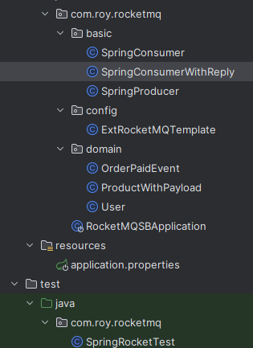

SpringBoot整合RocketMQ使用非常简单，下面是一个简单的例子，作为备忘：

完整项目代码： [https://github.com/dccmmtop/springBootRocketMQ](https://github.com/dccmmtop/springBootRocketMQ)


## 项目目录结构



## 依赖

```xml
<dependencies>
    <dependency>
        <groupId>org.apache.rocketmq</groupId>
        <artifactId>rocketmq-spring-boot-starter</artifactId>
        <version>2.1.1</version>
        <exclusions>
            <exclusion>
                <groupId>org.springframework.boot</groupId>
                <artifactId>spring-boot-starter</artifactId>
            </exclusion>
            <exclusion>
                <groupId>org.springframework</groupId>
                <artifactId>spring-core</artifactId>
            </exclusion>
            <exclusion>
                <groupId>org.springframework</groupId>
                <artifactId>spring-webmvc</artifactId>
            </exclusion>
        </exclusions>
    </dependency>
    <dependency>
        <groupId>org.springframework.boot</groupId>
        <artifactId>spring-boot-starter-web</artifactId>
        <version>2.1.6.RELEASE</version>
    </dependency>
    <dependency>
        <groupId>org.springframework.boot</groupId>
        <artifactId>spring-boot-starter-test</artifactId>
        <version>2.1.6.RELEASE</version>
    </dependency>
<dependencies>
```

## 配置类 ExtRocketMQTemplate
```java
package com.roy.rocketmq.config;

import org.apache.rocketmq.spring.annotation.ExtRocketMQTemplateConfiguration;
import org.apache.rocketmq.spring.core.RocketMQTemplate;

@ExtRocketMQTemplateConfiguration()
public class ExtRocketMQTemplate extends RocketMQTemplate {
}
```

## 消费者 SpringConsumer
```java
package com.roy.rocketmq.basic;

import org.apache.rocketmq.spring.annotation.ConsumeMode;
import org.apache.rocketmq.spring.annotation.RocketMQMessageListener;
import org.apache.rocketmq.spring.core.RocketMQListener;
import org.springframework.stereotype.Component;

@Component
// consumerGroup 相同角色的消费者需要具有完全相同的订阅和consumerGroup才能正确实现负载均衡。它是必需的并且需要是全球唯一的。
// consumeMode 控制消费模式，可以选择并发或顺序接收消息。
// 该注解还有很多其他属性，请详细查看源码
@RocketMQMessageListener(consumerGroup = "MyConsumerGroup", topic = "TestTopic",consumeMode= ConsumeMode.CONCURRENTLY)
public class SpringConsumer implements RocketMQListener<String> {
    @Override
    public void onMessage(String message) {
        System.out.println("Received message : "+ message);
    }
}
```

## 发送者示例 SpringProducer
```java
package com.roy.rocketmq.basic;

import org.apache.rocketmq.client.producer.SendResult;
import org.apache.rocketmq.spring.core.RocketMQTemplate;
import org.apache.rocketmq.spring.support.RocketMQHeaders;
import org.springframework.messaging.Message;
import org.springframework.messaging.support.MessageBuilder;
import org.springframework.stereotype.Component;

import javax.annotation.Resource;

@Component
public class SpringProducer {

    @Resource
    private RocketMQTemplate rocketMQTemplate;

    // 就是如此简单
    public void sendMessage(String topic,String msg){
        this.rocketMQTemplate.convertAndSend(topic,msg);
    }
}
```

## 更多的发消息示例

### 带有返回数据的消费者
```java
package com.roy.rocketmq.basic;

import org.apache.rocketmq.spring.annotation.ConsumeMode;
import org.apache.rocketmq.spring.annotation.RocketMQMessageListener;
import org.apache.rocketmq.spring.core.RocketMQReplyListener;
import org.springframework.stereotype.Component;

@Component
@RocketMQMessageListener(consumerGroup = "MyConsumerGroup1", topic = "TestTopicReplyString",consumeMode= ConsumeMode.CONCURRENTLY)
// 这里注意要使用与收到消息对应的类型 <String,String> 代表接收string 消息 返回的也是string类型的消息
public class SpringConsumerWithReply implements RocketMQReplyListener<String,String> {

    @Override
    public String onMessage(String message) {
        System.out.println("收到消息，并返回结果, " + , message);
        return "OK";
    }
}

```

### 接收 User  返回User
```java
package com.roy.rocketmq.basic;

import com.roy.rocketmq.domain.User;
import org.apache.rocketmq.spring.annotation.ConsumeMode;
import org.apache.rocketmq.spring.annotation.RocketMQMessageListener;
import org.apache.rocketmq.spring.core.RocketMQReplyListener;
import org.springframework.stereotype.Component;

@Component
@RocketMQMessageListener(consumerGroup = "MyConsumerGroup2", topic = "TestTopicUser",consumeMode= ConsumeMode.CONCURRENTLY)
public class SpringConsumerReplyUser implements RocketMQReplyListener<User,User> {


    @Override
    public User onMessage(User user) {
        System.out.println("收到User: " + user.toString());
        return user;
    }
}
```

### User
```java
package com.roy.rocketmq.domain;

public class User {
    private String userName;
    private Byte userAge;

    public String getUserName() {
        return userName;
    }

    public User setUserName(String userName) {
        this.userName = userName;
        return this;
    }

    public Byte getUserAge() {
        return userAge;
    }

    public User setUserAge(Byte userAge) {
        this.userAge = userAge;
        return this;
    }

    @Override
    public String toString() {
        return "User{" +
                "userName='" + userName + '\'' +
                ", userAge=" + userAge +
                '}';
    }
}

```

### OrderPaidEvent
```java
package com.roy.rocketmq.domain;

import java.math.BigDecimal;

public class OrderPaidEvent {
    private String orderId;

    private BigDecimal paidMoney;

    public OrderPaidEvent() {
    }

    public OrderPaidEvent(String orderId, BigDecimal paidMoney) {
        this.orderId = orderId;
        this.paidMoney = paidMoney;
    }

    public String getOrderId() {
        return orderId;
    }

    public void setOrderId(String orderId) {
        this.orderId = orderId;
    }

    public BigDecimal getPaidMoney() {
        return paidMoney;
    }

    public void setPaidMoney(BigDecimal paidMoney) {
        this.paidMoney = paidMoney;
    }
}

```

### 发送
```java
package com.roy.rocketmq;

import com.roy.rocketmq.domain.OrderPaidEvent;
import com.roy.rocketmq.domain.User;
import org.apache.rocketmq.client.producer.SendCallback;
import org.apache.rocketmq.client.producer.SendResult;
import org.apache.rocketmq.spring.core.RocketMQLocalRequestCallback;
import org.apache.rocketmq.spring.core.RocketMQTemplate;
import org.apache.rocketmq.spring.support.RocketMQHeaders;
import org.junit.Test;
import org.junit.runner.RunWith;
import org.springframework.boot.test.context.SpringBootTest;
import org.springframework.messaging.Message;
import org.springframework.messaging.MessageHeaders;
import org.springframework.messaging.support.MessageBuilder;
import org.springframework.test.context.junit4.SpringRunner;
import org.springframework.util.MimeTypeUtils;

import javax.annotation.Resource;
import java.math.BigDecimal;
import java.util.ArrayList;
import java.util.List;

@RunWith(SpringRunner.class)
@SpringBootTest
public class SpringRocketTest {

    @Resource
    private RocketMQTemplate rocketMQTemplate;

    @Test
    public void sendMessageTest(){
        String springTopic="TestTopic";
        String springTopicReplyString="TestTopicString";
        String springTopicUser="TestTopicUser";
        //发送字符消息
        SendResult sendResult = rocketMQTemplate.syncSend(springTopic, "你好！");
        System.out.printf("syncSend1 to topic %s sendResult=%s %n", springTopic, sendResult);

        sendResult = rocketMQTemplate.syncSend(springTopic, new User().setUserAge((byte) 18).setUserName("Kitty"));
        System.out.printf("syncSend1 to topic %s sendResult=%s %n", springTopic, sendResult);

        sendResult = rocketMQTemplate.syncSend(springTopic, MessageBuilder.withPayload(
                new User().setUserAge((byte) 21).setUserName("Lester")).setHeader(MessageHeaders.CONTENT_TYPE, MimeTypeUtils.APPLICATION_JSON_VALUE).build());
        System.out.printf("syncSend1 to topic %s sendResult=%s %n", springTopic, sendResult);

        //发送对象消息
        rocketMQTemplate.asyncSend(springTopic, new OrderPaidEvent("T_001", new BigDecimal("88.00")), new SendCallback() {
            @Override
            public void onSuccess(SendResult var1) {
                System.out.printf("async onSucess SendResult=%s %n", var1);
            }

            @Override
            public void onException(Throwable var1) {
                System.out.printf("async onException Throwable=%s %n", var1);
            }
        });

        //发送指定TAG的消息
        // 注意这里指定tag的方式，topic + : + tag
        rocketMQTemplate.convertAndSend(springTopic + ":tag0", "I'm from tag0");  // tag0 will not be consumer-selected
        System.out.printf("syncSend topic %s tag %s %n", springTopic, "tag0");
        rocketMQTemplate.convertAndSend(springTopic + ":tag1", "I'm from tag1");
        System.out.printf("syncSend topic %s tag %s %n", springTopic, "tag1");

        //同步发送消息并且返回一个String类型的结果。
        String replyString = rocketMQTemplate.sendAndReceive(springTopicReplyString, MessageBuilder.withPayload("同步发送测试").build(), String.class);
        System.out.printf("send %s and receive %s %n", "request string", replyString);

        //同步发送消息并且返回一个Byte数组类型的结果。
        byte[] replyBytes = rocketMQTemplate.sendAndReceive(springTopicReplyString, MessageBuilder.withPayload("request byte[]").build(), byte[].class, 3000);
        System.out.printf("send %s and receive %s %n", "request byte[]", new String(replyBytes));

        // 同步发送一个带hash参数的请求(排序消息)，并返回一个User类型的结果
        User requestUser = new User().setUserAge((byte) 9).setUserName("requestUserName");
        User replyUser = rocketMQTemplate.sendAndReceive(springTopicUser, requestUser, User.class, "order-id");
        System.out.printf("send %s and receive %s %n", requestUser, replyUser);

        //同步发送一个带延迟级别的消息(延迟消息)
        String replyGenericObject = rocketMQTemplate.sendAndReceive(springTopicReplyString, "request generic",
                String.class, 30000, 2);
        System.out.printf("send %s and receive %s %n", "request generic", replyGenericObject);


        //异步发送消息，返回String类型结果。
        rocketMQTemplate.sendAndReceive(springTopicReplyString, "request string", new RocketMQLocalRequestCallback<String>() {
            @Override public void onSuccess(String message) {
                System.out.printf("send %s and receive %s %n", "request string", message);
            }

            @Override public void onException(Throwable e) {
                e.printStackTrace();
            }
        });
        //异步发送消息，并返回一个User类型的结果。
        rocketMQTemplate.sendAndReceive(springTopicUser, new User().setUserAge((byte) 9).setUserName("requestUserName"), new RocketMQLocalRequestCallback<User>() {
            @Override public void onSuccess(User message) {
                System.out.printf("send user object and receive %s %n", message.toString());
            }

            @Override public void onException(Throwable e) {
                e.printStackTrace();
            }
        }, 5000);
        //发送批量消息
        List<Message> msgs = new ArrayList<Message>();
        for (int i = 0; i < 10; i++) {
            msgs.add(MessageBuilder.withPayload("Hello RocketMQ Batch Msg#" + i).
                    setHeader(RocketMQHeaders.KEYS, "KEY_" + i).build());
        }

        SendResult sr = rocketMQTemplate.syncSend(springTopic, msgs, 60000);

        System.out.printf("--- Batch messages send result :" + sr);
    }
}
```
