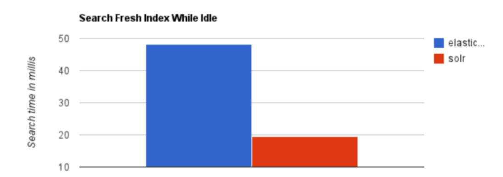
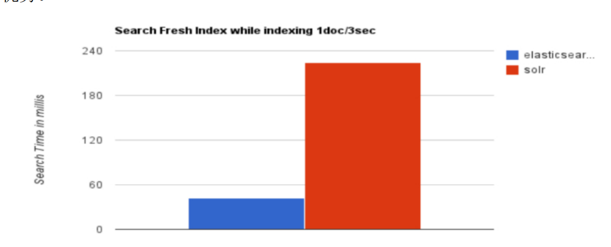

# 1. ElasticSearch 简介
Elasticsearch 是用 Java 开发并且是当前最流行的开源的企业级搜索引擎。 能够达到实时搜索，稳定，可靠，快速，安装使用方便。 客户端支持 Java、.NET（C#）、PHP、Python、Ruby 等多种语言，可以通过 JSON 格式的 HTTP 请求来进行索引、搜索和管理 Elasticsearch 集群。与之类似的另外一个全文搜索引擎 Solr，也是比较流行的。

Elasticsearch 和 Solr 是构建在 Apache Lucene 之上的开源分布式搜索引擎，Lucene 可以被认为是迄今为止最先进、性能最好的、功能最全的搜索引擎库（框架）。
既然如此为什么还要开发 Elasticsearch 来做搜索呢？直接使用 Lucence 不就好了吗？

# 2. 为什么不用 Lucene
想要使用 Lucene，必须使用 Java 来作为开发语言并将其直接集成到你的应用中，并且 Lucene 的配置及使用非常复杂，你需要深入了解检索的相关知识来理解它是如何工作的。它主要有一下几个缺点:
1. 只能在Java项目中使用,并且要以jar包的方式直接集成项目中
2. 使用非常复杂-创建索引和搜索索引代码繁杂
3. 不支持集群环境-索引数据不同步（不支持大型项目）
4. 索引数据如果太多就不行，索引库和应用所在同一个服务器,共同占用硬盘

# 3. Solr 和 ElasticSearch 的对比

## 3.1 检索速度
当单纯的对已有数据进行检索时，Solr 会更快, 有如下图表：

当实时建立索引时，Solr会产生阻塞，查询性能比较差，此时 ElasticSearch 具有明显的优势：

在大型互联网公司，实际生产测试中，将搜索引擎从Solr换成ElasticSearch后，平均查询速度有50倍的提升。

# 4. 为什么模糊搜索这么快
## 4.1 基于全文检索框架
全文检索指的是：
1. 通过程序扫描一段文本中的每个单词，针对单词建立与文本的索引关系，并保存单词在文中出现的位置和次数
2. 查询时，通过提前建立好的索引来查询数据，不必扫描原始文本。
   
## 4.2 倒排索引

> 联系方式：dccmmtop@foxmail.com