- [Container](#container)
- [圆角](#圆角)
- [阴影](#阴影)
- [渐变](#渐变)
  - [线性渐变](#线性渐变)
  - [圆形渐变](#圆形渐变)
  - [扫描渐变](#扫描渐变)
- [位移](#位移)
  - [水平方向或者垂直方向移动](#水平方向或者垂直方向移动)
  - [旋转](#旋转)
  - [缩放](#缩放)
- [完整示例](#完整示例)

### Container
它可以包含其他 Widget，并允许你控制其布局、大小、边距、填充、装饰等属性

Container 有许多属性，主要包括：

- alignment：设置子 Widget 的对齐方式。
- width 和 height：设置容器的宽度和高度。
- padding：设置内部填充。
- margin：设置外部边距。
- color：设置背景颜色。
- decoration：用于更复杂的背景样式，可以设置边框、阴影、渐变等。

### 圆角
四个角一样
`BorderRadius.all(Radius.circular(20))`
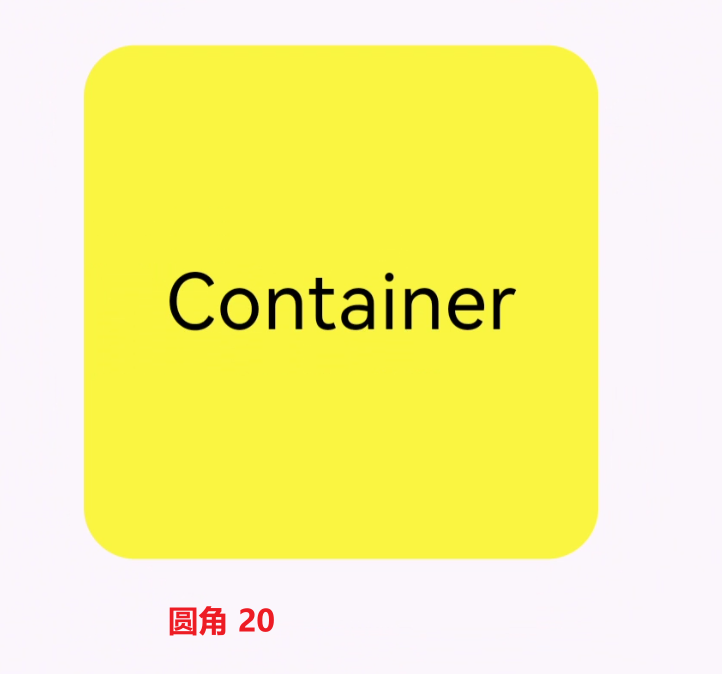
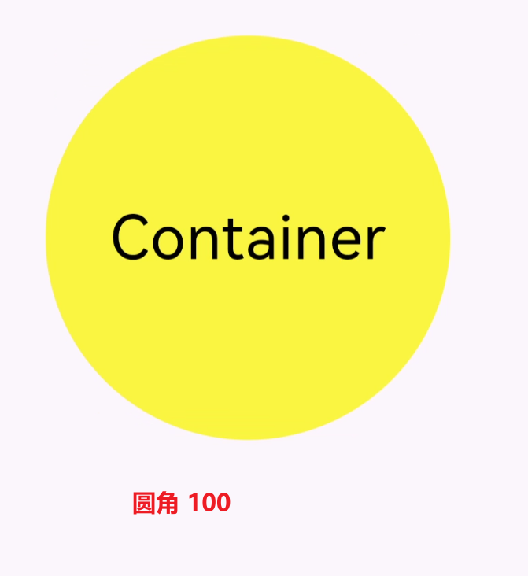

上下两边（垂直方向）的圆角度分别设置
`BorderRadius.vertical(top: Radius.circular(30), bottom: Radius.circular(80))`
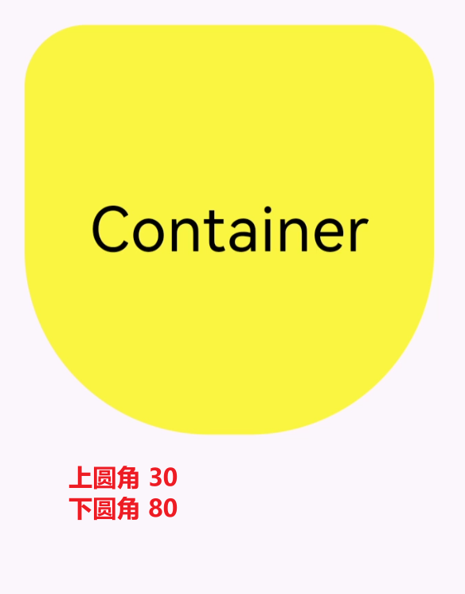
左右两边（水平方向）的圆角度分别设置
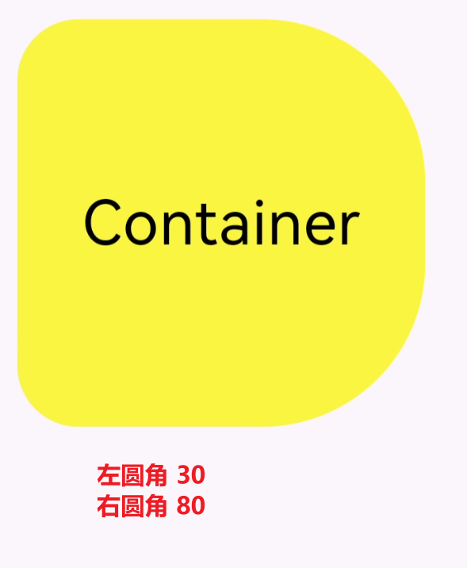

### 阴影
```dart
// 设置阴影
boxShadow: const [
  BoxShadow(color: Colors.yellow, blurRadius: 50),
  BoxShadow(color: Colors.green, blurRadius: 30),
  BoxShadow(color: Colors.blue, blurRadius: 10),
],
```
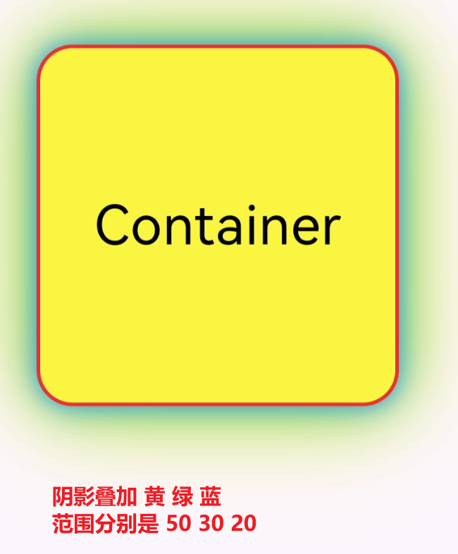

### 渐变

#### 线性渐变
`LinearGradient `
```dart
gradient: const LinearGradient(
    colors: [Colors.green, Colors.yellow, Colors.white],
    begin: Alignment.topLeft,
    end: Alignment.topRight)
```
效果: 
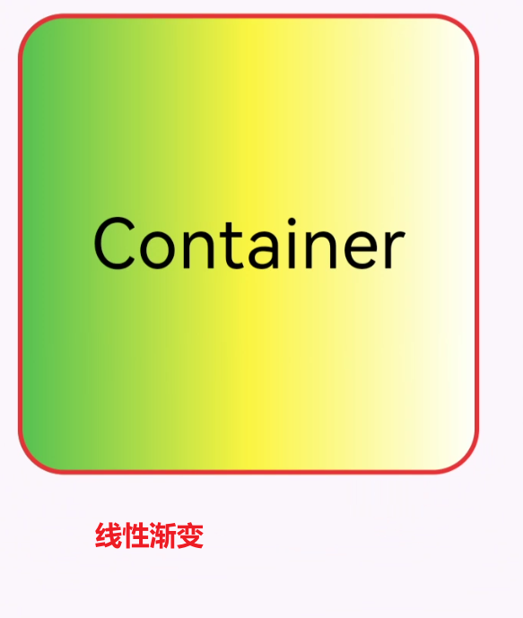

#### 圆形渐变
```dart
gradient: const RadialGradient(colors: [Colors.green, Colors.yellow, Colors.white]) 
```
效果:
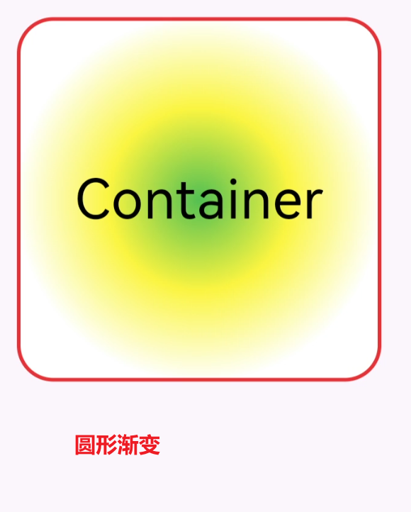


#### 扫描渐变
```dart
gradient: const SweepGradient( colors: [Colors.green, Colors.yellow, Colors.white])),
```
效果:
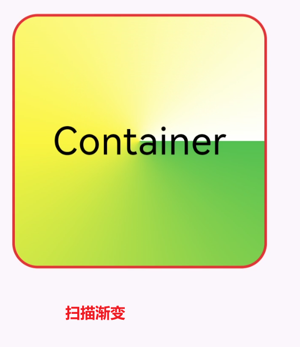

### 位移

#### 水平方向或者垂直方向移动
```dart
// 向右
transform: Matrix4.translationValues(50, 0, 0),
// 向左
transform: Matrix4.translationValues(-50, 0, 0),
```
效果:
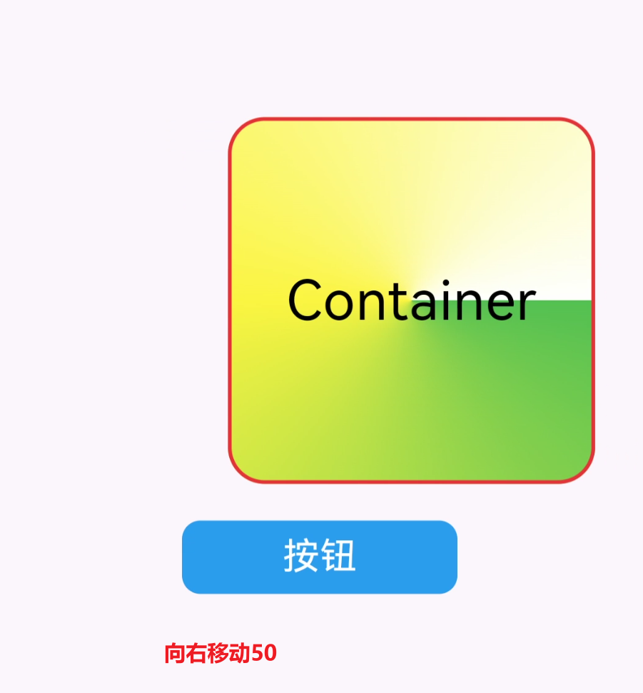

#### 旋转

```dart
// 沿着左顶点旋转
transform: Matrix4.rotationZ(0.2),
```
效果:
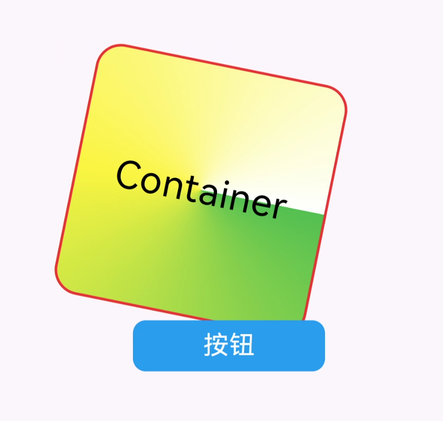

#### 缩放
```dart
// 缩放
transform: Matrix4.skewX(0.4),
```
效果:
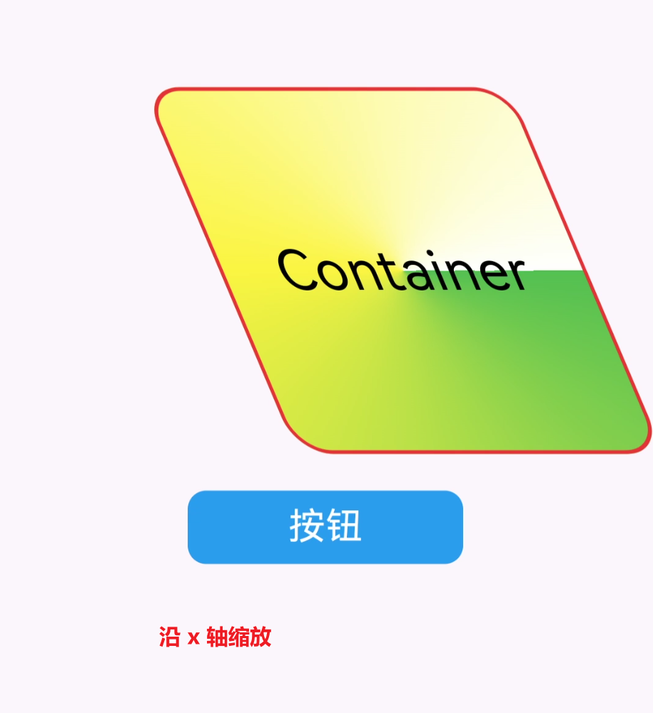


### 完整示例
```dart
import 'package:flutter/material.dart';

void main() {
  runApp(
    MaterialApp(
      home: Scaffold(
        appBar: AppBar(title: const Text("App Title")),
        body: const MyApp(),
      ),
    ),
  );
}

class MyApp extends StatelessWidget {
  const MyApp({super.key});

  @override
  Widget build(BuildContext context) {
    return Center(
      child: Container(
        // 设置容内部元素的对齐方式
        alignment: Alignment.center,
        height: 200,
        width: 200,
        // 修饰
        decoration: BoxDecoration(
            // 设置边框圆角, 四个角一样
            borderRadius: const BorderRadius.all(Radius.circular(20)),
            // 上下两边的圆角度分别设置
            // borderRadius: const BorderRadius.vertical(top: Radius.circular(30), bottom: Radius.circular(90)),
            // 左右两边的圆角度分别设置
            // borderRadius: const BorderRadius.horizontal( left: Radius.circular(30), right: Radius.circular(80)),
            color: Colors.yellow,
            // 设置边框
            border: Border.all(
              color: Colors.red,
              width: 2,
            ),
            // 设置阴影
            // boxShadow: const [
            //   BoxShadow(color: Colors.yellow, blurRadius: 50),
            //   BoxShadow(color: Colors.green, blurRadius: 30),
            //   BoxShadow(color: Colors.blue, blurRadius: 10),
            // ],
            //   线性渐变
            // gradient: const LinearGradient(
            //     colors: [Colors.green, Colors.yellow, Colors.white],
            //     begin: Alignment.topLeft,
            //     end: Alignment.topRight)
            // 圆形渐变
            // gradient: const RadialGradient(colors: [Colors.green, Colors.yellow, Colors.white])
            // 扫描渐变
            gradient: const SweepGradient(
                colors: [Colors.green, Colors.yellow, Colors.white])),

        child: const Text(
          "Container",
          style: TextStyle(color: Colors.black, fontSize: 30),
        ),
      ),
    );
  }
}
```

> 联系方式：dccmmtop@foxmail.com