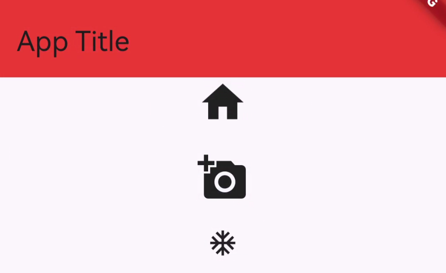
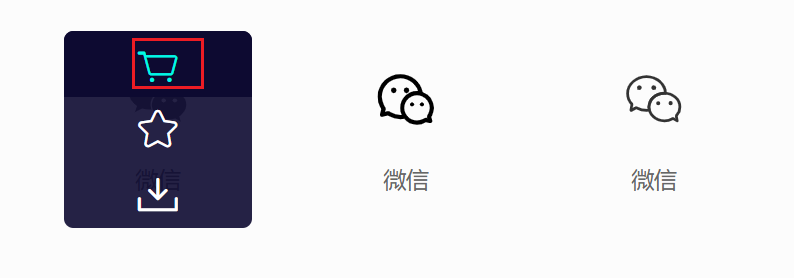
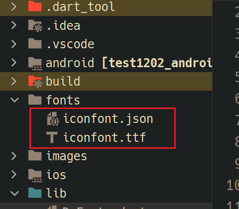
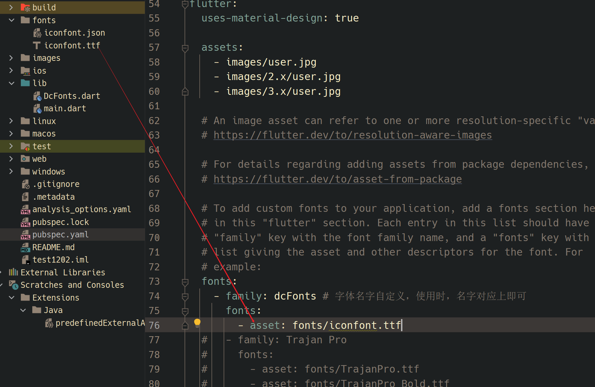
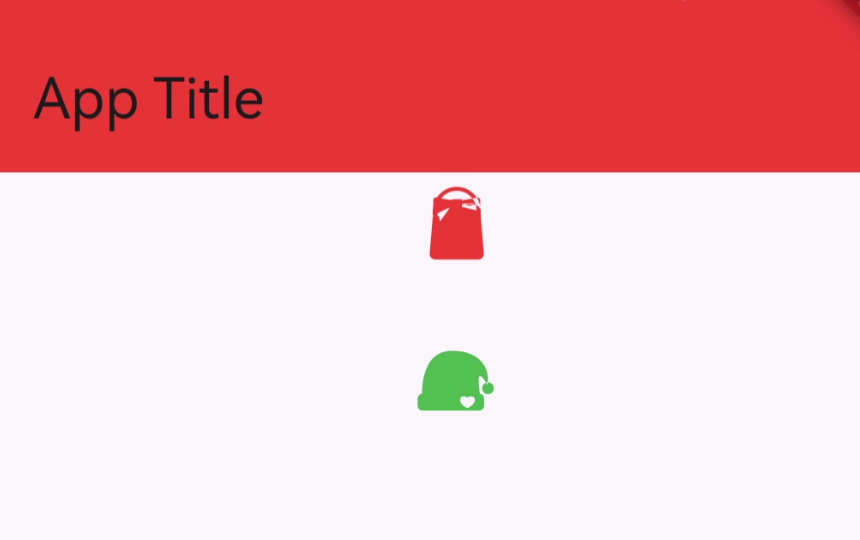

## 使用内置图标
```dart
import 'package:flutter/material.dart';

void main() {
  runApp(
    MaterialApp(
      home: Scaffold(
        appBar:
            AppBar(title: const Text("App Title"), backgroundColor: Colors.red),
        body: const MyHomePage(),
      ),
    ),
  );
}

class MyHomePage extends StatelessWidget {
  const MyHomePage({super.key});

  @override
  Widget build(BuildContext context) {
    return const Center(
      child: Column(
        children: [
          Icon(Icons.home, size: 40),
          SizedBox(height: 20),
          Icon(Icons.add_a_photo, size: 40),
          SizedBox(height: 20),
          Icon(Icons.ac_unit),
        ],
      ),
    );
  }
}
```

效果：


## 使用阿里巴巴图标库
### 1. 下载图标字体文件
选中图标加入购物车

打开购物车，点击下载代码

解压，赋值字体文件和json描述信息到项目 fonts 目录下:


### 2. 声明字体文件



### 3. 使用
新建字体类，用 IconData 类型，包装自定义的图标

```dart
import 'package:flutter/material.dart';

class DcFonts {
  static const IconData gouwudai = IconData(
  // json 字体描述文件中，此图标的编码，16进制表示
    0xe841,
    // 声明字体文件时起的字体名称
    fontFamily: "dcFonts",
    // 是否和文字的书写方向保持一致
   // 当 matchTextDirection 设置为 true 时，图标将在右到左（RTL）文本方向中自动镜像。这对于支持国际化的应用程序特别重要，因为某些语言（如阿拉伯语和希伯来语）是从右到左书写的。
    matchTextDirection: true
  );

    static const IconData shengdanmao = IconData(
    0xe842,
    fontFamily: "dcFonts",
    matchTextDirection: true
  );
}
```


main.dart
```dart

import 'package:flutter/material.dart';
import 'DcFonts.dart';

void main() {
  runApp(
    MaterialApp(
      home: Scaffold(
        appBar:
            AppBar(title: const Text("App Title"), backgroundColor: Colors.red),
        body: const MyHomePage(),
      ),
    ),
  );
}

class MyHomePage extends StatelessWidget {
  const MyHomePage({super.key});

  @override
  Widget build(BuildContext context) {
    return const Center(
      child: Column(
        children: [
          Icon(DcFonts.gouwudai, size: 40, color: Colors.red),
          SizedBox(height: 20),
          Icon(DcFonts.shengdanmao, size: 40, color: Colors.green),
        ],
      ),
    );
  }
}
```

效果:



> 联系方式: dccmmtop@foxmail.com