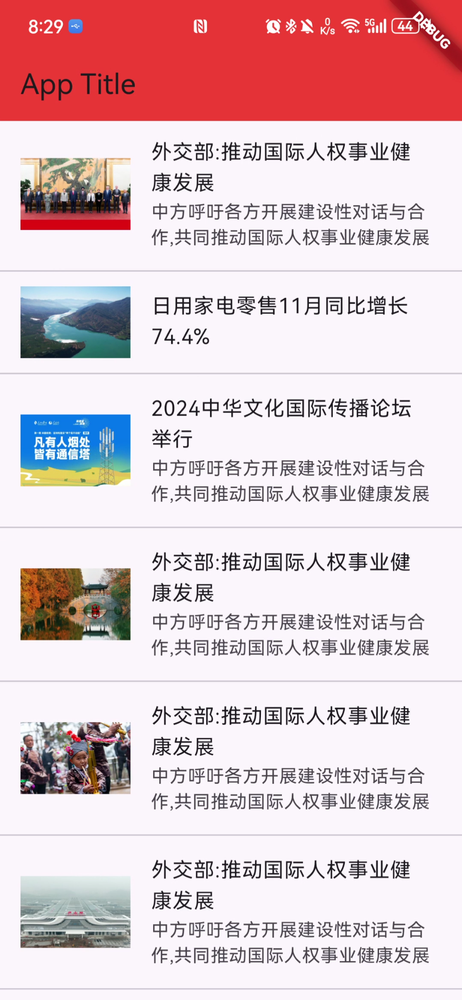
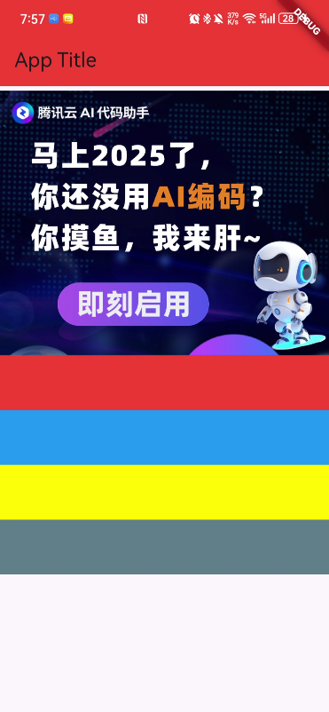
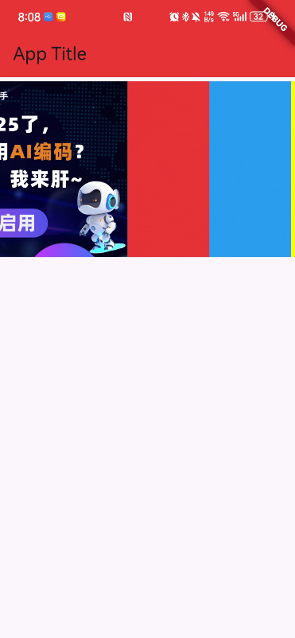
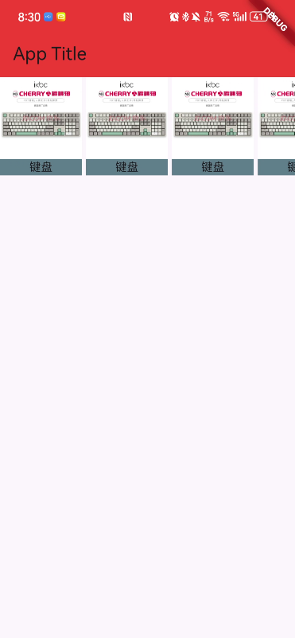

# ListView 常用属性讲解

`ListView` 是 Flutter 中用于展示滚动列表的一个非常常用的小部件。以下是一些常用的 `ListView` 属性及其说明：

## 1. children
- **类型**: `List<Widget>`
- **说明**: 用于直接传入一个包含多个子小部件的列表。适合子项数量较少的情况。

  ```dart
  ListView(
    children: <Widget>[
      ListTile(title: Text('Item 1')),
      ListTile(title: Text('Item 2')),
      ListTile(title: Text('Item 3')),
    ],
  )
  
## 2. builder
- 类型: IndexedWidgetBuilder
- 说明: 用于懒加载子项，适合子项数量较多的情况。只有在需要时才会构建可见的子项。
```dart
ListView.builder(
  itemCount: 100,
  itemBuilder: (context, index) {
    return ListTile(title: Text('Item $index'));
  },
)
```
## 3. separatorBuilder
说明: 用于在 ListView.separated 中指定分隔符的构建方式。可以用于添加分隔线或间距。
```dart
ListView.separated(
  itemCount: 100,
  itemBuilder: (context, index) {
    return ListTile(title: Text('Item $index'));
  },
  separatorBuilder: (context, index) => Divider(),
)

```
## 4. scrollDirection
- 类型: Axis
- 说明: 用于设置滚动方向，可以是 Axis.vertical（默认）或 Axis.horizontal。
## 5. physics
- 类型: ScrollPhysics
- 说明: 用于控制滚动行为，例如设置为 NeverScrollableScrollPhysics 来禁用滚动。
## 6. shrinkWrap
- 类型: bool
- 说明: 指示 ListView 是否应根据子项的大小来计算自身的高度。通常在嵌套滚动视图时使用。
## 7. padding
- 类型: EdgeInsets
- 说明: 用于设置 ListView 的内边距。
## 8. itemExtent
- 类型: double
- 说明: 用于设置每个列表项的高度，适合高度固定的列表以提高性能。


# ListTile 使用
ListTile 是 Flutter 中用于构建列表项的一个小部件。它通常用于在 ListView 或其他列表结构中显示一个条目。ListTile 提供了一种标准化的方式来展示信息，包括标题、副标题、图标等。

主要属性
- leading:
用于显示在列表项前面的图标或小部件（如 Icon 或 CircleAvatar）。
- title:
列表项的主标题，通常是一个 Text 小部件。
- subtitle:
列表项的副标题，通常也是一个 Text 小部件，可以用于显示额外信息。
- trailing:
用于显示在列表项后面的图标或小部件，常用于操作按钮或状态指示器。
- onTap:
点击列表项时执行的回调函数，允许你在用户点击时执行特定操作。
- isThreeLine:
一个布尔值，指示列表项是否有三行文本（标题、副标题和额外的文本）。
- dense:
一个布尔值，指示列表项是否应更紧凑地显示。

使用示例

```dart
ListTile(
  leading: Icon(Icons.album),
  title: Text('音乐专辑'),
  subtitle: Text('艺术家名称'),
  trailing: Icon(Icons.more_vert),
  onTap: () {
    // 执行某个操作
  },
)
```

效果：
```dart
import 'package:flutter/material.dart';

void main() {
  runApp(
    MaterialApp(
      home: Scaffold(
        appBar:
            AppBar(title: const Text("App Title"), backgroundColor: Colors.red),
        body: const MyList(),
      ),
    ),
  );
}

class MyList extends StatelessWidget {
  const MyList({super.key});

  @override
  Widget build(BuildContext context) {
    return Center(
      child: ListView(
        padding: const EdgeInsets.only(top: 5),
        children: [
          ListTile(
            // 设置前图片
            leading: Image.network(
              "http://www.people.com.cn/NMediaFile/2024/1210/MAIN1733813355177423YPNX22U.jpg",
            ),
            title: const Text("外交部:推动国际人权事业健康发展"),
            subtitle: const Text("中方呼吁各方开展建设性对话与合作,共同推动国际人权事业健康发展"),
          ),
          const Divider(),
          ListTile(
            leading: Image.network(
                "http://www.people.com.cn/NMediaFile/2024/1210/MAIN1733839403962N0OCKJB5ST.jpg"),
            title: const Text("日用家电零售11月同比增长74.4%"),
          ),
          const Divider(),
          ListTile(
            leading: Image.network(
              "http://www.people.com.cn/NMediaFile/2024/1210/MAIN1733793685988EYPIIFO3TV.jpg",
            ),
            title: const Text("2024中华文化国际传播论坛举行"),
            subtitle: const Text("中方呼吁各方开展建设性对话与合作,共同推动国际人权事业健康发展"),
          ),
          const Divider(),
          ListTile(
            leading: Image.network(
              "http://www.people.com.cn/NMediaFile/2024/1210/MAIN1733839403877Y0W2V4B91F.jpg",
            ),
            title: const Text("外交部:推动国际人权事业健康发展"),
            subtitle: const Text("中方呼吁各方开展建设性对话与合作,共同推动国际人权事业健康发展"),
          ),
          const Divider(),
          ListTile(
            leading: Image.network(
              "http://www.people.com.cn/NMediaFile/2024/1210/MAIN17337944922831E47YQPF4V.jpg",
            ),
            title: const Text("外交部:推动国际人权事业健康发展"),
            subtitle: const Text("中方呼吁各方开展建设性对话与合作,共同推动国际人权事业健康发展"),
          ),
          const Divider(),
          ListTile(
            leading: Image.network(
              "http://www.people.com.cn/NMediaFile/2024/1210/MAIN1733843461835Q6SZWKGIS9.jpg",
            ),
            title: const Text("外交部:推动国际人权事业健康发展"),
            subtitle: const Text("中方呼吁各方开展建设性对话与合作,共同推动国际人权事业健康发展"),
          ),
          const Divider(),
          ListTile(
            leading: Image.network(
              "http://www.people.com.cn/NMediaFile/2024/1210/MAIN1733839403914U9M3IAKRAR.jpg",
            ),
            title: const Text("外交部:推动国际人权事业健康发展"),
            subtitle: const Text("中方呼吁各方开展建设性对话与合作,共同推动国际人权事业健康发展"),
          ),
        ],
      ),
    );
  }
}
```




# 自定义垂直列表组件
children 中可以放任意组件:
- 垂直列表组件无法设置宽度。会根据屏幕自适应

```dart
import 'package:flutter/material.dart';

void main() {
  runApp(
    MaterialApp(
      home: Scaffold(
        appBar:
            AppBar(title: const Text("App Title"), backgroundColor: Colors.red),
        body: const MyList(),
      ),
    ),
  );
}

class MyList extends StatelessWidget {
  const MyList({super.key});

  @override
  Widget build(BuildContext context) {
    return Center(
      child: ListView(
        padding: const EdgeInsets.only(top: 5),
        // 可以放任意组件, 垂直列表中，宽度根据屏幕自适应，不能手动设置宽度
        children: [
          Image.network(
            "https://developer.qcloudimg.com/operation/attachment/900005/20241205-9e91b6ad.png",
            height: 400,
          ),
          Container(
            height: 60,
            // 设置宽度无效
            width: 100,

            decoration: const BoxDecoration(color: Colors.red),
          ),
          Container(
            height: 60,
            decoration: const BoxDecoration(color: Colors.blue),
          ),
          Container(
            height: 60,
            decoration: const BoxDecoration(color: Colors.yellowAccent),
          ),
          Container(
            height: 60,
            decoration: const BoxDecoration(color: Colors.blueGrey),
          ),
        ],
      ),
    );
  }
}
```
**效果:**


# 自定义水平列表
- 水平列表中，如果没有给列表的父容器设置高度，则列表的高度根据屏幕自适应，不能手动设置宽度

```dart
import 'package:flutter/material.dart';

void main() {
  runApp(
    MaterialApp(
      home: Scaffold(
        appBar:
            AppBar(title: const Text("App Title"), backgroundColor: Colors.red),
        body: const MyList(),
      ),
    ),
  );
}

class MyList extends StatelessWidget {
  const MyList({super.key});

  @override
  Widget build(BuildContext context) {
    return SizedBox(
      // 父容器设置高度，控制列表整体的高度
      height: 220,
      child: ListView(
        scrollDirection: Axis.horizontal,
        padding: const EdgeInsets.only(top: 5),
        // 水平列表中，如果没有给列表的父容器设置高度，则列表的高度根据屏幕自适应，不能手动设置宽度
        children: [
          Image.network(
            "https://developer.qcloudimg.com/operation/attachment/900005/20241205-9e91b6ad.png",
          ),
          Container(
            decoration: const BoxDecoration(color: Colors.red),
            width: 100,
            // 水平列表设置高度无效
            height: 420,
          ),
          Container(
            decoration: const BoxDecoration(color: Colors.blue),
            width: 100,
          ),
          Container(
            decoration: const BoxDecoration(color: Colors.yellowAccent),
            width: 100,
          ),
          Container(
            width: 100,
            decoration: const BoxDecoration(color: Colors.blueGrey),
          ),
        ],
      ),
    );
  }
}
```
**效果:**


# 实现水平列表商品效果
```dart
import 'package:flutter/material.dart';

void main() {
  runApp(
    MaterialApp(
      home: Scaffold(
        appBar:
            AppBar(title: const Text("App Title"), backgroundColor: Colors.red),
        body: const MyList(),
      ),
    ),
  );
}

class MyList extends StatelessWidget {
  const MyList({super.key});

  @override
  Widget build(BuildContext context) {
    return SizedBox(
      // 父容器设置高度，控制列表整体的高度
      height: 120,
      child: ListView(
        scrollDirection: Axis.horizontal,
        // padding: const EdgeInsets.only(top: 5),
        // 水平列表中，如果没有给列表的父容器设置高度，则列表的高度根据屏幕自适应，不能手动设置宽度
        children: [
          MyShop(
            "https://img14.360buyimg.com/n0/jfs/t1/226009/21/18660/59607/664f0109Fd05e02d9/6fb2028c374334c7.jpg",
            "键盘",
          ),
          const SizedBox(width: 5),
          MyShop(
            "https://img14.360buyimg.com/n0/jfs/t1/226009/21/18660/59607/664f0109Fd05e02d9/6fb2028c374334c7.jpg",
            "键盘",
          ),
          const SizedBox(width: 5),
          MyShop(
            "https://img14.360buyimg.com/n0/jfs/t1/226009/21/18660/59607/664f0109Fd05e02d9/6fb2028c374334c7.jpg",
            "键盘",
          ),
          const SizedBox(width: 5),
          MyShop(
            "https://img14.360buyimg.com/n0/jfs/t1/226009/21/18660/59607/664f0109Fd05e02d9/6fb2028c374334c7.jpg",
            "键盘",
          ),
          const SizedBox(width: 5),
          MyShop(
            "https://img14.360buyimg.com/n0/jfs/t1/226009/21/18660/59607/664f0109Fd05e02d9/6fb2028c374334c7.jpg",
            "键盘",
          ),
          const SizedBox(width: 5),
          MyShop(
            "https://img14.360buyimg.com/n0/jfs/t1/226009/21/18660/59607/664f0109Fd05e02d9/6fb2028c374334c7.jpg",
            "键盘",
          ),
          const SizedBox(width: 5),
          MyShop(
            "https://img14.360buyimg.com/n0/jfs/t1/226009/21/18660/59607/664f0109Fd05e02d9/6fb2028c374334c7.jpg",
            "键盘",
          ),
        ],
      ),
    );
  }
}

class MyShop extends StatelessWidget {
  String imgUrl;
  String text;

  MyShop(this.imgUrl, this.text, {super.key});

  @override
  Widget build(BuildContext context) {
    return Container(
      decoration: const BoxDecoration(
        color: Colors.blueGrey,
      ),
      width: 100,
      child: Column(
        children: [
          SizedBox(
            height: 100,
            child: Image.network(
              imgUrl,
            ),
          ),
          Text(text),
        ],
      ),
    );
  }
}
```

**效果**

> 联系方式: dccmmtop@foxmail.com