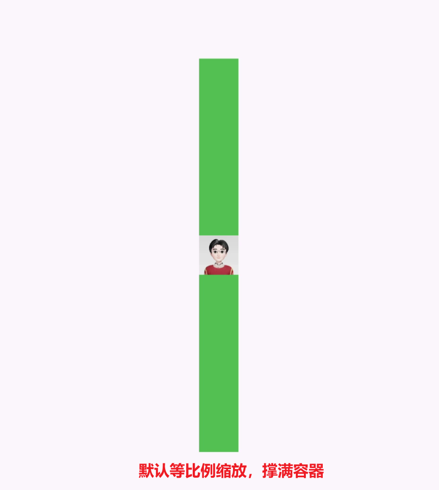
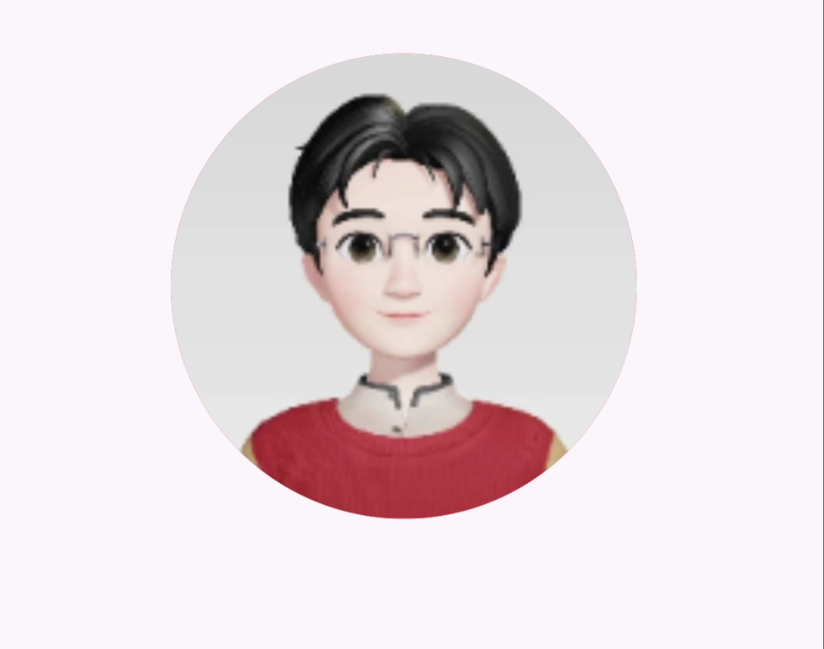
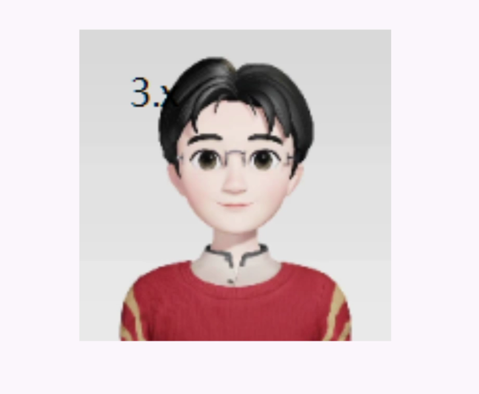

- [从网络加载图片](#从网络加载图片)
  - [常用属性](#常用属性)
    - [对齐方式, alignment](#对齐方式-alignment)
    - [缩放  scale](#缩放--scale)
    - [平铺方式 fit](#平铺方式-fit)
    - [重复方式 repeat](#重复方式-repeat)
  - [圆形图片](#圆形图片)
    - [Container 方式](#container-方式)
    - [ClipOval 方式](#clipoval-方式)
    - [ClipOval 介绍](#clipoval-介绍)
- [读取本地图片](#读取本地图片)


## 从网络加载图片
```dart
child: Image.network("https://profile-avatar.csdnimg.cn/cbaf0093c7ea46a89fd3780f1a250fbe_a141210104.jpg"),
```
默认保持比例缩放：
```dart
class MyApp extends StatelessWidget {
  const MyApp({super.key});

  @override
  Widget build(BuildContext context) {
    return Center(
      child: Container(
        width: 30,
        height: 300,
        color: Colors.green,
        child: Image.network("https://profile-avatar.csdnimg.cn/cbaf0093c7ea46a89fd3780f1a250fbe_a141210104.jpg"),
      ),
    );
  }
}
```
效果:


### 常用属性
#### 对齐方式, alignment
设置放在父容器中的位置, 默认居中
```dart
Image.network(
    "https://profile-avatar.csdnimg.cn/cbaf0093c7ea46a89fd3780f1a250fbe_a141210104.jpg",
    // 父容器左顶点
    alignment: Alignment.topLeft)
```

#### 缩放  scale
```dart
Image.network(
    "https://profile-avatar.csdnimg.cn/cbaf0093c7ea46a89fd3780f1a250fbe_a141210104.jpg",
    // 缩小2倍
    scale: 2)
```

#### 平铺方式 fit
```dart
Image.network(
    "https://profile-avatar.csdnimg.cn/cbaf0093c7ea46a89fd3780f1a250fbe_a141210104.jpg",
    // 等比例放大或缩小，直到充满父容器
    fit: BoxFit.fill)
```
#### 重复方式 repeat
```dart
Image.network(
    "https://profile-avatar.csdnimg.cn/cbaf0093c7ea46a89fd3780f1a250fbe_a141210104.jpg",
    //当图片小于父容器时，重复显示。直到铺满父容器
    repeat: ImageRepeat.repeat,
    //在水平方向上重复显示
    // repeat: ImageRepeat.repeatX,

    //在垂直方向上重复显示
    // repeat: ImageRepeat.repeatX,
    )
```

### 圆形图片

#### Container 方式
```dart
import 'package:flutter/material.dart';

void main() {
  runApp(
    MaterialApp(
      home: Scaffold(
        appBar: AppBar(title: const Text("App Title")),
        body: const MyApp(),
      ),
    ),
  );
}

class MyApp extends StatelessWidget {
  const MyApp({super.key});

  @override
  Widget build(BuildContext context) {
    return Center(
      child: Container(
        width: 200,
        height: 200,
        decoration: BoxDecoration(
          color: Colors.red,
          // 设置圆角100,为宽度的一半， 实现圆形图片
          borderRadius: BorderRadius.circular(100),
          // image 给容器设置图片装饰
          image: const DecorationImage(
            image: NetworkImage(
              "https://profile-avatar.csdnimg.cn/cbaf0093c7ea46a89fd3780f1a250fbe_a141210104.jpg",
            ),
            // 设置平铺方式
            fit: BoxFit.cover
          ),
        ),
      ),
    );
  }
}
```
效果:



#### ClipOval 方式
```dart
import 'package:flutter/material.dart';

void main() {
  runApp(
    MaterialApp(
      home: Scaffold(
        appBar: AppBar(title: const Text("App Title")),
        body: const OvalImage(),
      ),
    ),
  );
}

class OvalImage extends StatelessWidget {
  const OvalImage({super.key});

  @override
  Widget build(BuildContext context) {
    return Center(
      child: ClipOval(
        child: Image.network(
            "https://profile-avatar.csdnimg.cn/cbaf0093c7ea46a89fd3780f1a250fbe_a141210104.jpg",
            width: 200,
            height: 200,
            fit: BoxFit.cover),
      ),
    );
  }
}
```
#### ClipOval 介绍
ClipOval 是 Flutter 中的一个 Widget，用于将其子 Widget 裁剪为椭圆形或圆形。它常用于创建圆形头像、按钮或其他需要圆形效果的 UI 元素。

- 主要特性
裁剪形状：ClipOval 可以将其子 Widget 裁剪为椭圆或圆形，具体形状取决于其父容器的宽高比。
适用于任意 Widget：任何 Widget 都可以作为 ClipOval 的子 Widget，例如 Image、Container 或 Text。
简化布局：使用 ClipOval 可以轻松地在 UI 中创建圆形或椭圆形元素，而不需要手动处理边框和圆角。
常用属性
- child:
类型：Widget
描述：要被裁剪的子 Widget。

## 读取本地图片

1. 在项目根目录下新建images文件夹
2. 在 images 目录下新建 2.x 3.x 文件夹
3. 分别在images  images/2.x  images/3.x 目录下放入不同分辨率的图片 user.png
   flutter 会根据屏幕大小自动选择合适分辨率的图片
4. 在 pubspec.yml 文件中声明资源:
   ```yaml
    flutter:
    uses-material-design: true

    assets:
        - images/user.jpg
        - images/2.x/user.jpg
        - images/3.x/user.jpg
   ```
5. 在代码中通过 `Image.assets("img_path")` 使用


示例：
```dart

import 'package:flutter/material.dart';

void main() {
  runApp(
    MaterialApp(
      home: Scaffold(
        appBar: AppBar(title: const Text("App Title")),
        body: const LocalImage(),
      ),
    ),
  );
}

class LocalImage extends StatelessWidget {
  const LocalImage({super.key});

  @override
  Widget build(BuildContext context) {
    return Center(
      child: Container(
        width: 200,
        height: 200,
        // 会根据屏幕大小自动选择合适分辨率的图片
        child: Image.asset(
          "images/user.jpg",
          fit: BoxFit.cover,
        ),
      ),
    );
  }
}
```

效果:



> 联系方式: dccmmtop@foxmail.com