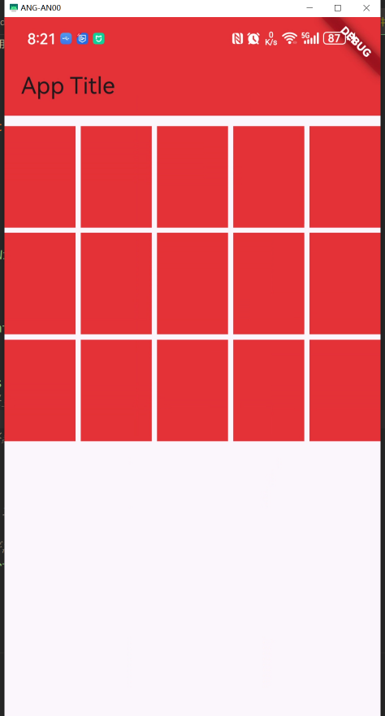

## GridView.count

### 常用属性
- **crossAxisCount**: 每一行（如果滚动方向是垂直的话）或每一列（如果滚动方向是水平的话）有多少个子组件。这是必须指定的参数。

- **childAspectRatio**: 子组件宽高比，默认值为 1.0，即正方形。你可以通过调整这个值来改变子组件的大小。例如，如果你想要每个子组件宽度是高度的两倍，你可以设置 `childAspectRatio: 2.0`。

- **mainAxisSpacing**: 设置主轴方向上子组件之间的间距。对于竖直滚动的 GridView，这将是子组件上下之间的间距；对于水平滚动的 GridView，这将是左右之间的间距。

- **crossAxisSpacing**: 设置交叉轴方向上子组件之间的间距。对于竖直滚动的 GridView，这将是子组件左右之间的间距；对于水平滚动的 GridView，这将是上下之间的间距。

- **children**: 包含所有子组件的列表，这些子组件将按照定义的网格布局进行排列。

- **scrollDirection**: 定义了 GridView 的滚动方向，可以是 `Axis.vertical` 或 `Axis.horizontal`，默认是竖直滚动。

- **padding**: 定义了 GridView 内边距，即网格布局与屏幕边缘的距离。

- **reverse**: 如果设置为 true，则反转滚动方向。

- **primary**: 确定是否应该将 GridView 作为主滚动小部件。默认情况下，当没有提供明确的滚动控制器时，它是 true。

- **physics**: 定义了 GridView 的滚动行为，比如是否允许用户滚动、是否有弹性的效果等。

- **shrinkWrap**: 如果设置为 true，GridView 的高度会根据子组件的内容自动调整。默认是 false，这时 GridView 会尽可能地占用多的空间。

- **controller**: 可选的 ScrollController，用于控制 GridView 的滚动位置。

使用 `GridView.count` 创建的网格布局非常适合那些需要显示固定数量项目的情况，例如相册应用中显示图片缩略图或者商品展示页面。

示例:
```dart
import 'package:flutter/material.dart';

void main() {
  runApp(
    MaterialApp(
      home: Scaffold(
        appBar:
            AppBar(title: const Text("App Title"), backgroundColor: Colors.red),
        body: const MyGrid(),
      ),
    ),
  );
}

class MyGrid extends StatelessWidget {
  const MyGrid({super.key});

  @override
  Widget build(BuildContext context) {
    return GridView.count(
      // 控制边距
      padding: const EdgeInsets.only(top: 10),
      // 交叉轴方向的数量。如果是竖直滚动的，交叉轴即是x轴
      crossAxisCount: 5,
      // 主轴方向网格的间距，网格默认竖直方向滚动，竖直方向即是主轴
      mainAxisSpacing: 5,
      // 交叉轴方向网格的间距
      crossAxisSpacing: 5,
      // 控制网格的宽高比。 默认 1.0. 正方形
      childAspectRatio: 0.7,
      // 控制滚动方向，如果是水平滚动。主轴就是x轴，
      scrollDirection: Axis.vertical,
      children: initChild(15),
    );
  }

  List<Widget> initChild(int n) {
    List<Widget> children = [];
    for (int i = 0; i < n; i++) {
      Container c = Container(
        decoration: const BoxDecoration(color: Colors.red),
      );
      children.add(c);
    }

    return children;
  }
}
```
**效果**



> 联系方式: dccmmtop@foxmail.com