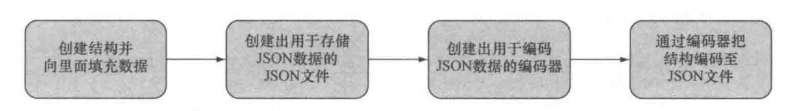

这个封装程序使用的结构和之前分析JSON时使用的结构是相同的。 

1. 程序首先会创建一些结构，然后通过调用MarshalIndent函数将结构封装为由字节切片组成的JSON数据
2. 最后，程序会将封装所得的JSON数据存储到指定的文件中。

也可以通过编码器手动将Go结构编码为json数据

流程如下:


##  示例
```go
package main

import (
    "encoding/json"
    "fmt"
    "io/ioutil"
    "os"
)

type Post struct {
    // 处理对象属性与json字段的映射关系
    // 如果对象属性与json字段名称相同。可以省略
    Id int `json:"id"`
    Content string `json:"content"`
    Author Author  `json:"author"`
    Comments []Comment `json:"comments"`
}
type Author struct {
    Id int `json:"id"`
    Name string `json:"name"`
}

type Comment struct {
    Id int `json:"id"`
    Content string `json:"content"`
    Author string `json:"author"`
}

func main(){
    post := Post{
        Id: 1,
        Content: "Hello World",
        Author: Author{
            Id: 2,
            Name: "dc1",
        },
        Comments: []Comment{
            {
                Id: 3,
                Content: "Have a great day",
                Author: "Adam",
            },
            {
                Id: 4,
                Content: "How are you today",
                Author: "Betty",
            },
        },
    }
    fmt.Printf("post: %v\n", post)
    // 将 json 结构封装为由字节切片组成的Json数据
    output, err := json.MarshalIndent(&post,"","\t\t")
    if err != nil {
        panic(err)
    }
    // 将数据写入文件中
    err = ioutil.WriteFile("post.json",output,0666)
    if err != nil {
        panic(err)
    }


    // 使用Encoder将结构编码到文件中
    // 创建用于储存json的文件
    jsonFile, err := os.Create("./post1.json")
    if err != nil {
        panic(err)
    }
    // 创建解码器
    encoder := json.NewEncoder(jsonFile)
    // 把结构编码到json文件中
    err = encoder.Encode(&post)
    if err != nil {
        panic(err)
    }
}
```
