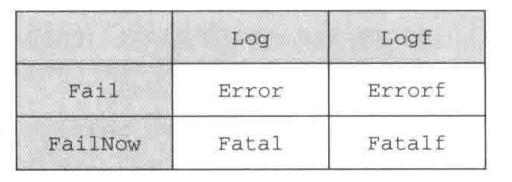
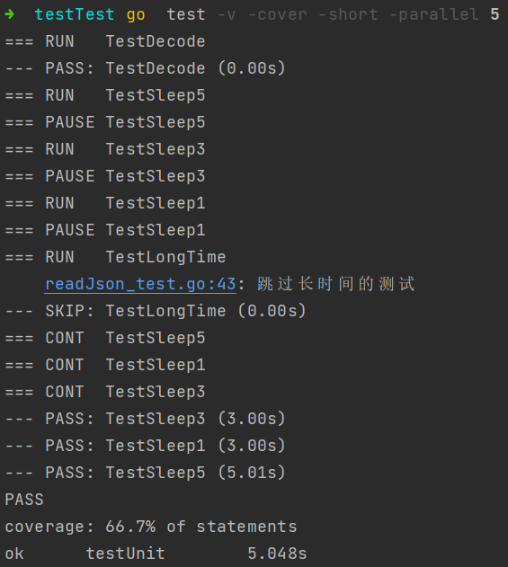

## 概念

测试是编程工作中非常重要的一环，但很多人却忽视了这一点，又或者只是把测试看作是一种可有可无的补充手段。Go语言提供了一些基本的测试功能，这些功能初看上去可能会显得非常原始，但正如将要介绍的那样，这些工具实际上已经能够满足程序员对自动测试的需要了。

除了Go语言内置的testing包之外，还会介绍check和Ginkgo这两个流行的Go测试包，它们提供的功能比testing包更为丰富。

## testing
testing包需要与go test命令以及源代码中所有以-test.go后缀结尾的测试文件一同使用。尽管Go并没有强制要求，但一般来说，测试文件的名字都会与被测试源码文件的名字相对应。

举个例子，对于源码文件server.go，我们可以创建出一个名为server-test.go的测试文件，这个测试文件包含我们想对server.go进行的所有测试。另外需要注意的一点是，被测试的源码文件和测试文件必须位于同一个包之内。

为了测试源代码，用户需要在测试文件中创建具有以下格式的测试函数，其中xxx可以是任意英文字母以及数字的组合，但是首字符必须是大写的英文字母：

`func TestXxx（*testing.T）{..}`

在测试函数的内部，用户可以使用Error，Fail等一系列方法表示测试失败。当用户在终端里面执行go test命令的时候，所有符合上述格式的测试函数就会被执行。如果一个测试在执行的时候没有任何失败，就认为通过了测试

一般来说，一个单元通常会与程序中的一个函数或者一个方法相对应，但这并不是必须的。程序中的一个部分能否独立地进行测试，是评判这个部分能否被归纳为“单元”的一个重要指标。

### 检测错误

```go
func TestDecode(t *testing.T){
    post := Decode("./tsconfig.json")
    if post.Id != 1{
        t.Error("错误的postId, 期望得到1，实际是: ", post.Id)
    }

    if post.Content != "Hello world!" {
        t.Error("错误的post content, 期望得到'Hello world'，实际是: ", post.Content)
    }

}
```

testing.T 有几个常用的方法:
- Log 将给定的文本记录到错误日志里， 与 `fmt.Println` 类似
- Logf 根据给定的格式,将文本记录到错误日志，与 `fmt.Printf` 类似
- Fail 将测试函数标记已失败，但允许测试函数继续执行
- FailNow 将测试函数标记已失败，并停止执行测试函数

除此之外。还提供了其他便利的方法

Error 先执行 Log 函数，再执行 Fail 函数, 其他3个类似

### 执行
`go test` 这条命令会执行当前目录中名字以_test.go为后缀的所有文件。结果如下


`go test` 输出很精简, 可以加 -v 参数使输出内容更详细, -cover 获知测试用例对代码的覆盖率


### 跳过测试用例

#### Skip

在进行测试驱动开发（test-driven development，TDD）的时候，通常会让测试用例持续地失败，直到函数被真正地实现出来为止；

但是，为了避免测试用例在函数尚未实现之前一直打印烦人的失败信息，用户也可以使用testing.T 结构提供的skip函数，暂时跳过指定的测试用例。

此外，如果某个测试用例的执行时间非常长，我们也可以在实施完整性检查（sanity check）的时候，使用Skip函数跳过该测试用例。

示例代码:

```go
func TestEncode(t *testing.T){
   // Skip 暂时跳过对某个方法的测试
   t.Skip("暂时跳过对Encode方法的测试")
}
```

再次执行测试：


#### Short

除了可以直接跳过整个测试用例，用户还可以通过向go test命令传入短暂标志 `-short`，并在测试用例中使用某些条件逻辑来跳过测试中的指定部分。
注意，这种做法跟在go test命令中通过选项来选择性地执行指定的测试不一样：选择性执行只会执行指定的测试，并跳过其他所有测试，而`-short`标志则会根据用户编写测试代码的方式，跳过测试中的指定部分或者跳过整个测试用例。

示例：
```go
func TestLongTime(t *testing.T) {
    // 如果带有 -short 参数
    if testing.Short() {
        t.Skip("跳过长时间的测试")
    }
    time.Sleep(10 * time.Second)
}
```


### 并行测试
正如之前所说，单元测试的目的是独立地进行测试。尽管有些时候，测试套件会因为内部存在依赖关系而无法独立地进行单元测试，但是只要单元测试可以独立地进行，用户就可以通过并行地运行测试用例来提升测试的速度了

testing 通过 Parallel 方法实现并行

示例：

```go
func TestSleep5(t *testing.T) {
    t.Parallel()
    time.Sleep(5 * time.Second)
}

func TestSleep3(t *testing.T) {
    t.Parallel()
    time.Sleep(3 * time.Second)
}

func TestSleep1(t *testing.T) {
    t.Parallel()
    time.Sleep(3 * time.Second)
    }
```

通过 -parallel n 控制可以同时运行几个单元测试



### 基准测试
Go 的 testing 包支持两种测试，一种是上面的功能测试，还一种就是检验程序的性能的基准测试 
- 基准测试用例也许要放到以 _test.go 结尾的文件中
- 基准测试函数需要符合 func BenchmarkXXXX(b *testing.B) {...} 格式
- 测试用例的迭代次数是Go自行决定的
- 使用 go test -bench . 执行本目录下的所有基准测试

示例：
```go
// 基准测试
func BenchmarkDecode(b *testing.B) {
    for i := 0; i < b.N; i++ {
        Decode("./tsconfig.json")
    }

```
结果:

执行了 21745 次。花费了 55310 纳秒，即 55 毫秒
### 完整代码
json文件

```json
{
  "id": 1,
  "content": "Hello world!",
  "author":{
    "id":2,
    "name": "Sau Sheong"
  },
  "comments": [
    {
      "id": 3,
      "content": "Have a great day!",
      "author": "Adam"
    },
    {
      "id": 4,
      "content": "How are you today?",
      "author": "Betty"
    }
  ]
}
```


```go
package main

import (
    "testing"
    "time"
)

func TestDecode(t *testing.T){
    post := Decode("./tsconfig.json")
    if post.Id != 1{
        t.Error("错误的postId, 期望得到1，实际是: ", post.Id)
    }

    if post.Content != "Hello world!" {
        t.Error("错误的post content, 期望得到'Hello world'，实际是: ", post.Content)
    }

}

func TestSleep5(t *testing.T) {
   t.Parallel()
   time.Sleep(5 * time.Second)
}

func TestSleep3(t *testing.T) {
   t.Parallel()
   time.Sleep(3 * time.Second)
}

func TestSleep1(t *testing.T) {
   t.Parallel()
   time.Sleep(3 * time.Second)
}

func TestEncode(t *testing.T){
 // Skip 暂时跳过对某个方法的测试
 t.Skip("暂时跳过对Encode方法的测试")
}

func TestLongTime(t *testing.T) {
   // 如果带有 -short 参数
   if testing.Short() {
       t.Skip("跳过长时间的测试")
   }
   time.Sleep(10 * time.Second)
}

// 基准测试
func BenchmarkDecode(b *testing.B) {
    for i := 0; i < b.N; i++ {
        Decode("./tsconfig.json")
    }
}
```

