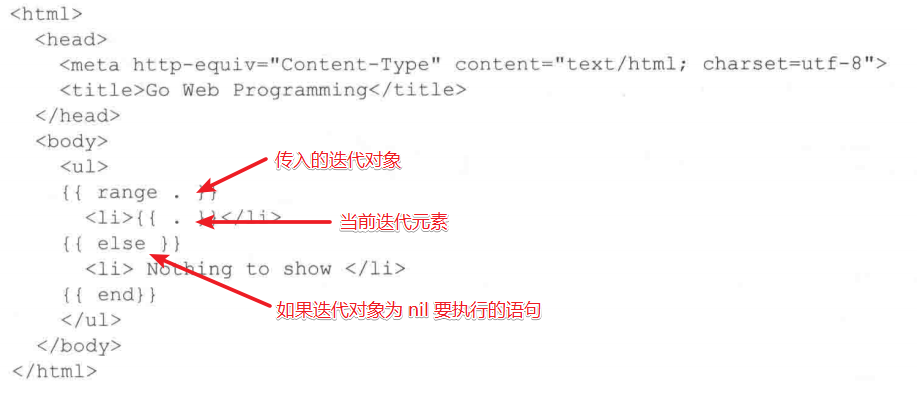
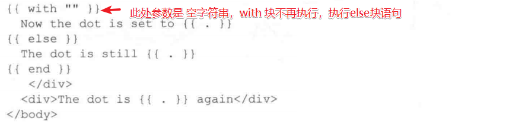
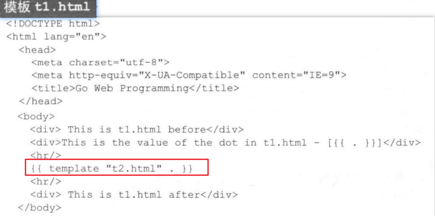
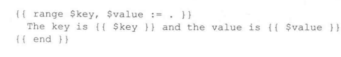
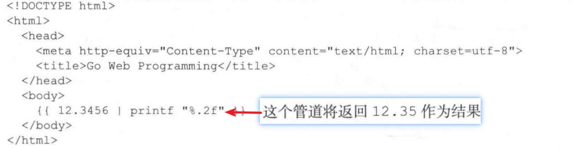

Go的模板动作就是嵌入模板的命令

## 条件动作
```go
{{ if arg }}
some content
{{ else }}
other content
{{ end }}
```

## 迭代动作
迭代动作可以对数组，切片，映射，或者通道进行迭代, 在迭代循环内部， 点(.) 会被设置正在当前迭代内容


## 设置动作
设置动作允许为指定的范围的点(.) 设置指定的值。减少重复代码


## 包含动作
包含动作（include action）允许用户在一个模板里面包含另一个模板，从而构建出嵌套的模板。
包含动作的格式为{{ template "name" arg }}，其中name参数为被包含模板的名字。没有特别指定名称时，就是文件名， arg 是参数名


## 参数、变量和管道
- 参数
一个参数（argument）就是模板中的一个值。它可以是布尔值、整数、字符串等字面量，也可以是结构、结构中的一个字段或者数组中的一个键。除此之外，参数还可以是一个变量、一个方法（这个方法必须只返回一个值，或者只返回一个值和一个错误）或者一个函数。最后，参数也可以是一个点（.），用于表示处理器向模板引擎传递的数据。
- 变量
除了参数之外，用户还可以在动作中设置变量。变量以美元符号（$）开头，就像这样：

在这个例子中，点（.）是一个映射，而动作range在迭代这个映射的时候，会将变量$key和$value分别初始化为当前被迭代映射元素的键和值。

- 管道
模板中的管道（pipeline）是多个有序地串联起来的参数、函数和方法，它的工作方式和语法跟Unix的管道也非常相似：
`{{p1 | p2 | p3}}` 这里的p1,p2和p3可以是参数或者函数。
管道允许用户将**一个参数的输出传递给下一个参数**，而各个参数之间则使用 | 分隔。

## 函数
Go的模板引擎函数都是受限制的：尽管这些函数可以接受任意多个参数作为输入，但它们只能返回一个值，或者返回一个值和一个错误。
为了创建一个自定义模板函数，需要：
1. 创建一个名为FuncMap的映射，并将映射的键设置为函数的名字，而映射的值则设置为实际定义的函数
2. 将FuncMap 与模板绑定

示例：
```go
package main

import (
    "fmt"
    "html/template"
    "net/http"
    "time"
)

func main(){
    server := http.Server{
        Addr: "127.0.0.1:8080",
    }
    http.HandleFunc("/testFuncMap", testFuncMap)
    server.ListenAndServe()
}

func testFuncMap(w http.ResponseWriter, re *http.Request) {
    funcMap := template.FuncMap{
        "fdate": formatDate,
    }
    t  := template.New("testFuncMap.tmpl").Funcs(funcMap)
    // 前后模板的名字必须相同
    t, err := t.ParseFiles("./testFuncMap.tmpl")
   if err != nil {
       fmt.Println(err)
       return
   }
   err = t.Execute(w,time.Now())
    if err != nil {
        fmt.Println(err)
        return
    }

}
func formatDate(t time.Time) string{
    layout := "2006-01-02"
    return t.Format(layout)
}

```
- 模板文件
```html
<!DOCTYPE html>
<html lang="en">
<head>
    <meta charset="UTF-8">
    <title>Title</title>
</head>
<body>
the date/time is {{. | fdate}}
</body>
</html>
```
- 结果
```html
<!DOCTYPE html>
<html lang="en">
<head>
    <meta charset="UTF-8">
    <title>Title</title>
</head>
<body>
the date/time is 2021-11-08
</body>
</html>
```