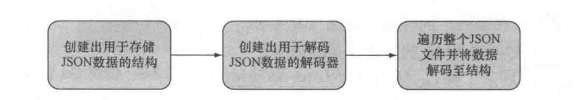

可以使用Unmarshal函数来解封JSON，还可以使用Decoder手动地将JSON数据解码到结构里面，以此来处理流式的JSON数据，
流程如下


## 要解析的json文件
```json
{
  "id": 1,
  "content": "Hello world!",
  "author":{
    "id":2,
    "name": "Sau Sheong"
  },
  "comments": [
    {
      "id": 3,
      "content": "Have a great day!",
      "author": "Adam"
    },
    {
      "id": 4,
      "content": "How are you today?",
      "author": "Betty"
    }
  ]
}
```

## 示例
```go
package main

import (
    "encoding/json"
    "fmt"
    "io"
    "io/ioutil"
    "os"
)

type Post struct {
    // 处理对象属性与json字段的映射关系
    // 如果对象属性与json字段名称相同。可以省略
    Id int `json:"id"`
    Content string `json:"content"`
    Author Author  `json:"author"`
    Comments []Comment `json:"comments"`
}
type Author struct {
    Id int `json:"id"`
    Name string `json:"name"`
}

type Comment struct {
    Id int `json:"id"`
    Content string `json:"content"`
    Author string `json:"author"`
}

func main(){
   jsonFile, err :=  os.Open("./tsconfig.json")

   defer jsonFile.Close()
   if err != nil {
      panic(err)
   }
   var post Post
   jsonContent, err := ioutil.ReadAll(jsonFile)
   if err != nil {
       panic(err)
   }
   // 将json数据解封至结构
   err = json.Unmarshal(jsonContent, &post)
   if err != nil {
       panic(err)
   }
   fmt.Printf("post: %v\n", post)


    // 另一种方式  使用解码器
    jsonFile1, err :=  os.Open("./tsconfig.json")

    defer jsonFile1.Close()
    if err != nil {
        panic(err)
    }
    decoder := json.NewDecoder(jsonFile1)
    var post1 Post
    err = decoder.Decode(&post1)
    if err != nil && err != io.EOF {
        panic(err)
    }
    fmt.Printf("post1: %v\n", post1)
}
```
## 选择

最后，在面对JSON数据时，我们可以根据输入决定使用Decoder还是Unmarshal：

如果JSON数据来源于io.Reader流， 如http.Request的Body，那么使用Decoder更好；

如果JSON数据来源于字符串或者内存的某个地方，那么使用Unmarshal更好。