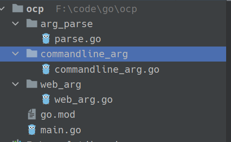

## OCP：开闭原则

软件的5大设计原则 “SOLID” 原则,其中之一就是 OCP(开闭原则)

该设计原则是由Bertrand Meyer在20世纪80年代大力推广的，其核心要素是：如果软件系统想要更容易被改变，那么其设计就必须允许新增代码来修改系统行为，而非只能靠修改原来的代码。

对原有代码改动越少，系统就越稳定。致力于实现增加新的功能只通过增加一个插件就可以实现

## 案例

某程序想实现对输入参数的转换，参数目前是来自命令行，以后可能来自网页，或者从文本读取。如果把处理业务的逻辑与参数转换耦合到一起，那么以后修改参数来源时，势必会需改部分业务逻辑，造成系统的不稳定。本文将模仿 "database/sql" 的方式，只需更换不同的包，实现更换转换器的效果


目录结构如下:




**main.go**

```go
package main

import (
	"ocp/arg_parse"
	//安装命令行转换器
	//_ "ocp/commandline_arg"

	// 或者安装网页参数转换器
	_ "ocp/web_arg"
	"os"
)

func main(){
    //  从原代码层面看，就是通过接口进行参数转换。在运行时，一个具体的实现就注册到 Driver 上。
    //  实则是通过该实现类的实例来完成转换的功能
	arg_parse.Driver.ParseArg(os.Args)
}

```

**parse.go**

该包中，大部分应该是接口，表明了各具体实现工具需要实现的一种方法，业务中通过调用接口的方式，最终调用具体实现。

就像一个领导说，我公司有一个开发职位，该职位要求会实现某种转换参数的技能， 你们这些工人必须拥有这项技能，才能来我这里上班

这里职位是虚拟的，职位本身不会干活，但是他要求了应聘该职位工人所拥有的技能

最后领导会协调不同工种相互配合，完成整体任务，而不会关心具体执行任务的工人。

```go
package arg_parse // 定义参数转换的接口，其他各种参数转换器都要实现本接口的功能。


// 具体的实现类的实例会赋值到 Driver，(一个职位)
var Driver Parse

type Args struct {
	Name string
	Age int
	Location string
}

// 待实现的方法(职位要求的技能)
type Parse interface {
	ParseArg([] string) *Args
}

```


**commandline_arg.go**

具体干活的工人1

```go
package commandline_arg

import (
	"fmt"
	"ocp/arg_parse"
)

type CommandlineParse struct {}

func init(){
	// 注册转换器, 该转换器拥有 parse 接口的方法， 就可以注册 (该工人应聘成功)
	fmt.Println("注册 CommandlineParse")
	arg_parse.Driver = &CommandlineParse{}

}

// 具体实现的功能， 实现了 ParseArg 方法 (该工人掌握的技能)
func (c CommandlineParse) ParseArg(args []string) *arg_parse.Args{
	fmt.Println("我是命令行的参数转换器")
	return &arg_parse.Args{}
}

```


**web_arg.go**

具体干活的工人2

```go
package web_arg

import (
	"fmt"
	"ocp/arg_parse"
)

type WebParse struct {}

func init(){
	// 注册转换器, （工人应聘成功）
	fmt.Println("注册 WebParse") 
	arg_parse.Driver = &WebParse{}

}
// 工人掌握的技能
func (c WebParse) ParseArg(args []string) *arg_parse.Args{
	fmt.Println("我是网页的参数转换器")
	return &arg_parse.Args{}
}

```