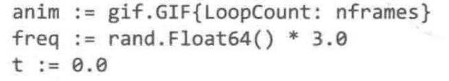

## var 方式
var name *type*  = *expiression*  

```go
var name string = "zhangsan"
var name = "zhangsan"
var name string // 默认值是 ""
```


- 变量列表声明


var 方式通常用户和初始化类型不一致的局部变量，或则初始化值不重要的情况
## 短变量声明


- 多变量声明

i,j := 0,1


## 重点
:= 代表声明
=  标识赋值

- 交换值
i,j = j,i

- 第二次声明等同赋值

第二行 err 等同于赋值

- 至少声明一个变量


