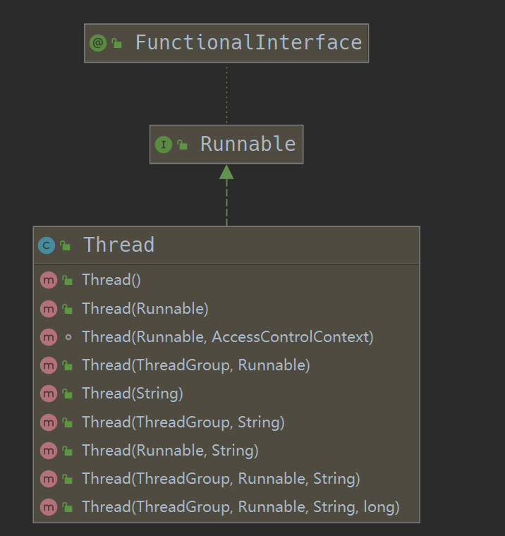
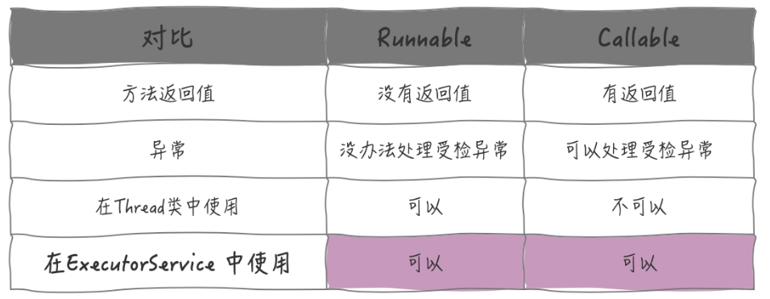
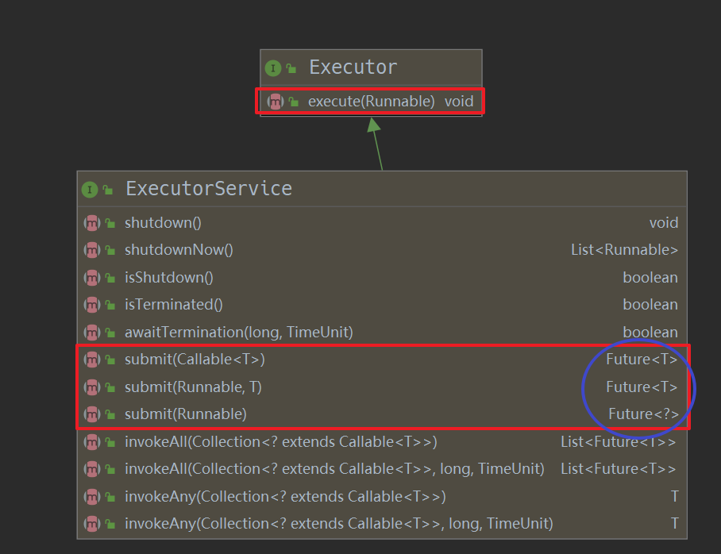
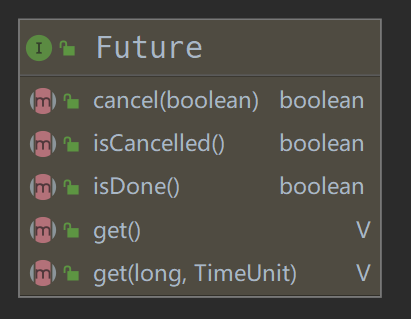

# 为什么需要 Callable

无论是继承 Thread 类，还是实现 Runnale 接口，或者使用线程池的 execute 方法去执行一个异步任务，都无法将这个任务的返回值带出来，以 Runnale 接口为例：
```java
/**
 * @since   JDK1.0
 */
@FunctionalInterface
public interface Runnable {
    public abstract void run();
}
```

可以看到 run()  方法没有参数，没有返回值，没有抛出异常，因此不能适用于那些需要异步任务返回值得场景，由此就诞生了可以获取异步任务结果的工具： Callable

# Callable

又是 Doug Lea 大师

```java

 /**
 * @see Executor
 * @since 1.5
 * @author Doug Lea
 * @param <V> the result type of method {@code call}
 */
@FunctionalInterface
public interface Callable<V> {

    V call() throws Exception;
}
```

Callable 是一个泛型接口，里面只有一个方法，call(), 可以返回泛型值V, Cacheable 与 Runnable 接口很是相似，下面看一下他们之间的区别

# Callable VS Runnable

两个接口都是用于多线程执行任务的，但是他们的使用场景的差别还是很大的。

## 执行机制上的差别

Runnable 可以用在Thread类中，也可以在 ExecutorService 中配合线程池使用，但是 Callable 只能用于 ExecutorService 中，Thread 类中没有 Cacheable 的身影：




## 异常处理的差别


Runnable 接口中的 run 方法签名上没有 throws, 自然也不能向上传播受检异常。而 Callable 接口中的 call f方法可以向上抛出异常。

区别总结如下：



# Callable 在线程池中的应用

上面说过，Callable 接口只能在 ExecutorService 中使用，下面看一下如何使用的



可以看到在 submit 方法中可以接收一个实现了 Callable 接口的任务， 返回的是 Future 类型。而 execute 方法无返回值。 那么 Future 是什么呢？ 如何通过 Future 拿到返回值呢？

# Future



Future 是一个接口，通过方法名就可以看出他们的用途：

```java
// 取消任务
boolean cancel(boolean mayInterruptIfRunning);

// 获取任务执行结果
V get() throws InterruptedException, ExecutionException;

// 获取任务执行结果，带有超时时间限制
V get(long timeout, TimeUnit unit) throws InterruptedException, ExecutionException,  TimeoutException;

// 判断任务是否已经取消
boolean isCancelled();

// 判断任务是否已经结束
boolean isDone();
```
看一下如何使用：

```java
public class FutureDemo {
    public static void main(String[] args) throws InterruptedException, ExecutionException {
        ExecutorService executorService = Executors.newSingleThreadExecutor();

        // 使用 Callable ，可以获取返回值
        Callable<String> callable = () -> {
           System.out.println("进入 Callable 的 call 方法");
            // 模拟子线程任务，在此睡眠 2s，
            // 小细节：由于 call 方法会抛出 Exception，这里不用像使用 Runnable 的run 方法那样 try/catch 了
            Thread.sleep(5000);
            return "Hello from Callable";
        };

       System.out.println("提交 Callable 到线程池");
        Future<String> future = executorService.submit(callable);

       System.out.println("主线程继续执行");

       System.out.println("主线程等待获取 Future 结果");
//        //检查任务是否做完
//        while(!future.isDone()) {
//            System.out.println("Task is still not done...");
//            Thread.sleep(1000);
//        }
        // Future.get() blocks until the result is available
        String result = future.get();
       System.out.println("主线程获取到 Future 结果: " +  result);

        executorService.shutdown();
    }
}

```

结果如下:

```txt
提交 Callable 到线程池
主线程继续执行
主线程等待获取 Future 结果
进入 Callable 的 call 方法
主线程获取到 Future 结果: Hello from Callable

Process finished with exit code 0
```

如果子程序运行时间过长，或者其他原因，我们想 cancel 子程序的运行，则我们可以使用 Future 提供的 cancel 方法，继续对程序做一些修改
```java

while(!future.isDone()) {
   System.out.println("子线程任务还没有结束...");
   Thread.sleep(1000);

   double elapsedTimeInSec = (System.nanoTime() - startTime)/1000000000.0;

      // 如果程序运行时间大于 1s，则取消子线程的运行
   if(elapsedTimeInSec > 1) {
      future.cancel(true);
   }
}
```

特别注意的是，如果使用 cancel 方法取消了任务， get() 方法会抛出一个 CancellationException  异常。


到这里已经知道和配合使用 Cacheable 和 Future 来获取异步任务的返回值了。总结就只有3点：
1. 待执行的任务要实现 Callable 接口中的
2. 使用线程池中的submit 方法
3. 通过 Future 获取任务的返回值

刚刚我们看 ExecutorService 中的 submit 方法返回的是 Future 接口，然后通过接口中的get 方法获取任务的返回值，其实 submit 返回的是 Future 的实现类： FutureTask, 至于 FutureTask 是如何配合线程池拿到任务的返回值，就需要深入源码查看底层实现了，这个以后再新写一遍博客讲解。

# 参考

http://www.lllpan.top/article/102