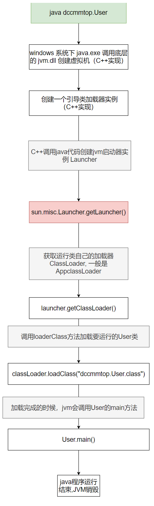

## 类加载是什么

把磁盘中的java文件加载到内存中的过程叫做类加载

当我们用java命令运行某个类的main函数启动程序时，首先需要通过类加载器把主类加载到JVM. 有如下 User 类

```java
package dc.dccmmtop;
public Class User {
    public static void main(String[] args) {
        System.out.println("hello");
    }
}
```

运行 `java dc.dccmmtop.User` 时， 先要找到 User.Class 文件，查找全路径就是 Class_PATH + {{package name}}，对于User类来说，就是 `{$Class_APTH}/dc/dccmmtop.User.Class`

假如 `User.java` 在`F:\code`, 并且不在Class_PATH 下，可以通过 `java -Classpath "F:\code"` 临时指定。

加载类之后还有后续的步骤:

2.  验证 
3. 准备 
4. 解析 
5. 初始化 
6. 使用 
7. 卸载

这篇文章主要来讲讲类加载

## 类加载器

不了解类加载机制的，可能就认为，只需找到java文件所在的磁盘位置，然后进行一次读文件的操作不就完成了加载嘛，其实远非如此。

总有一个加载类的工具，这个工具叫做类加载器，在java代码中可以通过如下方式获取当前类的类加载器是什么
```java
package dccmmtop;  
  
public Class User {  
    public static void main(String[] args) {  
        System.out.println("hello");  
        System.out.println(User.Class.getClassLoader()); 
    }  
}
```


如图可以看到类加载器的名字叫做 `AppClassLoader`

我们全局搜索一下这个类，会发现在 `sun.misc.Launcher.java` 文件中找到。


那么这个`AppClassLoader ` 本身也是一个 java 文件，它又是什么时候被加载并初始化的呢？

我们滚动到文件顶部，看到 Launcher 类的构造方法部分：


标记1 和标记2 实现了一个单例模式，在5 处获取到了 `AppClassLoader` 实例。也就是说在某一个地方通过调用 Launcher 类中的 `getLauncher()`  方法，会得到 `AppClassLoader` 实例， 那么 `getLauncher()` 方法又是在哪里调用的呢？追踪到这里已经无法在java代码中找到上一步了，其实这个方法是jvm (c++实现)调用的，如下图:



以上就是类加载的主要步骤了。下面看一下双亲委派机制

## 双亲委派机制

我们继续看`AppClassLoader` 实例化的过程：


在5处，实例化了一个`AppClassLoader`的对象，同时传进去了一个参数 `var1`, 这个 var1 是另外一个类加载器`ExtClassLoader` , 我们在进入 `getAppClassLoader` 方法看一看是怎么实现的：

先看一下 几个ClassLoad的继承关系：


有上面的继承关系图可以看出来，`AppClassLoader` 和 `ExtClassLoader` 都是从 `ClassLoader` 继承来的。

在 `Launcher()` 中可知，调用 `AppClassLoader.getAppClassLoader()` 方法时， 把 `ExtClassLoader` 的实例作为参数传递进来，最终到4这一步，作为 var2 参数，调用父类的构造方法，继续追踪父类的构造方法直到 `ClassLoader` :


在 `ClassLoader` 构造方法中，维护了一个 parent 变量，到此我们知道了 `AppClassLoader` 中 parent 变量保存的是 `ExtClassLoader`的实例, 如下图表示


继续看Launcher 构造方法：


`loadClass()` 方法将 Class 文件加载到jvm中，我们跟踪一下这个方法，会发现最后会调到 根类`ClassLoader` 中：

```java
protected Class<?> loadClass(String name, boolean resolve)  
    throws ClassNotFoundException  
{  
    synchronized (getClassLoadingLock(name)) {  
        // First, check if the Class has already been loaded  
        Class<?> c = findLoadedClass(name);  
        if (c == null) {  
            long t0 = System.nanoTime();  
            try {  
                if (parent != null) {  
                    c = parent.loadClass(name, false);  
                } else {  
                    c = findBootstrapClassOrNull(name);  
                }  
            } catch (ClassNotFoundException e) {  
                // ClassNotFoundException thrown if Class not found  
                // from the non-null parent Class loader            }  
  
            if (c == null) {  
                // If still not found, then invoke findClass in order  
                // to find the Class.                long t1 = System.nanoTime();  
                c = findClass(name);  
  
                // this is the defining Class loader; record the stats  
                sun.misc.PerfCounter.getParentDelegationTime().addTime(t1 - t0);  
                sun.misc.PerfCounter.getFindClassTime().addElapsedTimeFrom(t1);  
                sun.misc.PerfCounter.getFindClasses().increment();  
            }  
        }  
        if (resolve) {  
            resolveClass(c);  
        }  
        return c;  
    }  
}
```

上面代码块中的弟6行，`findLoadedClass()` , 先从已加载到的类集合中查找有没有这个类，如果有的话，直接返回，没有再进行下一步, `findLoadedClass` 方法源码如下


到 `native finnal Class<?> findLoadedClass0(String name);` 这里已经无法在向后追踪了，看到 `naive` ,要明白 使用native关键字说明这个方法是原生函数，也就是这个方法是用C/C++语言实现的，并且被编译成了DLL，由java去调用.

此时 User.Class 是第一次加载，`AppClassLoader` 中肯定无法在已加载的集合中找到，所以继续向下走到第 10，11 行. 上面已经分析过，`AppClassLoader` 中的 parent 是 `ExtClassLoader` , 所以在11行由 `ExtClassLoader` 的实例执行 `laodClass` 方法。 `ExtClassLoader` 没有覆写根类`ClassLoader` 的`loaderClass` 方法，所以也会到这里，只不过 `ExtClassLoader` 的 parent 是 NUll， 会走到13行，调用`findBootstrapClassOrNull()` 方法，再看一下这个方法的实现:


会发现这个方法也是C++实现的，虽然我们无法看到源码，但是根据注释可以知道，这个是保存了启动类加载器加载过的类。

到此为止，我们已经见识过3中不同的类加载器了：

- AppClassLoader 
- ExtClassLoader 
- BootStrapClassLoader

我们先不管这个后面两个类加载器是什么， 假定他们也找不到 User.Class. 继续向下看：

执行到第21行`findClas()`这里，再看源码


在A-2 这一步，`ucp` 其实保存的就是当前 ClassLoader 的类加载路径，就不再展开。要记住此时的 ClassLoader 是 `ExtClassLoader`, 假如仍然找不到User.Class 会执行到 A-3.然后返回到 loadClass 方法中， 此时 c 是空，继续执行到33行，返回到 `AppClassLoader` 调用 `parent.getAppClassLoader ` 处，在 `AppClassLoader` 实例的范围下继续向后执行，然后再继续调用 `findClass` 方法，如果在`AppClassLoader`的类加载路径中找到User.Class 文件，就会 执行 `defindClass(name,res)` 方法去加载类文件了。

整个过程用文字描述起来比较复杂，来张图就很清楚了，为什么叫做双亲委派：


把 loadedClassList 集合称作缓存

1. 先在 AppClassLoader  中缓存中找，如果找不到向 ExtClassLoader  找，如果能找到，直接返回
2. 在 ExtClassLoader 中缓存找，如果找不到向 BootStrapClassLoader 找，如果能找到，直接返回
3. 在 BootStrapClassLoader 找，如果找不到， 在 ExtClassLoader 类路径集合中找，
4. 如果在 ExtClassLoader 类路径集合找不到，在 AppClassLoader  类路径集合找
5. 如果在 AppClassLoader 类路径集合中能找到，加载该类，并放入缓存。找不到则报错

双亲指的是 `ExtClassLoader` 和 `BootStrapClassLoader`， AppClassLoader 先不加载，而是向上让其“父”加载，父加载不到时，自己再加载。这里的父不是父类，而是调用层级的关系。


是时候介绍一下 这三个类加载器

### BootStrapClassLoader 
引导类加载器

负责加载支撑JVM运行的位于JRE的lib目录下的核心类库，比如    rt.jar、charsets.jar等

### ExtClassLoader
扩展类加载器

负责加载支撑JVM运行的位于JRE的lib目录下的ext扩展目录中的JAR 类包

### AppClassLoader 
应用程序加载器

负责加载ClassPath路径下的类包，主要就是加载你自己写的那些类

我们可以写代码验证一下:

```java
package dccmmtop;  
  
import sun.misc.Launcher;  
  
import java.net.URL;  
  
public Class User {  
    public static void main(String[] args) {  
        System.out.println(String.Class.getClassLoader()); // null  
        System.out.println(com.sun.crypto.provider.DESKeyFactory.Class.getClassLoader().getClass().getName()); //sun.misc.Launcher$ExtClassLoader  
        System.out.println(User.Class.getClassLoader().getClass().getName()); // sun.misc.Launcher$AppClassLoader  
        System.out.println();  
        System.out.println("bootstrapLoader加载以下文件：");  
        URL[] urls = Launcher.getBootstrapClassPath().getURLs();  
        for (int i = 0; i < urls.length; i++) {  
            System.out.println(urls[i]);  
        }  
        System.out.println();  
        System.out.println("extClassloader加载以下文件：");  
        System.out.println(System.getProperty("java.ext.dirs"));  
        System.out.println();  
        System.out.println("appClassLoader加载以下文件：");  
        System.out.println(System.getProperty("java.Class.path"));  
    }  
}
```
输入如下:
```txt
null // 因为调用了 c++ 实现。无法获取到java对象
sun.misc.Launcher$ExtClassLoader
sun.misc.Launcher$AppClassLoader

the bootstrapLoader : null
the extClassloader : sun.misc.Launcher$ExtClassLoader@77459877
the appClassLoader : sun.misc.Launcher$AppClassLoader@18b4aac2

bootstrapLoader加载以下文件：
file:/C:/Program%20Files/Java/jdk1.8.0_261/jre/lib/resources.jar
file:/C:/Program%20Files/Java/jdk1.8.0_261/jre/lib/rt.jar
file:/C:/Program%20Files/Java/jdk1.8.0_261/jre/lib/sunrsasign.jar
file:/C:/Program%20Files/Java/jdk1.8.0_261/jre/lib/jsse.jar
file:/C:/Program%20Files/Java/jdk1.8.0_261/jre/lib/jce.jar
file:/C:/Program%20Files/Java/jdk1.8.0_261/jre/lib/charsets.jar
file:/C:/Program%20Files/Java/jdk1.8.0_261/jre/lib/jfr.jar
file:/C:/Program%20Files/Java/jdk1.8.0_261/jre/Classes

extClassloader加载以下文件：
C:\Program Files\Java\jdk1.8.0_261\jre\lib\ext;C:\WINDOWS\Sun\Java\lib\ext

appClassLoader加载以下文件：
C:\Program Files\Java\jdk1.8.0_261\jre\lib\charsets.jar;C:\Program Files\Java\jdk1.8.0_261\jre\lib\deploy.jar;C:\Program Files\Java\jdk1.8.0_261\jre\lib\ext\access-bridge-64.jar;C:\Program Files\Java\jdk1.8.0_261\jre\lib\ext\cldrdata.jar;C:\Program Files\Java\jdk1.8.0_261\jre\lib\ext\dnsns.jar;C:\Program Files\Java\jdk1.8.0_261\jre\lib\ext\jaccess.jar;...省略

```


### 为什么使用双亲委派机制

1. 沙箱安全机制：
    自己写的java.lang.String.Class类不会被加载，这样便可以防止核心 API库被随意篡改
	
2.  避免类的重复加载：当父亲已经加载了该类时，就没有必要子ClassLoader再加载一 次，保证被加载类的唯一性


### 全盘负责委托机制  
“全盘负责”是指当一个ClassLoder装载一个类时，除非显示的使用另外一个ClassLoder，该类  
所依赖及引用的类也由这个ClassLoder载入

## 自定义类加载器
待续...
## 打破双亲委派机制
待续...