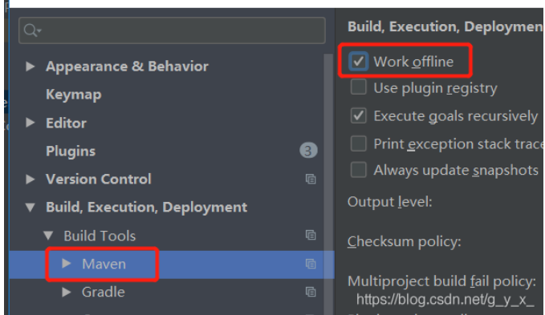

1.从可上网的外部电脑下载需要的jar包，自行传到内部电脑maven仓库对应文件夹，比如
com.alibaba.easyExcel，【注意有些包会有其他的依赖jar包，需要一同下载】
2.IDEA中添加jar包的maven依赖，比如

```xml
<dependency>
	<groupId>com.alibaba</groupId>
    <artifactId>easyexcel</artifactId>
    <version>1.1.2-beta4</version>
</dependency>
```

3.设置IDEA的maven为离线模式，打勾。


4.更改maven的setting.xml为离线模式
```xml
<offline>true</offline>
```

5. 更改源

```xml
<mirrors>
    <mirror>
        <id>central</id>
        <mirrorOf>*</mirrorOf>
        <name>central</name>
        <url>file://D:\MyRepository</url>
    </mirror>
</mirrors>
```

完成以上配置，不会在线下载依赖了，完全走本地。