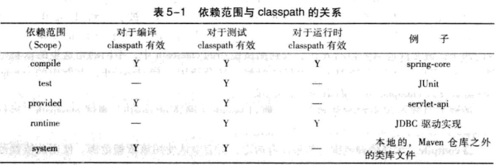
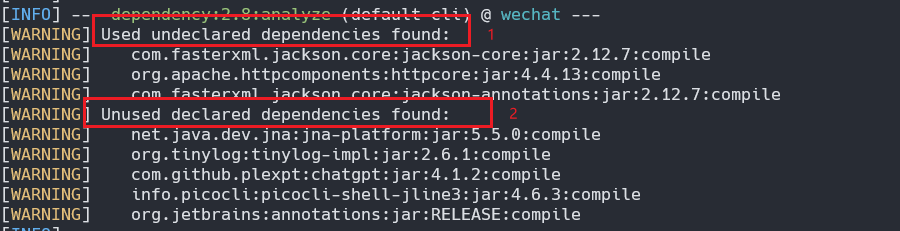
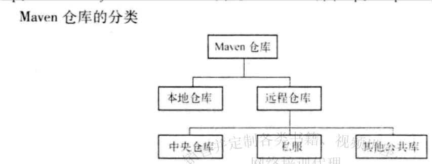
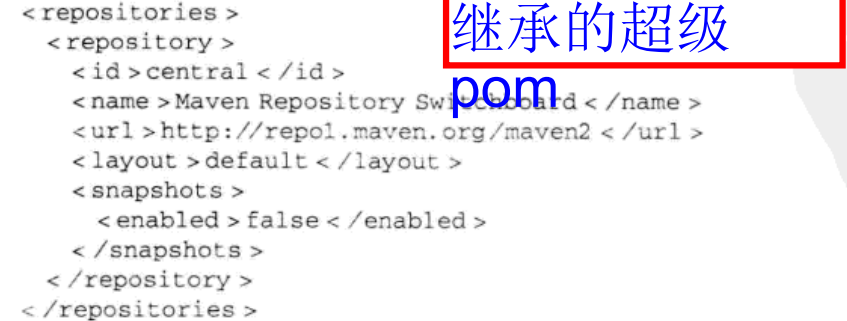

# 依赖

## 创建项目
```shell
maven archetype:generate
```

## 依赖范围
有如下依赖示例：
```xml
<dependency>
    <groupId>junit</groupId>
    <artifactId>junit</artifactId>
    <version>4.7</version>
    <scope>test</scope>
</dependency>
```

其中有一个`scope`标签来声明该依赖的作用范围
首先需要知道，Maven 在编译项目主代码的时候需要使用一套 classpath。在上例中，假如编译项目主代码的时候需要用到 spring-core, 该文件以依赖的方式被引入到 classpath 中。其次，**Maven 在编译和执行测试的时候会使用另外一套 classpath**。上例中的 JUnit 就是个很好的例子，该文件也以依赖的方式引入到测试使用的 classpath 中，不同的是这里的依赖范围是 test。最后，实际运行 Maven 项目的时候，又会使用一套 classpath, 上例中的 spring-core 需要在该 classpath 中，而 JUnit 则不需要。 依赖范围就是用来控制依赖与这三种 classpath（编译 classpath、测试 classpath、运行 classpath) 的关系，Maven 有以下几种依赖范围：

- compile: 编译依赖范围。如果没有指定，就会默认使用该依赖范围。使用此依赖范围的 Maven 依赖，对于编译、测试、运行三种 classpath 都有效。典型的例子是 spring-core, 在编译、测试和运行的时候都需要使用该依赖。

- test: 测试依赖范围。使用此依赖范围的 Maven 依赖，只对于测试 classpath 有效，在编译主代码或者运行项目的使用时将无法使用此类依赖。典型的例子是 JUnit, 它只有在编译测试代码及运行测试的时候才需要。

- provided: 已提供依赖范围。使用此依赖范围的 Maven 依赖，对于编译和测试 class-path 有效，但在运行时无效。典型的例子是 servlet-api, 编译和测试项目的时候需要该依赖，但在运行项目的时候，由于容器已经提供，就不需要 Maven 重复地引入一遍

- runtime: 运行时依赖范围。使用此依赖范围的 Maven 依赖，对于测试和运行 class-path 有效，但在编译主代码时无效。典型的例子是 JDBC 驱动实现，项目主代码的编译只需要 JDK 提供的 JDBC 接口，只有在执行测试或者运行项目的时候才需要实现上述接口的具体 JDBC 驱动。

- system: 系统依赖范围。该依赖与三种 classpath 的关系，和 provided 依赖范围完全一致。但是，使用 system 范围的依赖时必须通过 systemPath 元素显式地指定依赖文件 的路径。由于此类依赖不是通过 Maven 仓库解析的，**而且往往与本机系统绑定**，可能造成构建的不可移植，因此应该谨慎使用。 systemPath 元素可以引用环境变量，如：
```xml
<dependency>
    <groupId>javax.sql</groupId>
    <artifactId>jdbc-stdex</artifactId>
    <version>2.0</version>
    <scope>system</scope>
    <systemPath>${java.home}/lib/rt.jar</systemPath>
</dependency>
```

- import（Maven2.0.9 及以上）：导入依赖范围。该依赖范围不会对三种 classpath 产生实际的影响。



## 传递性依赖和依赖调解

Maven 会解析各个直接依赖的 POM, 将那些必要的间接依赖，以传递性依赖的形式引入到当前项目中。

但有时候，当传递性依赖造成问题的时候，我们就需要清楚地知道该传递性依赖是从哪条依赖路径引入的。 例如，项目 A 有这样的依赖关系：A->B->C->X(1.0)、A->D->X(2.0),X 是 A 的传递性依赖，但是两条依赖路径上有两个版本的 X, 那么哪个 X 会被 Maven 解析使用呢？ 两个版本都被解析显然是不对的，因为那会造成依赖重复，因此必须选择-一个。

### 依赖调解
Maven 依赖调解 (Dependency Mediation) 的第一原则是：
**路径最近者优先** :
该例中 X(1.0) 的路径长 度为 3，而 X(2.0) 的路径长度为 2，因此 X(2.0) 会被解析使用。

如果路径长度一致，那么使用第二原则：
**第一声明者优先**
比如这样的依赖关系：A->B->Y(1.0)、A-> C->Y(2.0),Y(1.0) 和 Y(2.0) 的依赖路径长度是一样的，都为 2。
依赖路径长度相等的前提下，在 POM 中依赖声明的顺序决定了谁会被解析使用，顺序最靠前 的那个依赖优胜。该例中，如果 B 的依赖声明在 C 之前，那么 Y(1.0) 就会被解析使用

## 依赖管理

### 查看依赖
```shell
maven dependency:list
```
### 依赖树
```shell
maven dependency:tree
```

### 依赖分析
列出使用但为直接声明的依赖，以及声明但未使用的依赖
```shell
maven dependency:tree
```



该结果中重要的是两个部分。首先是 Used undeclared dependencies, 意指项目中使用到的，但是没有**显式声明**的依赖，这里是 `jackson-core:jar`. 这种依赖意味着潜在的风险，当前项目直接在使用它们，例如有很多相关的 Java import 声明，而这种依赖是通过直接依赖传递进来的，**当升级直接依赖的时候，相关传递性依赖的版本也可能发生变化这种变化不易察觉，但是有可能导致当前项日出错**。例如由于接口的改变，当前项目中的相关代码无法编译。这种隐藏的、潜在的威胁一旦出现，就往往需要耗费大量的时间来查明真相。因此，**显式声明任何项目中直接用到的依赖**

结果中还有一个重要的部分是 Unused declared dependencies, 意指项目中未使用的，但显式声明的依赖，这里有 `jna-platform:jar`。需要注意的是，对于这样一类依赖，我们不应该简单地直接删除其声明，而是应该仔细分析。由于 `dependency:analyze` 只会分析编译主代码和测试代码需要用到的依赖，一些执行测试和运行时需要的依赖它就发现不了。 

## 排除依赖
有两个需要排除依赖的充分理由
1. 排除掉间接引用的不稳定依赖
2. 排除掉不兼容的依赖
```xml
<dependencies>
    <dependency>
        <groupId>groupId com.juvenxu.mvnbook</groupId>
        <artifactId>project-b</artifactId>
        <version>1.0.0</version>
        <exclusions>
            <!--            排除掉由 project-b 引入的 project-c-->
            <exclusion>
                <groupId>com.juvenxu.mvnbook</groupId>
                <artifactId>project-c</artifactId>
            </exclusion>
        </exclusions>
    </dependency>
    <!--    改为直接依赖-->
    <dependency>
        <groupId>com.juvenxu.mvnbook</groupId>
        <artifactId>project-c</artifactId>
        <version>1.1.0</version>
    </dependency>
</dependencies>
```

需要注意的是，排除依赖的时候只需要 groupId 和 artificId, 而不需要 version, 因为经过 maven 解析后的依赖中，不可能出现 groupId, artifactId 相同，但是 version 不同的依赖


## 归类依赖
有很多关于 Spring Framework 的依赖，例如 `org.springframework:spring-core:2.5.6`,`org.springframeworkspring-beans:2.5.6`,`org.springframework:spring-context:2.5.6`和`org.springframework:spring-context-support:2.5.6`, 它们是来自同一项目的不同模块。 因此，所有这些依赖的版本都是相同的，而且可以预见，如果将来需要升级 Spring Frame-work, 这些依赖的版本会一起升级。

对于项目中的这些 Spring Framework 来说，也应该在一个唯一的地方定义版本，并且在 dependency 声明中引用这一版本。这样，在升级 Spring Framework 的时候就只 需要修改一处。

例子：
```xml
<project>
    <modelversion>4.0.0</modelversion>
    <groupId>com.juven.mvnbook.account</groupId>
    <artifactId>account-email</artifactId>
    <name>Account Email</name>
    <version>1.0.0-SNAPSHOT</version>
    <!--定义属性-->
    <properties>
        <springframework.version>2.5.6</springframework.version>
    </properties>
    <dependencies>
        <dependency>
            <groupId>org.springframework</groupId>
            <artifactId>spring-core</artifactId>
            <!--使用属性-->
            <version>${springframework.version}</version>
        </dependency>

        <dependency>
            <groupId>org.springframework</groupId>
            <artifactId>spring-beans</artifactId>
            <version>${springframework.version}</version>
        </dependency>

        <dependency>
            <groupId>org.springframework</groupId>
            <artifactId>spring-context-support</artifactId>
            <version>${springframework.version}</version>
        </dependency>
    </dependencies>
</project>
```

# 仓库

## 仓库的分类
对于 Maven 来说，仓库只分为两类：本地仓库和远程仓库。当 Maven 根据坐标寻找构 件的时候，它首先会查看本地仓库，如果本地仓库存在此构件，则直接使用：如果本地仓库不存在此构件，或者需要查看是否有更新的构件版本，Maven 就会去远程仓库查找，发现需要的构件之后，下载到本地仓库再使用。如果本地仓库和远程仓库都没有需要的构件， Maven 就会报错。



## 本地仓库

### 修改本地仓库目录
有时候，因为某些原因（例如 C 盘空间不够），用户会想要自定义本地仓库目录地址。这时，可以编辑文件~/.m2/settings.xml, 设置 localRepository 元素的值为想要的仓库地址。例如：

```xml
<settings>
    <localRepository>D:\java\m2</localRepository>
</settings>
```

### 安装构件
一个构件只有在本地仓库中之后，才能由其他 Maven 项目使用，那么构件如何进入到本地仓库中呢？
1. 最常见的是依赖 Maven 从远程仓库下载到本地仓库中。
2. 还有一种常见的情况是，将本地项目的构件安装到 Maven 仓库中。

例如，本地有两个项目 A 和 B, 两者都无 法从远程仓库获得，而同时 A 又依赖于 B, 为了能构建 A,B 就必须首先得以构建并安装到本地仓库中。

```shell
mvn clean install
```
Install 插件的 install 且标将项且的构建输出文件安装到本地仓库


### 远程仓库

**maven 同时只能使用一个本地仓库，但是可以配置多个远程仓库**

#### 中央仓库

由于最原始的本地仓库是空的，Maven必须知道至少一个可用的远程仓库，才能在执行 Maven命令的时候下载到需要的构件。中央仓库就是这样一个默认的远程仓库，Maven的安装文件自带了中央仓库的配置。 可以使用解压工具打开jar文件$M2_HOME/lib/maven-model-builder-3.0.jar, 然后访问路径org/apache/maven/model/pom-4.0.0.xml,可以看到如下的配置：


包含这段配置的文件是所有Maven项目都会继承的超级POM

> 联系方式：dccmmtop@foxmail.com