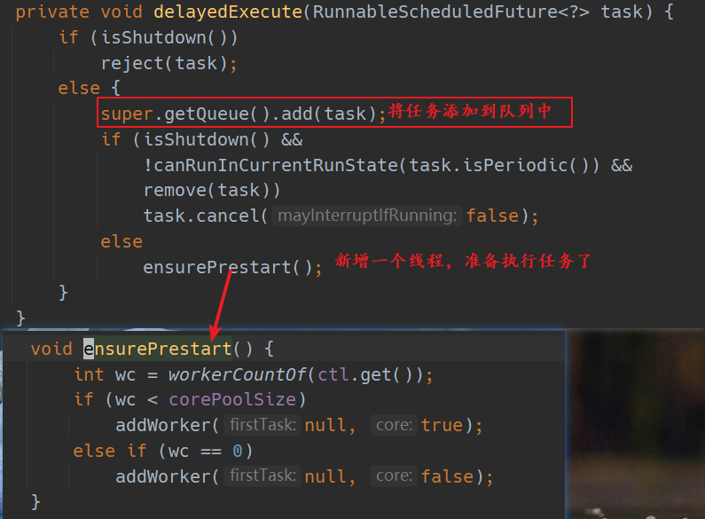
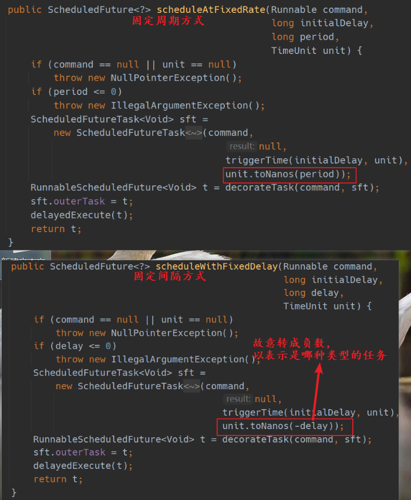

在 [线程池的应用](https://blog.csdn.net/a141210104/article/details/127416459) 一文中，讲解了常见几种线程池的使用方法与差别，今天再深入学一下其中定时任务线程池的用法和原理。

# 定时任务线程池

```java
public class User {
    public static void main(String[] args) {
        // 创建一个定时任务线程池
        ScheduledExecutorService executor =Executors.newScheduledThreadPool(1);
        // 提交任务，1 秒后开始执行
        executor.schedule(new Task(2), 1000,TimeUnit.MILLISECONDS);
        // 关闭线程池，不再接受新任务
        executor.shutdown();
    }

}
// 任务
class Task implements Runnable {
    int i;

    public Task(int i ) {
        this.i = i;
    }

    @Override
    public void run() {
        System.out.println(new Date() + ":"+ i + ":" + Thread.currentThread().getName());
        try {
            // 模拟任务要执行 4 秒钟
            Thread.sleep(4000);
        } catch (InterruptedException e) {
            e.printStackTrace();
        }
    }
}
```

**结果**
```txt
提交任务的时间是：Mon Oct 24 10:30:41 CST 2022
开始执行任务：Mon Oct 24 10:30:42 CST 2022:2:pool-1-thread-1
任务执行结束：Mon Oct 24 10:30:46 CST 2022

Process finished with exit code 0
```

可以看到任务一秒后开始执行

这就是定时任务线程池的使用， 下面看一下定时 + 周期任务的使用方法

# 周期任务

##  scheduleAtFixedRate

```java
public class User {
    public static void main(String[] args) {
        ScheduledExecutorService executor =Executors.newScheduledThreadPool(1);
        System.out.println("提交任务的时间是：" + (new Date()));
        // 参数分别是： 任务， 多久后开始执行， 每隔多久执行一次（周期），时间单位
        executor.scheduleAtFixedRate(new Task(1), 1000,2000, TimeUnit.MILLISECONDS);
    }

}
class Task implements Runnable {
    int i;

    public Task(int i ) {
        this.i = i;
    }

    @Override
    public void run() {
        System.out.println("开始执行任务：" + new Date() + ":"+ i + ":" + Thread.currentThread().getName());
        try {
            Thread.sleep(4000);
        } catch (InterruptedException e) {
            e.printStackTrace();
        }

        System.out.println("任务执行结束：" + new Date());
    }
}
```

设置任务的执行时间是 4 秒， 但周期是 2 秒，也就是说任务还没有执行结束，就要开始执行下一个任务。 但是线程池是不会这样做的，而是等到当前任务执行结束，如果已经超过了周期，会立刻开始执行下一个任务。

**结果**
```txt
提交任务的时间是：Mon Oct 24 10:34:01 CST 2022
开始执行任务：Mon Oct 24 10:34:02 CST 2022:1:pool-1-thread-1 // 延迟 1s 才开始执行任务
任务执行结束：Mon Oct 24 10:34:06 CST 2022 // 任务执行了 4s
开始执行任务：Mon Oct 24 10:34:06 CST 2022:1:pool-1-thread-1 // 又立刻开始下一个任务
任务执行结束：Mon Oct 24 10:34:10 CST 2022
开始执行任务：Mon Oct 24 10:34:10 CST 2022:1:pool-1-thread-1
任务执行结束：Mon Oct 24 10:34:14 CST 2022
```
修改一下： 任务执行时间是  1 秒， 周期是 3 秒，执行结果如下：
```txt
提交任务的时间是：Mon Oct 24 11:21:53 CST 2022
开始执行任务：Mon Oct 24 11:21:54 CST 2022:1:pool-1-thread-1 // 延迟 1s 开始执行
任务执行结束：Mon Oct 24 11:21:55 CST 2022 // 任务执行了 1s
开始执行任务：Mon Oct 24 11:21:57 CST 2022:1:pool-1-thread-1 // 54 + 3 , 3 秒后开始执行下一个任务
任务执行结束：Mon Oct 24 11:21:58 CST 2022
开始执行任务：Mon Oct 24 11:22:00 CST 2022:1:pool-1-thread-2
任务执行结束：Mon Oct 24 11:22:01 CST 2022
```

## scheduleWithFixedDelay

固定延迟时间，在上一个任务执行结束后，固定延迟设置的时间，再执行下一个任务

```java
public class User {
    public static void main(String[] args) {
        ScheduledExecutorService executor =Executors.newScheduledThreadPool(4);
        System.out.println("提交任务的时间是：" + (new Date()));
        executor.scheduleWithFixedDelay(new Task(2), 1000,3000, TimeUnit.MILLISECONDS);
    }

}
class Task implements Runnable {
    int i;

    public Task(int i ) {
        this.i = i;
    }

    @Override
    public void run() {
        System.out.println("开始执行任务：" + new Date() + ":"+ i + ":" + Thread.currentThread().getName());
        try {
            Thread.sleep(2000);
        } catch (InterruptedException e) {
            e.printStackTrace();
        }

        System.out.println("任务执行结束：" + new Date());
    }
}
```

设置每个任务执行的间隔是 3s（上个任务结束到下个任务开始的间隔），任务执行时间需要 2s，看下结果：
```txt
提交任务的时间是：Mon Oct 24 11:32:41 CST 2022
开始执行任务：Mon Oct 24 11:32:42 CST 2022:2:pool-1-thread-1 // 延迟 1s 才开始执行任务
任务执行结束：Mon Oct 24 11:32:44 CST 2022 // 任务执行了 2s
// 44 + 3 = 47, 固定延迟 3 秒开始执行下一个任务
开始执行任务：Mon Oct 24 11:32:47 CST 2022:2:pool-1-thread-1 
任务执行结束：Mon Oct 24 11:32:49 CST 2022
开始执行任务：Mon Oct 24 11:32:52 CST 2022:2:pool-1-thread-2
任务执行结束：Mon Oct 24 11:32:54 CST 2022
```

# 延迟任务线程池的实现原理

上述的延迟任务线程池底层采用`DelayQueue`存储等待的任务
1. DelayQueue 内部封装了一个 PriorityQueue，它会根据 time 的先后时间排序，若 time 相同则根据 sequenceNumber 排序；
2. DelayQueue 也是一个无界队列；

## 工作线程执行的过程：
- 工作线程会从 DelayQueue 取已经到期的任务去执行；
- 执行结束后重新设置任务的到期时间，再次放回 DelayQueue

下面从源码层面看一下大体流程：

## 新建线程池
```java
public ScheduledThreadPoolExecutor(int corePoolSize) {
    super(corePoolSize, Integer.MAX_VALUE, 0, NANOSECONDS,
            new DelayedWorkQueue());
}
```
可以看出底层还是调用 `ThreadPoolExecutor` 类，默认使用延时队列当做任务队列。

下面看一下任务是如何添加到队列中的，以及如何执行的

## 添加任务

在文章前半部分的应用示例中`executor.scheduleWithFixedDelay(new Task(2), 1000,3000, TimeUnit.MILLISECONDS);` 就是提交任务的入口了。进一步查看源码：

```java
public ScheduledFuture<?> scheduleWithFixedDelay(Runnable command,
                                                     long initialDelay,
                                                     long delay,
                                                     TimeUnit unit) {
        if (command == null || unit == null)
            throw new NullPointerException();
        if (delay <= 0)
            throw new IllegalArgumentException();
        // 将任务包装成 ScheduledFutureTask 类型
        ScheduledFutureTask<Void> sft =
            new ScheduledFutureTask<Void>(command,
                                          null,
                                          triggerTime(initialDelay, unit),
                                          unit.toNanos(-delay));
        // 再次装饰任务，可以复写 decorateTask 方法，定制化任务 
        RunnableScheduledFuture<Void> t = decorateTask(command, sft);
        sft.outerTask = t;
        // 放入延时队列中，ScheduledFutureTask 是接口 RunnableScheduledFuture 的一个实现类 
        // 所以放入队列还是 ScheduledFutureTask 类型的
        delayedExecute(t);
        return t;
    }
```

将任务放入队列中：


## 取出任务
因为把任务放在了延迟队列中，在取出任务的时候不能再和普通的阻塞队列那样：只要有任务就可以取出来。

延迟队列中的每个任务都有一个到期时间，只有到期的任务才可以被取出，否则取出动作会被阻塞。这里不细讲延迟队列的实现方式，只需知道延迟队列中的元素要实现 Delayed 接口中的 getDelayed() 方法，这个方法返回了该任务还有多久到期。源码如下：
```java
public long getDelay(TimeUnit unit) {
    // 下次要执行的时间 - 当前时间
    return unit.convert(time - now(), NANOSECONDS);
}
```
如果 getDelay 返回的值小于等于 0，那么就可以执行该任务了。 time 属性是任务下次执行的时间，下面会讲到。

## 执行任务

通过一个线程执行任务时，多半是调用这个任务的 `run()` 方法，现在看一下 `ScheduledFutureTask` 的实现：

```java
public void run() {
    boolean periodic = isPeriodic();
    // 如果线程已经不支持执行任务，则取消任务 
    if (!canRunInCurrentRunState(periodic))
        cancel(false);
   // 如果该任务不是周期性的，直接执行 run 方法，然后结束
    else if (!periodic)
        ScheduledFutureTask.super.run();
    // 如果需要周期执行，那么先执行，然后设置下次执行时间
    else if (ScheduledFutureTask.super.runAndReset()) {
        // 计算下次执行该任务的时间
        setNextRunTime();
        // 再次将任务添加到队列中，重复执行 
        reExecutePeriodic(outerTask);
    }

}
```
## 计算下次执行任务的时间

已经讲过，有两种执行任务的方式，一种是周期性的任务，在底层是这样区分的



巧妙地利用正负作为一个任务类型的标识，在后面的判断中就可以利用正负号区分，计算时，把负数转成正数即可

如下：

```java
// 计算下次执行时间
private void setNextRunTime() {
    long p = period;
    //  固定周期型任务
    if (p > 0)
        time += p;
    else
    // 固定间隔型任务，细节不再展开
        time = triggerTime(-p);
}
```

我们已经看了任务的添加，以及任务的执行

# 延时队列的特性

以上就是一个周期性任务执行的全部了。但是没有说队列中如果存在多个任务怎么办？

# 任务的排序

如果队列中包含多个任务，延迟队列还会把任务以到期时间排序，对头永远是最先到期的那个任务，如果到期时间相同，则按进入队列的顺序排。

"延迟队列还会把任务以到期时间排序", 这其实并不是延时队列实现的功能，而是调用了队列中任务的 `compareTo` 方法来排序的，这就要求队列中的元素实现 Comparable 接口中的 compareTo 方法。 是的， ScheduledFutureTask 正是实现了这个方法：
```java
public int compareTo(Delayed other) {
    if (other == this) // compare zero if same object
        return 0;
    if (other instanceof ScheduledFutureTask) {
        ScheduledFutureTask<?> x = (ScheduledFutureTask<?>)other;
        // 比较到期时间
        long diff = time - x.time;
        if (diff < 0)
            // 当前任务小，
            return -1;
        else if (diff > 0)
        // 当前任务大
            return 1;
        else if (sequenceNumber < x.sequenceNumber)
        // 如果相等，按 sequenceNumber 排序，小的在前
            return -1;
        else
            return 1;
    }
    long diff = getDelay(NANOSECONDS) - other.getDelay(NANOSECONDS);
    return (diff < 0) ? -1 : (diff > 0) ? 1 : 0;
}

```

这篇文章并没有太过详细的讲解线程池更底层的逻辑，只是介绍了几个重点方法，因为大致思想和之前讲的 AQS 差不太多，需要考虑很多并发的场景，加入很多限制。