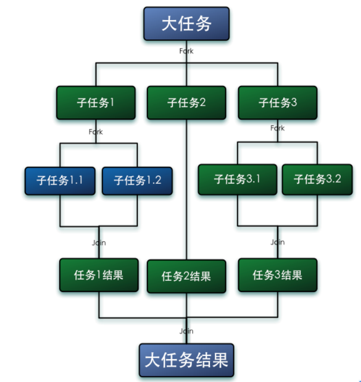
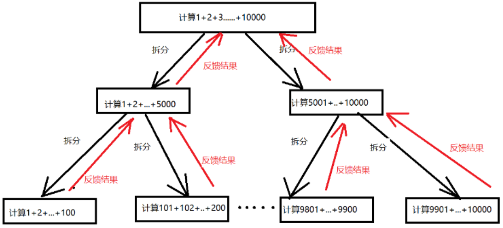

# 什么是 Fork/Join 框架
Fork/Join 是从 java7 开始提供的并行执行任务的框架，是一个把大任务分割成若干个小任务，最终汇总每个小任务的结果，得到大任务结果的框架。

如下图：


# Fork/Join 的特性

1. ForJoinPool 不是为了替代 ExecutorService, 而是它的补充，在一些可分割的大任务场景下，性能会更好。
2. ForJoinPool 主要利用“分而治之”的算法思想
3. ForJoinPool 最适合计算型密集的任务

# 工作窃取算法

指的是某个线程从其他线程队列中获取任务来执行。这也是 Fork/Join 框架执行任务的核心机制

当我们需要做一比较大的任务时， 我们可以把这个任务分成若干个不互相依赖的子任务，把这些子任务放在不同的队列中，并为不同的队列生成一个单独的线程去执行任务，线程和队列是一一对应的。但是有的线程干活比较快，把自己队列中的任务执行完了，不会干等着，而是去帮其他线程干活，就是取其他队列中的任务来执行。 这样的话就会有两个线程同时访问一个队列，会发生资源抢占问题，于是，把这个队列设计成**双端队列**， 从队列尾部偷任务执行，不和土著线程抢队头。这样就减少了资源抢占的机会。

工作窃取算法优点是，充分利用多核 CPU 并行计算，并减少了线程间的竞争，缺点是，并没有完全避免竞争，例如队列中只有一个任务时，同时消耗了更多的系统资源。

# ForkJoinPool 任务执行步骤

1. ForJoinPool 中的每个工作线程都维护一个队列（WorkQueue）, 这是一个双端队列 (Deque), 队列中只能存放 ForkJoinTask 子类型的任务
2. 线程在工作中产生的新任务时（通常是调用了 fork() 方法）, 会放入队尾，并且线程在处理任务时，使用的是 LIFO 方式，也就是从队尾取出任务执行。
3. 每个线程在处理自己的工作队列的同时，会尝试窃取一个任务（刚提交到线程池的任务，或者其他线程队列中的任务）, 窃取的任务位于其他线程队列的队头，也就是线程在窃取任务时，采取的是 FIFO 的方式。
4. 遇到 join() 方法时，如果需要 join() 的任务尚未完成，则会先处理其他任务，并等待这个任务完成。
5. 既没有自己的任务，也没有可窃取的任务时，进入休眠

# ForkJoinPool 的使用

ForkJoin 框架要求任务必须是 ForkJoinTask 的子类，通常情况下不需要直接继承 ForkJoinTask, 而是继承它的子类，`RecursiveAction` 和 `RecursiveTask`。

## RecursiveAction
用于没有返回值的任务，必须讲数据写到磁盘，可以把数据分块，多线程去写入

## RecursiveTask
用于有返回值的任务

## 使用示例

数组中的数字累加

```java
/**
 *有返回值类型的可拆分任务
 */
class SumTask extends RecursiveTask<Integer> {
    /**
     * 控制最小任务的粒度
     */
    private final static  int THRESHOLD = 20;
    private int[] arr;
    private int start;
    private int end;

    public SumTask(int[] arr, int start, int end){
        this.arr = arr;
        // 将数组分割成开始下表为 start， 结束下标为 end 的小数组
        this.start = start;
        this.end = end;
    }

    /**
     * 只计算某段的和
     */
    private int subTotal(){
        int sum = 0;
        for(int i = start; i < end; i ++){
            sum += arr[i];
        }
        return sum;
    }

    @Override
    protected Integer compute() {
        // 达到最小粒度时，开始计算
        if(end - start < THRESHOLD){
            return subTotal();
        }
        // 否则继续拆分成两个小任务
        int middle = (start + end) /2;
        SumTask leftSum = new SumTask(arr, start, middle);
        SumTask right = new SumTask(arr, middle, end);
        // 提交新任务
        leftSum.fork();
        right.fork();

        // 计算两个小任务的和
        return  leftSum.join() + right.join();

    }

}

public class ForkJoinTaskDemo {

    public static void main(String[] args) {
        int size = 1000000;
        int[] arr = new int[size];

        // 生成数组
        for(int i = 0; i< size ; i++){
            arr[i] = i + 1;
        }
        ForkJoinPool pool = new ForkJoinPool();
        // 提交一个大任务给线程池
        ForkJoinTask<Integer> result = pool.submit(new SumTask(arr,0, size));
        // 执行
        System.out.println("pool 结果：" + result.invoke());
        pool.shutdown();

    }
}
```

上面方法可以用下图说明:



# 重要方法解释

## 构造方法

完整的构造方法如下：

```java
private ForkJoinPool(int parallelism,
                         ForkJoinWorkerThreadFactory factory,
                         UncaughtExceptionHandler handler,
                         int mode,
                         String workerNamePrefix)
```

参数解释：
- parallelism 使用线程的个数，默认使用等同处理器个数的线程
- factory 创建线程的工厂，默认情况下使用 ForkJoinWorkerThreadFactory 
- handler 线程异常时的处理器，默认 null
- mode  表示工作线程内的任务队列是采用何种方式进行调度，可以是先进先出 FIFO，也可以是后进先出 LIFO。如果为 true，则线程池中的工作线程则使用先进先出方式进行任务调度，默认情况下是 false。
- workerNamePrefix 线程名字前缀。

## fork 方法

fork() 做的工作只有一件事：把任务推入当前工作线程的工作队列里，源码如下：

```java
public final ForkJoinTask<V> fork() {
    Thread t;
    if ((t = Thread.currentThread()) instanceof ForkJoinWorkerThread)
        ((ForkJoinWorkerThread)t).workQueue.push(this);
    else
        ForkJoinPool.common.externalPush(this);
    return this;
}
```

## join 方法

join() 的工作则复杂得多，也是 join() 可以使得线程免于被阻塞的原因——不像同名的 Thread.join()

1. 检查调用 join() 方法的线程是不是 ForkJoinThread 线程，如果不是，比如：main 线程，则阻塞当前线程，如果是，则不阻塞
2. 查看任务完成状态，如果已经完成，则直接返回结果，如果没有完成，而且处于自己的工作队列内，则完成它
3. 如果任务已经被其他的工作线程偷走，则窃取这个小偷的工作队列内的任务（以 FIFO 方式），执行，以期帮助它早日完成欲
join 的任务。
4. 如果偷走任务的小偷也已经把自己的任务全部做完，正在等待需要 join 的任务时，则找到小偷的小偷，帮助它完成它的任务。
5. 递归地执行第 4 步。

## submit 方法

ForJoinPool 自认拥有工作队列，用来接收外部线程(非 ForkJoinThread)提交过来的任务,这个工作队列被称为 submitting queue, submit() 方法和 fork() 方法没有本质区别， 只不任务的目的地是 submitting queue. submitting queue 和 work queue 一样，也是被窃取的对象。因此当一个任务被成功窃取时，就意味着被提交的任务真正开始进入执行阶段。


## invoke 方法
开始执行任务，如果必要，等待计算完成。

# 参考资料

- https://www.cnblogs.com/cjsblog/p/9078341.html

- https://note.youdao.com/ynoteshare/index.html?id=43491d79e1e5735d39b34b8f7a20c5c7&type=note&_time=1667033251690