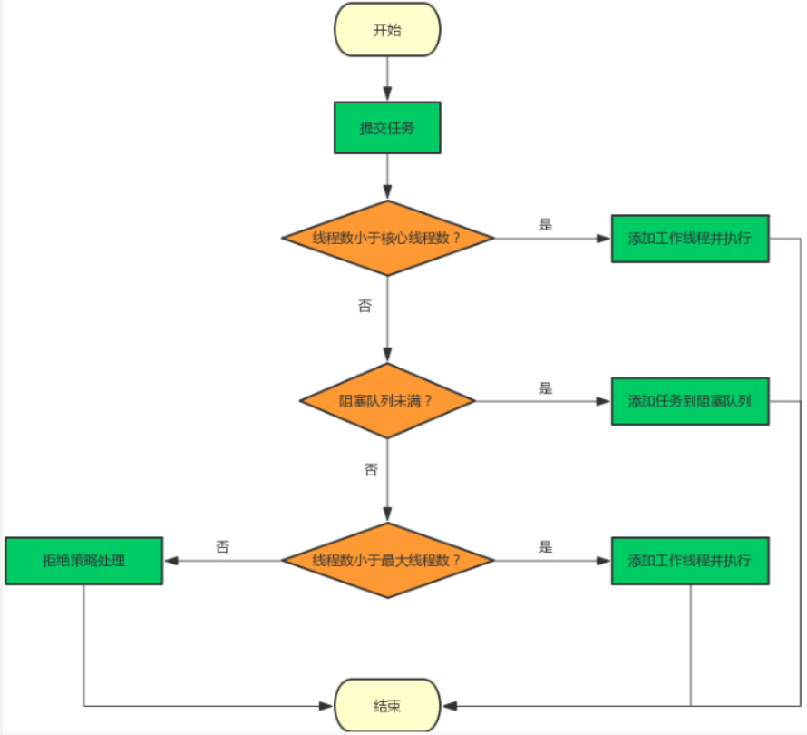
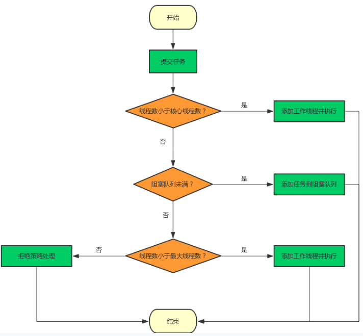
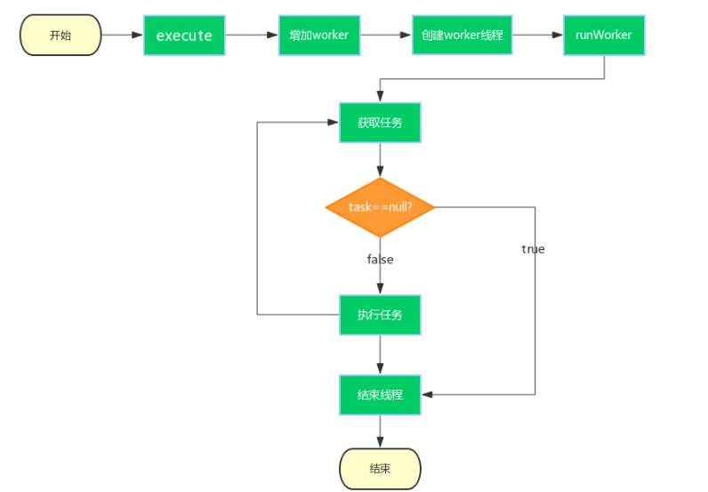

# ThreadPoolExecute 使用示例
```java
public class User {
    public static void main(String[] args) {
        ThreadPoolExecutor executor = new ThreadPoolExecutor(2,10,60, TimeUnit.SECONDS,new ArrayBlockingQueue<Runnable>(10));
        for(int i =0 ;i < 20; i ++){
            executor.execute(new Task(i));
        }
        executor.shutdown();
    }

}
class Task implements Runnable {
    int i;

    public Task(int i ) {
        this.i = i;
    }

    @Override
    public void run() {
        System.out.println(new Date() + ":"+ i + ":" + Thread.currentThread().getName());
        try {
            Thread.sleep(2000);
        } catch (InterruptedException e) {
            e.printStackTrace();
        }
    }
}
```

 先使用构造方法生成一个线程池对象，然后使用 `execute`  方法将任务提交给线程池

# 重要属性

`private final AtomicInteger ctl = new AtomicInteger(ctlOf(RUNNING, 0));`

`private static final int COUNT_BITS = Integer.SIZE - 3;`

`private static final int CAPACITY = (1 << COUNT_BITS) - 1;`

`ctl` 是对线程池的运行状态和线程池中有效线程的数量进行控制的一个字段，它包含两部分的信息：线程池的运行状态 (`runState`) 和线程池内有效线程的数量 (`workerCount`)，这里可以看到，使用了 Integer 类型来保存，高 3 位保存 `runState`，低 29 位保存`workerCount`。`COUNT_BITS` 就是 29，CAPACITY 就是 1 左移 29 位减 1（29 个 1），这个常量表示`workerCount`的上限值，大约是 5 亿。

`ctl` 相关方法，不用过于纠结如何计算的，知道即可

```java
// 获取运行状态；
private static int runStateOf(int c)     { return c & ~CAPACITY; }
//获取活动线程数；
private static int workerCountOf(int c)  { return c & CAPACITY; }
//获取运行状态和活动线程数的值。clt 记录着 runState 和 workerCount
private static int ctlOf(int rs, int wc) { return rs | wc; }
```

# 线程池状态解释

## RUNNING

- 状态说明：线程池处在 RUNNING 状态时，能够接收新任务，以及对已添加的任务进行处理。
- 状态切换：线程池的初始化状态是 RUNNING。换句话说，线程池被一旦被创建，就处于 RUNNING 状态，并且线程池中的任务数为 0！

## SHUTDOWN

- 状态说明：线程池处在 SHUTDOWN 状态时，**不接收新任务，但能处理已添加的任务。**
- 状态切换：调用线程池的 shutdown() 接口时，线程池由 RUNNING -> SHUTDOWN。

## STOP

- 状态说明：线程池处在 STOP 状态时，不接收新任务，不处理已添加的任务，**并且会中断正在处理的任务。**
- 状态切换：调用线程池的`shutdownNow()`接口时，线程池由 (RUNNING or SHUTDOWN ) -> STOP。

## TIDYING

- 状态说明：**当所有的任务已终止，`ctl`记录的”任务数量”为 0，线程池会变为 TIDYING 状态**。当线程池变为 TIDYING 状态时，**会执行钩子函数 terminated()**。`terminated() 在` `ThreadPoolExecutor`类中是空的，**若用户想在线程池变为 TIDYING 时，进行相应的处理；可以通过重载 terminated() 函数来实现。**

- 状态切换：当线程池在 SHUTDOWN 状态下，阻塞队列为空并且线程池中执行的任务也为空时，就会由 SHUTDOWN -> TIDYING。当线程池在 STOP 状态下，线程池中执行的任务为空时，就会由 STOP -> TIDYING。

##  TERMINATED

- 状态说明：线程池彻底终止，就变成 TERMINATED 状态。

- 状态切换：线程池处在 TIDYING 状态时，执行完 terminated() 之后，就会由 TIDYING -> TERMINATED。

进入 TERMINATED 的条件如下：

- 线程池不是 RUNNING 状态；
- 线程池状态不是 TIDYING 状态或 TERMINATED 状态；
- 如果线程池状态是 SHUTDOWN 并且`workerQueue`为空；
- `workerCount 为`0；
- 设置 TIDYING 状态成功。

如图：



# execute 方法

在 [线程池应用](https://blog.csdn.net/a141210104/article/details/127416459?spm=1001.2014.3001.5502) 中讲过线程的执行顺序：

>当线程数小于核心线程数时，创建线程。
>当线程数大于等于核心线程数，且任务队列未满时，将任务放入任务队列。
>当线程数大于等于核心线程数，且任务队列已满：
>若线程数小于最大线程数，创建线程。
>若线程数等于最大线程数，抛出异常，拒绝任务。
>优先级： 核心线程数 > 任务队列 > 最大线程数 > 拒绝任务

我们现在来看一下是如何实现这个规则的

```java
public void execute(Runnable command) {
        if (command == null)
            throw new NullPointerException();
        int c = ctl.get(); //获取线程池的状态和数量
        if (workerCountOf(c) < corePoolSize) { // 如果线程数量小于核心线程数
          // 第二个参数是 true，代表将创建核心线程 为 false 时创建的是非核心线程
          // 以此来判断线程数是超过了核心线程数还是超过了最大线程数
            if (addWorker(command, true)) // 创建一个新的线程并执行
                return; // 结束
            c = ctl.get();
        }
         // 如果执行到这里，说明线程数 > 核心线程数
        if (isRunning(c) && workQueue.offer(command)) { // 如果入队成功
            int recheck = ctl.get();
            // 再次检查线程池状态，如果线程池没有在运行由于之前已经把 command 添加到 workQueue 中了， 这时需要移除该 command
            if (! isRunning(recheck) && remove(command))
                reject(command); // 根据拒绝策略拒绝任务
            else if (workerCountOf(recheck) == 0) // 异常情况
                addWorker(null, false); //  第一个参数为 null，表示在线程池中创建一个线程，但不去启动；
        }
        // 执行到这里，入队失败，说明队列已满
        else if (!addWorker(command, false))// 新增非核心线程去执行任务
            reject(command); // 如果已达到最大核心线程数，拒绝任务
    }
```

流程图表示如下：



# addWorker 方法

该方法会接收一个可运行的任务，和一个标识符 core，如果 core 为 true, 判断当前线程数是超过了核心线程数。如果 core 为 false，就判断当前线程数是否超过了最大核心数

`addWorker` 方法会生成一个新的线程，并开始执行携带的任务——`firstTask`, 该任务执行结束后，会死循环的从阻塞任务队列中获取新任务，如果队列为空，该线程就会阻塞。源码如下：

```java
private boolean addWorker(Runnable firstTask, boolean core) {
  retry:
  for (;;) {
    int c = ctl.get();
    int rs = runStateOf(c); // 线程池状态

    // Check if queue empty only if necessary.
    if (rs >= SHUTDOWN &&
        ! (rs == SHUTDOWN &&
           firstTask == null &&
           ! workQueue.isEmpty())) // 线程池状态判断，参数校验
      return false;

    for (;;) {
      int wc = workerCountOf(c); // 获取线程数
      // 使用 core 标识符判断，线程数量的上限是哪个，但总共不能超过最大容量
      if (wc >= CAPACITY ||
          wc >= (core ? corePoolSize : maximumPoolSize))
        return false;
      // cas 方式增加线程数量，如果失败，
      if (compareAndIncrementWorkerCount(c))
        break retry;
      c = ctl.get();  // Re-read ctl
      if (runStateOf(c) != rs) // 考虑到并发场景，再读一次
        continue retry;
      // else CAS failed due to workerCount change; retry inner loop
    }
  }

  boolean workerStarted = false;
  boolean workerAdded = false;
  Worker w = null;
  try {
    // 将任务包装成一个 worker, worker 是包含一个线程，一个任务的结构，下面会介绍
    w = new Worker(firstTask);
    final Thread t = w.thread;
    if (t != null) {
      final ReentrantLock mainLock = this.mainLock;
      mainLock.lock(); //因为需要线程池状态做一些判断，线程池状态是共有的资源，需要加锁
      try {
        // Recheck while holding lock.
        // Back out on ThreadFactory failure or if
        // shut down before lock acquired.
        int rs = runStateOf(ctl.get());

        if (rs < SHUTDOWN ||
            (rs == SHUTDOWN && firstTask == null)) {
          if (t.isAlive()) // precheck that t is startable
            throw new IllegalThreadStateException();
          workers.add(w); // 记录该 worker,  workers 是一个 HashSet
          int s = workers.size();
           // largestPoolSize 记录着线程池中出现过的最大线程数量
          if (s > largestPoolSize)
            largestPoolSize = s;
          workerAdded = true;
        }
      } finally {
        mainLock.unlock();
      }
      if (workerAdded) {
        // 启动 woker 中的线程，开始执行任务了
        t.start();
        workerStarted = true;
      }
    }
  } finally {
    if (! workerStarted)
      addWorkerFailed(w);
  }
  return workerStarted;
}

```

# Worker

worker 是一个包含了可执行的任务，和用来执行任务的线程，它实现了`Runnable` 接口，本身也可以当作一个任务运行。部分源码如下：

```java
private final class Worker
  extends AbstractQueuedSynchronizer
  implements Runnable
{

  /** Thread this worker is running in.  Null if factory fails. */
  final Thread thread;
  /** Initial task to run.  Possibly null. */
  Runnable firstTask;
  /** Per-thread task counter */
  volatile long completedTasks; // 记录线程完成的任务的个数

  /**
         * Creates with given first task and thread from ThreadFactory.
         * @param firstTask the first task (null if none)
         */
  // 构造 worker
  Worker(Runnable firstTask) {
    setState(-1); // inhibit interrupts until runWorker
    this.firstTask = firstTask;
    this.thread = getThreadFactory().newThread(this); // 生成新的线程
  }

  /** Delegates main run loop to outer runWorker  */
  // 真正执行任务的地方
  public void run() {
    runWorker(this);
  }
  // ... 省略

  // 获取锁
  protected boolean tryAcquire(int unused) {
    if (compareAndSetState(0, 1)) {
      setExclusiveOwnerThread(Thread.currentThread());
      return true;
    }
    return false;
  }
}
```

Worker 继承了 AQS，使用 AQS 来实现独占锁的功能。为什么不使用`ReentrantLock`来实现呢？可以看到`tryAcquire`方法，它是不允许重入的，而 ReentrantLock 是允许重入的：

1. lock 方法一旦获取了独占锁，表示当前线程正在执行任务中；
2. 如果正在执行任务，则不应该中断线程；
3. 如果该线程现在不是独占锁的状态，也就是空闲的状态，说明它没有在处理任务，这时可以对该线程进行中断；
4. 线程池在执行 shutdown 方法或 tryTerminate 方法时会调用 interruptIdleWorkers 方法来中断空闲的线程，interruptIdleWorkers 方法会使用 tryLock 方法来判断线程池中的线程是否是空闲状态；
5. 之所以设置为不可重入，是因为我们不希望任务在调用像 setCorePoolSize 这样的线程池控制方法时重新获取锁。如果使用 ReentrantLock，它是可重入的，这样如果在任务中调用了如 setCorePoolSize 这类线程池控制的方法，会中断正在运行的线程。

所以，Worker 继承自 AQS，用于判断线程是否空闲以及是否可以被中断。

此外，在构造方法中执行了 setState(-1);，把 state 变量设置为-1，为什么这么做呢？是因为 AQS 中默认的 state 是 0，如果刚创建了一个 Worker 对象，还没有执行任务时，这时就不应该被中断， tryAcquire 方法是根据 state 是否是 0 来判断的，所以，setState(-1); 将 state 设置为-1 是为了禁止在执行任务前对线程进行中断。

正因为如此，在 runWorker 方法中会先调用 Worker 对象的 unlock 方法将 state 设置为 0。

从上面源码中拿出，最终调用 `runWorker` 方法去执行任务， `runnerWorker` 源码如下：

# runWorker

```java
 final void runWorker(Worker w) {
        Thread wt = Thread.currentThread();
        Runnable task = w.firstTask;
        w.firstTask = null;
        w.unlock(); // 允许中断
        boolean completedAbruptly = true;
        try {
          // 循环获取任务
            while (task != null || (task = getTask()) != null) {
                w.lock();
                // 如果线程池正在停止，那么要保证当前线程是中断状态； 
                // 如果不是的话，则要保证当前线程不是中断状态；
                if ((runStateAtLeast(ctl.get(), STOP) ||
                     (Thread.interrupted() &&
                      runStateAtLeast(ctl.get(), STOP))) &&
                    !wt.isInterrupted())
                    wt.interrupt();
                try {
                  // 执行任务之前做一些事情，类似于回调
                    beforeExecute(wt, task);
                    Throwable thrown = null;
                    try {
                      // 开始运行任务
                        task.run();
                    } catch (RuntimeException x) {
                      // 记录异常，并抛出异常跳出循环，下同
                        thrown = x; throw x;
                    } catch (Error x) {
                        thrown = x; throw x;
                    } catch (Throwable x) {
                        thrown = x; throw new Error(x);
                    } finally {
                      // 无论是否发生异常，都要执行这里
                      // 任务执行结束要做的事情，类似于回调
                        afterExecute(task, thrown);
                    }
                } finally {
                    task = null;
                    // 记录已经完成任务的个数
                    w.completedTasks++;
                    w.unlock();
                }
            }
            // 执行到这里，说明未发生异常
            completedAbruptly = false;
        } finally {
            processWorkerExit(w, completedAbruptly);
        }
    }
```

关于第一个 if 语句：这里要考虑在执行该 if 语句期间可能也执行了 shutdownNow 方法，shutdownNow 方法会把状态设置为 STOP，回顾一下 STOP 状态：
不能接受新任务，也不处理队列中的任务，会中断正在处理任务的线程。在线程池处于 RUNNING 或 SHUTDOWN 状态时，调用 shutdownNow() 方法会使线程池进入到该状态。 STOP 状态要中断线程池中的所有线程，而这里使用 Thread.interrupted() 来判断是否中断是为了确保在 RUNNING 或者 SHUTDOWN 状态时线程是非中断状态的，因为 Thread.interrupted() 方法会复位中断的状态。

当任1下面情况发生时，就退出循环 
1. 当从队列中获取的任务为空时，退出循环 
2. 发生异常时
退出循环后还会执行一个 processWorkerExit 方法，看一下这个方法做了什么:


# processWorkerExit

```java
private void processWorkerExit(Worker w, boolean completedAbruptly) {
  // 如果程序是发生了异常终止的，需要对线程数减一操作,为什么正常情况退出，而不需要减一操作了呢？
  // 因为在 getTask 方法中针对这种正常情况已经做了处理。
    if (completedAbruptly) 
        decrementWorkerCount();

    final ReentrantLock mainLock = this.mainLock;
    mainLock.lock();
    try {
        // 统计完成的任务数目 
        completedTaskCount += w.completedTasks;
        // 删除线程
        workers.remove(w);
    } finally {
        mainLock.unlock();
    }

    // 判断是否需要结束线程池
    tryTerminate();


  /*
  * 当线程池是RUNNING或SHUTDOWN状态时，如果worker是异常结束，那么会直接addWorker；
  * 如果allowCoreThreadTimeOut=true，并且等待队列有任务，至少保留一个worker；
  * 如果allowCoreThreadTimeOut=false，workerCount不少于corePoolSize。
  */
    int c = ctl.get();
    if (runStateLessThan(c, STOP)) {
        if (!completedAbruptly) {
            int min = allowCoreThreadTimeOut ? 0 : corePoolSize;
            if (min == 0 && ! workQueue.isEmpty())
                min = 1;
            if (workerCountOf(c) >= min)
                return; // replacement not needed
        }
        addWorker(null, false);
    }
}
```

所以一个线程执行结束后可能需要做的事情： 
1. 再次添加一个线程
2. 结束线程池


下面看一下 getTask 方法

# getTask 方法

```java
private Runnable getTask() {
  // 表示上次从从阻塞队列中取值是否超时
    boolean timedOut = false; // Did the last poll() time out?

    for (;;) {
        int c = ctl.get();
        int rs = runStateOf(c);

      /*
      * 如果线程池状态 rs >= SHUTDOWN，也就是非 RUNNING 状态，再进行以下判断：
      * 1. rs >= STOP，线程池是否正在 stop；
      * 2. 阻塞队列是否为空。
      * 如果以上条件满足，则将 workerCount 减 1 并返回 null。
      * 因为如果当前线程池状态的值是 SHUTDOWN 或以上时，不允许再向阻塞队列中添加任务。
      */
        if (rs >= SHUTDOWN && (rs >= STOP || workQueue.isEmpty())) {
          // 减一
            decrementWorkerCount();
            return null;
        }

        int wc = workerCountOf(c);

        // 标记是否需要进行超时处理
        //  alloCoreThreadTimeOut 默认为false，也就是核心线程默认不允许超时
        // wc > corePoolSize, 已经进入到非核心线程的状态，允许超时处理

        boolean timed = allowCoreThreadTimeOut || wc > corePoolSize;

        // wc > maximumPoolSize的情况是因为可能在此方法执行阶段同时执行了setMaximumPoolSize方法；
        // (timed && timeout) 表示需要超时处理，并且上次获取任务超时了
        // (wc > 1 || 队列为空) 线程池中除了当前线程还有其他工作的线程 或者 任务队列已经空了
        // 终上所述，1. 当获取任务超时（异常或者队列为空），并且还有其他线程可以继续工作，不会出现有任务但没线程的情况，当前线程就可以放心退出了，
        //         2. 当获取任务超时（异常或者队列为空），并且有任务可以做了，当前线程就可以放心的退出了，
        if ((wc > maximumPoolSize || (timed && timedOut))
            && (wc > 1 || workQueue.isEmpty())) {
              // return 了，线程要结束生命了，把线程数量减一。如果减失败了，下次再尝试
            if (compareAndDecrementWorkerCount(c))
                return null;
            continue;
        }

        // 执行到这里，说明是第一次获取任务, 就开始准备获取任务了
        // 如果获取失败，打上超时的标记，开始下次循环，走上面的逻辑，可能会结束这个线程
        // 如果获取成功，直接返回该任务，在 runWork 中执行了。
        try {
          // 下面是2中方式从阻塞队列中获取任务，根据线程数量，采用不同的方式, 详情可以搜索阻塞队列
          // 1. pool(time, unit): 只等待固定的时间，超过就返回空
          // 2. take(): 无限等待
            Runnable r = timed ?
                workQueue.poll(keepAliveTime, TimeUnit.NANOSECONDS) :
                workQueue.take();
            if (r != null)
                return r;
            // 打上超时的标记
            timedOut = true;
        } catch (InterruptedException retry) {
            timedOut = false;
        }
    }
}
```


所以线程池中的一个线程生命周期经过下面几个重点方法:

1. execute 是入口，决定任务是应该立即执行，还是加入队列中等待,或者拒绝任务
2. addWorker, 新增一个线程去执行任务
3. runWorker: 循环从队列获取任务，执行任务，如果未获取到任务，或者任务执行失败，跳出循环，进入线程终止方法
4. getTask 获取任务,无法获取到任务时，决定直接返回空，还是继续等待任务到来
5. processWorkerExit, 线程退出阶段，会做一些线程的统计和补偿工作，以及更改线程的状态，如果线程池运行中，且这个线程是因为异常退出的，就重新生成一个新的线程，继续工作。

流程图如下：




