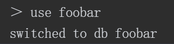
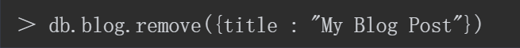

文档是MongoDB中数据的基本单元，非常类似于关系型数据库管理系统中的行，但更具表现力。
类似地，集合（collection）可以看作是一个拥有动态模式（dynamic schema）的表。
MongoDB的一个实例可以拥有多个相互独立的数据库（database），每一个数据库都拥有自己的集合。
每一个文档都有一个特殊的键"_id"，这个键在文档所属的集合中是唯一的。

## 文档
MongoDB而且区分大小写，
下面两个文档是不同的
```json
{
  "foo": 3
}
{
  "Foo": 3
}
```

文档中的键/值对是有序的：{"x" : 1, "y":2}与{"y": 2, "x": 1}是不同的。
通常，字段顺序并不重要，无须让数据库模式依赖特定的字段顺序（MongoDB会对字段重新排序）。在某些特殊情况下，字段顺序变得非常重要，

## 集合
文档中的键/值对是有序的：{"x" : 1, "y":2}与{"y": 2, "x": 1}是不同的。通常，字段顺序并不重要，无须让数据库模式依赖特定的字段顺序（MongoDB会对字段重新排序）。在某些特殊情况下，字段顺序变得非常重要，

集合是动态模式的。这意味着一个集合里面的文档可以是各式各样的

### 命名

可以使用db.collectionName获取一个集合的内容，但是，如果集合名称中包含保留字或者无效的JavaScript属性名称，db.collectionName就不能正常工作了。
假设要访问version集合，不能直接使用db.version，因为db.version是db的一个方法（会返回当前MongoDB服务器的版本）：
```shell
> db. version
function O {
return this. serverBuildInfoQ.version；
}
> db. getCollection(version”）；
test.version
```


在JavaScript中，x.y等同于x['y']。也就是说，除了名称的字面量之外，还可以使用变量访问子集合。因此，如果需要对blog的每一个子集合进行操作，可以使用如下方式进行迭代
```shell
var collections=["posts","comments2","authors"];
for (var i in collections){
  print(db.blog[collections[i]];
 }
```


### 相同数据结构归为一个文档
- 如果把各种各样的文档不加区分地放在同一个集合里，无论对开发者还是对管理员来说都将是噩梦。

- 在一个集合里查询特定类型的文档在速度上也很不划算，分开查询多个集合要快得多。

- 把同种类型的文档放在一个集合里，数据会更加集中

- 创建索引时，需要使用文档的附加结构（特别是创建唯一索引时）。索引是按照集合来定义的。在一个集合中只放入一种类型的文档，可以更有效地对集合进行索引。

### 命名

- 集合名不能以“system.”开头，这是为系统集合保留的前缀。例如，system.users这个集合保存着数据库的用户信息，而system.namespaces集合保存着所有数据库集合的信息。
- 用户创建的集合不能在集合名中包含保留字符’$'。因为某些系统生成的集合中包含$，很多驱动程序确实支持在集合名里包含该字符。除非你要访问这种系统创建的集合，否则不应该在集合名中包含$。
### 子集合

组织集合的一种惯例是使用“.”分隔不同命名空间的子集合。例如，一个具有博客功能的应用可能包含两个集合，分别是blog.posts和blog.authors

## 数据库
- 据库最终会变成文件系统里的文件，而数据库名就是相应的文件名，这是数据库名有如此多限制的原因。
另外，有一些数据库名是保留的，可以直接访问这些有特殊语义的数据库。这些数据库如下所示。
- · admin从身份验证的角度来讲，这是“root”数据库。如果将一个用户添加到admin数据库，这个用户将自动获得所有数据库的权限。再者，一些特定的服务器端命令也只能从admin数据库运行，如列出所有数据库或关闭服务器。
- local这个数据库永远都不可以复制，且一台服务器上的所有本地集合都可以存储在这个数据库中
- config MongoDB用于分片设置时，分片信息会存储在config数据库中。

## 启动MongoDB

通常，MongoDB作为网络服务器来运行，客户端可连接到该服务器并执行操作。下载MongoDB（http://www.mongodb.org/downloads）并解压，运行mongod命令，启动数据库服务器

- mongod在没有参数的情况下会使用默认数据目录/data/db（Windows系统中为C:\data\db）
- 默认情况下，MongoDB监听27017端口
- mongod还会启动一个非常基本的HTTP服务器，监听数字比主端口号高1000的端口，也就是28017端口。这意味着，通过浏览器访问http://localhost:28017，能获取数据库的管理信息


## shell中的基本操作
- 要查看db当前指向哪个数据库，可以使用db命令

- 选择数据库 use



### 读取
find和findOne方法可以用于查询集合里的文档。若只想查看一个文档，可用findOne：

find和findOne可以接受一个查询文档作为限定条件。这样就可以查询符合一定条件的文档。使用find时，shell会自动显示最多20个匹配的文档，也可获取更多文档 

## 更新
使用update修改博客文章。update接受（至少）两个参数：第一个是限定条件（用于匹配待更新的文档），第二个是新的文档

例子:
修改变量post，增加"comments"键：
```shell
post.comment = []
db.blog.update({title: "my blog"},post)
```

## 删除
使用remove方法可将文档从数据库中永久删除。如果没有使用任何参数，它会将集合内的所有文档全部删除。它可以接受一个作为限定条件的文档作为参数
