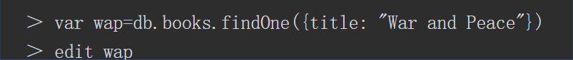

## 运行shell
MongoDB自带JavaScript shell，可在shell中使用命令行与MongoDB实例交互。
shell是一个功能完备的JavaScript解释器，可运行任意JavaScript程序

另外，可充分利用JavaScript的标准库:


再者，可定义和调用JavaScript函数：[插图]
需要注意，可使用多行命令。shell会检测输入的JavaScript语句是否完整，如没写完可在下一行接着写。在某行连续三次按下回车键可取消未输入完成的命令，并退回到＞-提示符。


- 启动mongo shell时不连接到任何mongod有时很方便。通过--nodb参数启动shell，启动时就不会连接任何数据库,启动mongo shell时不连接到任何mongod有时很方便。通过--nodb参数启动shell，启动时就不会连接任何数据库


- 可以通过db.help()查看数据库级别的帮助，使用db.foo.help()查看集合级别的帮助。
- 如果想知道一个函数是做什么用的，可以直接在shell输入函数名（函数名后不要输入小括号），这样就可以看到相应函数的JavaScript实现代码。例如，如果想知道update函数的工作机制，或者是记不清参数的顺序，就可以像下面这样做：

### 使用shell执行脚本
如果希望使用指定的主机/端口上的mongod运行脚本，需要先指定地址，然后再跟上脚本文件的名称


也可以使用load()函数，从交互式shell中运行脚本：


在脚本中可以访问db变量，以及其他全局变量。然而，shell辅助函数（比如"usedb"和"show collections"）不可以在文件中使用。这些辅助函数都有对应的JavaScript函数


### 编辑复合变量
shell的多行支持是非常有限的：不可以编辑之前的行。如果编辑到第15行时发现第1行有个错误，那会让人非常懊恼。因此，对于大块的代码或者是对象，你可能更愿意在编辑器中编辑。为了方便地调用编辑器，可以在shell中设置EDITOR变量（也可以在环境变量中设置）：

```shell
EDITOR = "/usr/bin/vim"
```
现在，如果想要编辑一个变量，可以使用"edit变量名"这个命令，比如：


用户主目录下创建一个名为.mongorc.js的文件,在.mongorc.js文件中添加一行内容，EDITOR="编辑器路径";，以后就不必单独设置EDITOR变量了。 