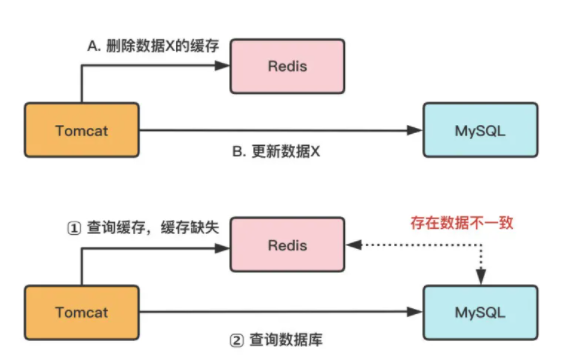
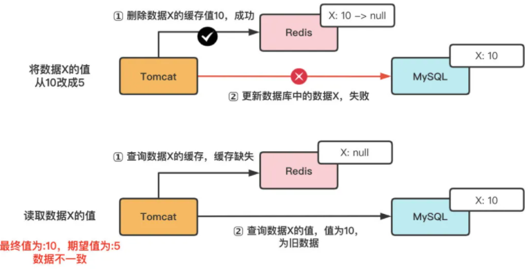
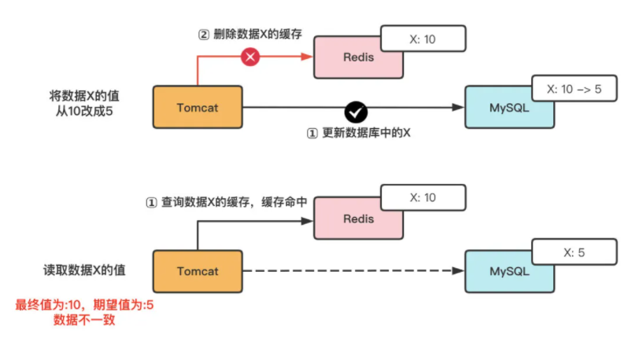
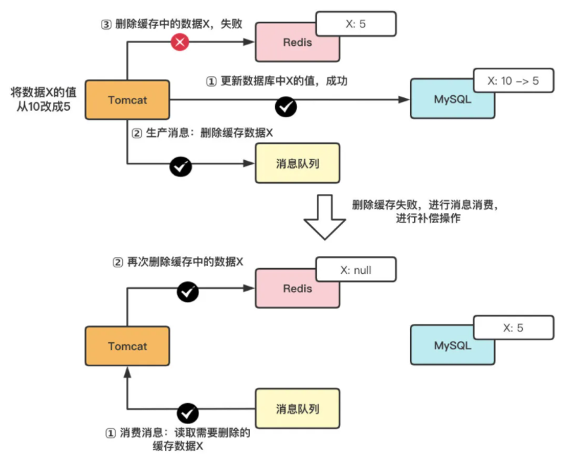
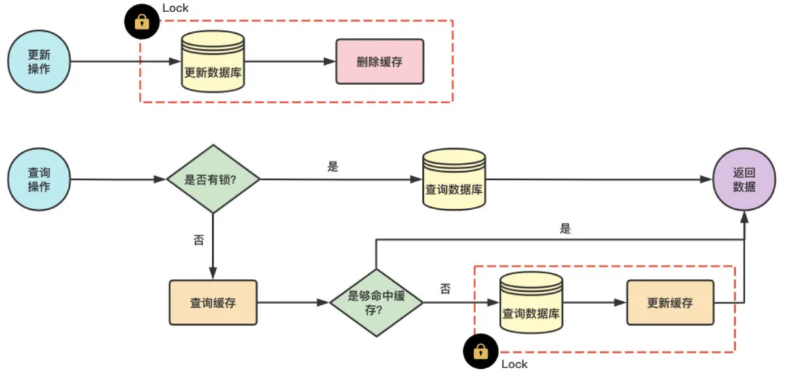
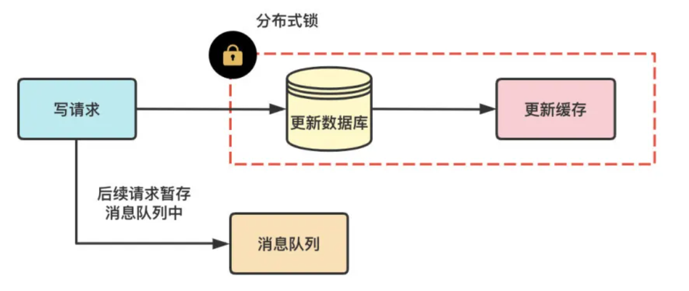
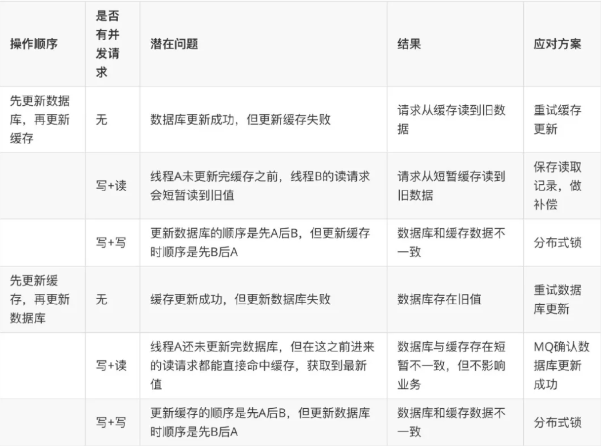
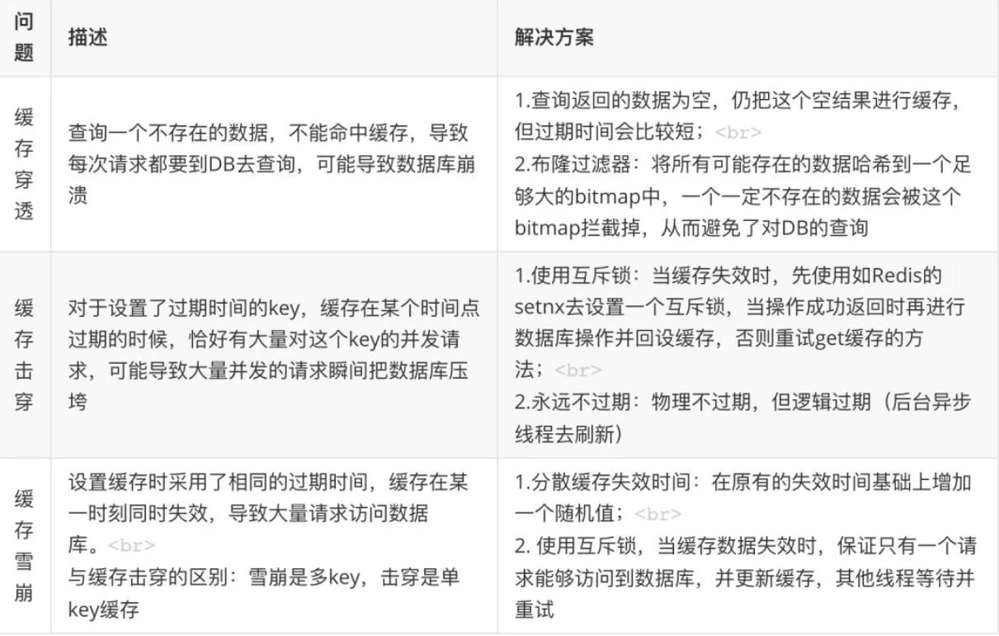

## 什么是数据的一致性
“数据一致”一般指的是：缓存中有数据，缓存的数据值 = 数据库中的值。

但根据缓存中是有数据为依据，则”一致“可以包含两种情况：

1. 缓存中有数据，缓存的数据值 = 数据库中的值（需均为最新值，本文将“旧值的一致”归类为“不一致状态”）
2. 缓存中本没有数据，数据库中的值 = 最新值（有请求查询数据库时，会将数据写入缓存，则变为上面的“一致”状态）

”数据不一致“：缓存的数据值 ≠ 数据库中的值；缓存或者数据库中存在旧值，导致其他线程读到旧数据

## 数据不一致情况及应对策略
根据是否主动向缓存中写值，可以把缓存分成**读写缓存**和**只读缓存**。

- 只读缓存：只在缓存进行数据查找，即使用 **更新数据库+删除缓存**策略；
- 读写缓存：需要在缓存中对数据进行增删改查，即使用 **更新数据库+更新缓存**策略。

### 只读缓存（更新数据库+删除缓存）
- 新增数据时 ，写入数据库；访问数据时，缓存缺失，查数据库，更新缓存（始终是处于”数据一致“的状态，不会发生数据不一致性问题)
- 更新（修改/删除）数据时 ，会有个时序问题：更新数据库与删除缓存的顺序（这个过程会发生数据不一致性问题）, 如下图


在更新数据的过程中，可能会有如下问题：

- 无并发请求下，其中一个操作失败的情况
- 并发请求下，其他线程可能会读到旧值
因此，要想达到数据一致性，需要保证两点：

- 无并发请求下，保证 A 和 B 步骤都能成功执行
- 并发请求下，在 A 和 B 步骤的间隔中，避免或消除其他线程的影响

接下来，我们针对有/无并发场景，进行分析并使用不同的策略。
#### A. 无并发情况
无并发请求下，在更新数据库和删除缓存值的过程中，因为操作被拆分成两步，那么就很有可能存在“步骤 1 成功，步骤 2 失败” 的情况发生（由于单线程中步骤 1 和步骤 2 是串行执行的，不太可能会发生 “步骤 2 成功，步骤 1 失败” 的情况）。

**先删除缓存，再更新数据库,如图**


**先更新数据库，再删除缓存**



两种方案执行情况对比:

| 执行时序                 | 潜在问题                     | 结果                             | 是否存在一致性问题 |
| :----------------------- | :--------------------------- | :------------------------------- | :----------------- |
| 先删除缓存，在更新数据库 | 删除缓存成功，更新数据库失败 | 请求无法命中缓存，读取数据库旧值 | 是                 |
| 先更新数据库,后删除缓存  | 更新数据库成功，删除缓存失败 | 请求命中缓存，读取到旧值         | 是                 |

解决策略：

a.消息队列+异步重试

无论使用哪一种执行时序，可以在执行步骤 1 时，将步骤 2 的请求写入消息队列，当步骤 2 失败时，就可以使用重试策略，对失败操作进行 “补偿”。
如图:



**具体步骤如下：**

1. 把要删除缓存值或者是要更新数据库值操作生成消息，暂存到消息队列中（例如使用 Kafka 消息队列）；
2. 当删除缓存值或者是更新数据库值操作成功时，把这些消息从消息队列中去除（丢弃），以免重复操作；
3. 当删除缓存值或者是更新数据库值操作失败时，执行失败策略，重试服务从消息队列中重新读取（消费）这些消息，然后再次进行删除或更新；
4. 删除或者更新失败时，需要再次进行重试，重试超过的一定次数，向业务层发送报错信息

**b.订阅 Binlog 变更日志**

- 创建更新缓存服务，接收数据变更的 MQ 消息，然后消费消息，更新/删除 Redis 中的缓存数据；
-  使用 Binlog 实时更新/删除 Redis 缓存。利用 Canal，即将负责更新缓存的服务伪装成一个 MySQL 的从节点，从 MySQL 接收 Binlog，解析 Binlog 之后，得到实时的数据变更信息，然后根据变更信息去更新/删除 Redis 缓存；
- MQ+Canal 策略，将 Canal Server 接收到的 Binlog 数据直接投递到 MQ 进行解耦，使用 MQ 异步消费 Binlog 日志，以此进行数据同步；
- 不管用 MQ/Canal 或者 MQ+Canal 的策略来异步更新缓存，对整个更新服务的数据可靠性和实时性要求都比较高，如果产生数据丢失或者更新延时情况，会造成 MySQL 和 Redis 中的数据不一致。因此，使用这种策略时，需要考虑出现不同步问题时的降级或补偿方案。

#### B. 高并发情况
使用以上策略后，可以保证在单线程/无并发场景下的数据一致性。但是，在高并发场景下，由于数据库层面的读写并发，会引发的数据库与缓存数据不一致的问题（本质是后发生的读请求先返回了）

**(1) 先删除缓存，再更新数据库**

假设线程 A 删除缓存值后，由于网络延迟等原因导致未及更新数据库，而此时，线程 B 开始读取数据时会发现缓存缺失，进而去查询数据库。而当线程 B 从数据库读取完数据、更新了缓存后，线程 A 才开始更新数据库，此时，会导致缓存中的数据是旧值，而数据库中的是最新值，产生“数据不一致”。其本质就是，本应后发生的“B 线程-读请求” 先于 “A 线程-写请求” 执行并返回了。

时序如下：

| 时间 | 线程A             | 线程B                                     | 问题                                 |
| ---- | ----------------- | ----------------------------------------- | ------------------------------------ |
| T1   | 删除数据X的缓存值 |                                           |                                      |
| T2   |                   | 1. 读取缓存值X，缓存缺失，从数据库读取X值 | 线程B读到旧值                        |
| T3   |                   | 2. 将数据X值写入缓存                      | 导致其他线程读到旧值                 |
| T4   | 更新数据库中X的值 |                                           | 缓存时旧值，数据库是新值。数据不一致 |


**解决方案**

a.设置缓存过期时间 + 延时双删

通过设置缓存过期时间，若发生上述淘汰缓存失败的情况，则在缓存过期后，读请求仍然可以从 DB 中读取最新数据并更新缓存，可减小数据不一致的影响范围。虽然在**一定时间范围内数据有差异**，但可以保证数据的**最终一致性**。

此外，还可以通过延时双删进行保障：在线程 A 更新完数据库值以后，让它先 sleep 一小段时间，确保线程 B 能够先从数据库读取数据，再把缺失的数据写入缓存（此时有可能写入的是旧值），然后，线程 A 再进行删除，确保缓存中最终会将是最新的值。后续，其它线程读取数据时，发现缓存缺失，会从数据库中读取最新值

**延时删除只是确保最终缓存中的值与数据库保持一致。不能防止中间的不一致**

```ruby
redis.delKey(X)
db.update(X)
Thread.sleep(N)
redis.delKey(X)
```
sleep 时间：在业务程序运行的时候，统计下线程读数据和写缓存的操作时间，以此为基础来进行估算(较难)

注意：如果难以接受 sleep 这种写法，可以使用**延时队列进行替代**。

先删除缓存值再更新数据库，有可能导致请求因缓存缺失而访问数据库，给数据库带来压力，也就是缓存穿透的问题。针对缓存穿透问题，可以用**缓存空结果**、**布隆过滤器**进行解决。

**(2) 先更新数据库，再删除缓存**

如果线程 A 更新了数据库中的值，但还没来得及删除缓存值，线程 B 就开始读取数据了，那么此时，线程 B 查询缓存时，发现缓存命中，就会直接从缓存中读取旧值。其本质也是，本应后发生的“B 线程-读请求” 先于 “A 线程-删除缓存” 执行并返回了。

如下:

| 时间 | 线程A               | 线程B                        | 问题                                 |
| ---- | ------------------- | ---------------------------- | ------------------------------------ |
| T1   | 更新数据库中的数据X |                              |                                      |
| T2   |                     | 读取数据X,命中缓存。读取旧值 | 线程A尚未删除缓存。导致线程B读到旧值 |
| T3   | 更新数据库中X的值   |                              | 导致其他线程读到旧值                 |

或者，在”先更新数据库，再删除缓存”方案下，“读写分离 + 主从库延迟”也会导致不一致：

| 时间 | 线程A                 | 线程B                                      | MySQL集群        | 问题                                                |
| ---- | --------------------- | ------------------------------------------ | ---------------- | --------------------------------------------------- |
| T1   | 更新主库X=2(原值 X=1) |                                            |                  |                                                     |
| T2   | 删除缓存              |                                            |                  |                                                     |
| T3   |                       | 查询缓存，没有命中。查询从库，得到旧值 X=1 |                  |                                                     |
| T4   |                       | 将X=1写入缓存                              |                  |                                                     |
| T5   |                       |                                            | 从库同步完成 X=2 | 缓存中是旧值X=1,数据库(主+从)是新值 X=2。数据不一致 |


**解决方案：**

- a.延迟消息

凭借经验发送「延迟消息」到队列中，延迟删除缓存，同时也要控制主从库延迟，尽可能降低不一致发生的概率

- b.订阅 binlog，异步删除

通过数据库的 binlog 来异步淘汰 key，利用工具(canal)将 binlog 日志采集发送到 MQ 中，然后通过 ACK 机制确认处理删除缓存。

- c.删除消息写入数据库

通过比对数据库中的数据，进行删除确认 先更新数据库再删除缓存，有可能导致请求因缓存缺失而访问数据库，给数据库带来压力，也就是缓存穿透的问题。针对缓存穿透问题，可以用缓存空结果、布隆过滤器进行解决。

- d.加锁

更新数据时，加写锁；查询数据时，加读锁 保证两步操作的“原子性”，使得操作可以串行执行。“原子性”的本质是什么？不可分割只是外在表现，其本质是多个资源间有一致性的要求，操作的中间状态对外不可见。



#### 建议：

优先使用“先更新数据库再删除缓存”的执行时序，原因主要有两个：

- 先删除缓存值再更新数据库，有可能导致请求因缓存缺失而访问数据库，给数据库带来压力；
- 业务应用中读取数据库和写缓存的时间有时不好估算，进而导致延迟双删中的 sleep 时间不好设置。

### 读写缓存（更新数据库+更新缓存）
读写缓存：**增删改在缓存中进行，并采取相应的回写策略，同步数据到数据库中**

- 同步直写：使用事务，保证缓存和数据更新的原子性，并进行失败重试（如果 Redis 本身出现故障，会降低服务的性能和可用性）

- 异步回写：写缓存时不同步写数据库，等到数据从缓存中淘汰时，再写回数据库（没写回数据库前，缓存发生故障，会造成数据丢失） 该策略在秒杀场中有见到过，业务层直接对缓存中的秒杀商品库存信息进行操作，一段时间后再回写数据库。

一致性：同步直写 > 异步回写 因此，对于读写缓存，要保持数据强一致性的主要思路是：利用同步直写 同步直写也存在两个操作的时序问题：更新数据库和更新缓存

####  无并发情况


| 执行顺序                 | 潜在问题                     | 结果                           | 是否存在一致性问题 | 解决策略                          |
| ------------------------ | ---------------------------- | ------------------------------ | ------------------ | --------------------------------- |
| 先更新缓存，后更新数据库 | 缓存更新成功，数据库更新失败 | 数据库为旧值                   | 是                 | 消息队列+重试机制                 |
| 先更新数据库，后更新缓存 | 数据库更新成功，缓存更新失败 | 请求命中缓存，读取缓存中的旧值 | 是                 | 消息队列+重试机制；订阅Binlog日志 |


#### 高并发情况

有一下四种情况

| 时序                     | 并发类型   | 潜在问题                                                                                                                 | 影响程度                                                                                                                    |
| ------------------------ | ---------- | ------------------------------------------------------------------------------------------------------------------------ | --------------------------------------------------------------------------------------------------------------------------- |
| 先更新数据库，后更新缓存 | 写+读 并发 | 1. 线程A先更新数据库<br />2. 线程B读取数据，命中缓存，读取到旧值<br />3. 线程A更新缓存成功，后续请求会命中缓存，得到新值 | 线程A未更新完缓存之前，这期间的读请求会读到短暂旧值。对业务影响短暂                                                         |
| 先更新缓存，后更新数据库 | 写+读 并发 | 1. 线程A先更新缓存成功<br />2. 线程B读取数据，此时线程B命中缓存，读取到最新值<br />3.线程A更新数据库成功                 | 虽然线程A还未更新完数据库，数据库与缓存会存在短暂的不一致。但在这之前进来的读请求都能命中缓存，获取到最新值，对业务影响较小 |
| 先更新数据库，后更新缓存 | 写+写 并发 | 1.线程A,B同时更新同一条数据<br />2. 更新缓数据库的顺序是先A后B<br />3. 更新缓存的顺序是先B后A                            | 会导致数据库与缓存不一致。对业务影响较大                                                                                    |
| 先更新缓存，后更新数据库 | 写+写 并发 | 1.线程A,B同时更新同一条数据<br />2. 更新缓存的顺序是先A后B<br />3. 更新数据库的顺序是先B后A                              | 会导致数据库与缓存不一致。对业务影响较大                                                                                    |


- 针对场景 1 和 2 的解决方案是：保存请求对缓存的读取记录，延时消息比较，发现不一致后，做业务补偿

-  针对场景 3 和 4 的解决方案是：
对于写请求，需要配合分布式锁使用。写请求进来时，针对同一个资源的修改操作，先加分布式锁，保证同一时间只有一个线程去更新数据库和缓存；没有拿到锁的线程把操作放入到队列中，延时处理。用这种方式保证多个线程操作同一资源的顺序性，以此保证一致性。
如图：


**其中，分布式锁的实现可以使用以下策略：**
- 乐观锁
使用版本号、updatetime；缓存中，只允许高版本覆盖低版本
- Watach实现Redis乐观锁
watch监控rediskey的状态值，创建redis事务，key+1，执行事务，key被修改过则回滚
- setnx
获取锁：set/setnx；释放锁：del命令/Lua脚本
- Redisson分布式锁
利用Redis的Hash结构作为储存单元，将业务指定的名称作为key，将随机UUID和线程ID作为field，最后将加锁的次数作为value来储存；线程安全


## 强一致性策略
上述策略只能保证数据的最终一致性。要想做到强一致，最常见的方案是 2PC、3PC、Paxos、Raft 这类一致性协议，但它们的性能往往比较差，而且这些方案也比较复杂，还要考虑各种容错问题。如果业务层要求必须读取数据的强一致性，可以采取以下策略：

（1）暂存并发读请求

在更新数据库时，先在 Redis 缓存客户端暂存并发读请求，等数据库更新完、缓存值删除后，再读取数据，从而保证数据一致性。

（2）串行化

读写请求入队列，工作线程从队列中取任务来依次执行

修改服务 Service 连接池，id 取模选取服务连接，能够保证同一个数据的读写都落在同一个后端服务上
修改数据库 DB 连接池，id 取模选取 DB 连接，能够保证同一个数据的读写在数据库层面是串行的
（3）使用 Redis 分布式读写锁

将淘汰缓存与更新库表放入同一把写锁中，与其它读请求互斥，防止其间产生旧数据。读写互斥、写写互斥、读读共享，可满足读多写少的场景数据一致，也保证了并发性。并根据逻辑平均运行时间、响应超时时间来确定过期时间。


## 总结


### 针对读写缓存时：同步直写，更新数据库+更新缓存：



### 针对只读缓存时：更新数据库+删除缓存：


### 较为通用的一致性策略拟定：

在并发场景下，使用 “更新数据库 + 更新缓存” 需要用分布式锁保证缓存和数据一致性，且可能存在”缓存资源浪费“和”机器性能浪费“的情况；一般推荐使用 “更新数据库 + 删除缓存” 的方案。如果根据需要，热点数据较多，可以使用 “更新数据库 + 更新缓存” 策略。

在 “更新数据库 + 删除缓存” 的方案中，推荐使用推荐用 “先更新数据库，再删除缓存” 策略，因为先删除缓存可能会导致大量请求落到数据库，而且延迟双删的时间很难评估。在 “先更新数据库，再删除缓存” 策略中，可以使用“消息队列+重试机制” 的方案保证缓存的删除。并通过 “订阅 binlog” 进行缓存比对，加上一层保障。

此外，需要通过初始化缓存预热、多数据源触发、延迟消息比对等策略进行辅助和补偿。【多种数据更新触发源：定时任务扫描，业务系统 MQ、binlog 变更 MQ，相互之间作为互补来保证数据不会漏更新】

## 数据一致性中需要注意的其他问题有哪些？

- k-v 大小的合理设置
Redis key 大小设计：由于网络的一次传输 MTU 最大为 1500 字节，所以为了保证高效的性能，建议单个 k-v 大小不超过 1KB，一次网络传输就能完成，避免多次网络交互；k-v 是越小性能越好Redis 热 key：（1） 当业务遇到单个读热 key，通过增加副本来提高读能力或是用 hashtag 把 key 存多份在多个分片中；（2）当业务遇到单个写热 key，需业务拆分这个 key 的功能，属于设计不合理- 当业务遇到热分片，即多个热 key 在同一个分片上导致单分片 cpu 高，可通过 hashtag 方式打散——[引自腾讯云技术分享]
- 避免其他问题导致缓存服务器崩溃，进而简直导致数据一致性策略失效
缓存穿透、缓存击穿、缓存雪崩、机器故障等问题：


## 总结

对于读多写少的服务，加入缓存可以提高性能，如果写多读少，又不能容忍缓存数据的不一致，那就没必要加缓存了，直接操作数据库。
当然，如果数据库扛不住压力，还可以把缓存作为哦数据读写的主存储，然后异步的将数据同步到数据库，此时数据库只做为数据的备份

**放入缓存的数据应该是对实时性、一致性要求不是很高的数据。切记不要为了用缓存，同时又要保证绝对的一致性做大量的过度设计和控制，增加系统复杂性！**


## 参考资料
- [https://mp.weixin.qq.com/s/GU3cbUkI84IMwttDz16P3w](https://mp.weixin.qq.com/s/GU3cbUkI84IMwttDz16P3w)