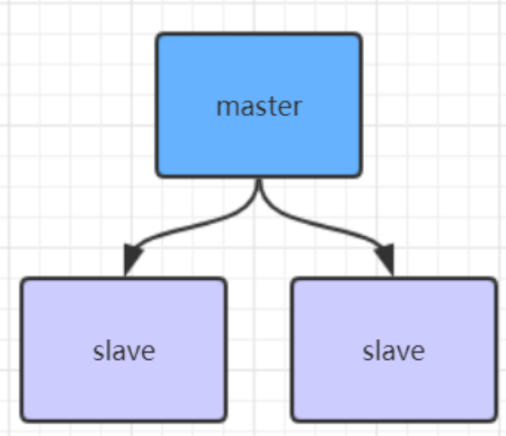
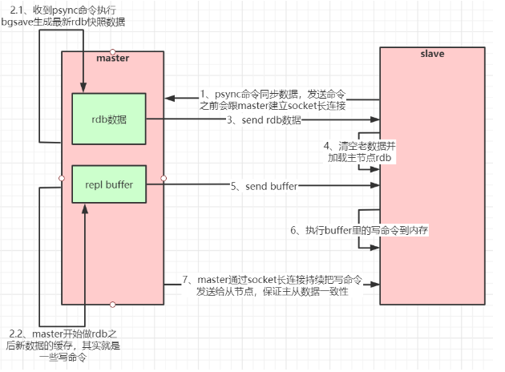
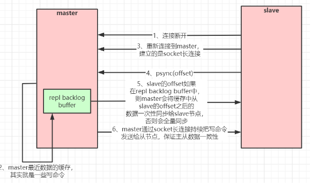
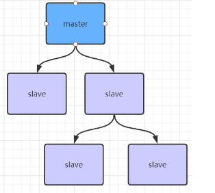
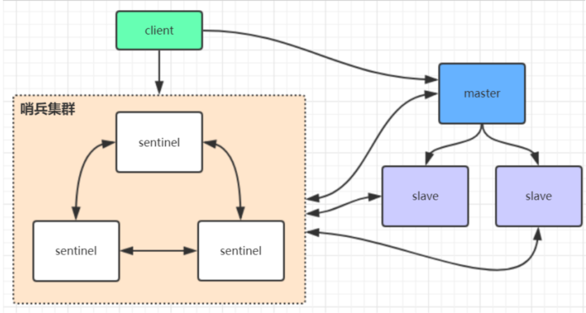

## Redis 的主从架构



### 主从架构搭建步骤

#### 1. 添加从节点
复制一份 redis.conf 文件，将相关配置修改如下：

```conf
# 如果在不同机器上部署，端口可以不用修改
port 6380
# 把 pid 进程号写入 pidfile 配置的文件
pidfile /var/run/redis_6380.pid  
logfile "6380.log"
# 指定数据存放目录
dir /usr/local/redis-5.0.3/data/6380  

# 需要注释掉 bind
# bind 127.0.0.1（bind 绑定的是自己机器网卡的 ip，如果有多块网卡可以配多个 ip，代表允许客户端通过机器的哪些网卡 ip 去访问，内网一般可以不配置 bind，注释掉即可）

# 配置主从复制
# 从 192.168.2.10 6379 的 redis 实例复制数据，Redis 5.0 之前使用 slaveof
replicaof 192.168.2.10 6379   
# 配置从节点只读
replica-read-only yes  
```
#### 2. 启动从节点
`redis-server redis.conf`

#### 3. 连接从节点
`redis-cli -p 6380`

#### 4. 测试
在主节点 6379 上写如数据，然后在 6380 上看看是否能读取到

#### 5. 同理，再添加一个 6381 节点

### Redis 主从工作原理

1. 如果为一个 master 配置一个 slave ，不管这个 slave 是否第一次连接上 Master， 它都会发送一个 PSYNC 命令给 master， 请求复制数据。
2. master 接收到 PSYNC 命令后，会在后台通过 bgsave 命令，生成最新的 rdb 快照文件，在持久化期间，master 会继续接收客户端请求，**把可能修改数据的请求记录在内存中**，master 会把 rdb 文件发给 slave，salve 接收到 rdb 文件后，保存在本地，然后加载到内存中。 之后，master 会把刚刚记录在内存中的修改数据的命令再发给 slave， slave 再依次执行这些命令。达到数据一致。
3. 当 master 与 slave 之间因为网络问题而断开时， slave 能够自动连接到 master。 如果 master 收到多个 slave 的连接请求，它只会进行一次持久化动作，而不是每个连接一次，然后再把这持久化文件发送给各个 slave。

### 主从全量复制的流程


### 数据的部分复制
当主节点与从节点断开重连后，一般都会进行全量的数据复制，从 2.8 版本开始，redis 可以支持部分数据复制的命令与 master 同步，也就是断点续传。

主节点会在内存中维护一个复制数据用的缓存队列，这个队列保存这**最近一段时间的数据**，master 和 slave 都会维护复制数据的下标 offset，和 master 的进程 id。因此当网络重连后，slave 会请求 master 继续未完成的复制，从所记录的下标位置开始，如果 master 的进程 id 变了，或者在 master 中的缓存队列中找不到这个下标，（意味着从节点的下标 offset 太旧了） 那么将会进行一次全量的数据复制。

流程图如下：


### 主从复制风暴
如果有很多个从节点，多个从节点同时从主节点复制数据，导致主节点压力过大，可以做如下阶梯式架构，让部分从节点从其他从节点复制数据：



## Redis 哨兵高可用架构



sentinel 哨兵是特殊的 redis 服务，不提供读写服务，主要用来监控 redis 节点。

哨兵架构下的 client 端第一次从哨兵中找出主节点，后续就直接访问 redis 的主节点，不会每次都通过哨兵代理访问主节点，当 redis 的主节点发生变化时，哨兵会第一时间感知到，并将新的 redis 主节点通知给客户端，这里的 redis 客户端一般都实现了订阅功能，订阅哨兵发布的节点变动信息。

### 哨兵架构搭建步骤

1. 复制一份 sentinel.conf 文件
`cp sentinel.conf sentinel-26379.conf`
2. 修改相关配置
```conf
port 26379
daemonize yes
pidfile "/var/run/redis-sentinel-26379.pid"
logfile "26379.log"
dir "/usr/local/redis-5.0.3/data"
# sentinel monitor <master-redis-name> <master-redis-ip> <master-redis-port> <quorum>
# quorum 是一个数字，指明当有多少个 sentinel 认为一个 master 失效时（值一般为：sentinel 总数/2 + 1)，master 才算真正失效
sentinel monitor mymaster 192.168.1.32 6379 2   # mymaster 这个名字随便取，客户端访问时会用到
```
3. 启动哨兵实例
```shell
src/redis-sentinel sentinel-26379.conf
```
4. 连接 redis 客户端执行 info 命令查看哨兵信息
5. 再配置另外两个 sentinel, 端口为 26380， 26381

哨兵集群启动完毕后，会将哨兵集群的元信息写入所有的 sentinel 的配置文件中，例如：
```txt
sentinel known-replica mymaster 192.168.0.60 6380 #代表 redis 主节点的从节点信息
sentinel known-replica mymaster 192.168.0.60 6381 #代表 redis 主节点的从节点信息
sentinel known-sentinel mymaster 192.168.0.60 26380 52d0a5d70c1f90475b4fc03b6ce7c3c56935760f  #代表感知到的其它哨兵节点
sentinel known-sentinel mymaster 192.168.0.60 26381 e9f530d3882f8043f76ebb8e1686438ba8bd5ca6  #代表感知到的其它哨兵节点
```

如果主节点（6379）宕机，哨兵集群会重新选举新的主节点，同时修改所有 sentinel 节点配置文件的集群元信息， 同时还会修改 sentinel 配置文件中的 mymaster 对应的 6379 端口，改为 6380:
```conf
sentinel monitor mymaster 192.168.0.60 6380 2
```
当 6379 节点再次启动时，哨兵集群根据集群元信息就可以将 6379 作为从节点加入集群中。


## Redis 集群
TODO:

## java 使用 Jedis 连接集群

```java
public class JedisSentinelTest {
    public static void main(String[] args) throws IOException {

        JedisPoolConfig config = new JedisPoolConfig();
        config.setMaxTotal(20);
        config.setMaxIdle(10);
        config.setMinIdle(5);

        String masterName = "mymaster";
        Set<String> sentinels = new HashSet<String>();
        sentinels.add(new HostAndPort("192.168.1.32",26379).toString());
        sentinels.add(new HostAndPort("192.168.1.32",26380).toString());
        sentinels.add(new HostAndPort("192.168.1.32",26381).toString());
        //JedisSentinelPool 其实本质跟 JedisPool 类似，都是与 redis 主节点建立的连接池
        //JedisSentinelPool 并不是说与 sentinel 建立的连接池，而是通过 sentinel 发现 redis 主节点并与其建立连接
        JedisSentinelPool jedisSentinelPool = new JedisSentinelPool(masterName, sentinels, config, 3000, null);
        Jedis jedis = null;
        try {
            jedis = jedisSentinelPool.getResource();
            System.out.println(jedis.set("sentinel", "dc"));
            System.out.println(jedis.get("sentinel"));
        } catch (Exception e) {
            e.printStackTrace();
        } finally {
            //注意这里不是关闭连接，在 JedisPool 模式下，Jedis 会被归还给资源池。
            if (jedis != null)
                jedis.close();
        }
    }
}
```

## spting-boot 连接集群

1. 引入依赖
```xml
dependency>
   <groupId>org.springframework.boot</groupId>
   <artifactId>spring-boot-starter-data-redis</artifactId>
</dependency>

<dependency>
   <groupId>org.apache.commons</groupId>
   <artifactId>commons-pool2</artifactId>
</dependency>
```

2. 配置信息

```xml
server:
  port: 8080

spring:
  redis:
    database: 0
    timeout: 3000
    sentinel:    #哨兵模式
      master: mymaster #主服务器所在集群名称
     nodes: 192.168.1.32:26379,192.168.1.32:26380,192.168.1.32:26381
   lettuce:
      pool:
        max-idle: 50
        min-idle: 10
        max-active: 100
        max-wait: 1000
```

3. 访问代码

```java
@RestController
public class IndexController {

    private static final Logger logger = LoggerFactory.getLogger(IndexController.class);

    @Autowired
    private StringRedisTemplate stringRedisTemplate;

    /**
     * 测试节点挂了哨兵重新选举新的 master 节点，客户端是否能动态感知到
     * 新的 master 选举出来后，哨兵会把消息发布出去，客户端实际上是实现了一个消息监听机制，
     * 当哨兵把新 master 的消息发布出去，客户端会立马感知到新 master 的信息，从而动态切换访问的 masterip
     *
     * @throws InterruptedException
     */
    @RequestMapping("/test_sentinel")
    public void testSentinel() throws InterruptedException {
        int i = 1;
        while (true){
            try {
                stringRedisTemplate.opsForValue().set("zhuge"+i, i+"");
                System.out.println("设置 key："+ "zhuge" + i);
                i++;
                Thread.sleep(1000);
            }catch (Exception e){
                logger.error("错误：", e);
            }
        }
    }
}
```
## StringRedisTemplate 与 RedisTemplate 详解
spring 封装了 RedisTemplate 对象来进行对 redis 的各种操作，它支持所有的 redis 原生的 api。在 RedisTemplate 中提供了几个常用的接口方法的使用，分别是：
```java

private ValueOperations<K, V> valueOps;
private HashOperations<K, V> hashOps;
private ListOperations<K, V> listOps;
private SetOperations<K, V> setOps;
private ZSetOperations<K, V> zSetOps;
// RedisTemplate 中定义了对 5 种数据结构操作
redisTemplate.opsForValue();//操作字符串
redisTemplate.opsForHash();//操作 hash
redisTemplate.opsForList();//操作 list
redisTemplate.opsForSet();//操作 set
redisTemplate.opsForZSet();//操作有序 set
```
StringRedisTemplate 继承自 RedisTemplate，也一样拥有上面这些操作。
StringRedisTemplate 默认采用的是 String 的序列化策略，保存的 key 和 value 都是采用此策略序列化保存的。
RedisTemplate 默认采用的是 JDK 的序列化策略，保存的 key 和 value 都是采用此策略序列化保存的。

Redis 客户端命令对应的 RedisTemplate 中的方法列表：

| **String 类型结构**                                         |                                                             |
| ----------------------------------------------------------- | ----------------------------------------------------------- |
| Redis                                                       | RedisTemplate rt                                            |
| set key value                                               | rt.opsForValue().set("key","value")                         |
| get key                                                     | rt.opsForValue().get("key")                                 |
| del key                                                     | rt.delete("key")                                            |
| strlen key                                                  | rt.opsForValue().size("key")                                |
| getset key value                                            | rt.opsForValue().getAndSet("key","value")                   |
| getrange key start end                                      | rt.opsForValue().get("key",start,end)                       |
| append key value                                            | rt.opsForValue().append("key","value")                      |
|                                                             |                                                             |
| **Hash 结构**                                               |                                                             |
| hmset key field1 value1 field2 value2...                    | rt.opsForHash().putAll("key",map) //map 是一个集合对象      |
| hset key field value                                        | rt.opsForHash().put("key","field","value")                  |
| hexists key field                                           | rt.opsForHash().hasKey("key","field")                       |
| hgetall key                                                 | rt.opsForHash().entries("key") //返回 Map 对象              |
| hvals key                                                   | rt.opsForHash().values("key") //返回 List 对象              |
| hkeys key                                                   | rt.opsForHash().keys("key") //返回 List 对象                |
| hmget key field1 field2...                                  | rt.opsForHash().multiGet("key",keyList)                     |
| hsetnx key field value                                      | rt.opsForHash().putIfAbsent("key","field","value"           |
| hdel key field1 field2                                      | rt.opsForHash().delete("key","field1","field2")             |
| hget key field                                              | rt.opsForHash().get("key","field")                          |
|                                                             |                                                             |
| **List 结构**                                               |                                                             |
| lpush list node1 node2 node3...                             | rt.opsForList().leftPush("list","node")                     |
| rt.opsForList().leftPushAll("list",list) //list 是集合对象  |                                                             |
| rpush list node1 node2 node3...                             | rt.opsForList().rightPush("list","node")                    |
| rt.opsForList().rightPushAll("list",list) //list 是集合对象 |                                                             |
| lindex key index                                            | rt.opsForList().index("list", index)                        |
| llen key                                                    | rt.opsForList().size("key")                                 |
| lpop key                                                    | rt.opsForList().leftPop("key")                              |
| rpop key                                                    | rt.opsForList().rightPop("key")                             |
| lpushx list node                                            | rt.opsForList().leftPushIfPresent("list","node")            |
| rpushx list node                                            | rt.opsForList().rightPushIfPresent("list","node")           |
| lrange list start end                                       | rt.opsForList().range("list",start,end)                     |
| lrem list count value                                       | rt.opsForList().remove("list",count,"value")                |
| lset key index value                                        | rt.opsForList().set("list",index,"value")                   |
|                                                             |                                                             |
| **Set 结构**                                                |                                                             |
| sadd key member1 member2...                                 | rt.boundSetOps("key").add("member1","member2",...)          |
| rt.opsForSet().add("key", set) //set 是一个集合对象         |                                                             |
| scard key                                                   | rt.opsForSet().size("key")                                  |
| sidff key1 key2                                             | rt.opsForSet().difference("key1","key2") //返回一个集合对象 |
| sinter key1 key2                                            | rt.opsForSet().intersect("key1","key2")//同上               |
| sunion key1 key2                                            | rt.opsForSet().union("key1","key2")//同上                   |
| sdiffstore des key1 key2                                    | rt.opsForSet().differenceAndStore("key1","key2","des")      |
| sinter des key1 key2                                        | rt.opsForSet().intersectAndStore("key1","key2","des")       |
| sunionstore des key1 key2                                   | rt.opsForSet().unionAndStore("key1","key2","des")           |
| sismember key member                                        | rt.opsForSet().isMember("key","member")                     |
| smembers key                                                | rt.opsForSet().members("key")                               |
| spop key                                                    | rt.opsForSet().pop("key")                                   |
| srandmember key count                                       | rt.opsForSet().randomMember("key",count)                    |
| srem key member1 member2...                                 | rt.opsForSet().remove("key","member1","member2",...)        |