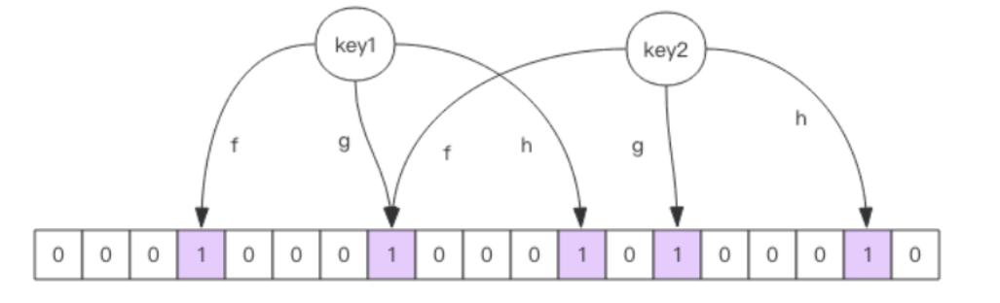

- [缓存穿透](#缓存穿透)
  - [缓存穿透问题解决方案](#缓存穿透问题解决方案)
    - [缓存空对象](#缓存空对象)
    - [布隆过滤器](#布隆过滤器)
    - [redisson 实现布隆过滤器](#redisson-实现布隆过滤器)
      - [引入依赖](#引入依赖)
      - [预先放入数据](#预先放入数据)
      - [使用](#使用)
- [缓存击穿](#缓存击穿)
- [缓存雪崩](#缓存雪崩)
  - [预防和解决方案](#预防和解决方案)
- [热点key的重建优化](#热点key的重建优化)


## 缓存穿透
缓存穿透指的是查询一个根本不存在的数据，缓存层和存储层都不会命中，通常处于容错的考虑，如果存储层不存在数据也不会写入缓存层。这样就导致每次请求都要去存储层查询，失去了缓存保护后端存储的意义。

造成缓存穿透的原因有两个:
1. 自身业务代码或者数据出现问题
2. 一些恶意攻击，爬虫等造成大量的空命中

### 缓存穿透问题解决方案
#### 缓存空对象
```java
String get(String key) {
    // 从缓存中获取数据
    String cacheValue = cache.get(key);
    // 缓存为空
    if (StringUtils.isBlank(cacheValue)) {
        // 从存储中获取
        String storageValue = storage.get(key);
        cache.set(key, storageValue);
        // 如果存储数据为空， 需要设置一个过期时间(300秒)
        if (storageValue == null) {
            cache.expire(key, 60 * 5);
        }
        return storageValue;
    } else {
        // 缓存非空
        return cacheValue;
    }
}
```
#### 布隆过滤器

对于恶意攻击，向服务器请求大量不存在的数据造成的缓存穿透可以先用布隆过滤器做一次筛选，对于不存在数据，布隆过滤器一般都能够过滤掉，不让请求再继续往后端走。

布隆过滤器的特性是：**当它说这个值存在，那么这个值可能存在，也可能不存在；当它说不存在时，这个值一定不存在**

它的这种特性是由它的算法和数据结构决定的：



如上图所示，布隆过滤器就是一个大型的位数组和几个不一样的无偏hash函数，所谓无偏，就是能够把元素的hash值计算的比较均匀。工作原理如下：
向布隆过滤器添加key时，会使用多个hash函数对key进行hash运算，得出一个整数索引值，然后对数组长度进行取模运算，得到在数组中的位置。每个hash函数都会算的一个不同的位置，再把为位数组的这几个位置都置为1，就完成了add操作

那么为什么需要多个hash函数呢？先带着问题看一下布隆过滤器如何判断一个值是否存在:
当检查一个元素是否在布隆过滤器中时，同样会将该元素哈希成多个不同的位数组下标，然后检查这些下标对应的位**是否都为1**。如果有任何一个位为0，则可以确定该元素一定不存在于布隆过滤器中；如果所有位都为1，则该元素可能存在于布隆过滤器中，但也可能是一个**假阳性（false positive）。**

设置多个hash函数主要是为了**减少假阳性的概率**。当只使用一个哈希函数时，会有可能出现多个元素被哈希到同一个位数组下标的情况，从而导致误判。而使用多个哈希函数可以让元素分布在更多的位数组下标上，从而减少假阳性的概率。当使用k个哈希函数时，假阳性的概率为`(1 - \frac{1}{m})^{kn}`，其中m是位数组的长度，n是元素数量。
因此，使用多个哈希函数可以提高布隆过滤器的准确性和可靠性。

综上述可以得知，布隆过滤器的可靠性大致由 hash 函数的个数，以及位数组的长度决定。hash 函数的个数计算有些复杂，暂按下不表。而位数组的长度一般我们不能直接设定，而是先设置成业务中待查找样本的总量，布隆过滤器会自动调整位数组的长度。这个长度一般很大，过亿都是正常的，因为它是按位存储的，一亿的长度所占的空间也就 12M。

这种方法适用于数据命中不高、 **数据相对固定、 实时性低**（通常是数据集较大） 的应用场景， 代码维护较为复杂， 但是缓存空间占用很少。

#### redisson 实现布隆过滤器

##### 引入依赖
```xml
dependency>
   <groupId>org.redisson</groupId>
   <artifactId>redisson</artifactId>
   <version>3.6.5</version>
</dependency>
```

##### 预先放入数据

**使用布隆过滤器需要把所有数据提前放入布隆过滤器，并且在增加数据时也要往布隆过滤器里放，但是布隆过滤器不支持删除数据，如果原始数据删除比较多，需要定期重置布隆过滤器，以保持较高的正确性**

```java
/初始化布隆过滤器
RBloomFilter<String> bloomFilter = redisson.getBloomFilter("nameList");
//初始化布隆过滤器：预计元素为100000000L,误差率为3%
bloomFilter.tryInit(100000000L,0.03);
        
//把所有数据存入布隆过滤器
void init(){
    keys = ["zhangsan","lisi","wanger" ....]
    for (String key: keys) {
        bloomFilter.put(key);
    }
}
```
##### 使用
```java
public class RedissonBloomFilter {

    public static void main(String[] args) {
        Config config = new Config();
        config.useSingleServer().setAddress("redis://localhost:6379");
        //构造Redisson
        RedissonClient redisson = Redisson.create(config);

        RBloomFilter<String> bloomFilter = redisson.getBloomFilter("nameList");
        //初始化布隆过滤器：预计元素为100000000L,误差率为3%,根据这两个参数会计算出底层的bit数组大小
        bloomFilter.tryInit(100000000L,0.03);

        //判断下面号码是否在布隆过滤器中
        System.out.println(bloomFilter.contains("sa"));//false
        System.out.println(bloomFilter.contains("jlsd"));//false
        System.out.println(bloomFilter.contains("zhangsan"));//true
    }
}
```

## 缓存击穿

由于大批量缓存在同一时间失效可能导致大量得请求同时穿透缓存直达访问数据库，可能会造成数据库瞬间压力过大甚至挂掉。为应对这种情况，我们一般将某批缓存在过期的时间基础上再加一个短暂的随机值，避免同时失效, 伪代码如下:

```java
String get(String key) {
    // 从缓存中获取数据
    String cacheValue = cache.get(key);
    // 缓存为空
    if (StringUtils.isBlank(cacheValue)) {
        // 从存储中获取
        String storageValue = storage.get(key);
        cache.set(key, storageValue);
        //设置一个过期时间(300到600之间的一个随机数)
        int expireTime = new Random().nextInt(300)  + 300;
        if (storageValue == null) {
            cache.expire(key, expireTime);
        }
        return storageValue;
    } else {
        // 缓存非空
        return cacheValue;
    }
}
```

## 缓存雪崩

缓存雪崩指的是缓存层支撑不住请求或者宕机了，流量会直接冲击到后端存储层。

由于缓存层承载这大量的请求，有效的保护了存储层，但是如果某些原因导致缓存层不能提供正常的服务，如： 
1. 超大并发，缓存层支撑不住 
2. 缓存设计不好，类似于大量请求 bigkey,导致缓存层服务性能急剧下降
这样就导致大量的请求都会打到后端，造成存储层宕机

### 预防和解决方案
1. 保证缓存服务的高可用，使用哨兵架构，或者集群架构
2. 依赖隔离组件为后端请求限流熔断并降级，比如使用 sentinel 或者 Hystrix 限流降级组件
   > 比如服务降级，我们可以针对不同的数据采取不同的处理方式。当业务应用访问的是非核心数据（例如电商商品属性，用户信息等）时，暂时停止从缓存中查询这些数据，而是直接返回预定义的默认降级信息、空值或是错误提示信息；当业务应用访问的是核心数据（例如电商商品库存）时，仍然允许查询缓存，如果缓存缺失，也可以继续通过数据库读取。
3. 提前演练。在项目上线前， 演练缓存层宕掉后， 应用以及后端的负载情况以及可能出现的问题， 在此基础上做一些预案设定。


## 热点key的重建优化
对于缓存的使用一般是 "缓存 + 过期时间"的方式，既能提高接口的并发，也能在一定的时间内保证数据最新。这种方式基本能满足大部分需求，但是下面两个问题同时出现时，可能会对应用造成致命的伤害:
1. 当前key热度很高，并发量很大
2. 重建缓存的过程比较耗时

这种情况下缓存失效的瞬间，有大量的线程去重建缓存，造成后端负载过大，甚至导致宕机。解决这个问题的关键是要避免大量线程同时重建缓存：

可以使用互斥锁来解决，此方法只允许一个线程重建缓存，其他线程等待，然后重新获取最新数据，伪代码如下:

```java
String get(String key) {
    // 从Redis中获取数据
    String value = redis.get(key);
    // 如果value为空， 则开始重构缓存
    if (value == null) {
        // 只允许一个线程重建缓存， 使用nx， 并设置过期时间ex
        String mutexKey = "mutext:key:" + key;
        if (redis.set(mutexKey, "1", "ex 180", "nx")) {
             // 从数据源获取数据
            value = db.get(key);
            // 回写Redis， 并设置过期时间
            redis.setex(key, timeout, value);
            // 删除key_mutex
            redis.delete(mutexKey);
        }// 其他线程休息50毫秒后重试
        else {
            Thread.sleep(50);
            get(key);
        }
    }
    return value;
}
```