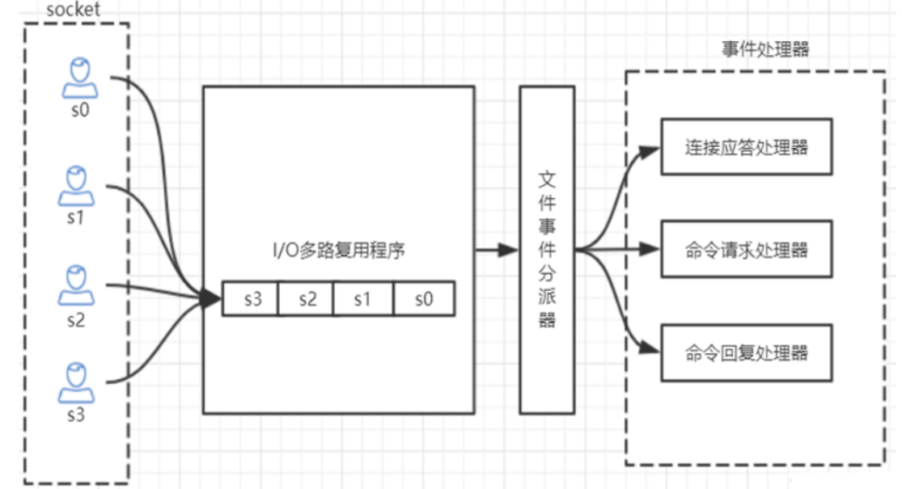

## redis 的单线程和和高性能

### redis 是单线程的吗
Redis 的单线程主要是指网络 IO 和键值对读写是由一个线程完成的，这也是 Redis 对外提供键值存储服务的主要流程。但 Redis 的其他功能，比如：持久化，异步删除，集群数据同步等，其实是由额外的线程执行的。

### Redis 单线程为什么还能这么快？

因为它的所有数据都在内存中，所有的运算都是内存级别的运算，而且避免了多线程上下文切换的损耗。
正因为 Redis 是单线程的，使用的过程中一定要注意避免阻塞操作，比如 在 key 数量非常多的情况下使用 `keys *`， 这会阻塞后续所有 redis 对 key 的操作。

### Redis 单线程如何处理多客户端并发连接

Redis 的 IO 多路复用，redis利用epoll来实现IO多路复用，将连接信息和事件放到队列中，依次放到文件事件分派器，事件分派器将事件分发给事件处理器。
如图:


#### redis 支持的最大连接数
在配置文件中 `redis.conf` :

```conf
maxlients 6000
```

也可以在 redis-cli 中查看:

```shell
127.0.0.1:6379> CONFIG GET maxclients
"maxclients"
"6000"
```

