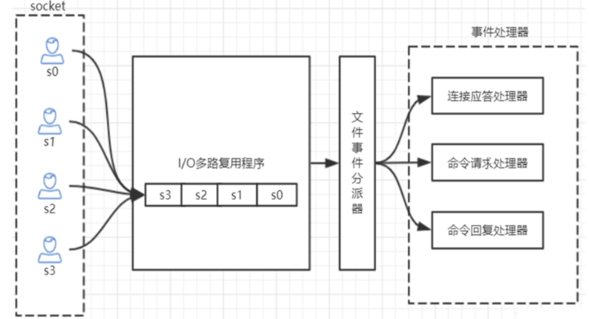
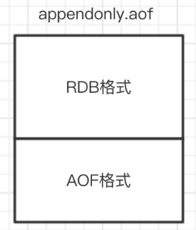

## redis 的单线程和和高性能

### redis 是单线程的吗
Redis 的单线程主要是指网络 IO 和键值对读写是由一个线程完成的，这也是 Redis 对外提供键值存储服务的主要流程。但 Redis 的其他功能，比如：持久化，异步删除，集群数据同步等，其实是由额外的线程执行的。

### Redis 单线程为什么还能这么快？

因为它的所有数据都在内存中，所有的运算都是内存级别的运算，而且避免了多线程上下文切换的损耗。
正因为 Redis 是单线程的，使用的过程中一定要注意避免阻塞操作，比如 在 key 数量非常多的情况下使用 `keys *`， 这会阻塞后续所有 redis 对 key 的操作。

### Redis 单线程如何处理多客户端并发连接

Redis 的 IO 多路复用，redis 利用 epoll 来实现 IO 多路复用，将连接信息和事件放到队列中，依次放到文件事件分派器，事件分派器将事件分发给事件处理器。
如图：


#### redis 支持的最大连接数
在配置文件中 `redis.conf` :

```conf
maxlients 6000
```

也可以在 redis-cli 中查看：
```shell
127.0.0.1:6379> CONFIG GET maxclients
"maxclients"
"6000"
```
## 查看服务运行信息

info 命令可以查看 redis 服务运行信息，分为 9 大块，分别是：
- Server 服务器运行参数
- Clients 客户端相关信息
- Memory 服务器运行内存统计数据
- Persistence 持久化信息
- Stats 通用统计数据
- Replication 主从复制相关信息
- CPU CPU 使用情况
- Cluster 集群信息
- KeySpace 键值对统计数量信息

下面简要介绍一些信息：

```txt
connected_clients:2                  # 正在连接的客户端数量

instantaneous_ops_per_sec:789        # 每秒执行多少次指令

used_memory:929864                   # Redis 分配的内存总量 (byte)，包含 redis 进程内部的开销和数据占用的内存
used_memory_human:908.07K            # Redis 分配的内存总量 (Kb，human 会展示出单位）
used_memory_rss_human:2.28M          # 向操作系统申请的内存大小 (Mb)（这个值一般是大于 used_memory 的，因为 Redis 的内存分配策略会产生内存碎片）
used_memory_peak:929864              # redis 的内存消耗峰值 (byte)
used_memory_peak_human:908.07K       # redis 的内存消耗峰值 (KB)

maxmemory:0                         # 配置中设置的最大可使用内存值 (byte), 默认 0, 不限制，一般配置为机器物理内存的百分之七八十，需要留一部分给操作系统
maxmemory_human:0B                  # 配置中设置的最大可使用内存值
maxmemory_policy:noeviction         # 当达到 maxmemory 时的淘汰策略
```

## Redis 持久化

### RDB 快照

默认情况下，redis 将内存数据库快照保存在名字为 dump.rbd 的二进制文件中

可以通过配置文件设置 "N 秒内至少有 M 个改动" 条件触发时，自动保存一次数据，配置项是 `save`, 如：

```txt
save 60 1000 
```
这个配置让 redis 在满足 “60 秒内至少有 1000 个键改动” 条件时，自动保存一次数据集

还可以手动执行命令生成 RDB 快照，进入 reids 客户端命令执行 `save` 或者 `bgsave` 可以生成 dump.rbd 文件，每次执行命令都会将内存中的数据保存到一个新的 rdb 文件中，并覆盖原有的 rdb 快照文件

如果想关闭 RDB 快照功能，直接将此配置注释即可

#### bgsave 的写时复制机制 (COW)

reids 借助操作系统提供的写时复制技术 (Copy-On-Write) 在生成快照的同时，依然可以进行写命令。实现机制是：bgsave 是由子进程操作的，它有主线程 fork 生成，可以共享主线程的所有内存数据，bgsave 子进程生成后，它开始读取主线程的内存数据，并把他们写入 RDB 文件。 此时 如果主线程对数据都是读操作，那么主线程和子进程互不影响，但是如果主线程要修改一块数据，那么这个数据就会被复制一份，生成该数据的副本，bgsave 子进程会把这个副本数据写入 RDB 文件，这个过程中，主进程仍然可以直接修改原来的数据。

在配置文件指定 `save 60 1000` 用的是 basave 的方式

#### save 与 bgsave 的对比

|                         | save               | bgsave                     |
| ----------------------- | ------------------ | -------------------------- |
| IO 类型                 | 同步               | 异步                       |
| 是否阻塞 redis 其它命令 | 是                 | 否                         |
| 复杂度                  | O(n)               | O(n)                       |
| 优点                    | 不会消耗额外的内存 | 不阻塞客户端命令           |
| 缺点                    | 阻塞客户端命令     | 需要 fork 子进程，消耗内存 |

### AOF(append-only file)

快照功能并不是非常耐久（durable）： 如果 Redis 因为某些原因而造成故障停机， **那么服务器将丢失 最近写入、且仍未保存到快照中的那些数据。**从 1.1 版本开始， Redis 增加了一种完全耐久的持久化方式： **AOF 持久化**，将修改的每一条指令记录进文件 appendonly.aof 中（先写入 os cache，每隔一段时间 fsync 到磁盘）

比如执行命令`set dc 666`，aof 文件里会记录如下数据 
```txt
1 *3
2 $3
3 set
4 $5 
5 dc
6 $3 
7 666 
```

这是一种 resp 协议格式数据，星号后面的数字代表命令有多少个参数，$号后面的数字代表这个参数有几个字符，注意：如果执行带过期时间的 set 命令，aof 文件里记录的是并不是执行的原始命令，而是记录 key 过期的时间戳

可以修改配置文件来打开 AOF 功能：

```txt
appendonly yes
```
当 Redis 重新启动时， 程序就可以通过重新执行 AOF 文件中的命令来达到重建数据集的目的，由于 redis 不是直接把命令写入磁盘，而是先写入 os cache, 隔一段时间才持久化到磁盘中，故而可以配置 Redis 多久才将数据 fsync 得到磁盘一次，有三种选择：

- appenfsync always # 每次有新命令追加到 AOF 文件时，就执行一次 fsync， 非常慢也非常安全
- appenfsync everysec # 每秒 fsnc 一次，足够快，并且指挥丢失 1 秒中的数据。
- appenfsync no # 从不 fsync 依赖操作系统处理，够快，但不够安全

推荐每秒一次，也是默认的配置， 兼顾速度和安全

### AOF 重写

加入对一个 key 进行 N 次累加： `incr viewCnt`, AOF 文件中就会记录 N 次这个命令，其实只需记录 `incr ViewCnt N` 即可。 所以 reids 会定期对 AOF 中的命令重写，以便将来可以更快的恢复数据。
有两个配置可以控制重写的频率：
```txt
auto‐aof‐rewrite‐min‐size 64mb # aof 文件至少要达到 64M 才会自动重写，文件太小恢复速度本来就 很快，重写的意义不大 
auto‐aof‐rewrite‐percentage 100 # aof 文件自上一次重写后文件大小增长了 100%则再次触发重写
```

当让 AOF 重写动作还可以手动触发，在 redis-cli 中执行 `bgrewriteaof`, AOF 重写会 fork 出一个子进程去做，和 bgsave 类似，不会对 redis 执行正常的命令有太多的影响。

### RDB 与 AOF 的对比

|            | RDB        | AOF          |
| ---------- | ---------- | ------------ |
| 启动优先级 | 低         | 高           |
| 文件体积   | 小         | 大           |
| 恢复速度   | 快         | 慢           |
| 数据安全性 | 容易丢数据 | 根据策略决定 |

在生产环境都可以启用，如果既有 RBD 文件，也有 AOF 文件，则优先选择 AOF 文件来恢复数据，因为相对来说数据更安全一些

## Redis 4.0 混合持久化

重启 redis 时，很少会使用 rdb 文件来恢复数据，因为会丢失大量数据，通常会通过 AOF 日志重放，但是重放 AOF 日志的性能会比 RDB 来说慢的多，尤其在 redis 中数据很大的情况下启动要花费很长时间， redis 为了解决这个问题，带来了一个新的持久化选项——混合持久化。通过下面的配置可以开启混合持久化，注意：必须先开启 aof 持久化：

```txt
aof-use-rdb-premable yes
```

如果开启了混合持久化，AOF 在重写时，不再是单纯将内存数据转换为 RESP 命令写入 AOF 文件，而是将重写这一刻之前的内存做 RDB 快照处理，并且将 RDB 快照内容和增量的 AOF 修改内存数据的命令存在一起，都写入新的 AOF 文件，新的文件一开始不叫 appendonly.aof，等到重写完新的 AOF 文件才会进行改名，覆盖原有的 AOF 文件，完成新旧两个 AOF 文件的替换。 于是在 Redis 重启的时候，可以先加载 RDB 的内容，然后再重放增量 AOF 日志就可以完全替代之前的 AOF 全量文件重放，因此重启效率大幅得到提升。

混合持久化AOF文件结构如下:



## Redis 数据备份策略

1. 写crontab定时调度脚本，每小时都copy一份rdb或aof的备份到一个目录中去，仅仅保留最近48 小时的备份 
2. 每天都保留一份当日的数据备份到一个目录中去，可以保留最近1个月的备份 
3. 每次copy备份的时候，都把太旧的备份给删了 
4. 每天晚上将当前机器上的备份复制一份到其他机器上，以防机器损坏