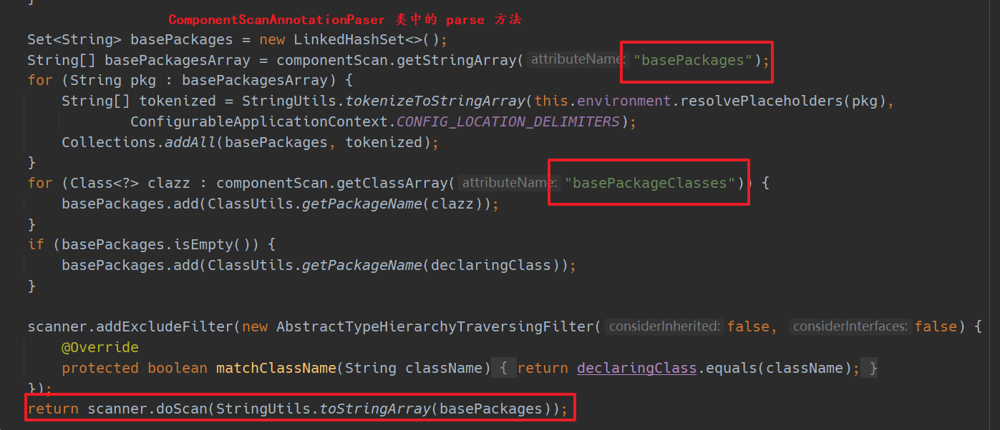
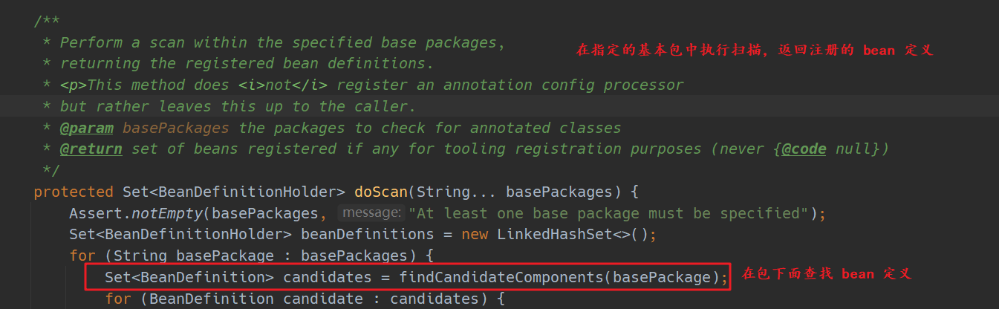

本文从源码层面简要介绍一下 Spring IoC 加载过程，以及这个过程遇到的重点方法，重点类。

## new AnnotationConfigApplicationContext()

一切的根源都要从 `new AnnotationConfigApplicationContext()` 方法开始，这是 Spring 启动的入口，先准备如下代码：
```java
public class ContextDemo {
    public static void main(String[] args) {

        AnnotationConfigApplicationContext context = new AnnotationConfigApplicationContext(Config.class);
        context.getBean("car",Car.class);
    }
}

@Configuration
@ComponentScan(basePackageClasses = {Car.class})
class Config{
    @Bean
    public User1 user(){
        return new User1(10, "dc1");
    }
}

@Component
class Car  {
    private int color;
    private String name;
}

class User1 {
    private int age;
    private String name;

}

```

进入 `new AnnotationConfigApplicationContext(Config.class);` 方法可见如下：
```java
public AnnotationConfigApplicationContext(Class<?>... annotatedClasses) {
    this();
    register(annotatedClasses);
    refresh();
}
```

再进入 `this()` 方法，如下：
```java
public AnnotationConfigApplicationContext() {
    this.reader = new AnnotatedBeanDefinitionReader(this);
    this.scanner = new ClassPathBeanDefinitionScanner(this);
}
```

发现调用的 `AnnotationConfigApplicationContext` 无参构造器， 再调用一个类的无参构造器时，会先调用父类的无参构造器， 同时发现这个类的父类构造器如下：
```java
public GenericApplicationContext() {
    this.beanFactory = new DefaultListableBeanFactory();
}
```
方法很简单，只是 new 了一个 `beanFactory`, 从名称来看，这个属性是 bean 工厂。现在只知道 `AnnotationConfigApplicationContext` 中有一个 `beanFactory` 的字段，这个字段是从父类继承来的。

父类的构造方法已经结束，接着往下看， `this.reader = new AnnotatedBeanDefinitionReader(this);`, `this.scanner = new ClassPathBeanDefinitionScanner(this); `。初始化 `reader` 和 `scanner`.
1. 找到 `reader` 属性，会发现它是 `AnnotatedBeanDefinitionReader` 类型。看一下这个类型的注释说明：
```java
/**
 * Convenient adapter for programmatic registration of annotated bean classes.
 * This is an alternative to {@link ClassPathBeanDefinitionScanner}, applying
 * the same resolution of annotations but for explicitly registered classes only.
 *
 * @author Juergen Hoeller
 * @author Chris Beams
 * @author Sam Brannen
 * @author Phillip Webb
 * @since 3.0
 * @see AnnotationConfigApplicationContext#register
 */
public class AnnotatedBeanDefinitionReader {....}
```

翻译一下：
>简便的适配器，用于注解 bean 类的注册。这是 ClassPathBeanDefinitionScanner 的替代方案，应用相同的注解，但仅适用于显式注册的类。

意思就是可以替代 `ClassPathBeanDefinitionScanner` 使用，但是它只能用于我们手动注册的类。

2. 找到`scanner` 属性，发现它正是 `ClassPathBeanDefinitionScanner` 类型。再看一下这个类的注释说明：
```java
/**
 * A bean definition scanner that detects bean candidates on the classpath,
 * registering corresponding bean definitions with a given registry ({@code BeanFactory}
 * or {@code ApplicationContext}).
 *
 * <p>Candidate classes are detected through configurable type filters. The
 * default filters include classes that are annotated with Spring's
 * {@link org.springframework.stereotype.Component @Component},
 * {@link org.springframework.stereotype.Repository @Repository},
 * {@link org.springframework.stereotype.Service @Service}, or
 * {@link org.springframework.stereotype.Controller @Controller} stereotype.
 *
 * <p>Also supports Java EE 6's {@link javax.annotation.ManagedBean} and
 * JSR-330's {@link javax.inject.Named} annotations, if available.
 *
 * @author Mark Fisher
 * @author Juergen Hoeller
 * @author Chris Beams
 * @since 2.5
 * @see AnnotationConfigApplicationContext#scan
 * @see org.springframework.stereotype.Component
 * @see org.springframework.stereotype.Repository
 * @see org.springframework.stereotype.Service
 * @see org.springframework.stereotype.Controller
 */
public class ClassPathBeanDefinitionScanner extends ClassPathScanningCandidateComponentProvider {...}

```
翻译一下：
> 一个 bean 定义扫描器，用于检测类路径上的 bean 的候选者，将相应的 bean 定义注册到给定的注册表（ BeanFactory 或 ApplicationContext ）。
> 通过可配置的类型过滤器检测候选类。默认过滤器包括使用 Spring 的@Component 、 @Repository 、 @Service 或@Controller 原型注释的类。
> 如果可用，还支持 Java EE 6 的 javax.annotation.ManagedBean 和 JSR-330 的 javax.inject.Named 注释。

它的意思说，把类路径中的所有类进行扫描。把类中配置的 bean 放到注册表， 注册表可能是 `BeanFactory` 或者 `ApplicationContext`

到这里可以知道， `AnnotationConfigApplicationContext` 除了继承父类的属性外，还初始化了 1. bean 定义读取器 (reader) 2. bean 定义扫描器 (scanner)

下面看一下如何初始化的：

## 初始化 AnnotatedBeanDefinitionReader

一层层进入 `new AnnotatedBeanDefinitionReader(this)`, 最终找到方法：

```java
/**
    * Register all relevant annotation post processors in the given registry.
    * @param registry the registry to operate on
    * @param source the configuration source element (already extracted)
    * that this registration was triggered from. May be {@code null}.
    * @return a Set of BeanDefinitionHolders, containing all bean definitions
    * that have actually been registered by this call
    */
public static Set<BeanDefinitionHolder> registerAnnotationConfigProcessors(
        BeanDefinitionRegistry registry, @Nullable Object source) {

    DefaultListableBeanFactory beanFactory = unwrapDefaultListableBeanFactory(registry);
    if (beanFactory != null) {
        if (!(beanFactory.getDependencyComparator() instanceof AnnotationAwareOrderComparator)) {
            beanFactory.setDependencyComparator(AnnotationAwareOrderComparator.INSTANCE);
        }
        if (!(beanFactory.getAutowireCandidateResolver() instanceof ContextAnnotationAutowireCandidateResolver)) {
            beanFactory.setAutowireCandidateResolver(new ContextAnnotationAutowireCandidateResolver());
        }
    }

    Set<BeanDefinitionHolder> beanDefs = new LinkedHashSet<>(8);

    if (!registry.containsBeanDefinition(CONFIGURATION_ANNOTATION_PROCESSOR_BEAN_NAME)) {
        RootBeanDefinition def = new RootBeanDefinition(ConfigurationClassPostProcessor.class);
        def.setSource(source);
        beanDefs.add(registerPostProcessor(registry, def, CONFIGURATION_ANNOTATION_PROCESSOR_BEAN_NAME));
    }

    if (!registry.containsBeanDefinition(AUTOWIRED_ANNOTATION_PROCESSOR_BEAN_NAME)) {
        RootBeanDefinition def = new RootBeanDefinition(AutowiredAnnotationBeanPostProcessor.class);
        def.setSource(source);
        beanDefs.add(registerPostProcessor(registry, def, AUTOWIRED_ANNOTATION_PROCESSOR_BEAN_NAME));
    }
    // .... 省略很多代码
    return beanDefs;
}
```

先翻译一下这个方法的注释，以及参数和返回值：

**注释：**
> 在给定的注册表中注册所有相关的注解后处理器

**参数：**
1. 第一个参数是： `register`, 这个是从最开始传入的 `AnnotationConfigApplicationContext` 对象
2. 第二个参数是：`Object source` 这个传入的 null, 暂不关心它

**返回值：**

返回的是 `Set<BeanDefinitionHolder>` 集合，到这里先暂停一下，需要看 `BeanDefinitionHolder` 是什么，它里面都是什么属性，以及干嘛用的：

### BeanDefinition

进入这个类，查看它的注释和内部结构：
通过注释可以知道它是 **具有名称和别名的 BeanDefinition 的持有者**


由此可知道关键信息不在它，而是 `BeanDefinition`, `BeanDefinitionHolder` 只是 `BeanDefinition` 的持有者，只比 `BeanDefinition` 多了 `beanName` 以及别名属性。为的是可以有一个具体的名称来描述 `BeanDefinition`. 所以要接着看 `BeanDefinition`：

先看翻译下 `BeanDefinition` 的注释：
> BeanDefinition 描述了一个 bean 实例，它具有属性值、构造函数参数值以及具体实现提供的更多信息。 这只是一个最小接口：主要目的是允许像 PropertyPlaceholderConfigurer 这样的 BeanFactoryPostProcessor 内省和修改属性值和其他 bean 元数据。

它说 BeanDefinition **描述了** bean 的实例。也就是建筑图纸和建筑物的关系，BeanDefinition 会存有 某个 bean 的字段，构造方法等等。可以根据 BeanDefinition 构造出应的 bean。就如同可以通过建筑图纸还原出建筑物一样。

这里就非常巧妙了，一个系统中的有各式各样的 bean，功能不同，类型不同。用一个相同的东西去描述，操作这些 bean，是一个非常有利的转换。因为它们都是对象，是对象就会有方法，字段，类型。把这些方法，字段，类型再抽象，聚合就形成了 BeanDefinition.

看一下 BeanDefinition 内部结构：


内容很多，都是设置，获取 某个对象类型信息的，挑几个看一下：

```java
public interface BeanDefinition extends AttributeAccessor, BeanMetadataElement {

    // 标准单例范围的范围标识符：“单例”。
	String SCOPE_SINGLETON = ConfigurableBeanFactory.SCOPE_SINGLETON;
    // 标准原型范围的范围标识符：“原型”。
  	String SCOPE_PROTOTYPE = ConfigurableBeanFactory.SCOPE_PROTOTYPE;
    // ...
    // 指定此 bean 定义的 bean 类名。
    // 类名可以在 bean 工厂后期处理期间修改，通常用它的解析变体替换原始类名。
	void setBeanClassName(@Nullable String beanClassName);

    // 覆盖此 bean 的目标范围，指定一个新的范围名称
    void setScope(@Nullable String scope);

    //设置这个 bean 是否应该被延迟初始化。
    //如果为 false ，则 bean 将在启动时由执行单例预初始化的 bean 工厂实例化。
	void setLazyInit(boolean lazyInit);

    //返回此 bean 是否应该延迟初始化，即在启动时不急切地实例化。仅适用于单例 bean。
	boolean isLazyInit();
    // ....
}
```

好了，对 BeanDefinition 的了解暂时到此。不再深入了。继续上面的` registerAnnotationConfigProcessors`方法：

第一行： `DefaultListableBeanFactory beanFactory = unwrapDefaultListableBeanFactory(registry); `

进入方法后，发现没有做太多的是事情，就是把注册器的 beanFactory 包装一下，再返回。这里的 register 就是最开始 main 方法中的 `AnnotationConfigApplicationContext` 对象。

接着看下面：

```java
if (beanFactory != null) {
    if (!(beanFactory.getDependencyComparator() instanceof AnnotationAwareOrderComparator)) {
        beanFactory.setDependencyComparator(AnnotationAwareOrderComparator.INSTANCE);
    }
    if (!(beanFactory.getAutowireCandidateResolver() instanceof ContextAnnotationAutowireCandidateResolver)) {
        beanFactory.setAutowireCandidateResolver(new ContextAnnotationAutowireCandidateResolver());
    }
}
```
对 beanFactory 添加 `依赖比较器` 和 `Autowire 候选解析器` 暂时不知道设么作用，跳过。继续：

```java
Set<BeanDefinitionHolder> beanDefs = new LinkedHashSet<>(8);

if (!registry.containsBeanDefinition(CONFIGURATION_ANNOTATION_PROCESSOR_BEAN_NAME)) {
    RootBeanDefinition def = new RootBeanDefinition(ConfigurationClassPostProcessor.class);
    def.setSource(source);
    beanDefs.add(registerPostProcessor(registry, def, CONFIGURATION_ANNOTATION_PROCESSOR_BEAN_NAME));
}
```

先构造了一个 `BeanDefinitionHolder` 的集合，也就是这个方法要返回的集合，if 语句中， 判断注册器是否包含某个 BeanDefinition, 进去看一下怎么判断的：

```java
   // 在 DefaultListableBeanFactory 类下面
	@Override
	public boolean containsBeanDefinition(String beanName) {
		Assert.notNull(beanName, "Bean name must not be null");
		return this.beanDefinitionMap.containsKey(beanName);
	}
```

最终会进入 `DefaultListableBeanFactory` 类中的 `containsBeanDefinition` 方法，也就是说这个方法不是注册器提供的，而是它的 beanFactory 属性提供的。并且在 beanFactory 中有一个 `Map<String, BeanDefinition> beanDefinitionMap`；通过名字就可以知道，存放的是 BeanDefinition, 判断注册器是否包已经包含某个 BeanDefinition, 就是看这个 map 是否包含相应的 key 了。这个功能是由它所辖的 beanFactory 实现的。这也比较符合常理： bean 工厂去管理 bean 定义。到这里就可以猜测出注册 bean 时，也是放入这个 Map, 取出 bean 时，也是从这个 Map 中获取。

再看一下传入的 key 是什么：
`CONFIGURATION_ANNOTATION_PROCESSOR_BEAN_NAME` 是写死在源码中的常量：`org.springframework.context.annotation.internalConfigurationAnnotationProcessor` 某个类的全名称。继续向下看

```java
RootBeanDefinition def = new RootBeanDefinition(ConfigurationClassPostProcessor.class);
def.setSource(source);
beanDefs.add(registerPostProcessor(registry, def, CONFIGURATION_ANNOTATION_PROCESSOR_BEAN_NAME));
```

将 `ConfigurationClassPostProcessor.class` 作为参数，构造了一个 RootBeanDefinition , 查看类关系，发现 RootBeanDefinition 是 BeanDefinition 的一个实现类。这里只需明白把一个 class 转成了 BeanDefinition 就行了。至于怎么转的，可以自行查看

`def.setSource(source)` 刚刚说过 source 参数是 null, 先跳过。不深究它是什么意思。

再看 `registerPostProcessor(registry, def, CONFIGURATION_ANNOTATION_PROCESSOR_BEAN_NAME)` 这一行，方法名是 `注册后置处理器`， 把注册器，BeanDefinition, 和 类全名作为参数传入方法，再一路跟踪下去发现最后还是进入了 DefaultListableBeanFactory 类。执行的是 `registerBeanDefinition` 方法：

```java
@Override
public void registerBeanDefinition(String beanName, BeanDefinition beanDefinition)
        throws BeanDefinitionStoreException {

    Assert.hasText(beanName, "Bean name must not be empty");
    Assert.notNull(beanDefinition, "BeanDefinition must not be null");

    // 省略很多校验性代码
    BeanDefinition existingDefinition = this.beanDefinitionMap.get(beanName);
    if (existingDefinition != null) {
        // 省略很多校验性代码
        this.beanDefinitionMap.put(beanName, beanDefinition);
    }
    else {
        // 检查这个工厂的 bean 创建阶段是否已经开始，即在此期间是否有任何 bean 被标记为已创建。
        if (hasBeanCreationStarted()) {
            //... 省略暂不会执行的代码
        }
        else {
            // Still in startup registration phase: 仍处于启动注册阶段
            // beanName 作为 key, beanDefinition 是 value, 这些都是参数传入的
            this.beanDefinitionMap.put(beanName, beanDefinition);
            // bean 工厂还维护了所有的 beanName，有序的
            this.beanDefinitionNames.add(beanName);
            // 不懂，先跳过
            this.manualSingletonNames.remove(beanName);
        }
            // 不懂。先跳过
        this.frozenBeanDefinitionNames = null;
    }
    // 省略后置代码，先跳过
}
```

从上面代码可知，注册 BeanDefinition 也是有注册器的 beanFactory 实现的。还记得 `AnnotatedBeanDefinitionReader` 这个类的注释说道：`用于注解 bean 类的编程注册。这是 ClassPathBeanDefinitionScanner 的替代方案，应用相同的注解，但仅适用于显式注册的类`. **显示注册** 就是手动把事先定义好的类添加到 beanDefinitionMap。 那么猜测一下 `ClassPathBeanDefinitionScanner` 是不是自动扫描我们系统自定义的类，然后把我们自定义类自动添加到 beanDefinitionMap 中的。比如被 @Service @Controller @Bean 修饰的类。我们使用 Spring 时，可没有把这些类向 bean 工厂手动注册

这个方法的后面还注册了很多其他内置的类。就不一一罗列了。之后这个方法就结束了。

总结一下 `this.reader = new AnnotatedBeanDefinitionReader(this);` 都干了哪些事情：
1. new 一个 `AnnotatedBeanDefinitionReader` Bean 定义读取类
2. 在 new 的过程中，把 spring 内置的各种类注册到 beanDefinitionMap 中。

从这个方法中我们可以知道：
1. AnnotationConfigApplicationContext 中有 AnnotatedBeanDefinitionReader 类型的属性
2. BeanDefinition 是用来描述各种 bean 的类，类似建筑图纸和建筑物的关系
3. BeanDefinitionHolder 只是 BeanDefinition 的持有者，相当于为 BeanDefinition 增加了名称和别名
4. AnnotationConfigApplicationContext 中有 beanFactory, beanDefinition 的注册都是由 beanFactory 完成的。
5. BeanFactory 中有 beanDefinitionMap, 用来存放 beanDefinition.
6. BeanFactory 中还有 beanDefinitionNames, 存放所有的 beanDefinition 的名称

目前为止我们只知道向注册器中注册了一堆内置的类。还没有看到这些类的用法， 大胆猜测一下，这些内置类是一些创世纪的类，后面用到的类扫描，属性注入，切面等，可能都是由这些类实现的。

## 初始化 ClassPathBeanDefinitionScanner

这里主要是初始化一个扫描器，扫描器的作用就是把某个路径下的 class 文件加载 jvm 中，然后找到这些类中可以使用的 Bean, 把这些 bean 注册进来。

初始化 reader 后，接着就是初始化 scanner 字段了：
```java
this.scanner = new ClassPathBeanDefinitionScanner(this);
```
一层层进入方法后，会到达这个地方：

```java
public ClassPathBeanDefinitionScanner(BeanDefinitionRegistry registry, boolean useDefaultFilters,
        Environment environment, @Nullable ResourceLoader resourceLoader) {

    Assert.notNull(registry, "BeanDefinitionRegistry must not be null");
    this.registry = registry;

    if (useDefaultFilters) {
        registerDefaultFilters();
    }
    setEnvironment(environment);
    setResourceLoader(resourceLoader);
}
```

这是一个构造器，第一个参数是`register`, 和 reader 一样，是 AnnotationConfigApplicationContext 的对象，第二参数默认传的 true， 第三个参数是环境相关信息，第四个参数是一个 resourceLoader, 这里传入的也是 AnnotationConfigApplicationContext.

其中 `registerDefaultFilters();` 是一个默认的过滤器，其方法实现是：

```java
protected void registerDefaultFilters() {
    // 首先把 Component 注解加入
    this.includeFilters.add(new AnnotationTypeFilter(Component.class));
    // 获取类加载器
    ClassLoader cl = ClassPathScanningCandidateComponentProvider.class.getClassLoader();
    try {
        // 想把 javax.annotation.ManagedBean 加载到 jvm 中，如果系统中没有这个包，就会异常
        this.includeFilters.add(new AnnotationTypeFilter(
                ((Class<? extends Annotation>) ClassUtils.forName("javax.annotation.ManagedBean", cl)), false));
        logger.debug("JSR-250 'javax.annotation.ManagedBean' found and supported for component scanning");
    }
    catch (ClassNotFoundException ex) {
        // JSR-250 1.1 API (as included in Java EE 6) not available - simply skip.
    }
    try {

        // 想把 javax.inject.Named 加载到 jvm 中，如果系统中没有这个包，就会异常
        this.includeFilters.add(new AnnotationTypeFilter(
                ((Class<? extends Annotation>) ClassUtils.forName("javax.inject.Named", cl)), false));
        logger.debug("JSR-330 'javax.inject.Named' annotation found and supported for component scanning");
    }
    catch (ClassNotFoundException ex) {
        // JSR-330 API not available - simply skip.
    }
}

```
这个方法想把 @Component 、@ManagedBean、 @Named 注解加入过滤器中，但是由于系统没有后面两个包，会走到异常处理块。所以过滤器中只会有 @Component.

然后下面就是为扫描器设置环境信息，和资源加载信息了。这时候并没有开始扫描包。只是完成了扫描器的初始化。到此我们可以知道扫描器 scanner 中有下面几个属性：
1. 默认过滤器，用来判断哪些 bean 应该注册到工厂中
2. 一些环境信息。暂时不深究
3. 资源加载器

猜测应该是使用资源加载器把某个包下的所有 class 加载到 jvm 中，然后根据反射遍历每个 class 的信息，看看类上的注解是否在默认的过滤器中，如果在就注册到 bean 工厂中。 我们还需要了解一下资源加载器是什么？

### ResourceLoader

进入 `setResourceLoader` 方法，最后会进入 `PathMatchingResourcePatternResolver` 类。这个类的根是 ResourceLoader. 进入这个接口看一下他都有哪些方法：
```java
public interface ResourceLoader {

	/** Pseudo URL prefix for loading from the class path: "classpath:" */
	String CLASSPATH_URL_PREFIX = ResourceUtils.CLASSPATH_URL_PREFIX;
	Resource getResource(String location);

	@Nullable
	ClassLoader getClassLoader();
}
```

就只有两个方法，到这里就比较明显了，不同的 ResourceLoader 实现类都会实现特定的 getResource 方法，功能就是根据一个位置，获取一个 Resource. 进入 Resource 类中可知，里面有很多和文件相关的方法。它保存着一个文件的详细信息，比如 文件所在的路径，文件的 File 对象等等。可以理解为 ResourceLoader 把某个路径的下的 class 文件封装成了 Resource 对象。

而 PathMatchingResourcePatternResolver 正是 ResourceLoader 的一个实现，从这个类的注释可知它能够将指定的资源位置路径解析为一个或多个匹配的资源。源路径可以是与目标 Resource 一对一映射的简单路径，或者可以包含特殊的“ classpath*: ”前缀和/或内部 Ant 样式的正则表达式

到这里已经知道 ResourceLoader 是什么了，暂不向下深究了。

已经浏览完 AnnotationConfigApplicationContext 无参构造器中的功能了。接着往下看：

```java
public AnnotationConfigApplicationContext(Class<?>... annotatedClasses) {
    this(); // 结束了
    register(annotatedClasses); // 该它了
    refresh();
}
```

通过 `this()` 这个构造方法，注册器 AnnotationConfigApplicationContext 中有了 reader, scanner, bean 工厂中有了一些内置类的 beanDefinition. scanner 中有了资源加载器。

## 注册配置类

进入 `register(annotatedClasses)` :
```java
public void register(Class<?>... annotatedClasses) {
    Assert.notEmpty(annotatedClasses, "At least one annotated class must be specified");
    // 使用 reader 注册配置类
    this.reader.register(annotatedClasses);
}
```

上面已经说过，reader 是用来显式注册 beanDefinition 的。这里还是指定一个具体的 class 来注册，属于显式注册，所以用 reader 中的注册方法，没毛病。进入方法：

```java
//从给定的 bean 类注册一个 bean，从类声明的注释中派生其元数据。

//参数：
//annotatedClass – bean 的类
//instanceSupplier – 创建 bean 实例的回调（可能为 null ）
//name – bean 的显式名称
//qualifiers – 除了 bean 类级别的限定符之外，要考虑的特定限定符注释（如果有）
//definitionCustomizers – 一个或多个用于自定义工厂 BeanDefinition 的回调，例如设置惰性初始化或主标志

<T> void doRegisterBean(Class<T> annotatedClass, @Nullable Supplier<T> instanceSupplier, @Nullable String name,
        @Nullable Class<? extends Annotation>[] qualifiers, BeanDefinitionCustomizer... definitionCustomizers) {

   // 把 class 转换成一个 BeanDefinition, 而这个 BeanDefinition 还保留了注解信息
    AnnotatedGenericBeanDefinition abd = new AnnotatedGenericBeanDefinition(annotatedClass);

    // 如果这个类有 @Condition 注解，那么就会判断是否应该跳过
    if (this.conditionEvaluator.shouldSkip(abd.getMetadata())) {
        return;
    }
    // 省略。...
    // 注册 BeanDefinition
    BeanDefinitionReaderUtils.registerBeanDefinition(definitionHolder, this.registry);
}
```

这里已经把配置类注册到工厂中了。 这里仅仅是把系统中的配置类进行注册，并没有开始扫描配置类中的代码。接下来就是 refresh 方法了：

## refresh

```java
@Override
public void refresh() throws BeansException, IllegalStateException {
    synchronized (this.startupShutdownMonitor) {
        // 刷新前做一些准备，记录开始时间等
        prepareRefresh();

        // 获取 bean 工厂
        ConfigurableListableBeanFactory beanFactory = obtainFreshBeanFactory();

        // 对 bean 工厂做一些预处理、先不展开
        prepareBeanFactory(beanFactory);

        try {
            // 这个类是一个模板方法，给子类留了一个接口，可以做一些事情
            // 当前类并没有做什么事情 是一个空方法
            postProcessBeanFactory(beanFactory);

            // Invoke factory processors registered as beans in the context.
            // 调用 bean 工厂中所有 实现了 BeanFactoryPostProcessor 和
            // BeanDefinitionRegistryPostProcessor 接口的 bean 的 postProcessBeanFactory 方法，或者 postProcessBeanDefinitionRegistry 方法，
            invokeBeanFactoryPostProcessors(beanFactory);

            // Register bean processors that intercept bean creation.
            registerBeanPostProcessors(beanFactory);

            // Initialize message source for this context.
            initMessageSource();

            // Initialize event multicaster for this context.
            initApplicationEventMulticaster();

            // Initialize other special beans in specific context subclasses.
            onRefresh();

            // Check for listener beans and register them.
            registerListeners();

            // Instantiate all remaining (non-lazy-init) singletons.
            finishBeanFactoryInitialization(beanFactory);

            // Last step: publish corresponding event.
            finishRefresh();
        }

        catch (BeansException ex) {
            if (logger.isWarnEnabled()) {
                logger.warn("Exception encountered during context initialization - " +
                        "cancelling refresh attempt: " + ex);
            }

            // Destroy already created singletons to avoid dangling resources.
            destroyBeans();

            // Reset 'active' flag.
            cancelRefresh(ex);

            // Propagate exception to caller.
            throw ex;
        }

        finally {
            // Reset common introspection caches in Spring's core, since we
            // might not ever need metadata for singleton beans anymore...
            resetCommonCaches();
        }
    }
}
```

### invokeBeanFactoryPostProcessors

进入 `invokeBeanFactoryPostProcessors(beanFactory)` ：

```java
// 第一个参数 bean 工厂
// 第二参数是 BeanFactoryPostProcessor 的实现类。 这里是空集合
public static void invokeBeanFactoryPostProcessors(
        ConfigurableListableBeanFactory beanFactory, List<BeanFactoryPostProcessor> beanFactoryPostProcessors) {

    // Invoke BeanDefinitionRegistryPostProcessors first, if any.
    Set<String> processedBeans = new HashSet<>();

    if (beanFactory instanceof BeanDefinitionRegistry) {
        BeanDefinitionRegistry registry = (BeanDefinitionRegistry) beanFactory;
        List<BeanFactoryPostProcessor> regularPostProcessors = new ArrayList<>();
        List<BeanDefinitionRegistryPostProcessor> registryProcessors = new ArrayList<>();

        // 这个集合是空的，不会走这个循环 .. 省略
        for (BeanFactoryPostProcessor postProcessor : beanFactoryPostProcessors) {
            // .... 省略了
        }

        // Do not initialize FactoryBeans here: We need to leave all regular beans
        // uninitialized to let the bean factory post-processors apply to them!
        // Separate between BeanDefinitionRegistryPostProcessors that implement
        // PriorityOrdered, Ordered, and the rest.
        List<BeanDefinitionRegistryPostProcessor> currentRegistryProcessors = new ArrayList<>();

        // First, invoke the BeanDefinitionRegistryPostProcessors that implement PriorityOrdered.
        // 这里是个重点，通过 bean 工厂获取所有类型为 BeanDefinitionRegistryPostProcessor
        // 的 bean， 也就是说只要 bean 实现了这个接口，都会被获取到
        String[] postProcessorNames =
                beanFactory.getBeanNamesForType(BeanDefinitionRegistryPostProcessor.class, true, false);

        // 遍历所有的 BeanDefinitionRegistryPostProcessor 类型的 bean
        for (String ppName : postProcessorNames) {
            // 如果这个 bean 还实现了 PriorityOrdered 接口
            if (beanFactory.isTypeMatch(ppName, PriorityOrdered.class)) {
                // 把这个 bean 单独放到 currentRegistryProcessors 集合中
                // 注意看这里，已经使用 getBean 方法，把该 BeanDefinition 进行实例化了
                // 实例化 bean 时还要遵循 bean 的生命周期。下面会讲到
                currentRegistryProcessors.add(beanFactory.getBean(ppName, BeanDefinitionRegistryPostProcessor.class));
                // 同时把 bean 添加到 processedBeans 集合中
                processedBeans.add(ppName);
            }
        }
        // 把这些有优先级的 bean 排序
        sortPostProcessors(currentRegistryProcessors, beanFactory);
        registryProcessors.addAll(currentRegistryProcessors);
        // 先调用这些有优先级的 bean 中的 postProcessBeanDefinitionRegistry 方法
        invokeBeanDefinitionRegistryPostProcessors(currentRegistryProcessors, registry);
        // 清空有优先 bean 集合，注意 registryProcessors 并没有清空
        currentRegistryProcessors.clear();

        // Next, invoke the BeanDefinitionRegistryPostProcessors that implement Ordered.
        // 再一次获取 获取所有类型为 BeanDefinitionRegistryPostProcessor
        // 的 bean， 因为上面执行了 postProcessBeanDefinitionRegistry 方法
        // 可能有新的 bean 被注册
        postProcessorNames = beanFactory.getBeanNamesForType(BeanDefinitionRegistryPostProcessor.class, true, false);
        // 遍历
        for (String ppName : postProcessorNames) {
            // 如果没有在集合中，并且属于 Ordered 类型，也就是说 bean 还实现了 Ordered 接口
            if (!processedBeans.contains(ppName) && beanFactory.isTypeMatch(ppName, Ordered.class)) {
                // 把有排序的 bean 加入 currentRegistryProcessors 集合
                currentRegistryProcessors.add(beanFactory.getBean(ppName, BeanDefinitionRegistryPostProcessor.class));
                // 同时加入 processedBeans 集合
                processedBeans.add(ppName);
            }
        }
        // 排序
        sortPostProcessors(currentRegistryProcessors, beanFactory);
        registryProcessors.addAll(currentRegistryProcessors);
        // 再调用这些有排序的 bean 中的 postProcessBeanDefinitionRegistry 方法
        invokeBeanDefinitionRegistryPostProcessors(currentRegistryProcessors, registry);
        // 清空
        currentRegistryProcessors.clear();

        // Finally, invoke all other BeanDefinitionRegistryPostProcessors until no further ones appear.
        // 同上，继续查找普通的 BeanDefinitionRegistryPostProcessor 的 bean. 直到没有出现新的了
        boolean reiterate = true;
        while (reiterate) {
            reiterate = false;
            postProcessorNames = beanFactory.getBeanNamesForType(BeanDefinitionRegistryPostProcessor.class, true, false);
            for (String ppName : postProcessorNames) {
                if (!processedBeans.contains(ppName)) {
                    currentRegistryProcessors.add(beanFactory.getBean(ppName, BeanDefinitionRegistryPostProcessor.class));
                    processedBeans.add(ppName);
                    // 还有新的 bean 被加入，就不能终止，可能因为这个新的 bean 会引入更多的 bean
                    reiterate = true;
                }
            }
            sortPostProcessors(currentRegistryProcessors, beanFactory);
            registryProcessors.addAll(currentRegistryProcessors);
            invokeBeanDefinitionRegistryPostProcessors(currentRegistryProcessors, registry);
            currentRegistryProcessors.clear();
        }

        // Now, invoke the postProcessBeanFactory callback of all processors handled so far.
        invokeBeanFactoryPostProcessors(registryProcessors, beanFactory);
        invokeBeanFactoryPostProcessors(regularPostProcessors, beanFactory);
    }

    else {
        // Invoke factory processors registered with the context instance.
        invokeBeanFactoryPostProcessors(beanFactoryPostProcessors, beanFactory);
    }

    // 所有 BeanDefinitionRegistryPostProcessor 类型的 bean 的 postProcessBeanDefinitionRegistry  放法执行完后
    // 再执行所有 BeanFactoryPostProcessor 类型的 bean 的 postProcessBeanFactory 方法

    // Do not initialize FactoryBeans here: We need to leave all regular beans
    // uninitialized to let the bean factory post-processors apply to them!

    // 获取所有 BeanFactoryPostProcessor 类型的 bean
    // 因为 BeanDefinitionRegistryPostProcessor 继承了 BeanFactoryPostProcessor
    // 所以这里还会获取到所有 BeanDefinitionRegistryPostProcessor 的 bean
    // 当然这些 bean 已经处理过了，下面会跳过已经处理过的 bean
    String[] postProcessorNames =
            beanFactory.getBeanNamesForType(BeanFactoryPostProcessor.class, true, false);

    // Separate between BeanFactoryPostProcessors that implement PriorityOrdered,
    // Ordered, and the rest.
    // 同上，分别获取有优先级的，有排序的，普通的 bean
    // 然后调用他们的 postProcessBeanFactory 方法
    List<BeanFactoryPostProcessor> priorityOrderedPostProcessors = new ArrayList<>();
    List<String> orderedPostProcessorNames = new ArrayList<>();
    List<String> nonOrderedPostProcessorNames = new ArrayList<>();
    for (String ppName : postProcessorNames) {
        // 跳过已经处理过的 bean
        if (processedBeans.contains(ppName)) {
            // skip - already processed in first phase above
        }
        // 优先级
        else if (beanFactory.isTypeMatch(ppName, PriorityOrdered.class)) {
            priorityOrderedPostProcessors.add(beanFactory.getBean(ppName, BeanFactoryPostProcessor.class));
        }
        // 有排序
        else if (beanFactory.isTypeMatch(ppName, Ordered.class)) {
            orderedPostProcessorNames.add(ppName);
        }
        else {
            // 普通的 bean
            nonOrderedPostProcessorNames.add(ppName);
        }
    }

    // First, invoke the BeanFactoryPostProcessors that implement PriorityOrdered.
    sortPostProcessors(priorityOrderedPostProcessors, beanFactory);
    invokeBeanFactoryPostProcessors(priorityOrderedPostProcessors, beanFactory);

    // Next, invoke the BeanFactoryPostProcessors that implement Ordered.
    List<BeanFactoryPostProcessor> orderedPostProcessors = new ArrayList<>();
    for (String postProcessorName : orderedPostProcessorNames) {
        orderedPostProcessors.add(beanFactory.getBean(postProcessorName, BeanFactoryPostProcessor.class));
    }
    sortPostProcessors(orderedPostProcessors, beanFactory);
    invokeBeanFactoryPostProcessors(orderedPostProcessors, beanFactory);

    // Finally, invoke all other BeanFactoryPostProcessors.
    List<BeanFactoryPostProcessor> nonOrderedPostProcessors = new ArrayList<>();
    for (String postProcessorName : nonOrderedPostProcessorNames) {
        nonOrderedPostProcessors.add(beanFactory.getBean(postProcessorName, BeanFactoryPostProcessor.class));
    }
    invokeBeanFactoryPostProcessors(nonOrderedPostProcessors, beanFactory);

    // Clear cached merged bean definitions since the post-processors might have
    // modified the original metadata, e.g. replacing placeholders in values...
    beanFactory.clearMetadataCache();
}
```

refresh 方法中的 `invokeBeanFactoryPostProcessors()` 作用是：
1. 找到所有实现了 BeanDefinitionRegistryPostProcessor 接口的 bean，然后调用他们的 postProcessBeanDefinitionRegistry 方法。
2. 找到所有实现了 BeanFactoryPostProcessor 接口的 bean，然后调用他们的 postProcessBeanFactory 方法。

还记得在初始化 reader 时，注册了很多内置类到 bean 工厂中吗？其中第一个注册的就是：
```java
if (!registry.containsBeanDefinition(CONFIGURATION_ANNOTATION_PROCESSOR_BEAN_NAME)) {
    RootBeanDefinition def = new RootBeanDefinition(ConfigurationClassPostProcessor.class);
    def.setSource(source);
    beanDefs.add(registerPostProcessor(registry, def, CONFIGURATION_ANNOTATION_PROCESSOR_BEAN_NAME));
}
```

而 `ConfigurationClassPostProcessor` 正是实现了 BeanDefinitionRegistryPostProcessor 接口，所以会调用这个类的 postProcessBeanDefinitionRegistry 方法：
```java
/**
* Build and validate a configuration model based on the registry of
* {@link Configuration} classes.
*/
public void processConfigBeanDefinitions(BeanDefinitionRegistry registry) {
//....
}
```
翻译一下注释：
> 基于 Configuration 类的注册表构建和验证配置模型。

也就是说这个方法会解析我们传入的配置类，如果配置类上有 @ComponentScan 注解，还会扫描给定的包下的所有 class, 找到所有需要注册的 bean. 也就是在这里会把系统中我们定义的 bean 注册成 BeanDefinition 到工厂中。具体的扫描动作在 ClassPathBeanDefinitionScanner 类中的 doScan() 方法：




#### BeanFactoryPostProcessor

上面我们说了。 spring IoC 容器在加载过程中会找到所有实现了 BeanFactoryPostProcessor 接口的 bean，然后调用他们的 postProcessBeanFactory 方法。而这个时机是在 bean 定义注册到工厂之后，bean 实例生成之前。所以如果我们自己的 bean 想在 bean 通过 bean 工厂做一些事情的时候，可以实现这个接口，做一些特殊的操作：下面是对加密的配置进行解密，

数据库配置：
```yml
mysql.host=127.0.0.1
mysql.port=13306
# 密码是加密的
mysql.password=SM@jfajoadajdfa
```

代码：
```java
public class ContxtDemo {
    public static void main(String[] args) {
        AnnotationConfigApplicationContext context = new AnnotationConfigApplicationContext(Config.class);
        // 获取解密后的密码
        System.out.println(context.getEnvironment().getProperty("mysql.password"));
    }

}

@Configuration
@ComponentScan(basePackageClasses = {Config.class})
@PropertySource("classpath:/app.properties")
class Config{ }

/**
 * 还实现了 EnvironmentAware 接口，可以获得 Environment 信息
 */
@Component
class DecryptConfig implements EnvironmentAware,BeanFactoryPostProcessor {
    private ConfigurableEnvironment environment;

    @Override
    public void postProcessBeanFactory(ConfigurableListableBeanFactory beanFactory) throws BeansException {
        MutablePropertySources propertySources = environment.getPropertySources();
        // 获取所有 PropertySource
        for (org.springframework.core.env.PropertySource<?> propertySource : propertySources) {
            Map<String,String> map = (Map)propertySource.getSource();
            // 遍历所有配置信息，
            // 如果值是 SM@ 开头的，说明是加密信息，需要解密
            map.forEach((k,v) -> {
                if(v.indexOf("SM@") == 0){

                    String ciphertext =  v.substring(3) + "解密后";
                    map.put(k,ciphertext);
                }
            });
        }
    }

    @Override
    public void setEnvironment(Environment environment) {
        // 得到环境信息
        this.environment = (ConfigurableEnvironment)environment;
    }
}

```

**结果**
```txt
jfajoadajdfa 解密后
```

### finishBeanFactoryInitialization(beanFactory);

实例化剩余非懒加载的 bean, 为什么说是剩余的？ 因为在前面的 invokeBeanFactoryPostProcessors 方法中，可能有的 bean 已经调用 getBean() 方法进行实例化了。

这里会看到 bean 实例化过程会执行留给用户的扩展点。下面列出过程重要的步骤：
#### 1. 实例化 bean
```java
instanceWrapper = createBeanInstance(beanName, mbd, args);//创建 bean 的实例。核心
```

#### 2. 填充属性
```java
opulateBean(beanName, mbd, instanceWrapper);//填充属性，重要
```
#### 3. Aware 系列接口的回调

aware 系列接口的回调位于 initializeBean 中的 invokeAwareMethods 方法：

```java
protected Object initializeBean(final String beanName, final Object bean, @Nullable RootBeanDefinition mbd) {
    if (System.getSecurityManager() != null) {
        AccessController.doPrivileged((PrivilegedAction<Object>) () -> {
            invokeAwareMethods(beanName, bean);
            return null;
        }, getAccessControlContext());
    }
    else {
        // aware 系列接口回调
        invokeAwareMethods(beanName, bean);
    }

    Object wrappedBean = bean;
    if (mbd == null || !mbd.isSynthetic()) {
        // BeanPostProcessor 方法回调
        wrappedBean = applyBeanPostProcessorsBeforeInitialization(wrappedBean, beanName);
    }

    try {
        // initMethods 方法回调
        invokeInitMethods(beanName, wrappedBean, mbd);
    }
    catch (Throwable ex) {
        throw new BeanCreationException(
                (mbd != null ? mbd.getResourceDescription() : null),
                beanName, "Invocation of init method failed", ex);
    }
    if (mbd == null || !mbd.isSynthetic()) {
        // BeanPostProcessorsAfterInitialization 方法回调
        wrappedBean = applyBeanPostProcessorsAfterInitialization(wrappedBean, beanName);
    }

    return wrappedBean;
}

```
下面是 aware 方法：

```java
private void invokeAwareMethods(final String beanName, final Object bean) {
    if (bean instanceof Aware) {
        if (bean instanceof BeanNameAware) {
            ((BeanNameAware) bean).setBeanName(beanName);
        }
        if (bean instanceof BeanClassLoaderAware) {
            ClassLoader bcl = getBeanClassLoader();
            if (bcl != null) {
                ((BeanClassLoaderAware) bean).setBeanClassLoader(bcl);
            }
        }
        if (bean instanceof BeanFactoryAware) {
            ((BeanFactoryAware) bean).setBeanFactory(AbstractAutowireCapableBeanFactory.this);
        }
    }
}
```
#### 4. postProcessBeforeInitialization

```java
public Object applyBeanPostProcessorsBeforeInitialization(Object existingBean, String beanName)
        throws BeansException {

    Object result = existingBean;
    for (BeanPostProcessor processor : getBeanPostProcessors()) {
        Object current = processor.postProcessBeforeInitialization(result, beanName);
        if (current == null) {
            return result;
        }
        result = current;
    }
    return result;
}

```

#### 5. afterPropertiesSet 和 init-method

在 invokeInitMethods 方法中又掉了两个回调方法：
```java
protected void invokeInitMethods(String beanName, final Object bean, @Nullable RootBeanDefinition mbd)
        throws Throwable {

    boolean isInitializingBean = (bean instanceof InitializingBean);
    if (isInitializingBean && (mbd == null || !mbd.isExternallyManagedInitMethod("afterPropertiesSet"))) {
        if (logger.isDebugEnabled()) {
            logger.debug("Invoking afterPropertiesSet() on bean with name '" + beanName + "'");
        }
        if (System.getSecurityManager() != null) {
            try {
                AccessController.doPrivileged((PrivilegedExceptionAction<Object>) () -> {
                    ((InitializingBean) bean).afterPropertiesSet();
                    return null;
                }, getAccessControlContext());
            }
            catch (PrivilegedActionException pae) {
                throw pae.getException();
            }
        }
        else {
            // 回调 afterPropertiesSet 方法
            ((InitializingBean) bean).afterPropertiesSet();
        }
    }

    if (mbd != null && bean.getClass() != NullBean.class) {
        String initMethodName = mbd.getInitMethodName();
        if (StringUtils.hasLength(initMethodName) &&
                !(isInitializingBean && "afterPropertiesSet".equals(initMethodName)) &&
                !mbd.isExternallyManagedInitMethod(initMethodName)) {
            // 回调 init 方法
            invokeCustomInitMethod(beanName, bean, mbd);
        }
    }
}
```
#### 6. postProcessAfterInitialization

```java
public Object applyBeanPostProcessorsAfterInitialization(Object existingBean, String beanName)
        throws BeansException {

    Object result = existingBean;
    for (BeanPostProcessor processor : getBeanPostProcessors()) {
        // 回调 postProcessAfterInitialization 方法
        Object current = processor.postProcessAfterInitialization(result, beanName);
        if (current == null) {
            return result;
        }
        result = current;
    }
    return result;
}
```

### Spring Bean 的生命周期
1. 实例化 Bean 对象，这个时候 Bean 的对象是非常低级的，基本不能够被我们使用，因为连最基本的属性都没有设置，可以理解为 连 Autowired 注解都是没有解析的；
2. 填充属性，当做完这一步，Bean 对象基本是完整的了，可以理解为 Autowired 注解已经解析完毕，依赖注入完成了；
3. 如果 Bean 实现了 BeanNameAware 接口，则调用 setBeanName 方法；
4. 如果 Bean 实现了 BeanClassLoaderAware 接口，则调用 setBeanClassLoader 方法；
5. 如果 Bean 实现了 BeanFactoryAware 接口，则调用 setBeanFactory 方法；
6. 调用 BeanPostProcessor 的 postProcessBeforeInitialization 方法；
7. 如果 Bean 实现了 InitializingBean 接口，调用 afterPropertiesSet 方法；
8. 如果 Bean 定义了 init-method 方法，则调用 Bean 的 init-method 方法；
9. 调用 BeanPostProcessor 的 postProcessAfterInitialization 方法；当进行到这一步，Bean 已经被准备就绪了，一直停留在应用的
上下文中，直到被销毁；
10. 如果应用的上下文被销毁了，如果 Bean 实现了 DisposableBean 接口，则调用 destroy 方法，如果 Bean 定义了 destory-method
声明了销毁方法也会被调用。

写个程序验证一下：

```java
public class ContxtDemo {
    public static void main(String[] args) {

        AnnotationConfigApplicationContext context = new AnnotationConfigApplicationContext(Config.class);
    }

}

@Configuration
@ComponentScan(basePackageClasses = {Config.class})
@PropertySource("classpath:/app.properties")
class Config{


    @Bean(initMethod = "init", destroyMethod = "des", name="car")
    public Car car(){
        return new Car();

    }
}

class Car implements BeanPostProcessor, InitializingBean, BeanNameAware, BeanFactoryAware, BeanClassLoaderAware, DisposableBean {
    int age;

    public Car() {
        System.out.println("构造方法");

    }
    @Override
    public Object postProcessBeforeInitialization(Object bean, String beanName) throws BeansException {
        if("tank".equals(beanName)) {
            System.out.println("postProcessBeforeInitialization");
        }
        return bean;
    }

    public Object postProcessAfterInitialization(Object bean, String beanName) throws BeansException {
        if("tank".equals(beanName)) {
            System.out.println("postProcessAfterInitialization");
        }
        return bean;
    }

    @Override
    public void afterPropertiesSet() throws Exception {
        System.out.println("afterPropertiesSet");
    }

    @Override
    public void setBeanClassLoader(ClassLoader classLoader) {
        System.out.println("setBeanClassLoader");

    }

    @Override
    public void setBeanFactory(BeanFactory beanFactory) throws BeansException {
        System.out.println("setBeanFactory");

    }

    @Override
    public void setBeanName(String name) {
        System.out.println("setBeanName");
    }

    @Override
    public void destroy() throws Exception {
        System.out.println("destroy");
    }


    private void init() {
        System.out.println("initMe");
    }

    private void des() {
        System.out.println("desM");
    }
}

@Component
class Tank {
}
```

**结果:**
```txt
构造方法
setBeanName
setBeanClassLoader
setBeanFactory
afterPropertiesSet
initMe
postProcessBeforeInitialization
postProcessAfterInitialization
```

###
