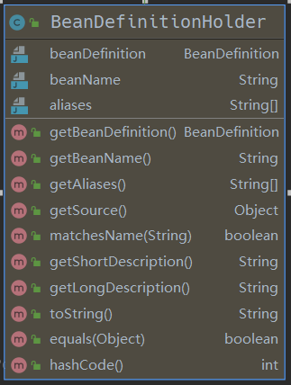
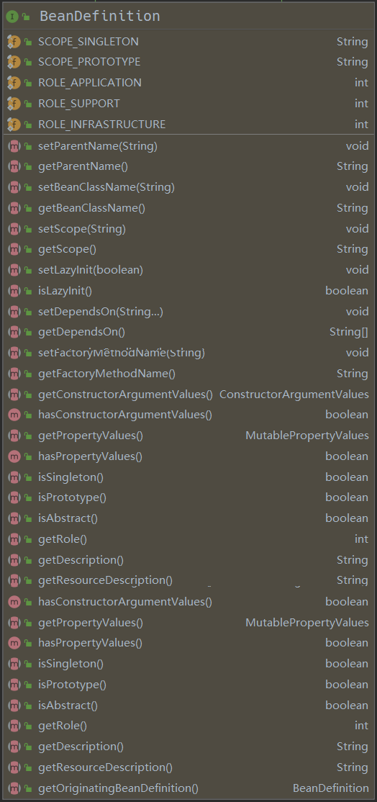

本文从源码层面简要介绍一下 Spring IoC 加载过程，以及这个过程遇到的重点方法，重点类。

## new AnnotationConfigApplicationContext()

一切的根源都要从 `new AnnotationConfigApplicationContext()` 方法开始，这是 Spring 启动的入口，先准备如下代码：
```java
public class ContextDemo {
    public static void main(String[] args) {

        AnnotationConfigApplicationContext context = new AnnotationConfigApplicationContext(Config.class);
        context.getBean("car",Car.class);
    }
}

@Configuration
@ComponentScan(basePackageClasses = {Car.class})
class Config{
    @Bean
    public User1 user(){
        return new User1(10, "dc1");
    }
}

@Component
class Car  {
    private int color;
    private String name;
}

class User1 {
    private int age;
    private String name;

}

```

进入 `new AnnotationConfigApplicationContext(Config.class);` 方法可见如下：
```java
public AnnotationConfigApplicationContext(Class<?>... annotatedClasses) {
    this();
    register(annotatedClasses);
    refresh();
}
```

再进入 `this()` 方法，如下：
```java
public AnnotationConfigApplicationContext() {
    this.reader = new AnnotatedBeanDefinitionReader(this);
    this.scanner = new ClassPathBeanDefinitionScanner(this);
}
```

发现调用的 `AnnotationConfigApplicationContext` 无参构造器， 再调用一个类的无参构造器时，会先调用父类的无参构造器， 同时发现这个类的父类构造器如下：
```java
public GenericApplicationContext() {
    this.beanFactory = new DefaultListableBeanFactory();
}
```
方法很简单，只是 new 了一个 `beanFactory`, 从名称来看，这个属性是 bean 工厂。现在只知道 `AnnotationConfigApplicationContext` 中有一个 `beanFactory` 的字段，这个字段是从父类继承来的。

父类的构造方法已经结束，接着往下看， `this.reader = new AnnotatedBeanDefinitionReader(this);`, `this.scanner = new ClassPathBeanDefinitionScanner(this); `。初始化 `reader` 和 `scanner`.
1. 找到 `reader` 属性，会发现它是 `AnnotatedBeanDefinitionReader` 类型。看一下这个类型的注释说明：
```java
/**
 * Convenient adapter for programmatic registration of annotated bean classes.
 * This is an alternative to {@link ClassPathBeanDefinitionScanner}, applying
 * the same resolution of annotations but for explicitly registered classes only.
 *
 * @author Juergen Hoeller
 * @author Chris Beams
 * @author Sam Brannen
 * @author Phillip Webb
 * @since 3.0
 * @see AnnotationConfigApplicationContext#register
 */
public class AnnotatedBeanDefinitionReader {....}
```

翻译一下：
>简便的适配器，用于注解 bean 类的注册。这是 ClassPathBeanDefinitionScanner 的替代方案，应用相同的注解，但仅适用于显式注册的类。

意思就是可以替代 `ClassPathBeanDefinitionScanner` 使用，但是它只能用于我们手动注册的类。

2. 找到`scanner` 属性，发现它正是 `ClassPathBeanDefinitionScanner` 类型。再看一下这个类的注释说明：
```java
/**
 * A bean definition scanner that detects bean candidates on the classpath,
 * registering corresponding bean definitions with a given registry ({@code BeanFactory}
 * or {@code ApplicationContext}).
 *
 * <p>Candidate classes are detected through configurable type filters. The
 * default filters include classes that are annotated with Spring's
 * {@link org.springframework.stereotype.Component @Component},
 * {@link org.springframework.stereotype.Repository @Repository},
 * {@link org.springframework.stereotype.Service @Service}, or
 * {@link org.springframework.stereotype.Controller @Controller} stereotype.
 *
 * <p>Also supports Java EE 6's {@link javax.annotation.ManagedBean} and
 * JSR-330's {@link javax.inject.Named} annotations, if available.
 *
 * @author Mark Fisher
 * @author Juergen Hoeller
 * @author Chris Beams
 * @since 2.5
 * @see AnnotationConfigApplicationContext#scan
 * @see org.springframework.stereotype.Component
 * @see org.springframework.stereotype.Repository
 * @see org.springframework.stereotype.Service
 * @see org.springframework.stereotype.Controller
 */
public class ClassPathBeanDefinitionScanner extends ClassPathScanningCandidateComponentProvider {...}

```
翻译一下：
> 一个 bean 定义扫描器，用于检测类路径上的 bean 的候选者，将相应的 bean 定义注册到给定的注册表（ BeanFactory 或 ApplicationContext ）。
> 通过可配置的类型过滤器检测候选类。默认过滤器包括使用 Spring 的@Component 、 @Repository 、 @Service 或@Controller 原型注释的类。
> 如果可用，还支持 Java EE 6 的 javax.annotation.ManagedBean 和 JSR-330 的 javax.inject.Named 注释。

它的意思说，把类路径中的所有类进行扫描。把类中配置的 bean 放到注册表， 注册表可能是 `BeanFactory` 或者 `ApplicationContext`

到这里可以知道， `AnnotationConfigApplicationContext` 除了继承父类的属性外，还初始化了 1. bean 定义读取器(reader) 2. bean 定义扫描器 (scanner)

下面看一下如何初始化的：

## 初始化 AnnotatedBeanDefinitionReader

一层层进入 `new AnnotatedBeanDefinitionReader(this)`, 最终找到方法:

```java
/**
    * Register all relevant annotation post processors in the given registry.
    * @param registry the registry to operate on
    * @param source the configuration source element (already extracted)
    * that this registration was triggered from. May be {@code null}.
    * @return a Set of BeanDefinitionHolders, containing all bean definitions
    * that have actually been registered by this call
    */
public static Set<BeanDefinitionHolder> registerAnnotationConfigProcessors(
        BeanDefinitionRegistry registry, @Nullable Object source) {

    DefaultListableBeanFactory beanFactory = unwrapDefaultListableBeanFactory(registry);
    if (beanFactory != null) {
        if (!(beanFactory.getDependencyComparator() instanceof AnnotationAwareOrderComparator)) {
            beanFactory.setDependencyComparator(AnnotationAwareOrderComparator.INSTANCE);
        }
        if (!(beanFactory.getAutowireCandidateResolver() instanceof ContextAnnotationAutowireCandidateResolver)) {
            beanFactory.setAutowireCandidateResolver(new ContextAnnotationAutowireCandidateResolver());
        }
    }

    Set<BeanDefinitionHolder> beanDefs = new LinkedHashSet<>(8);

    if (!registry.containsBeanDefinition(CONFIGURATION_ANNOTATION_PROCESSOR_BEAN_NAME)) {
        RootBeanDefinition def = new RootBeanDefinition(ConfigurationClassPostProcessor.class);
        def.setSource(source);
        beanDefs.add(registerPostProcessor(registry, def, CONFIGURATION_ANNOTATION_PROCESSOR_BEAN_NAME));
    }

    if (!registry.containsBeanDefinition(AUTOWIRED_ANNOTATION_PROCESSOR_BEAN_NAME)) {
        RootBeanDefinition def = new RootBeanDefinition(AutowiredAnnotationBeanPostProcessor.class);
        def.setSource(source);
        beanDefs.add(registerPostProcessor(registry, def, AUTOWIRED_ANNOTATION_PROCESSOR_BEAN_NAME));
    }
    // .... 省略很多代码
    return beanDefs;
}
```

先翻译一下这个方法的注释，以及参数和返回值:

**注释:**
> 在给定的注册表中注册所有相关的注解后处理器

**参数:**
1. 第一个参数是： `register`, 这个是从最开始传入的 `AnnotationConfigApplicationContext` 对象
2. 第二个参数是：`Object source` 这个传入的 null, 暂不关心它

**返回值:**

返回的是 `Set<BeanDefinitionHolder>` 集合，到这里先暂停一下，需要看 `BeanDefinitionHolder` 是什么，它里面都是什么属性，以及干嘛用的：

### BeanDefinition

进入这个类，查看它的注释和内部结构:
通过注释可以知道它是 **具有名称和别名的 BeanDefinition 的持有者**



由此可知道关键信息不在它，而是 `BeanDefinition`, `BeanDefinitionHolder` 只是 `BeanDefinition` 的持有者，只比 `BeanDefinition` 多了 `beanName` 以及别名属性。为的是可以有一个具体的名称来描述 `BeanDefinition`. 所以要接着看 `BeanDefinition`：

先看翻译下 `BeanDefinition` 的注释:
> BeanDefinition 描述了一个 bean 实例，它具有属性值、构造函数参数值以及具体实现提供的更多信息。 这只是一个最小接口：主要目的是允许像PropertyPlaceholderConfigurer这样的BeanFactoryPostProcessor内省和修改属性值和其他 bean 元数据。

它说 BeanDefinition **描述了** bean 的实例。也就是建筑图纸和建筑物的关系，BeanDefinition 会存有 某个bean 的字段，构造方法等等。可以根据 BeanDefinition 构造出应的bean。就如同可以通过建筑图纸还原出建筑物一样。

这里就非常巧妙了，一个系统中的有各式各样的bean，功能不同，类型不同。用一个相同的东西去描述，操作这些bean，是一个非常有利的转换。因为它们都是对象，是对象就会有方法，字段，类型。把这些方法，字段，类型再抽象，聚合就形成了 BeanDefinition. 

看一下 BeanDefinition 内部结构:



内容很多，都是设置，获取 某个对象类型信息的，挑几个看一下:

```java
public interface BeanDefinition extends AttributeAccessor, BeanMetadataElement {

    // 标准单例范围的范围标识符：“单例”。
	String SCOPE_SINGLETON = ConfigurableBeanFactory.SCOPE_SINGLETON;
    // 标准原型范围的范围标识符：“原型”。
  	String SCOPE_PROTOTYPE = ConfigurableBeanFactory.SCOPE_PROTOTYPE;
    // ...
    // 指定此 bean 定义的 bean 类名。
    // 类名可以在 bean 工厂后期处理期间修改，通常用它的解析变体替换原始类名。
	void setBeanClassName(@Nullable String beanClassName);

    // 覆盖此 bean 的目标范围，指定一个新的范围名称
    void setScope(@Nullable String scope);

    //设置这个 bean 是否应该被延迟初始化。
    //如果为false ，则 bean 将在启动时由执行单例预初始化的 bean 工厂实例化。
	void setLazyInit(boolean lazyInit);

    //返回此 bean 是否应该延迟初始化，即在启动时不急切地实例化。仅适用于单例 bean。
	boolean isLazyInit();
    // ....
}
```

好了，对 BeanDefinition 的了解暂时到此。不再深入了。继续上面的` registerAnnotationConfigProcessors`方法:

第一行： `DefaultListableBeanFactory beanFactory = unwrapDefaultListableBeanFactory(registry); `

进入方法后，发现没有做太多的是事情，就是把注册器的 beanFactory 包装一下，再返回。这里的 register 就是最开始 main 方法中的 `AnnotationConfigApplicationContext` 对象。

接着看下面：

```java
if (beanFactory != null) {
    if (!(beanFactory.getDependencyComparator() instanceof AnnotationAwareOrderComparator)) {
        beanFactory.setDependencyComparator(AnnotationAwareOrderComparator.INSTANCE);
    }
    if (!(beanFactory.getAutowireCandidateResolver() instanceof ContextAnnotationAutowireCandidateResolver)) {
        beanFactory.setAutowireCandidateResolver(new ContextAnnotationAutowireCandidateResolver());
    }
}
```
对 beanFactory 添加 `依赖比较器` 和 `Autowire 候选解析器` 暂时不知道设么作用，跳过。继续：

```java
Set<BeanDefinitionHolder> beanDefs = new LinkedHashSet<>(8);

if (!registry.containsBeanDefinition(CONFIGURATION_ANNOTATION_PROCESSOR_BEAN_NAME)) {
    RootBeanDefinition def = new RootBeanDefinition(ConfigurationClassPostProcessor.class);
    def.setSource(source);
    beanDefs.add(registerPostProcessor(registry, def, CONFIGURATION_ANNOTATION_PROCESSOR_BEAN_NAME));
}
```

先构造了一个 `BeanDefinitionHolder` 的集合，也就是这个方法要返回的集合，if 语句中， 判断注册器是否包含某个 BeanDefinition, 进去看一下怎么判断的：

```java
   // 在 DefaultListableBeanFactory 类下面
	@Override
	public boolean containsBeanDefinition(String beanName) {
		Assert.notNull(beanName, "Bean name must not be null");
		return this.beanDefinitionMap.containsKey(beanName);
	}
```

最终会进入 `DefaultListableBeanFactory` 类中的 `containsBeanDefinition` 方法，也就是说这个方法不是注册器提供的，而是它的 beanFactory 属性提供的。并且在 beanFactory 中有一个 `Map<String, BeanDefinition> beanDefinitionMap`；通过名字就可以知道，存放的是 BeanDefinition, 判断注册器是否包已经包含某个 BeanDefinition,就是看这个 map 是否包含相应的key了。这个功能是由它所辖的 beanFactory 实现的。这也比较符合常理： bean 工厂去管理 bean定义。到这里就可以猜测出注册 bean时,也是放入这个Map, 取出 bean 时，也是从这个 Map 中获取。

再看一下传入的 key 是什么:
`CONFIGURATION_ANNOTATION_PROCESSOR_BEAN_NAME` 是写死在源码中的常量: `org.springframework.context.annotation.internalConfigurationAnnotationProcessor` 某个类的全名称。继续向下看

```java
RootBeanDefinition def = new RootBeanDefinition(ConfigurationClassPostProcessor.class);
def.setSource(source);
beanDefs.add(registerPostProcessor(registry, def, CONFIGURATION_ANNOTATION_PROCESSOR_BEAN_NAME));
```

将 `ConfigurationClassPostProcessor.class` 作为参数，构造了一个 RootBeanDefinition , 查看类关系，发现 RootBeanDefinition 是 BeanDefinition 的一个实现类。这里只需明白把一个 class 转成了 BeanDefinition就行了。至于怎么转的，可以自行查看

`def.setSource(source)` 刚刚说过 source 参数是 null, 先跳过。不深究它是什么意思。


再看 `registerPostProcessor(registry, def, CONFIGURATION_ANNOTATION_PROCESSOR_BEAN_NAME)` 这一行，方法名是 `注册后置处理器`， 把注册器，BeanDefinition, 和 类全名作为参数传入方法，再一路跟踪下去发现最后还是进入了 DefaultListableBeanFactory 类。执行的是 `registerBeanDefinition` 方法:

```java
@Override
public void registerBeanDefinition(String beanName, BeanDefinition beanDefinition)
        throws BeanDefinitionStoreException {

    Assert.hasText(beanName, "Bean name must not be empty");
    Assert.notNull(beanDefinition, "BeanDefinition must not be null");

    // 省略很多校验性代码
    BeanDefinition existingDefinition = this.beanDefinitionMap.get(beanName);
    if (existingDefinition != null) {
        // 省略很多校验性代码
        this.beanDefinitionMap.put(beanName, beanDefinition);
    }
    else {
        // 检查这个工厂的bean创建阶段是否已经开始，即在此期间是否有任何bean被标记为已创建。
        if (hasBeanCreationStarted()) {
            //... 省略暂不会执行的代码
        }
        else {
            // Still in startup registration phase: 仍处于启动注册阶段
            // beanName 作为key, beanDefinition 是 value, 这些都是参数传入的
            this.beanDefinitionMap.put(beanName, beanDefinition);
            // bean 工厂还维护了所有的 beanName，有序的
            this.beanDefinitionNames.add(beanName);
            // 不懂，先跳过
            this.manualSingletonNames.remove(beanName);
        }
            // 不懂。先跳过
        this.frozenBeanDefinitionNames = null;
    }
    // 省略后置代码, 先跳过
}
```

从上面代码可知，注册 BeanDefinition 也是有注册器的 beanFactory 实现的。还记得 `AnnotatedBeanDefinitionReader` 这个类的注释说道：`用于注解 bean 类的编程注册。这是ClassPathBeanDefinitionScanner的替代方案，应用相同的注解，但仅适用于显式注册的类`. **显示注册** 就是手动把事先定义好的类添加到 beanDefinitionMap。 那么猜测一下 `ClassPathBeanDefinitionScanner` 是不是自动扫描我们系统自定义的类，然后把我们自定义类自动添加到 beanDefinitionMap 中的。比如被 @Service @Controller @Bean 修饰的类。我们使用Spring时，可没有把这些类向bean工厂手动注册

这个方法的后面还注册了很多其他内置的类。就不一一罗列了。之后这个方法就结束了。

总结一下 `this.reader = new AnnotatedBeanDefinitionReader(this);` 都干了哪些事情:
1. new 一个 `AnnotatedBeanDefinitionReader` Bean 定义读取类
2. 在 new 的过程中，把 spring 内置的各种类注册到 beanDefinitionMap 中。

从这个方法中我们可以知道：
1. AnnotationConfigApplicationContext 中有 AnnotatedBeanDefinitionReader 类型的属性
2. BeanDefinition 是用来描述各种bean的类，类似建筑图纸和建筑物的关系
3. BeanDefinitionHolder 只是 BeanDefinition 的持有者，相当于为 BeanDefinition 增加了名称和别名 
4. AnnotationConfigApplicationContext 中有 beanFactory, beanDefinition 的注册都是由 beanFactory 完成的。
5. BeanFactory 中有 beanDefinitionMap, 用来存放 beanDefinition.
6. BeanFactory 中还有 beanDefinitionNames, 存放所有的 beanDefinition 的名称


目前为止我们只知道向注册器中注册了一堆内置的类。还没有看到这些类的用法， 大胆猜测一下，这些内置类是一些创世纪的类，后面用到的类扫描，属性注入，切面等，可能都是由这些类实现的。


## 初始化 ClassPathBeanDefinitionScanner

## 注册配置类

## refresh 方法

### 
