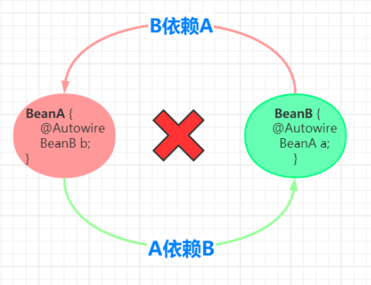
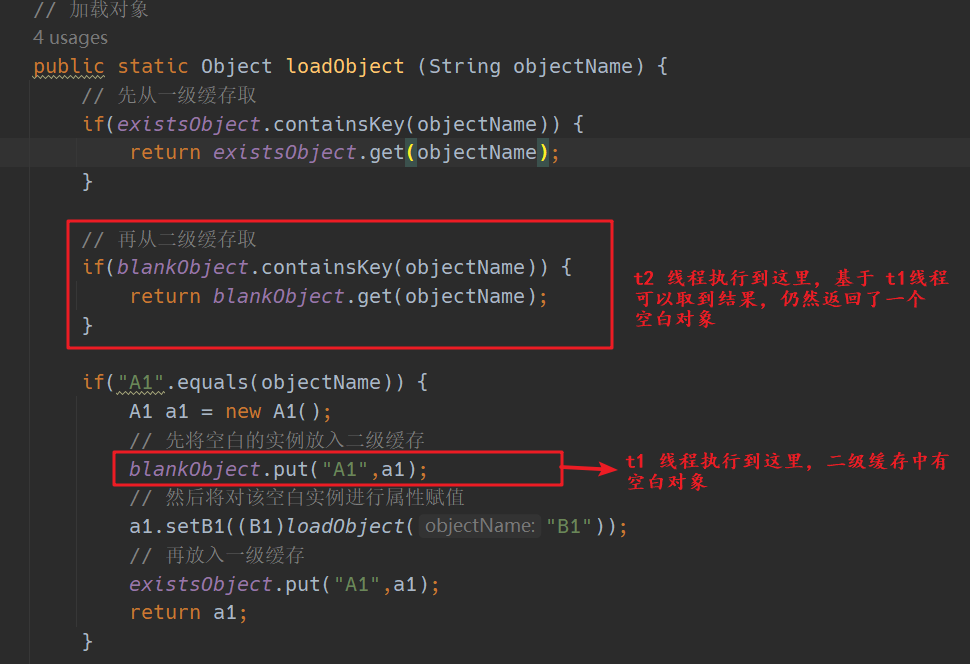

# 什么是循环依赖

A 类中有一个属性 B ，也就是说 A 依赖 B，同时 B 类中有一个属性 A,  也就是说 B 依赖 A. 他们之间的依赖关系形成了环。就是我们说的循环依赖，如下图：


# 循环依赖示例
```java
public class CircularDependenciesDemo {
    public static void main(String[] args) {
        new A1();
    }
}

class A1 {
    private B1 b1;
    public A1() {
        this.b1 = new B1();
    }
}

class B1 {

    private A1 a1;
    public B1() {
        this.a1 = new A1();
    }
}

```

**结果：**

```txt
Exception in thread "main" java.lang.StackOverflowError
	at io.dc.B1.<init>(CircularDependenciesDemo.java:23)
	at io.dc.A1.<init>(CircularDependenciesDemo.java:16)
	at io.dc.B1.<init>(CircularDependenciesDemo.java:24)
```

如上所示，发生 栈溢出错误。下面我们试着解决这种循环依赖

# 解决循环依赖

```java
public class CircularDependenciesDemo {

    // 实例缓存池
    public static Map<String, Object> existsObject = new HashMap<>();

    public static Object loadObject (String objectName) {
        if(existsObject.containsKey(objectName)) {
            return existsObject.get(objectName);
        }

        if("A1".equals(objectName)) {
            A1 a1 = new A1();
            // 先将空白的实例放入缓存 
            existsObject.put("A1",a1);
            // 然后将对该空白实例进行属性赋值
            a1.setB1((B1)loadObject("B1"));
            return a1;
        }

        if ("B1".equals(objectName)) {
            B1 b1 = new B1();
            existsObject.put("B1",b1);
            b1.setA1((A1)loadObject("A1"));
            return b1;
        }
        return null;
    }

    public static void main(String[] args) {
        A1 a1 = (A1)loadObject("A1");
        a1.getB1().sayHello();
    }
}

class A1 {
    private B1 b1;

    public B1 getB1() {
        return b1;
    }

    public void setB1(B1 b1) {
        this.b1 = b1;
    }

}

class B1 {

    private A1 a1;

    public A1 getA1() {
        return a1;
    }

    public void setA1(A1 a1) {
        this.a1 = a1;
    }

    public void sayHello(){
        System.out.println("我是 B1 , 你好");
    }
}

```

**结果：**

```txt
我是 B1 , 你好
```

本来由构造方法来构造 A1 中的 B1. 现在分成两步：
1. 先调用无参构造器生成一个空白实例
2. 再调用 set 方法，为空白实例赋值

为了解决循环依赖，设置了一个实例缓存池，existsObject. 用来存放已经生成的实例。但是这个实例池会存放空白对象的状态。在多线程的情况下，会取到一个空白实例。也就是对象中的字段都是 null, 引发程序错误。我们可以再添加一层二级缓存，二级缓存中存放空白实例。一级缓存中只放完整实例。

## 纯净的缓存

```java
public class CircularDependenciesDemo {

    // 一级缓存，只存放完整的对象
    public static Map<String, Object> existsObject = new HashMap<>();

    // 二级缓存，包含空白的对象
    public static Map<String, Object> blankObject = new HashMap<>();

    // 加载对象
    public static Object loadObject (String objectName) {
        // 先从一级缓存取
        if(existsObject.containsKey(objectName)) {
            return existsObject.get(objectName);
        }

        // 再从二级缓存取
        if(blankObject.containsKey(objectName)) {
            return blankObject.get(objectName);
        }

        if("A1".equals(objectName)) {
            A1 a1 = new A1();
            // 先将空白的实例放入二级缓存
            blankObject.put("A1",a1);
            // 然后将对该空白实例进行属性赋值
            a1.setB1((B1)loadObject("B1"));
            // 再放入一级缓存
            existsObject.put("A1",a1);
            return a1;
        }

        if ("B1".equals(objectName)) {
            B1 b1 = new B1();
            blankObject.put("B1",b1);
            b1.setA1((A1)loadObject("A1"));
            existsObject.put("B1",b1);
            return b1;
        }
        return null;
    }

    public static void main(String[] args) {

        A1 a1 = (A1)loadObject("A1");
        a1.getB1().sayHello();

        B1 b1 = (B1) loadObject("B1");
        b1.getA1().sayHello();
    }
}

class A1 {
    private B1 b1;

    public B1 getB1() {
        return b1;
    }

    public void setB1(B1 b1) {
        this.b1 = b1;
    }

    public void sayHello(){
        System.out.println("我是 A1 , 你好");
    }

}

class B1 {

    private A1 a1;

    public A1 getA1() {
        return a1;
    }

    public void setA1(A1 a1) {
        this.a1 = a1;
    }

    public void sayHello(){
        System.out.println("我是 B1 , 你好");
    }
}

```

通过添加二级缓存，把空白对象和完整对象剥离了。当从一级缓存中取实例时，要么拿到的是完整对象，要么拿到的是 null, 而不会获取到空白的对象，引发错误。

但是上面的代码是有问题的，当实例未初始化完，并且在在多线程的情况下,仍然会取到不完整对象，如下:




那么单单只加二级缓存并不能解决这个并发问题，同时还要加锁：

```java
public static Object loadObject (String objectName) {
    // 先从一级缓存取,因为可以确保一级缓存中只有完整的对象
    if(existsObject.containsKey(objectName)) {
        return existsObject.get(objectName);
    }

    synchronized (existsObject) {

        // 第二次判断一级缓存是否有,因为有可能在等待锁的时候，已经有其他线程把实例放入一级缓存中
        if(existsObject.containsKey(objectName)) {
            return existsObject.get(objectName);
        }

        // 再从二级缓存取
        if(blankObject.containsKey(objectName)) {
            return blankObject.get(objectName);
        }

        if("A1".equals(objectName)) {
            A1 a1 = new A1();
            // 先将空白的实例放入二级缓存
            blankObject.put("A1",a1);
            // 然后将对该空白实例进行属性赋值
            a1.setB1((B1)loadObject("B1"));
            // 再放入一级缓存
            existsObject.put("A1",a1);
            // 然后移除二级缓存中的 A1
            blankObject.remove("A1");
            return a1;
        }

        if ("B1".equals(objectName)) {
            B1 b1 = new B1();
            blankObject.put("B1",b1);
            b1.setA1((A1)loadObject("A1"));
            existsObject.put("B1",b1);
            blankObject.remove("B1");
            return b1;
        }
    }
    return null;
}
```

到此我们才完整的解决了循环依赖，并且保证不会取到不完整的实例.


其实 spring 也是这样来解决bean循环依赖的，不过 spring 还添加动态代理bean的功能，为了解耦，还添加了三级缓存，保证代码整洁，优雅。

# spring 是如何解决循环依赖的

由于 spring 在处理循环依赖时考虑很多其他功能，代码非常复杂，为了便于展示，这里只模仿核心功能：

详细说明已在注释中

```java
// 主类
public class MainStart {

    // 本应该使用 ConcurrentHashMap 类型，但是为了演示效果，确保先实例化A，使用了有序HashMap
    private static Map<String, BeanDefinition> beanDefinitionMap = new LinkedHashMap<>(256);

    /**
     * 读取bean定义，当然在spring中肯定是根据配置 动态扫描注册
     */
    public static void loadBeanDefinitions() {
        RootBeanDefinition aBeanDefinition=new RootBeanDefinition(InstanceA.class);
        RootBeanDefinition bBeanDefinition=new RootBeanDefinition(InstanceB.class);
        beanDefinitionMap.put("instanceA",aBeanDefinition);
        beanDefinitionMap.put("instanceB",bBeanDefinition);
    }

    public static void main(String[] args) throws Exception {
        // 加载了BeanDefinition
        loadBeanDefinitions();

        // 循环创建Bean
        for (String key : beanDefinitionMap.keySet()){
            // 先创建A
            getBean(key);
        }
        IApi instanceA = (IApi) getBean("instanceA");
        instanceA.say();
    }

    // 一级缓存
    public static Map<String,Object> singletonObjects=new ConcurrentHashMap<>();


    // 二级缓存： 为了将 成熟Bean和纯净Bean分离，避免读取到不完整得Bean
    public static Map<String,Object> earlySingletonObjects=new ConcurrentHashMap<>();

    // 三级缓存
    public static Map<String,ObjectFactory> singletonFactories=new ConcurrentHashMap<>();

    // 循环依赖标识
    public  static  Set<String> singletonsCurrennlyInCreation=new HashSet<>();


    // 假设A 使用了Aop @PointCut("execution(* *..InstanceA.*(..))")   要给A创建动态代理
    // 获取Bean
    public  static Object getBean(String beanName) throws Exception {
        Object singleton = getSingleton(beanName);
        if(singleton!=null){
            return singleton;
        }
        Object instanceBean = null;
        synchronized (singletonObjects) {

            // 第二次判断
            if(singletonObjects.containsKey(beanName)) {
                return singletonObjects.get(beanName);
            }
            // 标记正在创建,而不是用二级缓存是否包含 beanName 来判断
            if(!singletonsCurrennlyInCreation.contains(beanName)){
                singletonsCurrennlyInCreation.add(beanName);
            }

            // 实例化
            RootBeanDefinition beanDefinition = (RootBeanDefinition) beanDefinitionMap.get(beanName);
            // 获取 class 对象
            Class<?> beanClass = beanDefinition.getBeanClass();
             // 通过无参构造函数,构造一个空白对象
            instanceBean = beanClass.newInstance();

            // 创建动态代理
            // 只在循环依赖的情况下在实例化后创建proxy   判断当前是不是循环依赖
            Object finalInstanceBean = instanceBean;
            // 这是一个三级缓存，三级缓存放的不是 bean, 而是一个可以创建动态代理bean的函数。（lambda 表达式。关键词： 函数接口）
            // 为什么不直接创建一个代理对象放入二级缓存中，而是先把 lambda 表达式放入三级缓存，
            // 而后面再调用这个表达式去生成代理对象，然后放入二级缓存（getSingleton 方法）
            // 我认为是是为了逻辑上的统一，getSingleton方法负责创建或返回对象，而不是在这里。

            singletonFactories.put(beanName, () -> new JdkProxyBeanPostProcessor().getEarlyBeanReference(finalInstanceBean,beanName));

            // 属性赋值
            Field[] declaredFields = beanClass.getDeclaredFields();
            for (Field declaredField : declaredFields) {
                Autowired annotation = declaredField.getAnnotation(Autowired.class);
                // 说明属性上面有Autowired
                if(annotation!=null){
                    declaredField.setAccessible(true);
                    String name = declaredField.getName();
                    Object fileObject= getBean(name);
                    declaredField.set(instanceBean,fileObject);
                }

            }

            // 由于递归完后A 还是原实例，， 所以要从二级缓存中拿到proxy 。
            if(earlySingletonObjects.containsKey(beanName)){
                instanceBean=earlySingletonObjects.get(beanName);
            }

            // 添加到一级缓存   A
            singletonObjects.put(beanName,instanceBean);

            // remove 二级缓存和三级缓存
            earlySingletonObjects.remove(beanName);
            singletonFactories.remove(beanName);

        }
        return instanceBean;
    }


    public  static Object getSingleton(String beanName){
        // 先从一级缓存中拿
        Object bean = singletonObjects.get(beanName);
        synchronized (singletonObjects) {

            // 说明是循环依赖
            if(bean==null && singletonsCurrennlyInCreation.contains(beanName)){
                bean=earlySingletonObjects.get(beanName);
                // 如果二级缓存没有就从三级缓存中拿
                if(bean==null) {
                    // 从三级缓存中拿
                    ObjectFactory factory = singletonFactories.get(beanName);
                    if (factory != null) {
                        // 拿到动态代理
                        // 为什么需要动态代理对象，而不是我们自己原来的bean.
                        // 因为原始bean的代理对象扩展了功能，同时还和原始 bean 有相同的类型。因为它们继承了同一个接口
                        // 或者 代理对象继承了原始bean. (详情可以搜索 JDK动态代理,cglib 代理)
                        bean=factory.getObject();
                        // 将代理对象放入二级缓存，这个代理对象仍然是空白对象
                        // 所以这个方法如果不加锁仍然可能会返回一个空白对象
                        earlySingletonObjects.put(beanName, bean);
                    }
                }
            }
        }
        return bean;
    }

}


//  InstanceA 接口， 为了动态代理使用
public interface IApi {

	void say();
}

// InstanceA 
@Component
public class InstanceA implements IApi {

    @Autowired
    private InstanceB instanceB;

    public InstanceB getInstanceB() {
        return instanceB;
    }

    public void setInstanceB(InstanceB instanceB) {
        this.instanceB = instanceB;
    }

    public InstanceA(InstanceB instanceB) {
        this.instanceB = instanceB;
    }


    public InstanceA() {
        System.out.println("InstanceA实例化");
    }

	@Override
	public void say() {
		System.out.println("I'm A");
	}
}


// InstanceB
@Component
public class InstanceB  {


    @Autowired
    private InstanceA instanceA;


    public InstanceA getInstanceA() {
        return instanceA;
    }


    public void setInstanceA(InstanceA instanceA) {
        this.instanceA = instanceA;
    }

    public InstanceB(InstanceA instanceA) {
        this.instanceA = instanceA;
    }


    public InstanceB() {
        System.out.println("InstanceB实例化");
    }

}


//  JDK 动态代理使用
public class JdkDynimcProxy implements InvocationHandler {

	private Object target;

	public JdkDynimcProxy(Object target) {
		this.target = target;
	}

	public <T> T getProxy() {
		return (T) Proxy.newProxyInstance(target.getClass().getClassLoader(), target.getClass().getInterfaces(), this);
	}

	@Override
	public Object invoke(Object proxy, Method method, Object[] args) throws Throwable {
		System.out.println("测试");
		return method.invoke(target,args);
	}
}


// 
@Component
public class JdkProxyBeanPostProcessor implements SmartInstantiationAwareBeanPostProcessor {

	public Object getEarlyBeanReference(Object bean, String beanName) throws BeansException {

		// 假设:A 被切点命中 需要创建代理  @PointCut("execution(* *..InstanceA.*(..))")
		if(bean instanceof InstanceA) {
			JdkDynimcProxy jdkDynimcProxy = new JdkDynimcProxy(bean);
			return  jdkDynimcProxy.getProxy();
		}
		return bean;
	}
}
```

## 为什么需要三级缓存，而不是两级缓存

我认为两级缓存完全可以解决循环依赖，完全可以先创建 bean的动态代理放入二级缓存中，而不是在 getSingleton 方法中延迟调用三级缓存中的 lambda 表达式再去生成动态代理。

我认为三级缓存作用之一是为了代码解耦，逻辑统一。


# spring 如何避免拿到不完整的bean

1. spring 容器加载完成后，因为解决了循环依赖不会存在不完整的bean，
2. 在 spring 容器加载过程中，通过加锁的方式可以避免取到不完整的bean

# spring 没有解决的循环依赖
1. 没有解决构造函数的循环依赖
    所以不建议构造函数注入方式
2. 没有解决多例下的循环依赖
    好像也无法解决，没有必要