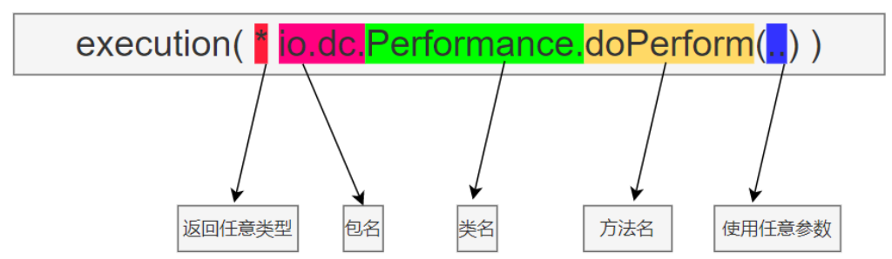
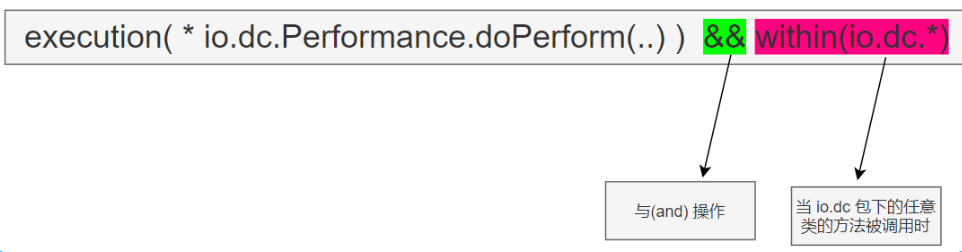
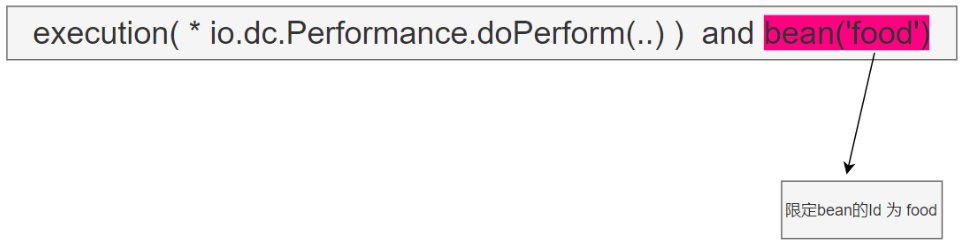
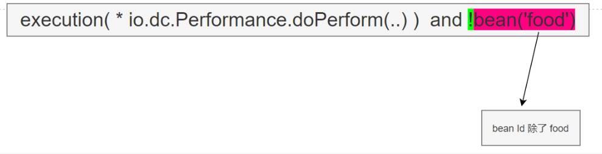

---
title: 面向切面的Spring
date: 2022-11-27 15:06:05
tags: [spring]
---

## 横切关注点

- 散播应用中多处的功能被称为横切关注点
    - 安全就是一个关注点，每个方法或者类都需要注重安全
    - 方法参数日志记录也是一个关注点
    - 以及事务管理

- 横切关注点从概念上讲是与业务分离的，但往往会直接嵌入到业务中
    - 多个类使用到相同的功能。最常见到的就是继承或委托
    - 为什么不使用继承
        > 如果整个应用都使用相同的基类，会导致脆弱的对象体系

    - 为什么不使用委托
        > 可能需要对委托对象进行复杂的调用

- 把横切关注点与业务分离是面向切面编程（AOP）要解决的重要问题

## 切面

1. 横切点可以被模块化为特殊的类，这个类被称为切面
2. 取代继承和委托的另一种方案
3. 一处定义功能，生声明何时何地使用

## 术语

AOP 已经形成了自己的术语，常见的有 1. 通知 2. 切点 3. 连接点

### 通知 Advice

- 切面要完成的工作被称为通知，它定义了切面要做什么，何时使用
-  何时使用

	- 前置通知 Before ·

		- 在目标方法被调用之前调用通知功能

	- 后置通知 After

		- 在目标方法完成之后调用通知，不会关心方法输出是什么，也不会关心是否执行成功

	- 返回通知 After-returning

		-  在目标方法成功执行之后调用通知

	- 异常通知 After-throwing

		- 在目标方法抛出异常后调用通知

	- 环绕通知 Around

		- 包裹被通知的方法：目标方法调用之前之后都要执行

### 连接点 JoinPoint

- 触发通知的时机叫做连接点

	- 调用方法时
	- 抛出异常时
	- 修改字段时
	- 等

### 切点 PointCut

- 要执行通知的地点，指明了哪些方法要执行切面。
- 通常使用明确的类或方法名称或正则表达式匹配类或方法名指定切点

### 切面 Aspect

- 切面是通知和切点的结合，它是什么，何时 何地完成其功能

### 引入 Introduction

- 可以在现有的类中添加新的方法和属性

### 织入 Weaving

- 把切面应用到目标对象并创建新的代理对象的过程。
- 织入可以在多个时期发生：

	- 编译期

		- 切面在目标类编译期被织入，需要特殊的编译器

	- 类加载期

		- 切面在目标类加载到JVM时被织入，需要特殊的类加载器。他可以在目标类被引入到应用之前增强该目标类的字节码

	- 运行期

		- 切面在应用运行的某时刻被织入。一般情况下，在织入切面时，AOP容器会为目标对象动态的创建一个代理对象，SpringAOP就是以这种方式织入切面的

## Spring对AOP的支持

### Spring 提供了4种类型的AOP支持

- 基于代理的经典AOP

	- 不用，过于笨重和复杂

- 纯POJO切面

	- 不怎么用，需要XML配置

- @AspectJ注解驱动切面

	- 用的多

- 注入式 AspectJ切面，适用Spring各种版本

### Spring 只支持方法级别的连接点

- 因为Spring 基于动态代理实现的AOP
- Spring 不支持对字段和构造器连接点

	- 不可以拦截对象字段的修改
	- 无法在bean创建时拦截

- AspectJ 和 JBoss 除了方法切点，还支持字段和构造器

## 编写切面

### SpringAOP 仅支持部分Aspect指示器

- Spring AOP 支持的指示器：
	- arg() 
	    限制连接点的匹配参数为为指定类型的执行方法

	- @args()
		限制连接点匹配参数由指定注解标注的执行方法

	- execution()
		用于匹配是连接点的执行方法

	- this()
		限制连接点匹配 AOP代理的bean引用为指定类型的类

	- target
		限制连接点匹配目标对象为指定类型的类

	- @target()
		限制连接点匹配特定的执行对象，这些对象对应的类要有指定类型的注解

	- within()
		限制连接点匹配指定的类型

	- @within()
		 限制连接点匹配注解所标注的类型

	- @annotation
		 限定匹配 带有指定注解的连接点
    - bean()
         限定beanId

当在Spring 中使用其他指示器时，会抛出异常
只有 execution 指示器是实际执行匹配的，其他都是限制匹配的

### 切入点的编写规则

- 示例：

- 与 within() 配合

- 在切点中选择bean

