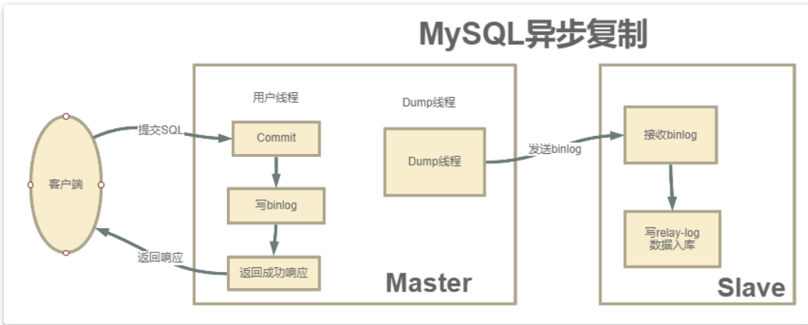
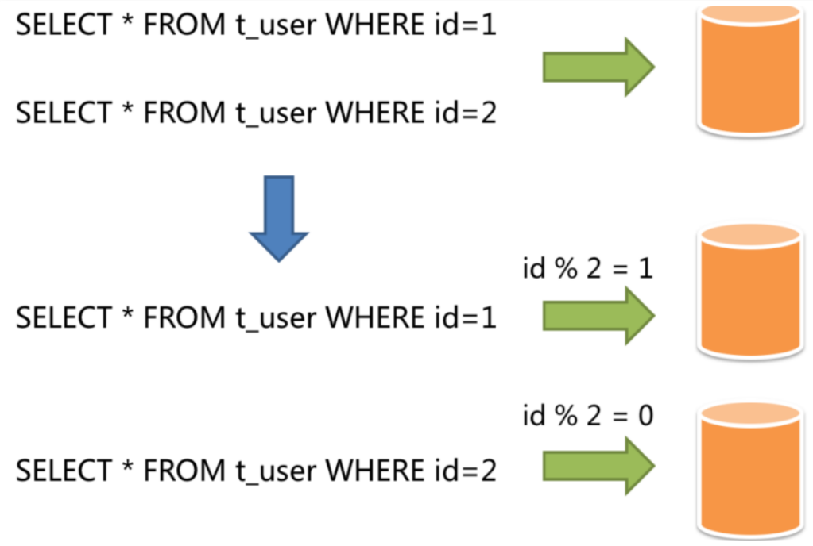

MySQL 是实际生产中最常用的数据库，生产环境数据量极为庞大，对性能和安全要求很高，单机的 MySQL 是远远达不到的，所以必须搭建一个主从复制架构，同时可以基于一些工具实现高可用架构，在此基础上，基于一些中间件实现读写分离架构，如果数据量非常庞大，还要考虑分库分表。

本文不讲解 MySQL 数据库的安装，和高可用架构搭建的具体细节，只为探索生产环境常用的高可用方案，和各个方案的优劣。
## 主从集群
主从集群可以缓解 MySQL 的数据存储以及访问的压力，具备一下几个优点

### 1. 数据安全

为了给主服务增加一个数据备份，可以搭建主从架构，基于此架构也可以搭建互主架构

### 2.  读写分离

对于大部分系统来说，都是读多写少的，当主库的访问压力较大时，可以将数据的读请求交给从库承担，主库只负责数据的写入。 可以大大缓解主库的压力。

**【注意】**
MySQL 的主从架构只是实现读写分离的基础。要实现读写分离还需要一些中间件来实现，如 ShardingSphere

### 3. 故障转移-高可用

当 MySQL 主服务宕机后，可以由一台从服务切换成主服务。

对于高可用架构，主从架构也只是实现故障转移的基础，要实现自动主从切换，还需要一些其他中间件实现，如： MMM, MHA， MGR

**【重要】**

在一般项目中，如果数据库的访问压力没有那么大，不一定必须要做读写分离，但是**主从架构，高可用架构是一定要搭建的**

## 主从同步的原理

MySQL 主从同步架构一般是通过 binlog 日志文件来进行的。
简要步骤如下：
1. 在主服务上打开 binlog 记录每一步的数据操作。
2. 从服务会有一个 IO 线程，负责和主服务建立 TCP 连接，请求主服务将 binlog 日志传送过来
3. 这时主库上会有一个 IO dump 线程，负责通过这个 TCP 连接把 binlog 日志传输给从库
4. 从服务的 IO 线程会把接收到的 binlog 日志数据写入自己的 **relay** 日志文件中，进行操作重演。达到还原数据的目的


> MySQL 的 binlog 日志不仅仅可以用于主从同步，还可以用于缓存数据同步的场景，如 Canal, 它可以模拟一个 slave 节点，向 MySQL 发起 binlog 同步，然后将数据落地到 redis，等其它组件中，实现数据的实时流转

**【注意】**
搭建主从同步有两个必要的要求：
1. 双方的 MySQL 版本必须一致。 至少要求主服务版本低于从服务
2. 两节点的时间需要同步

## 搭建主从集群
### 1. 配置 master 主服务器
修改 /etc/my.cnf, 主要是有两点
- 打开 binlog 日志
- 指定 serverId

示例配置如下：
```cnf
[mysqld]
server-id=47
#开启 binlog
log_bin=master-bin
log_bin-index=master-bin.index
skip-name-resolve
# 设置连接端口
port=3306
# 设置 mysql 的安装目录
basedir=/usr/local/mysql
# 设置 mysql 数据库的数据的存放目录
datadir=/usr/local/mysql/mysql-files
# 允许最大连接数
max_connections=200
# 允许连接失败的次数。
max_connect_errors=10
# 服务端使用的字符集默认为 UTF8
character-set-server=utf8
# 创建新表时将使用的默认存储引擎
default-storage-engine=INNODB
# 默认使用“mysql_native_password”插件认证
#mysql_native_password
default_authentication_plugin=mysql_native_password
```

**配置说明：**
- server-id：服务节点的唯一标识。需要给集群中的每个服务分配一个单独的 ID。
- log_bin：打开 Binlog 日志记录，并指定文件名。
- log_bin-index：Binlog 日志文件

### 2. 重启服务
`service mysqld restart`

### 3. 分配 replication slave 权限
```shell
#登录主数据库
mysql -u root -p
# 分配权限
GRANT REPLICATION SLAVE ON *.* TO 'root'@'%';
flush privileges;
#查看主节点同步状态：
show master status;
```

> 这个权限赋予从服务器与主服务器建立复制连接和接收主服务器上的数据更新的能力。具有"REPLICATION SLAVE"权限的从服务器可以连接到主服务器，并从主服务器接收数据更改事件（如插入、更新和删除操作）。这使得从服务器能够保持与主服务器上数据的实时同步。

**注意：**在实际生产中，一般不会直接使用 root 用户，而是会创建一个拥有全部权限的用户来负责主从同步


这个指令结果中的 
- File 是当前日志的 binlog 文件
- Position 是文件中的索引
- Binlog_DO_DB 标识 binlog 要记录的库，也就特殊指定哪些库中的更改需要在 binlog 中记录下来
- Binglog_Ignore_DB 表示不要把某个库的更改记录到 binlog 文件中。主从同步时，自然也不会同步这个库

> 开启 binlog 后，数据库中的所有操作都会被记录到 datadir 当中，以一组 轮询文件的方式循环记录。而指令查到的 File 和 Position 就是当前日志的 文件和位置。而在后面配置从服务时，就需要通过这个 File 和 Position 通知从服务从哪个地方开始记录 binLog。


### 4. 配置从服务
也是有几个关键的配置：
- server-id: 服务节点的唯一标识
- relay-log： 打开从服务的 bin-log 日志记录
- log-bin: 打开从服务的 binlog 日志记录

示例配置如下：
```cnf
[mysqld]
#主库和从库需要不一致
server-id=48
#打开 MySQL 中继日志
relay-log-index=slave-relay-bin.index
relay-log=slave-relay-bin
#打开从服务二进制日志
log-bin=mysql-bin
#使得更新的数据写进二进制日志中
log-slave-updates=1
# 设置 3306 端口
port=3306
# 设置 mysql 的安装目录
basedir=/usr/local/mysql
# 设置 mysql 数据库的数据的存放目录
datadir=/usr/local/mysql/mysql-files
# 允许最大连接数
max_connections=200
# 允许连接失败的次数。
max_connect_errors=10
# 服务端使用的字符集默认为 UTF8
character-set-server=utf8
# 创建新表时将使用的默认存储引擎
default-storage-engine=INNODB
# 默认使用“mysql_native_password”插件认证
#mysql_native_password
default_authentication_plugin=mysql_native_password
```

### 5. 重启从服务，设置与主节点的同步状态
```shell
#登录从服务
mysql -u root -p;
#设置同步主节点：
CHANGE MASTER TO
MASTER_HOST='192.168.232.128',
MASTER_PORT=3306,
MASTER_USER='root',
MASTER_PASSWORD='root',
MASTER_LOG_FILE='master-bin.000004',
MASTER_LOG_POS=156
GET_MASTER_PUBLIC_KEY=1;
#开启 slave
start slave;
#查看主从同步状态
show slave status;
# 或者用 show slave status \G; 这样查看比较简洁
```

**注意：** ，CHANGE MASTER 指令中需要指定的 MASTER_LOG_FILE 和 MASTER_LOG_POS 必须与主服务中查到的保持一致。并且后续如果要检查主从架构是否成功，也可以通过检查主服务与从服务之间的 File 和 Position 这两个属性是否一致来确定。


重点关注其中红色方框的两个属性，与主节点保持一致，就表示这个主从同步搭建是成功的。

从这个指令的结果能够看到，有很多 Replicate_开头的属性，这些属性指定了两个服务之间要同步哪些数据库、哪些表的配置。只是在我们这个示例中全都没有进行配置，就标识是全库进行同步。后面补充如何配置需要同步的库和表。

### 6. 主从集群测试

1. 在主新建表，在从查看是否存在
2. 在主新增表，在从查看是否存在
3. 在主新增数据，在从查看是否存在

### 7. 主从同步失败的检查与恢复
主从同步是有可能失败的，可以在从上执行命令： `show slave status \G`, 如果发现 Slave_SQL_Running=no 就表示同步失败了，这有可能是
- 在从库上进行了写操作，与不同过来的 SQL 冲突了，
- 也可能是从服务重启后，有事务回滚了。

如果是因为从服务事务回滚的原因，可以按照一下方式重启同步：
```shell
mysql> stop slave ;
mysql> set GLOBAL SQL_SLAVE_SKIP_COUNTER=1;
mysql> start slave ;
```

另一种解决方法： 重新记录主节点的 binlog 文件消息
```shell
mysql> stop slave ;
mysql> change master to .... # 省略，与前面开启同步方法一样
mysql> start slave ;
```
这种方案需要注意 binlog 文件和位置， 如果修改后和之前同步的接不上，就会丢失部分数据，不太常用

## 集群搭建扩展

### 1. 全库同步与部分同步
目前配置的主从同步是针对全库配置的，而实际环境中，一般是不需要进行全量同步的，只需要对一些特别重要的库进行同步。请看如下配置：

先在主库中，指定需要同步的库或表
```txt
#需要同步的数据库名
binlog-do-db=masterdemo
#只保留 7 天的二进制日志，以防磁盘被日志占满（可选）
expire-logs-days = 7
#不备份的数据库
binlog-ignore-db=information_schema
binlog-ignore-db=performation_schema
binlog-ignore-db=sys
```

然后在从库中配置与主库的对应关系：

```txt
#如果 salve 库名称与 master 库名相同，使用本配置
replicate-do-db = masterdemo
#如果 master 库名 [mastdemo] 与 salve 库名 [mastdemo01] 不同，使用以下配置 [需要做映射]
replicate-rewrite-db = masterdemo -> masterdemo01
#如果不是要全部同步 [默认全部同步]，则指定需要同步的表
replicate-wild-do-table=masterdemo01.t_dict
replicate-wild-do-table=masterdemo01.t_num
```

分别重启数据库后，在主库中执行 `show master status` 就可以看到 Binlog_Do_DB 和 Binlog_Ignore_DB 参数的作用了

### 2. 限制从库写数据

目前的架构数据的同步是单向的，只能主库到从库进行同步，反之不行。为了保证数据的一致性，不可以在从库上进行写操作。可以通过`set global read_only=1;` 指令限制用户写入数据，但是这个指令有两个需要注意的地方：

- read_only=1 设置的只读模式，不会影响从库的同步复制功能
- 只能限定普通用户修改数据，不会限制具有 super 权限的用户
- 如果想限制 super 用户，可以设置 `super_read_only=0`, 

如果为了分担主库的压力，可以在主库上只进行写数据，从库只读数据，这就是**读写分离** **【注意】** mysql 主从本身是无法提供读写分离服务的。需要有业务自己来实现，也就是下文提到的 ShardingSphere 的一个重要功能

### 3. 其他集群方式

#### 一主多从
当业务中使用了读写分离后，为了进一步提高整个集群的读能力，可以扩展出一主多从，同步为了避免发生**主从复制风暴**，减轻主节点同步数据的压力，可以扩展出多级的主从集群

#### 多主
为了提高整个集群的高可用能力，可以扩展出
- 多主的集群
- 互为主从集群
- 环形主从集群

互为主从集群搭建方式和主从一样，只是在主服务打开一个 slave 进程，并指向从节点的 binlog 当前文件地址和位置。也就在从节点做的配置，在主节点做一遍。

## GTID 同步集群

上面是基于 Binlog 日志记录点来搭建的集群，这也是最为传统的 MySQL 集群搭建方式，这种方式会因为日志偏移量的问题造成数据的不一致。在 MySQL5.6 版本，引入了 GTID 集群方式

GTID 的本质也是基于 Binlog 来实现的主从同步，只是他会基于一个全局的事务 ID 来表示同步事务，GTID 即全局事务 ID，全局唯一，并且递增，可以保证每一个主节点提交的事务在集群中生成一个唯一的事务 ID

在基于 GTID 集群中， 从服务器会告诉主服务器它已经执行了哪些事务，然后主库会把从库没有执行的事务发送到从库执行。并且保证同一个事务只指定的从库上执行一次，可以避免由于偏移量问题造成的数据不一致。

### 搭建方式

和上面的主从架构差不多，示例配置如下：
**主节点**
```txt
gtid_mode=on
enforce_gtid_consistency=on
log_bin=on
server_id={唯一值}
binlog_format=row
```
**从节点**
```txt
gtid_mode=on
enforce_gtid_consistency=on
log_slave_updates=1
server_id=单独设置一个
```

然后分别重启主从服务，就可以开启 GTID 同步复制

## 集群扩容
扩展相对比较简单，只需要增加一个 binlog 复制就行了，但是扩容一般发生在集群已经运行过一段时间，这时候扩展新的从节点，之前的的数据无法从 binlog 日志来恢复，需要增加一个数据复制的操作。

MySQL 的数据备份恢复相对比较简单，可以通过 SQL 语句完成。用到 mysqldump 工具，具体操作如下：
`mysqldump -u root -p --all-database > backup.sql`

通过这个指令，可以将整个数据库的数据导出成 backup.sql, 然后把这个 backup.sql 分发到新的 MySQL 服务器上，并执行下面的执行将数据导入到新的 MySQL 服务中。

`musql -u root -p < backup.sql`

这样新的数据库就有了历史数据，然后就可以按照上面的步骤配置从服务了。

## 半同步复制

到此，主从同步集群有一个重大隐患，会丢失数据，原因如下：

MySQL 主从集群默认采用异步复制架构，主服务执行用户提交的事务，写入 binlog 日志，然后直接返回客户端成功的响应。而 binlog 日志会有一个异步线程发送给从节点。



主节点执行事务时，不知道 binlog 是否同步成功了的。这时如果主节点宕机了，从节点还没有备份到新执行的 binlog，就可能丢失数据。

MySQL 的半同步机制可以保证数据的安全，半同步机制介于异步复制和全同步复制之间。主库执行完事务后，至少等待一个从库接收并写入 rely log 后，才返回客户端成功的表示。MySQL 会默认等待 10 秒，超过这个时间没有接收到从节点的 ack，就会降级为异步复制。

**优点：**
- 与异步相比，有效的提高数据安全性

**缺点：**
- 不保证事务在从库中是成功的
- 增加延迟，因为需要等待一个从库响应，如果从库出现问题，延迟时间会更长

### 半同步复制的搭建

半同步复制的搭建需要特定的模块，从 mysql 5.5 开始，都默认自带了这个模块，这个模块在 mysql 安装目录下/lib/plugin 目录下的 semisync_master.so 和 semisync_slave.so 两个文件中，需要在主节点安装 semisynv_master 在从节点安装 semisynv_slave。b 步骤如下：
1. 登录主服务，安装 semisynv_master 模块
    ```shell
    mysql> install plugin rpl_semi_sync_master soname 'semisync_master.so';
    Query OK, 0 rows affected (0.01 sec)
    mysql> show global variables like 'rpl_semi%';
    +-------------------------------------------+------------+
    | Variable_name                             | Value      |
    +-------------------------------------------+------------+
    | rpl_semi_sync_master_enabled              | OFF        |
    | rpl_semi_sync_master_timeout              | 10000      |
    | rpl_semi_sync_master_trace_level          | 32         |
    | rpl_semi_sync_master_wait_for_slave_count | 1          |
    | rpl_semi_sync_master_wait_no_slave        | ON         |
    | rpl_semi_sync_master_wait_point           | AFTER_SYNC |
    +-------------------------------------------+------------+
    6 rows in set, 1 warning (0.02 sec)
    mysql> set global rpl_semi_sync_master_enabled=ON;
    Query OK, 0 rows affected (0.00 sec)
    ```

    第一条指令 `install plugin rpl_semi_sync_master soname 'semisync_master.so';` 通过扩展库安装半同步复制模块。
    第二条指令 `show global variables like 'rpl_semi%';` `rpl_semi_sync_master_timeout` 就是主节点默认等待的时长， 这里是 10 秒，可以执行调整
    第三条指令 `set global rpl_semi_sync_master_enabled=ON;` 打开半同步复制的开关

    > 在第二行查看系统参数时，最后的一个参数 rpl_semi_sync_master_wait_point 其实表示一种半同步复制的方式。 半同步复制有两种方式，一种是我们现在看到的这种默认的 AFTER_SYNC 方式。这种方式下，主库把日志写入 binlog，并且复制给从库，然后开始等待从库的响应。从库返回成功后，主库再提交事务，接着给客户端返回一个成功响应。而另一种方式是叫做 AFTER_COMMIT 方式。他不是默认的。这种方式， 在主库写入 binlog 后，等待 binlog 复制到从库，主库就提交自己的本地事务，再等待从库返回给自己一个成功响应，然后主库再给客户端返回响应

2. 登录从服务，安装 semisync_slave 模块
   ```shell
    mysql> install plugin rpl_semi_sync_slave soname 'semisync_slave.so';
    Query OK, 0 rows affected (0.01 sec)
    mysql> show global variables like 'rpl_semi%';
    +---------------------------------+-------+
    | Variable_name                   | Value |
    +---------------------------------+-------+
    | rpl_semi_sync_slave_enabled     | OFF   |
    | rpl_semi_sync_slave_trace_level | 32    |
    +---------------------------------+-------+
    2 rows in set, 1 warning (0.01 sec)
    mysql> set global rpl_semi_sync_slave_enabled = on;
    Query OK, 0 rows affected (0.00 sec)
    mysql> show global variables like 'rpl_semi%';
    +---------------------------------+-------+
    | Variable_name                   | Value |
    +---------------------------------+-------+
    | rpl_semi_sync_slave_enabled     | ON    |
    | rpl_semi_sync_slave_trace_level | 32    |
    +---------------------------------+-------+
    2 rows in set, 1 warning (0.00 sec)
    mysql> stop slave;
    Query OK, 0 rows affected (0.01 sec)
    mysql> start slave;
    Query OK, 0 rows affected (0.01 sec)
   ```
   安装过程基本差不多，但是要重启 slave 服务
   

## 主从架构的数据延迟问题

由于主节点的数据都是由业务多线程写入的，而从服务是单个线程慢慢拉取 binlog, 效率不一样。解决问题的根本就是让从节点多线程并行复制 binlog。

MySQL 5.7 版本以后就已经支持并行复制了，在从服务上设置 `slave_parallel_workers`的值 > 0， 然后设置 `slave_parallel_type`为 `LOGICAL_CLOCK` 就可以了。

## MYSQL 高可用方案

目前搭建的主从架构不会在主节点宕机后，从节点自动变成主节点提供服务。所以不具备高可用

MySQL 自身没有提供这样的配置，需要借助一些第三方工具，常见的 MySQL 高可用集群方案有：
- MMM
- MHA
- MGR
它们都有一些共同的点：
- 对主从集群中的主节点监控
- 自动对主节点迁移，通过 VIP（虚拟 IP)
- 重新配置集群中其他的 slaved 对新的 master 进行同步

这一不过多介绍这三种方案具体实现方式，请自行搜索

## 分库分表
### 作用
解决数据量过大引起的性能问题。
### 方式
分库或者分表统称为数据分片，其目的就是将数据拆成不同的存储单元。从拆分的角度上，可以分为垂直分片和水平分片。

#### 垂直分片
按照业务对数据进行分片，核心理念就是专库专用，比如每一个微服务专用一个数据库。
但是对于已经运行多年的服务来说数据量巨大，是无法迅速做到这一点的，并且无法真正的解决单点数据库的性能问题，能一定程度上解决数据量和访问量的问题，但是无法根治。
#### 水平分片
不再根据业务逻辑区分，而是根据某几个字段，按照某种规则将数据分散到多个库或者表中。每个分片仅包含数据的一部分。如下图，按照主键分片：


常见分分片策略有：
- 取模， 能均匀存放数据，但扩容麻烦，增加一个节点时，所有的已经分好片的数据都要从新分片
- 按照范围分片
- 按照时间分片
- 按照枚举值分片，如地区

**水平分片从理论上突破了单机数据量的处理瓶颈，并且扩展相对自由，是分库分表的标准解决方案。**

**【重点】**
一般来说，在系统设计之初就应该根据业务耦合松紧垂直分库，垂直分表，在数据量以及访问压力不是很大的情况下，首先考虑缓存，索引技术等方案，若数据量极大，切持续增长，再考虑水平分库分表的方案，总之： **能不分就不分**

### 分库分表的缺点
- 事务一致性问题
  数据分布在不同的数据库，甚至不同的服务器，不可避免的带来分布式事务问题，目前是业界的难题
- 跨节点关联查询问题
  单库很容易联表查询，分库后，无法关联，需要拆成多次查询，然后组装
- 跨节点分页，排序函数
  同上，只能在各个分片查询全部，然后在内存中分组，排序，很容易出现内存溢出问题
- 主键重复问题
  由于原来在同一个表中的数据被分散到多个表中，库中。自然会出现主键重复，这时无法利用自增 id，需要单独设计全局主键。
- 公共表问题
  参数表，配置表等都是数据量较小，变动少，而且数据高频联查的依赖表，这种一般需要在每个库中都要维护一份。
- 工作量问题
  每一次数据的读写都需要知道往哪个具体的库中，表中操作。对于开发，问题排查都十分繁琐。这是不可忽略的重要挑战之一。

### 什么时候需要分库分表
阿里巴巴开发手册建议 MySQL 表记录如果达到 500W 级别，或者单表容量达到 2GB, 一般建议分库分表。分库分表需要对数据进行再次平衡，所以如果要使用分库分表就要在系统设计之初详细考虑好分库分表的方案，有下面两种情况：

一般对于用户数据这一类后期增长比较缓慢的数据，一般可以按照三年左右的业务量来预估使用人数，按照标准预设好分库分表的方案。

而对于业务数据这一类增长快速且稳定的数据，一般则需要按照预估量的两倍左右预设分库分表方案。并且由于分库分表的**后期扩容是非常麻烦的，所以在进行分库分表时，尽量根据情况，多分一些表**。最好是计算一下数据增量，**永远不用增加更多的表**。 另外，在设计分库分表方案时，要尽量兼顾业务场景和数据分布。在支持业务场景的前提下，**尽量保证数据能够分得更均匀。**

最后，一旦用到了分库分表，就会表现为对数据查询业务的灵活性有一定的影响，例如如果按 userId 进行分片，那按 age 来进行查询，就必然会增加很多麻烦。如果再要进行排序、分页、聚合等操作，很容易就扛不住了。这时候，都要尽量在分库分表的同时，再补充设计一个降级方案，例如**将数据转存一份到 ES，ES 可以实现 更灵活的大数据聚合查询（本人非常推荐使用这种方案）**

## 常见的分库分表组件

由于分库分表之后，数据被分散在不同的数据库、服务器。因此，对数据的操作也 就无法通过常规方式完成，并且它还带来了一系列的问题。好在，这些问题不是所有都需要我们在应用层面上解决，市面上有很多中间件可供我们选择：
- shardingsphere 官网地址：https://shardingsphere.apache.org/document/current/cn/overview/
- mycat 官网地址： http://www.mycat.org.cn/
- DBLE 官网地址：https://opensource.actionsky.com/
  

> 联系方式：dccmmtop@foxmail.com