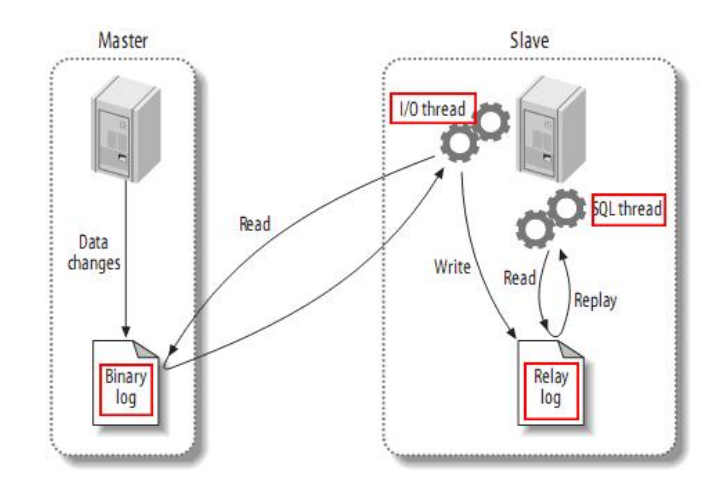
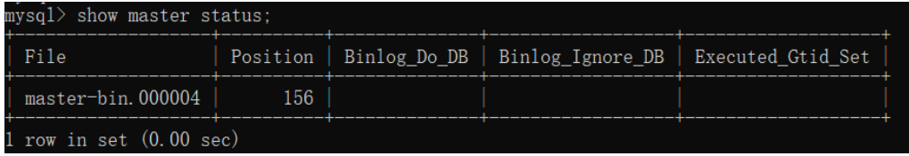
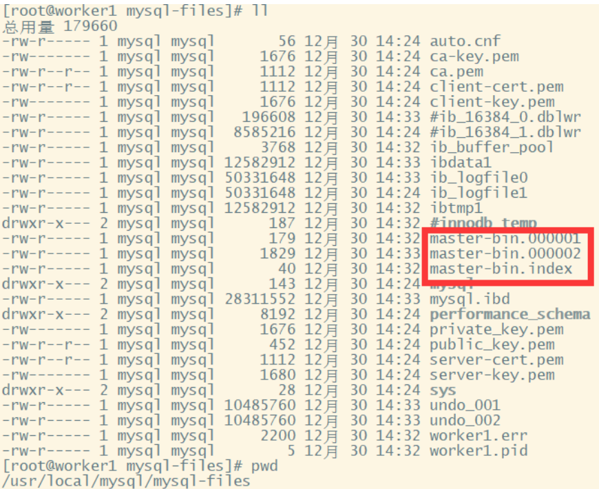
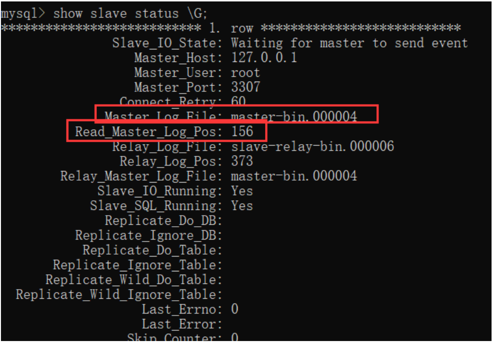

MySQL 是实际生产中最常用的数据库，生产环境数据量极为庞大，对性能和安全要求很高，单机的 MySQL 是远远达不到的，所以必须搭建一个主从复制架构，同时可以基于一些工具实现高可用架构，在此基础上，基于一些中间件实现读写分离架构，如果数据量非常庞大，还要考虑分库分表。

本文不讲解 MySQL 数据库的安装，和高可用架构搭建的具体细节，只为探索生产环境常用的高可用方案，和各个方案的优劣。
## 主从集群
主从集群可以缓解 MySQL 的数据存储以及访问的压力，具备一下几个优点

### 1. 数据安全

为了给主服务增加一个数据备份，可以搭建主从架构，基于此架构也可以搭建互主架构

### 2.  读写分离

对于大部分系统来说，都是读多写少的，当主库的访问压力较大时，可以将数据的读请求交给从库承担，主库只负责数据的写入。 可以大大缓解主库的压力。

**【注意】**
MySQL 的主从架构只是实现读写分离的基础。要实现读写分离还需要一些中间件来实现，如 ShardingSphere

### 3. 故障转移-高可用

当 MySQL 主服务宕机后，可以由一台从服务切换成主服务。

对于高可用架构，主从架构也只是实现故障转移的基础，要实现自动主从切换，还需要一些其他中间件实现，如： MMM, MHA， MGR

**【重要】**

在一般项目中，如果数据库的访问压力没有那么大，不一定必须要做读写分离，但是**主从架构，高可用架构是一定要搭建的**

## 主从同步的原理

MySQL 主从同步架构一般是通过 binlog 日志文件来进行的。
简要步骤如下：
1. 在主服务上打开 binlog 记录每一步的数据操作。
2. 从服务会有一个 IO 线程，负责和主服务建立 TCP 连接，请求主服务将 binlog 日志传送过来
3. 这时主库上会有一个 IO dump 线程，负责通过这个 TCP 连接把 binlog 日志传输给从库
4. 从服务的 IO 线程会把接收到的 binlog 日志数据写入自己的 **relay** 日志文件中，进行操作重演。达到还原数据的目的



> MySQL 的 binlog 日志不仅仅可以用于主从同步，还可以用于缓存数据同步的场景，如 Canal, 它可以模拟一个 slave 节点，向 MySQL 发起 binlog 同步，然后将数据落地到 redis，等其它组件中，实现数据的实时流转

**【注意】**
搭建主从同步有两个必要的要求：
1. 双方的 MySQL 版本必须一致。 至少要求主服务版本低于从服务
2. 两节点的时间需要同步

## 搭建主从集群
### 1. 配置 master 主服务器
修改 /etc/my.cnf, 主要是有两点
- 打开 binlog 日志
- 指定 serverId

示例配置如下：
```cnf
[mysqld]
server-id=47
#开启 binlog
log_bin=master-bin
log_bin-index=master-bin.index
skip-name-resolve
# 设置连接端口
port=3306
# 设置 mysql 的安装目录
basedir=/usr/local/mysql
# 设置 mysql 数据库的数据的存放目录
datadir=/usr/local/mysql/mysql-files
# 允许最大连接数
max_connections=200
# 允许连接失败的次数。
max_connect_errors=10
# 服务端使用的字符集默认为 UTF8
character-set-server=utf8
# 创建新表时将使用的默认存储引擎
default-storage-engine=INNODB
# 默认使用“mysql_native_password”插件认证
#mysql_native_password
default_authentication_plugin=mysql_native_password
```

**配置说明：**
- server-id：服务节点的唯一标识。需要给集群中的每个服务分配一个单独的 ID。
- log_bin：打开 Binlog 日志记录，并指定文件名。
- log_bin-index：Binlog 日志文件

### 2. 重启服务
`service mysqld restart`

### 3. 分配 replication slave 权限
```shell
#登录主数据库
mysql -u root -p
# 分配权限
GRANT REPLICATION SLAVE ON *.* TO 'root'@'%';
flush privileges;
#查看主节点同步状态：
show master status;
```

> 这个权限赋予从服务器与主服务器建立复制连接和接收主服务器上的数据更新的能力。具有"REPLICATION SLAVE"权限的从服务器可以连接到主服务器，并从主服务器接收数据更改事件（如插入、更新和删除操作）。这使得从服务器能够保持与主服务器上数据的实时同步。

**注意：**在实际生产中，一般不会直接使用 root 用户，而是会创建一个拥有全部权限的用户来负责主从同步



这个指令结果中的 
- File 是当前日志的 binlog 文件
- Position 是文件中的索引
- Binlog_DO_DB 标识 binlog 要记录的库，也就特殊指定哪些库中的更改需要在 binlog 中记录下来
- Binglog_Ignore_DB 表示不要把某个库的更改记录到 binlog 文件中。主从同步时，自然也不会同步这个库

> 开启 binlog 后，数据库中的所有操作都会被记录到 datadir 当中，以一组 轮询文件的方式循环记录。而指令查到的 File 和 Position 就是当前日志的 文件和位置。而在后面配置从服务时，就需要通过这个 File 和 Position 通知从服务从哪个地方开始记录 binLog。



### 4. 配置从服务
也是有几个关键的配置：
- server-id: 服务节点的唯一标识
- relay-log： 打开从服务的 bin-log 日志记录
- log-bin: 打开从服务的 binlog 日志记录

示例配置如下：
```cnf
[mysqld]
#主库和从库需要不一致
server-id=48
#打开 MySQL 中继日志
relay-log-index=slave-relay-bin.index
relay-log=slave-relay-bin
#打开从服务二进制日志
log-bin=mysql-bin
#使得更新的数据写进二进制日志中
log-slave-updates=1
# 设置 3306 端口
port=3306
# 设置 mysql 的安装目录
basedir=/usr/local/mysql
# 设置 mysql 数据库的数据的存放目录
datadir=/usr/local/mysql/mysql-files
# 允许最大连接数
max_connections=200
# 允许连接失败的次数。
max_connect_errors=10
# 服务端使用的字符集默认为 UTF8
character-set-server=utf8
# 创建新表时将使用的默认存储引擎
default-storage-engine=INNODB
# 默认使用“mysql_native_password”插件认证
#mysql_native_password
default_authentication_plugin=mysql_native_password
```

### 5. 重启从服务，设置与主节点的同步状态
```shell
#登录从服务
mysql -u root -p;
#设置同步主节点：
CHANGE MASTER TO
MASTER_HOST='192.168.232.128',
MASTER_PORT=3306,
MASTER_USER='root',
MASTER_PASSWORD='root',
MASTER_LOG_FILE='master-bin.000004',
MASTER_LOG_POS=156
GET_MASTER_PUBLIC_KEY=1;
#开启 slave
start slave;
#查看主从同步状态
show slave status;
# 或者用 show slave status \G; 这样查看比较简洁
```

**注意：** ，CHANGE MASTER 指令中需要指定的 MASTER_LOG_FILE 和 MASTER_LOG_POS 必须与主服务中查到的保持一致。并且后续如果要检查主从架构是否成功，也可以通过检查主服务与从服务之间的 File 和 Position 这两个属性是否一致来确定。



重点关注其中红色方框的两个属性，与主节点保持一致，就表示这个主从同步搭建是成功的。

从这个指令的结果能够看到，有很多Replicate_开头的属性，这些属性指定了两个服务之间要同步哪些数据库、哪些表的配置。只是在我们这个示例中全都没有进行配置，就标识是全库进行同步。后面补充如何配置需要同步的库和表。


### 6. 主从集群测试

1. 在主新建表，在从查看是否存在
2. 在主新增表，在从查看是否存在
3. 在主新增数据，在从查看是否存在

### 7. 主从同步失败的检查与恢复
主从同步是有可能失败的，可以在从上执行命令： `show slave status \G`, 如果发现 Slave_SQL_Running=no 就表示同步失败了，这有可能是
- 在从库上进行了写操作，与不同过来的SQL冲突了，
- 也可能是从服务重启后，有事务回滚了。

如果是因为从服务事务回滚的原因，可以按照一下方式重启同步：
```shell
mysql> stop slave ;
mysql> set GLOBAL SQL_SLAVE_SKIP_COUNTER=1;
mysql> start slave ;
```

另一种解决方法： 重新记录主节点的 binlog文件消息
```shell
mysql> stop slave ;
mysql> change master to .... # 省略，与前面开启同步方法一样
mysql> start slave ;
```
这种方案需要注意 binlog 文件和位置， 如果修改后和之前同步的接不上，就会丢失部分数据，不太常用

## 集群搭建扩展
未完待续...


> 联系方式：dccmmtop@foxmail.com