[关于 ShardingSphere](#关于-shardingsphere)
- [关于 ShardingSphere](#关于-shardingsphere)
  - [功能](#功能)
    - [分库分表的作用](#分库分表的作用)
    - [分库分表策略的选择](#分库分表策略的选择)
- [核心概念](#核心概念)
- [分片策略介绍](#分片策略介绍)
  - [准备工作](#准备工作)
    - [1. 数据库](#1-数据库)
    - [2. 新建 SpringBoot 项目](#2-新建-springboot-项目)
    - [3. 在项目中配置数据源](#3-在项目中配置数据源)
    - [4. 项目目录结构](#4-项目目录结构)
  - [inline](#inline)
    - [1. 新建 course 表](#1-新建-course-表)
    - [2. 指定逻辑表与实际表的关系](#2-指定逻辑表与实际表的关系)
    - [3. 编写实体类](#3-编写实体类)
    - [4. 测试插入](#4-测试插入)
    - [5. 测试全表查询](#5-测试全表查询)
    - [6. 精确查询](#6-精确查询)
    - [7. 范围查询](#7-范围查询)
  - [standard](#standard)
    - [1. 创建表](#1-创建表)
    - [2. 添加配置](#2-添加配置)
    - [3. 创建实体类和 Mapper](#3-创建实体类和-mapper)
    - [4. 算法实现【重点】](#4-算法实现重点)
      - [分库算法：](#分库算法)
      - [分表算法](#分表算法)
    - [5. 测试插入](#5-测试插入)
    - [6. 测试精确查询](#6-测试精确查询)
    - [7. 测试范围查询](#7-测试范围查询)
  - [complex](#complex)
    - [1. 创建 message 表](#1-创建-message-表)
    - [2. 创建实体类和 Mapper](#2-创建实体类和-mapper)
    - [3. 添加分片配置](#3-添加分片配置)
    - [4. 分片算法](#4-分片算法)
      - [分库](#分库)
      - [分表](#分表)
    - [5. 测试插入](#5-测试插入-1)
    - [6. 测试查询](#6-测试查询)
  - [hint](#hint)
    - [配置如下：](#配置如下)
    - [创建表，实体类和 Mapper](#创建表实体类和-mapper)
    - [分片算法](#分片算法)
      - [分库](#分库-1)
      - [分表](#分表-1)
    - [测试插入](#测试插入)
  - [广播表](#广播表)
  - [总结](#总结)
  - [读写分离](#读写分离)
    - [配置](#配置)
    - [测试插入](#测试插入-1)
    - [测试查询](#测试查询)

# 关于 ShardingSphere
下图是官网的介绍
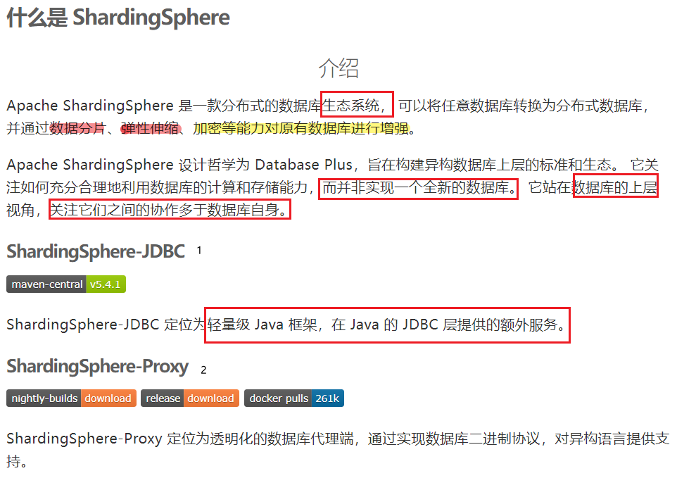

本篇文章只介绍 ShardingSphere-JDBC 的使用

## 功能
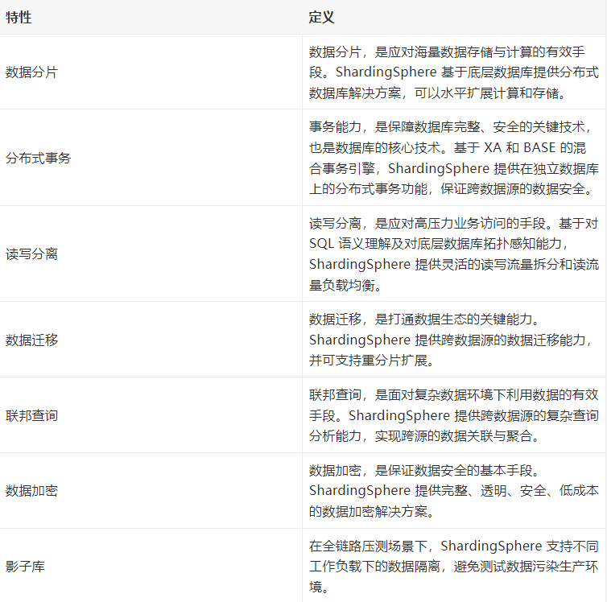

ShardingSphere-JDBC 的核心功能是数据分片和读写分离，通过 ShardingSphere=JDBC 应用可以透明的使用 JDBC 访问已经分库分表，读写分离的多个数据源，而不用关心数据源的数量以及数据如何分布。

在开始使用 SharedingSphere 之前在温习一下分库分表的基本要点：
### 分库分表的作用
- 加大存储
- 提升查询效率
- 提升数据库并发能力

### 分库分表策略的选择
- 分库分表一定要提前设计，尽量避免临时设计。只针对最核心的表
- 分库分表后，**对表的查询尽量简单**，不要有跨表，跨库的复杂查询
- 分库分表尽量同时进行，可以分担网络的压力

# 核心概念
- 逻辑表：水平拆分后，逻辑和数据结构相同的表的总称。user 被拆分成 user_1  user_2 ，user 就是逻辑表。
- 真实表：在分片数据库中真实存在的物理表，user_1 user_2 就是真实表
- 数据节点：数据分片的最小单元，有数据源名称和数据表组成。
- 绑定表：分片规则一致的主表和子表
- 广播表：也叫公共表，指的是在所有的分片数据源中都存在的表，结构和数据完全一致，一般是配置表，字典表，这种关联次数多，几乎不会发生变化，数据量小的表。
- 分片键：用于分片的数据库字段，是将数据库表水平拆分的关键字段，比如按照 id 取模分表。id 就是分片键，SQL 语句中如果不含分片键，将会执行全路由，性能会很差。
- 分片算法：通过分片算法将数据进行分片，支持通过 = BETWEEN IN 分片，算法需要开发者自行实现，灵活度高。
- 分片策略：真正用于分片操作的是分片键+分片算法，也就是分片策略。在 ShardingSphereJDBC 中，一般采用 Groovy 表达式来描述分片策略。如 inline 策略的描述：user_$->{u_id%8}, 它描述了根据 u_id 模 8，分成 8 张表，表名称是 user_0 到 user_7

# 分片策略介绍
- inline: 直接在配置文件中通过 Groovy 表达式实现分片策略，如：user_$->{u_id%8}, 只支持精确查找 ( = in)，不支持范围查找
- standard: 标准分片策略，用户通过编写分片精确查找和范围查找算法，实现自定义的分片，可以支持精确查找和范围查找，但是分片键只能有一个，也就是只能根据一列来进行分片
- complex： 复合分片，和标准分片一样，但是可以支持多个列对数据进行分片
- hint: 强制路由策略，不再由 SQL 决定如何分片，直接由用户指定分片参数
  
下面分别介绍这几种分片策略的使用：
## 准备工作
### 1. 数据库
准备两个数据库，建议使用 docker-compose 快速搭建
m1 数据源下的 sharing_1 库 m2 数据源下的 sharing_2 数据库

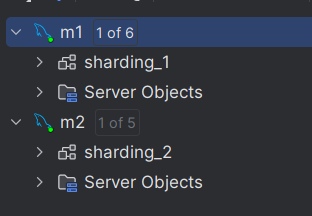

docker-compose.yml:
```yml
version: '3.8'
services:
  mysql-master:
    container_name: mysql-single
    image: mysql:5.7.31
    restart: always
    ports:
      - 3342:3306
    privileged: true
    volumes:
      - $PWD/log:/var/log/mysql
      - $PWD/my.cnf:/etc/mysql/my.cnf
      - $PWD/data:/var/lib/mysql
    environment:
      MYSQL_ROOT_PASSWORD: "123456"
    command: [
        '--character-set-server=utf8mb4',
        '--collation-server=utf8mb4_general_ci',
        '--max_connections=3000'
    ]
```
### 2. 新建 SpringBoot 项目
要用到的依赖如下：
```xml
<properties>
    <java.version>1.8</java.version>
    <project.build.sourceEncoding>UTF-8</project.build.sourceEncoding>
    <project.reporting.outputEncoding>UTF-8</project.reporting.outputEncoding>
    <spring-boot.version>2.6.13</spring-boot.version>
</properties>
<dependencies>
    <dependency>
        <groupId>org.springframework.boot</groupId>
        <artifactId>spring-boot-starter-web</artifactId>
    </dependency>
    <dependency>
        <groupId>org.mybatis.spring.boot</groupId>
        <artifactId>mybatis-spring-boot-starter</artifactId>
        <version>2.2.2</version>
    </dependency>
    <dependency>
        <groupId>org.apache.shardingsphere</groupId>
        <artifactId>sharding-jdbc-spring-boot-starter</artifactId>
        <version>4.1.1</version>
    </dependency>

    <dependency>
        <groupId>org.springframework.boot</groupId>
        <artifactId>spring-boot-starter-test</artifactId>
        <scope>test</scope>
    </dependency>

    <dependency>
        <groupId>com.alibaba</groupId>
        <artifactId>druid</artifactId>
        <version>1.1.22</version>
    </dependency>

    <dependency>
        <groupId>mysql</groupId>
        <artifactId>mysql-connector-java</artifactId>
    </dependency>
    <!-- 使用 mybatis plus 简化数据操作，专注 ShardingSphere JDBC 框架的使用-->
    <dependency>
        <groupId>com.baomidou</groupId>
        <artifactId>mybatis-plus-boot-starter</artifactId>
        <version>3.5.2</version>
    </dependency>

    <!-- 需要用到一些日期操作， 借助第三方工具包-->
    <dependency>
        <groupId>cn.hutool</groupId>
        <artifactId>hutool-core</artifactId>
        <version>5.8.23</version>
    </dependency>
</dependencies>
<dependencyManagement>
    <dependencies>
        <dependency>
            <groupId>org.springframework.boot</groupId>
            <artifactId>spring-boot-dependencies</artifactId>
            <version>${spring-boot.version}</version>
            <type>pom</type>
            <scope>import</scope>
        </dependency>
    </dependencies>
</dependencyManagement>
``` 

### 3. 在项目中配置数据源

在 application.properties 中添加数据源的配置：
```properties
# 配置多个数据源 m1 m2
spring.shardingsphere.datasource.names=m1,m2
spring.shardingsphere.datasource.m1.type=com.alibaba.druid.pool.DruidDataSource
spring.shardingsphere.datasource.m1.driver-class-name=com.mysql.cj.jdbc.Driver
spring.shardingsphere.datasource.m1.url=jdbc:mysql://192.168.11.12:3340/sharding_1?serverTimezone=GMT%2B8
spring.shardingsphere.datasource.m1.username=root
spring.shardingsphere.datasource.m1.password=123456

spring.shardingsphere.datasource.m2.type=com.alibaba.druid.pool.DruidDataSource
spring.shardingsphere.datasource.m2.driver-class-name=com.mysql.cj.jdbc.Driver
spring.shardingsphere.datasource.m2.url=jdbc:mysql://192.168.11.12:3342/sharding_2?serverTimezone=GMT%2B8
spring.shardingsphere.datasource.m2.username=root
spring.shardingsphere.datasource.m2.password=123456
```

### 4. 项目目录结构
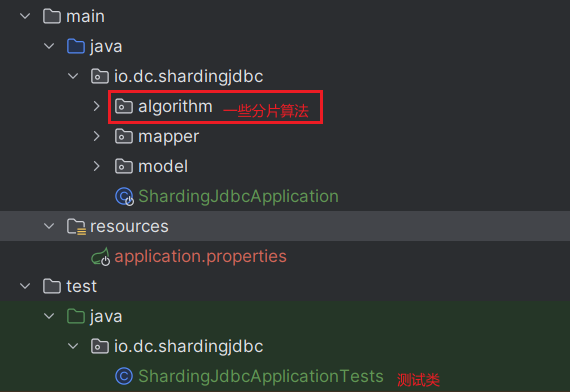

## inline

### 1. 新建 course 表

ShardingSphere 不会帮助我们建表，只是将 SQL 解析成符合分表分库之后的实际 SQL

我们使用 course 表举例：
```sql
create table course_1
(
    cid     BIGINT(20) PRIMARY KEY,
    cname   VARCHAR(50) NOT NULL,
    user_id BIGINT(20)  NOT NULL,
    cstatus varchar(10) NOT NULL
);
create table course_2
(
    cid     BIGINT(20) PRIMARY KEY,
    cname   VARCHAR(50) NOT NULL,
    user_id BIGINT(20)  NOT NULL,
    cstatus varchar(10) NOT NULL
);
```

分别在两个数据库中执行 建表 sql。

### 2. 指定逻辑表与实际表的关系

在 application.properties 配置文件中添加：
```txt
# table.course 指定一个逻辑表是 course, 这个表不用真实存在
# course 是逻辑表， 他下面分布的真实表 course_1 course_2  groovy 表达方式
# course 逻辑表下面有 4 个真实表，分别是 m1:course_1 m1:course_2 m2:course_1 m2:course_2
spring.shardingsphere.sharding.tables.course.actual-data-nodes=m$->{1..2}.course_$->{1..2}

# 使用雪花算法生成 cid 列的内容
# 下面三行的配置指定了 course 表主键生成的策略，使用了雪花算法。它是一种效率较高的分布式 ID, 算法实现细节自行查阅。
spring.shardingsphere.sharding.tables.course.key-generator.column=cid
spring.shardingsphere.sharding.tables.course.key-generator.type=SNOWFLAKE
# 雪花算法需要的参数，可以不写
spring.shardingsphere.sharding.tables.course.key-generator.props.worker.id=2

# 分片算法， 选库，这里根据 cid 进行选择
spring.shardingsphere.sharding.tables.course.database-strategy.inline.sharding-column=cid
# 表达式可能的结果是 m1  m2
spring.shardingsphere.sharding.tables.course.database-strategy.inline.algorithm-expression=m$->{cid%2+1}

# 分片算法，选表
spring.shardingsphere.sharding.tables.course.table-strategy.inline.sharding-column=cid
# 结果表达式的结果可能是：course_1  course_2
spring.shardingsphere.sharding.tables.course.table-strategy.inline.algorithm-expression=course_$->{cid%2+1}
```

先选出所有符合条件的库，然后在每个库下选出复合条件的表。这里一共有四张表 m1:course_1  m1:course_2 m2:course_1 m2:course_2, 我们想要实现的效果是 cid 为奇数的放入 m2:course_2 cid 为偶数的放入 m1:course_1 

**【疑问】**
这种分片下就用不到 m1:course_2 和 m2:course_1, 是不是这两张表就不用建了呢？ 
不是！ 原因可以看下面的实践

### 3. 编写实体类
如下：
Course.java:

```java
package io.dc.shardingjdbc.model;

import com.baomidou.mybatisplus.annotation.TableId;

/**
 * @author dc on 2023/12/4
 */
public class Course {
    // 使用雪花算法生成 id 时， 这里要用 Long 而不是 long
    @TableId
    private Long cid;
    private String cname;
    private Long userId;
    private String cstatus;

    public Long getCid() {
        return cid;
    }

    public void setCid(Long cid) {
        this.cid = cid;
    }

    public String getCname() {
        return cname;
    }

    public void setCname(String cname) {
        this.cname = cname;
    }

    public Long getUserId() {
        return userId;
    }

    public void setUserId(Long userId) {
        this.userId = userId;
    }

    public String getCstatus() {
        return cstatus;
    }

    public void setCstatus(String cstatus) {
        this.cstatus = cstatus;
    }

    @Override
    public String toString() {
        return "Course{" +
                "cid=" + cid +
                ", cname='" + cname + '\'' +
                ", userId=" + userId +
                ", cstatus='" + cstatus + '\'' +
                '}';
    }
}
```

### 4. 测试插入

在测试类中：
```java
@Test
public void addCourse() {
    for (int i = 1; i <= 200; i++) {
        Course c = new Course();

        // 注意，因为使用了雪花算法生成 cid，这里不要手动设置
        //  c.setCid(Long.valueOf(i));
        c.setCname("xxx");
        c.setUserId(Long.valueOf(1000 + i));
        c.setCstatus("1");

        courseMapper.insert(c);
    }
}
```
执行这个测试方法，控制台部分输出如下：
```txt
2023-12-09 18:36:05.455  INFO 22524 --- [main] ShardingSphere-SQL:Logic SQL: INSERT INTO course  ( cid, cname, user_id, cstatus )  VALUES  ( ?, ?, ?, ? ) 

2023-12-09 18:36:05.455  INFO 22524 --- [main] ShardingSphere-SQL: Actual SQL: m2 ::: INSERT INTO course_2  ( cid, cname, user_id, cstatus )  VALUES  (?, ?, ?, ?) ::: [1733435338651176961, xxx, 1001, 1] 
```

插入一条数据产生两条 sql，一条是逻辑 sql，一条是真实 sql，并且真实 sql 是插入到了 m2:course_2 中，cid 是奇数。复合我们的配置，下面看下数据库的数据分布：
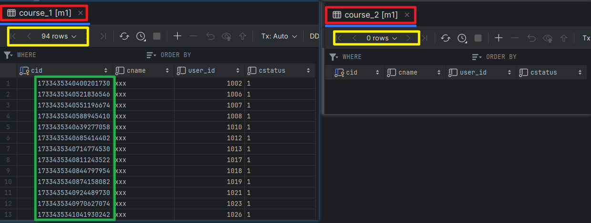

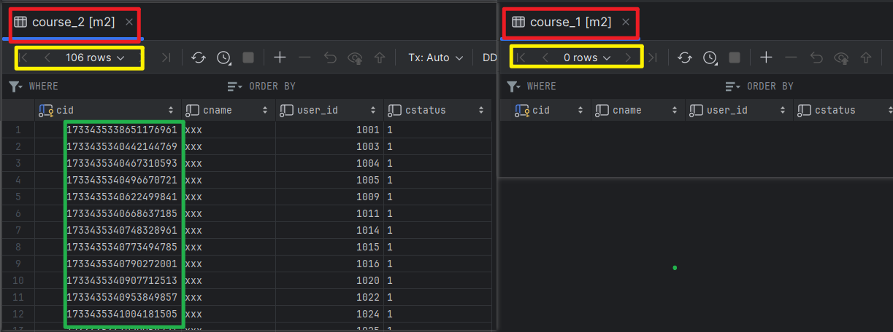

可以看到，m1:course_1 cid 都是偶数，m1:course_2 为空 m2:course_1 cid 为空，m2:course_2 都是奇数

### 5. 测试全表查询

添加测试方法，测试全表查询
```java
@Test
public void queryCourse() {
    System.out.println("全表查询");
    // mybatis plus 写法
    QueryWrapper<Course> wrapper = new QueryWrapper<>();
    wrapper.orderByDesc("cid").orderByDesc("user_id");
    List<Course> courseList = courseMapper.selectList(wrapper);
    for (Course course : courseList) {
        System.out.println(course);
    }
}
```

运行测试方法，控制台部分输出：
```txt
全表查询
2023-12-09 18:50:35.066  INFO 17952 --- [main] ShardingSphere-SQL: Logic SQL: SELECT  cid,cname,user_id,cstatus  FROM course ORDER BY cid DESC,user_id DESC

2023-12-09 18:50:35.067  INFO 17952 --- [main] ShardingSphere-SQL: Actual SQL: m1 ::: SELECT  cid,cname,user_id,cstatus  FROM course_1 ORDER BY cid DESC,user_id DESC

2023-12-09 18:50:35.067  INFO 17952 --- [main] ShardingSphere-SQL: Actual SQL: m1 ::: SELECT  cid,cname,user_id,cstatus  FROM course_2 ORDER BY cid DESC,user_id DESC

2023-12-09 18:50:35.067  INFO 17952 --- [main] ShardingSphere-SQL: Actual SQL: m2 ::: SELECT  cid,cname,user_id,cstatus  FROM course_1 ORDER BY cid DESC,user_id DESC

2023-12-09 18:50:35.067  INFO 17952 --- [main] ShardingSphere-SQL: Actual SQL: m2 ::: SELECT  cid,cname,user_id,cstatus  FROM course_2 ORDER BY cid DESC,user_id DESC

Course{cid=1733435344938438657, cname='xxx', userId=1200, cstatus='1'}
Course{cid=1733435344904884226, cname='xxx', userId=1199, cstatus='1'}
Course{cid=1733435344883912706, cname='xxx', userId=1198, cstatus='1'}
.... 省略
```

因为没有用到分片键，产生了四条真实 sql，四张表都查了一遍。这个案例可解上面的疑问，为什么用不到表还要建出来。也许可以调整 groovy 表达式的写法，只需见 2 张表就行了。后面调研一下。

### 6. 精确查询

添加测试方法：
```java
@Test
public void queryCourseById() {
    System.out.println("按照 Id 查询");
    QueryWrapper<Course> wrapper = new QueryWrapper<>();
    wrapper.eq("cid", 1733435340907712513L);
    List<Course> courseList = courseMapper.selectList(wrapper);
    System.out.println("按照 ID");
    for (Course course : courseList) {
        System.out.println(course);
    }
    wrapper.clear();
    System.out.println("in 查询");
    wrapper.in("cid", Arrays.asList(1733435340953849857L, 1733435340844797954L));
    courseList = courseMapper.selectList(wrapper);
    for (Course course : courseList) {
        System.out.println(course);
    }
}
```

运行测试方法，控制台输出：
```txt
按照 Id 查询
2023-12-09 19:19:00.664  INFO 14872 --- [main] ShardingSphere-SQL: Logic SQL: SELECT  cid,cname,user_id,cstatus  FROM course WHERE (cid = ?)
2023-12-09 19:19:00.664  INFO 14872 --- [main] ShardingSphere-SQL: Actual SQL: m2 ::: SELECT  cid,cname,user_id,cstatus  FROM course_2 WHERE (cid = ?) ::: [1733435340907712513]

按照 ID
Course{cid=1733435340907712513, cname='xxx', userId=1020, cstatus='1'}

in 查询
2023-12-09 19:19:00.714  INFO 14872 --- [main] ShardingSphere-SQL: Logic SQL: SELECT  cid,cname,user_id,cstatus  FROM course WHERE (cid IN (?,?))

2023-12-09 19:19:00.714  INFO 14872 --- [main] ShardingSphere-SQL: Actual SQL: m1 ::: SELECT  cid,cname,user_id,cstatus  FROM course_1 WHERE (cid IN (?,?)) ::: [1733435340953849857, 1733435340844797954]

2023-12-09 19:19:00.714  INFO 14872 --- [main] ShardingSphere-SQL: Actual SQL: m1 ::: SELECT  cid,cname,user_id,cstatus  FROM course_2 WHERE (cid IN (?,?)) ::: [1733435340953849857, 1733435340844797954]

2023-12-09 19:19:00.714  INFO 14872 --- [main] ShardingSphere-SQL: Actual SQL: m2 ::: SELECT  cid,cname,user_id,cstatus  FROM course_1 WHERE (cid IN (?,?)) ::: [1733435340953849857, 1733435340844797954]

2023-12-09 19:19:00.714  INFO 14872 --- [main] ShardingSphere-SQL: Actual SQL: m2 ::: SELECT  cid,cname,user_id,cstatus  FROM course_2 WHERE (cid IN (?,?)) ::: [1733435340953849857, 1733435340844797954]

Course{cid=1733435340844797954, cname='xxx', userId=1018, cstatus='1'}
Course{cid=1733435340953849857, cname='xxx', userId=1022, cstatus='1'}
```

按照 Id 查询，只产生了一条 SQL，根据我们设置的分片算法直接定位到 m2:cour2 表。

按照 in 查询，进行了全表路由

### 7. 范围查询
添加测试方法：
```java
@Test
public void queryCourseByRange() {
    System.out.println("按照 Id 范围查询");
    QueryWrapper<Course> wrapper = new QueryWrapper<>();
    wrapper.between("cid", 938561391969701888L, 938561392535932929L);
    List<Course> courseList = courseMapper.selectList(wrapper);
    for (Course course : courseList) {
        System.out.println(course);
    }
    // 在 inline 策略下，不支持范围查询
}
```

执行报错：
```txt
org.mybatis.spring.MyBatisSystemException: nested exception is org.apache.ibatis.exceptions.PersistenceException: 
### Error querying database.  Cause: java.lang.IllegalStateException: Inline strategy cannot support this type sharding:RangeRouteValue(columnName=cid, tableName=course, valueRange=[938561391969701888‥938561392535932929])
```

报错信息是 inline 策略不支持范围查询。

由于这个策略不支持范围查询，灵活度远远不够，接下来看支持范围查询的 stander 策略

## standard

standard 策略我们用 dept 表验证：
### 1. 创建表
分别在两个数据库中执行
```sql
drop table if exists dept_1;
create table dept_1
(
    did      BIGINT(20) PRIMARY KEY,
    name     VARCHAR(10) NOT NULL,
    user_num int         NOT NULL default 0
);
drop table if exists dept_2;
create table dept_2
(
    did      BIGINT(20) PRIMARY KEY,
    name     VARCHAR(10) NOT NULL,
    user_num int         NOT NULL default 0
);
```

### 2. 添加配置
```properties
# 指定逻辑表和真实表的对应关系
spring.shardingsphere.sharding.tables.dept.actual-data-nodes=m$->{1..2}.dept_$->{1..2}
# 使用雪花算法生成 did 列的内容
spring.shardingsphere.sharding.tables.dept.key-generator.column=did
spring.shardingsphere.sharding.tables.dept.key-generator.type=SNOWFLAKE

## 标准策略分片
## 分表时选择 did 作为分片键
spring.shardingsphere.sharding.tables.dept.table-strategy.standard.sharding-column=did
# 支持精确查询和范围查询，都需要自己实现分片算法
# 精确查询时选择表
spring.shardingsphere.sharding.tables.dept.table-strategy.standard.precise-algorithm-class-name=io.dc.shardingjdbc.algorithm.DeptTablePreciseAlgorithm
# 范围查询时选择表
spring.shardingsphere.sharding.tables.dept.table-strategy.standard.range-algorithm-class-name=io.dc.shardingjdbc.algorithm.DeptTableRangeAlgorithm

## 分库时选择 did 作为分片键
spring.shardingsphere.sharding.tables.dept.database-strategy.standard.sharding-column=did
# 精确查询时选择库
spring.shardingsphere.sharding.tables.dept.database-strategy.standard.precise-algorithm-class-name=io.dc.shardingjdbc.algorithm.DeptDsPreciseAlgorithm
# 范围查询时选择库
spring.shardingsphere.sharding.tables.dept.database-strategy.standard.range-algorithm-class-name=io.dc.shardingjdbc.algorithm.DeptDsRangeAlgorithm
```

### 3. 创建实体类和 Mapper
实体类 Dept.java
```java
package io.dc.shardingjdbc.model;

/**
 * @author dc on 2023/12/6
 */
public class Dept {
    private Long did;
    private Integer userNum;
    private String name;

    public Long getDid() {
        return did;
    }

    public void setDid(Long did) {
        this.did = did;
    }

    public Integer getUserNum() {
        return userNum;
    }

    public void setUserNum(Integer userNum) {
        this.userNum = userNum;
    }

    public String getName() {
        return name;
    }

    public void setName(String name) {
        this.name = name;
    }

    @Override
    public String toString() {
        return "Dept{" +
                "did=" + did +
                ", userNum=" + userNum +
                ", name='" + name + '\'' +
                '}';
    }
}
```

DeptMapper.java
```java
package io.dc.shardingjdbc.mapper;

import com.baomidou.mybatisplus.core.mapper.BaseMapper;
import io.dc.shardingjdbc.model.Dept;
import io.dc.shardingjdbc.model.User;

/**
 * @author dc on 2023/12/4
 */
public interface DeptMapper extends BaseMapper<Dept> {
}
```

### 4. 算法实现【重点】

假如想要 did 最后一位等于 1 的放到 m1:dept_1 中，其他情况放入 m2:dept_2 中

#### 分库算法：
在配置文件中已经配置 分库算法的类名：`DeptDsPreciseAlgorithm` 和 `DeptDsRangeAlgorithm`, 下面开始实现这两种算法：
DeptDsPreciseAlgorithm.java
```java
package io.dc.shardingjdbc.algorithm;

import org.apache.shardingsphere.api.sharding.standard.PreciseShardingAlgorithm;
import org.apache.shardingsphere.api.sharding.standard.PreciseShardingValue;

import java.util.Collection;

/**
 * @author dc on 2023/12/5
 * PreciseShardingAlgorithm<T> 实现精确查询分片算法 T 是分片键的类型
 */
public class DeptDsPreciseAlgorithm implements PreciseShardingAlgorithm<Long> {
    /**
     *
     * @param databases 已经配置的数据源
     * @param preciseShardingValue 分片键相关信息， 包含分片键和逻辑表
     * @return 从哪个库中查询（插入）。因为这是精确分片，只会返回一个值
     */
    @Override
    public String doSharding(Collection<String> databases, PreciseShardingValue<Long> preciseShardingValue) {
        System.out.println("dept 库精确");
        // 获取分片键的值
        Long cid = preciseShardingValue.getValue();
        if(cid % 10 == 1){
            System.out.println("在 m1 库中查找");
            return "m1";
        }
        System.out.println("在 m2 库中查找");
        return "m2";
    }
}
```

接下来看范围查询算法实现：
DeptDsRangeAlgorithm.java
```java
package io.dc.shardingjdbc.algorithm;

import org.apache.shardingsphere.api.sharding.standard.RangeShardingAlgorithm;
import org.apache.shardingsphere.api.sharding.standard.RangeShardingValue;

import java.util.Collection;

/**
 * @author dc on 2023/12/5
 * 实现 RangeShardingAlgorithm<Long> 接口
 */
public class DeptDsRangeAlgorithm implements RangeShardingAlgorithm<Long> {
    /**
     * @param databases 配置的数据源
     * @param rangeShardingValue 分片相关信息
     * @return 因为是范围查询，可能要在多个数据源中才能找到所有数据，所以返回值是集合
     */
    @Override
    public Collection<String> doSharding(Collection<String> databases, RangeShardingValue<Long> rangeShardingValue) {
        // 获取范围查询中范围的最小值
        Long min = rangeShardingValue.getValueRange().lowerEndpoint();
        // 获取范围查询中范围的最大值
        Long max = rangeShardingValue.getValueRange().upperEndpoint();
        // 获取逻辑表名
        String logicTableName = rangeShardingValue.getLogicTableName();
        // 获取分片键列的名字
        String columnName = rangeShardingValue.getColumnName();

        // 范围查询需要在所有的库中查询， 暂时没有想到好的案例，没有用到上面几个变量，仅仅做演示
        return databases;
    }
}
```

#### 分表算法

与分库算法差不多

DeptTablePreciseAlgorithm.java

```java
package io.dc.shardingjdbc.algorithm;

import org.apache.shardingsphere.api.sharding.standard.PreciseShardingAlgorithm;
import org.apache.shardingsphere.api.sharding.standard.PreciseShardingValue;

import java.math.BigInteger;
import java.util.Collection;

/**
 * @author dc on 2023/12/5
 */
public class DeptTablePreciseAlgorithm implements PreciseShardingAlgorithm<Long> {
    @Override
    public String doSharding(Collection<String> availableTargetNames, PreciseShardingValue<Long> preciseShardingValue) {
        System.out.println("dept 表精确");
        Long cid = preciseShardingValue.getValue();
        String logicTable = preciseShardingValue.getLogicTableName();
        String actualTable = logicTable + "_";
        if (cid % 10 == 1) {
            actualTable += "1";
            System.out.println("在 " + actualTable+ " 中查找");
            return actualTable;
        }
        actualTable += "2";
        System.out.println("在 " + actualTable+ " 中查找");
        return actualTable;
    }
}
```

DeptTableRangeAlgorithm.java
```java
package io.dc.shardingjdbc.algorithm;

import org.apache.shardingsphere.api.sharding.standard.RangeShardingAlgorithm;
import org.apache.shardingsphere.api.sharding.standard.RangeShardingValue;

import java.util.Collection;

/**
 * @author dc on 2023/12/5
 */
public class DeptTableRangeAlgorithm implements RangeShardingAlgorithm<Long> {
    @Override
    public Collection<String> doSharding(Collection<String> tableNames, RangeShardingValue<Long> rangeShardingValue) {
        System.out.println("===========range================");
        // 范围查询应该在所有表中都查一遍
        return tableNames;
    }
}
```

### 5. 测试插入

添加测试方法：
```java
@Test
public void insertDept() {
    for (int i = 0; i < 100; i++) {
        Dept dept = new Dept();
        dept.setUserNum((i +1) * 200);
        dept.setName("测试标准策略_" + i);
        deptMapper.insert(dept);
    }
}
```

执行方法后，查看数据库如下：
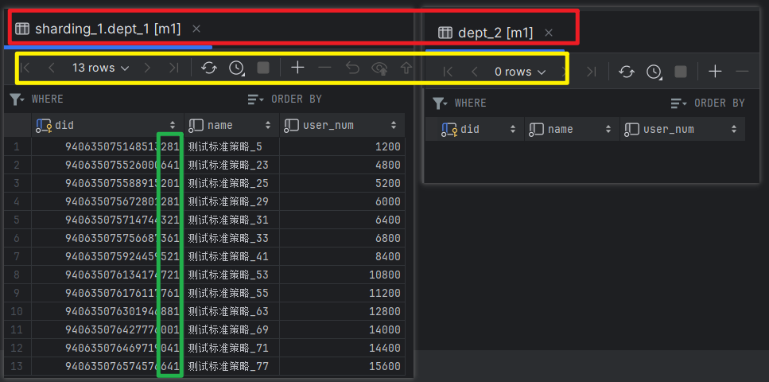

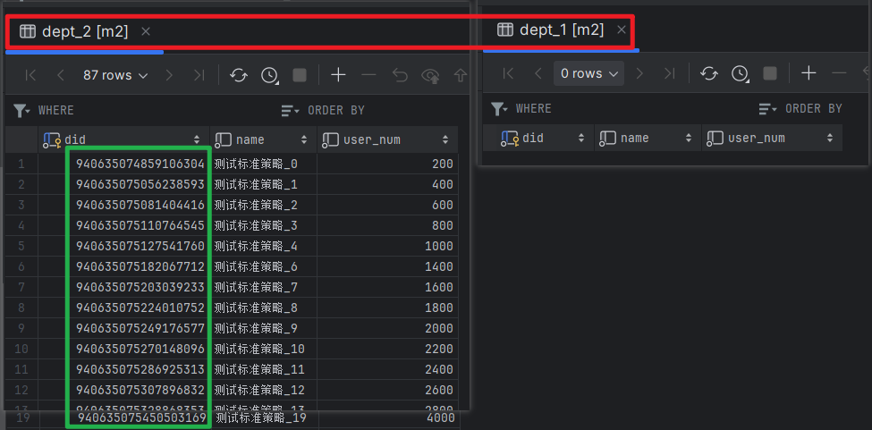

发现数据分布正如分片算法一致，did 追后一位等于 1 的都在 m1:dept_1，下面测试一下查询

### 6. 测试精确查询
新建测试方法：
```java
@Test
public void queryDept() {
    QueryWrapper<Dept> wrapper = new QueryWrapper<>();
    wrapper.eq("did",940635075672801281L);
    List<Dept> deptList = deptMapper.selectList(wrapper);
    for (Dept dept : deptList) {
        System.out.println(dept);
    }
}
```
执行方法，控制台有如下输出：
```txt
dept 库精确
在 m1 库中查找
dept 表精确
在 dept_1 中查找
2023-12-10 15:55:33.006  INFO 19080 --- [main] ShardingSphere-SQL: Logic SQL: SELECT  did,user_num,name  FROM dept WHERE (did = ?)

 2023-12-10 15:55:33.006  INFO 19080 --- [main] ShardingSphere-SQL: Actual SQL: m1 ::: SELECT  did,user_num,name  FROM dept_1 WHERE (did = ?) ::: [940635075672801281]

Dept{did=940635075672801281, userNum=6000, name='测试标准策略_29'}
```
走了精确查询算法，所以只产生了一条真实 SQL

### 7. 测试范围查询
添加测试方法：
```java
@Test
public void queryDeptRange() {
    QueryWrapper<Dept> wrapper = new QueryWrapper<>();
    wrapper.between("did",940635075672801281L, 940635076750737408L);
    List<Dept> deptList = deptMapper.selectList(wrapper);
    for (Dept dept : deptList) {
        System.out.println(dept);
    }
}
```

执行方法，控制台有如下部分输出：
```txt
2023-12-10 16:02:04.018  INFO 23444 --- [main] ShardingSphere-SQL: Logic SQL: SELECT  did,user_num,name  FROM dept WHERE (did BETWEEN ? AND ?)

2023-12-10 16:02:04.018  INFO 23444 --- [main] ShardingSphere-SQL: Actual SQL: m1 ::: SELECT  did,user_num,name  FROM dept_1 WHERE (did BETWEEN ? AND ?) ::: [940635075672801281, 940635076750737408]

2023-12-10 16:02:04.019  INFO 23444 --- [main] ShardingSphere-SQL: Actual SQL: m1 ::: SELECT  did,user_num,name  FROM dept_2 WHERE (did BETWEEN ? AND ?) ::: [940635075672801281, 940635076750737408]

2023-12-10 16:02:04.019  INFO 23444 --- [main] ShardingSphere-SQL: Actual SQL: m2 ::: SELECT  did,user_num,name  FROM dept_1 WHERE (did BETWEEN ? AND ?) ::: [940635075672801281, 940635076750737408]

2023-12-10 16:02:04.019  INFO 23444 --- [main] ShardingSphere-SQL: Actual SQL: m2 ::: SELECT  did,user_num,name  FROM dept_2 WHERE (did BETWEEN ? AND ?) ::: [940635075672801281, 940635076750737408]

Dept{did=940635075672801281, userNum=6000, name='测试标准策略_29'}
Dept{did=940635075714744321, userNum=6400, name='测试标准策略_31'}
Dept{did=940635075756687361, userNum=6800, name='测试标准策略_33'}
Dept{did=940635075924459521, userNum=8400, name='测试标准策略_41'}
Dept{did=940635076134174721, userNum=10800, name='测试标准策略_53'}
Dept{did=940635076176117761, userNum=11200, name='测试标准策略_55'}
Dept{did=940635076301946881, userNum=12800, name='测试标准策略_63'}
```

产生了 4 条 SQL，符合分片算法

## complex

上面两种策略的分片键只能是单个， 复合策略可以支持多个分片键。

用 message 来演示：
### 1. 创建 message 表

```sql
drop table message_1;
create table message_1
(
    mid          BIGINT(20) PRIMARY KEY,
    body         VARCHAR(500) NOT NULL,
    created_time BIGINT(20)   NOT NULL,
    created_time_str char(19)   NOT NULL,
    type         BIGINT(20)   NOT NULL
);
drop table message_2;
create table message_2
(
    mid          BIGINT(20) PRIMARY KEY,
    body         VARCHAR(500) NOT NULL,
    type         BIGINT(20)   NOT NULL,
    created_time_str char(19)   NOT NULL,
    created_time BIGINT(20)   NOT NULL
);

drop table message_3;
create table message_3
(
    mid          BIGINT(20) PRIMARY KEY,
    body         VARCHAR(500) NOT NULL,
    type         BIGINT(20)   NOT NULL,
    created_time_str char(19)   NOT NULL,
    created_time BIGINT(20)   NOT NULL
);
```
分别在两个数据源中执行

### 2. 创建实体类和 Mapper

```java
package io.dc.shardingjdbc.model;

import com.baomidou.mybatisplus.annotation.TableId;

/**
 * @author dc on 2023/12/6
 */
public class Message {
    /**
     * 消息 id
     */
    @TableId
    private Long mid;
    /**
     * 消息文本
     */
    private String body;
    /**
     * 消息类型
     */
    private Long type;
    /**
     * 消息创建时间
     */
    private Long createdTime;
    private String createdTimeStr;

    public Long getMid() {
        return mid;
    }

    public void setMid(Long mid) {
        this.mid = mid;
    }

    public String getBody() {
        return body;
    }

    public void setBody(String body) {
        this.body = body;
    }
    public Long getCreatedTime() {
        return createdTime;
    }

    public void setCreatedTime(Long createdTime) {
        this.createdTime = createdTime;
    }

    public Long getType() {
        return type;
    }

    public void setType(Long type) {
        this.type = type;
    }

    public String getCreatedTimeStr() {
        return createdTimeStr;
    }

    public void setCreatedTimeStr(String createdTimeStr) {
        this.createdTimeStr = createdTimeStr;
    }

    @Override
    public String toString() {
        return "Message{" +
                "mid=" + mid +
                ", body='" + body + '\'' +
                ", type=" + type +
                ", createdTime=" + createdTime +
                ", createdTimeStr='" + createdTimeStr + '\'' +
                '}';
    }
}

```

Mapper:
```java
package io.dc.shardingjdbc.mapper;

import com.baomidou.mybatisplus.core.mapper.BaseMapper;
import io.dc.shardingjdbc.model.Course;
import io.dc.shardingjdbc.model.Message;

public interface MessageMapper extends BaseMapper<Message> {
}
```

### 3. 添加分片配置
```properties
# 对 message 表进行分表分库， 采用复杂策略
spring.shardingsphere.sharding.tables.message.actual-data-nodes=m$->{1..2}.message_$->{1..3}
spring.shardingsphere.sharding.tables.message.key-generator.column=mid
spring.shardingsphere.sharding.tables.message.key-generator.type=SNOWFLAKE
# 雪花算法需要的参数，可以不写（工作机器编号，生成分布式 id 需要）
spring.shardingsphere.sharding.tables.message.key-generator.props.worker.id=2
# 复杂策略分片
# 分片键
spring.shardingsphere.sharding.tables.message.table-strategy.complex.sharding-columns=type,created_time
spring.shardingsphere.sharding.tables.message.table-strategy.complex.algorithm-class-name=io.dc.shardingjdbc.algorithm.MessageTableComplexSharing
spring.shardingsphere.sharding.tables.message.database-strategy.complex.sharding-columns=type,created_time
spring.shardingsphere.sharding.tables.message.database-strategy.complex.algorithm-class-name=io.dc.shardingjdbc.algorithm.MessageDatabaseComplexSharing
```

写法和标准策略一样，只是不再区分精确查找，还是范围查找，由算法来负责实现
想实现如下分片功能
- 消息类型 (type) 等于 1，并且 消息创建时间 (created_time) 小于 20231201 放入 m1:message_1 中
- 消息类型 (type) 等于 2，并且 消息创建时间 (created_time) 大于 20231201 放入 m1:message_2 中
- 其他情况放入 m1:message_3

下面直接看分片算法如何实现

### 4. 分片算法
#### 分库

```java
package io.dc.shardingjdbc.algorithm;

import cn.hutool.core.date.DateUtil;
import com.google.common.collect.Range;
import org.apache.shardingsphere.api.sharding.complex.ComplexKeysShardingAlgorithm;
import org.apache.shardingsphere.api.sharding.complex.ComplexKeysShardingValue;
import org.springframework.util.ObjectUtils;

import java.util.ArrayList;
import java.util.Collection;

/**
 * @author dc on 2023/12/6
 */

public class MessageDatabaseComplexSharing implements ComplexKeysShardingAlgorithm<Long> {
    /**
     * 将消息类型为 1 的，并且时间在 2023-12-01 之前的插入 m1 库 message_1 表中
     * 将消息类型为 2 的，并且时间在 2023-12-01 之后的插入 m2 库 message_2 表中
     * 其他情况数据在 m1 库中的 message_3
     */
    @Override
    public Collection<String> doSharding(Collection<String> collection, ComplexKeysShardingValue<Long> complexKeysShardingValue) {
        // 获取精确查找的字段
        Collection<Long> typeList = complexKeysShardingValue.getColumnNameAndShardingValuesMap().get("type");
        Collection<Long> createdTimeList = complexKeysShardingValue.getColumnNameAndShardingValuesMap().get("created_time");

        // 获取范围类型的字段
        Range<Long> typeRange = complexKeysShardingValue.getColumnNameAndRangeValuesMap().get("type");
        Range<Long> createdTimeRange = complexKeysShardingValue.getColumnNameAndRangeValuesMap().get("created_time");

        Collection<String> databases = new ArrayList<>();
        long now = DateUtil.parse("20231201").getTime();
        // 两个字段都是精确值
        if (!ObjectUtils.isEmpty(typeList) && !ObjectUtils.isEmpty(createdTimeList)) {
            System.out.println("选库： type 和 created_time 都是精确查找");
            for (Long type : typeList) {
                for (Long createTime : createdTimeList) {
                    if (type.equals(1L) && createTime.compareTo(now) < 0) {
                        databases.add("m1");
                    } else if (type.equals(2L) && createTime.compareTo(now) > 0) {
                        databases.add("m2");
                    } else {
                        databases.add("m1");
                    }

                }
            }
            System.out.println("选中的库有");
            for (String database : databases) {
                System.out.println(database);
            }
            return databases;
        }

        // type 是精确值， created_time 是范围值，如：
        // type = 1 and (created_time between ('20231202','20231204'))
        if (!ObjectUtils.isEmpty(typeList) && !ObjectUtils.isEmpty(createdTimeRange)) {
            System.out.println("选库： type 是精确查找，created_time 是范围查找");
            Long min = createdTimeRange.lowerEndpoint();
            Long max = createdTimeRange.upperEndpoint();
            // 根据分片规则
            for (Long type : typeList) {
                if (type.equals(1L) && max.compareTo(now) < 0) {
                    databases.add("m1");
                } else if (type.equals(2L) && min.compareTo(now) > 0) {
                    databases.add("m2");
                } else {
                    databases.add("m1");
                }
            }
            System.out.println("选中的库有");
            for (String database : databases) {
                System.out.println(database);
            }
            return databases;
        }

        System.out.println("选库：其他情况在所有的数据库中查找");
        return collection;
    }
}
```

#### 分表
```java
package io.dc.shardingjdbc.algorithm;

import cn.hutool.core.date.DateUtil;
import com.google.common.collect.Range;
import org.apache.shardingsphere.api.sharding.complex.ComplexKeysShardingAlgorithm;
import org.apache.shardingsphere.api.sharding.complex.ComplexKeysShardingValue;
import org.springframework.util.ObjectUtils;

import java.util.ArrayList;
import java.util.Collection;

/**
 * @author dc on 2023/12/6
 * 将消息类型为 1 的，并且时间在 2023-12-01 之前的插入 m1 库 message_1 表中
 * 将消息类型为 2 的，并且时间在 2023-12-01 之后的插入 m2 库 message_2 表中
 * 其他情况数据在 m1 库中的 message_3
 */
public class MessageTableComplexSharing implements ComplexKeysShardingAlgorithm<Long> {
    @Override
    public Collection<String> doSharding(Collection<String> collection, ComplexKeysShardingValue<Long> complexKeysShardingValue) {
        // 获取精确查找的字段
        Collection<Long> typeList = complexKeysShardingValue.getColumnNameAndShardingValuesMap().get("type");
        Collection<Long> createdTimeList = complexKeysShardingValue.getColumnNameAndShardingValuesMap().get("created_time");

        // 获取范围类型的字段
        Range<Long> typeRange = complexKeysShardingValue.getColumnNameAndRangeValuesMap().get("type");
        Range<Long> createdTimeRange = complexKeysShardingValue.getColumnNameAndRangeValuesMap().get("created_time");

        Collection<String> tables = new ArrayList<>();
        String logicTable = complexKeysShardingValue.getLogicTableName();
        long now = DateUtil.parse("20231201").getTime();
        // 规则 1： 两个字段都是精确值，数据插入时唯一命中的。因为不可能插入一个范围吧
        if (!ObjectUtils.isEmpty(typeList) && !ObjectUtils.isEmpty(createdTimeList)) {
            System.out.println("选表： type 和 created_time 都是精确查找");
            for (Long type : typeList) {
                for (Long createTime : createdTimeList) {
                    if (type.equals(1L) && createTime.compareTo(now) < 0) {
                        tables.add(logicTable + "_1");
                    } else if (type.equals(2L) && createTime.compareTo(now) > 0) {
                        tables.add(logicTable + "_2");
                    } else {
                        tables.add(logicTable + "_3");
                    }
                }
            }
            System.out.println("选中的表有：");
            for (String table : tables) {
                System.out.println(table);
            }
            return tables;
        }

        // 规则 2: type 是精确值， created_time 是范围值，如：type = 1 and (created_time between ('20231202','20231204'))
        if (!ObjectUtils.isEmpty(typeList) && !ObjectUtils.isEmpty(createdTimeRange)) {
            System.out.println("选库： type 是精确查找，created_time 是范围查找");
            Long min = createdTimeRange.lowerEndpoint();
            Long max = createdTimeRange.upperEndpoint();
            // 根据分片规则
            for (Long type : typeList) {
                if (type.equals(1L) && max.compareTo(now) < 0) {
                    tables.add(logicTable + "_1");
                } else if (type.equals(2L) && min.compareTo(now) > 0) {
                    tables.add(logicTable + "_2");
                } else {
                    tables.add(logicTable + "_3");
                }
            }
            System.out.println("选中的表有：");
            for (String table : tables) {
                System.out.println(table);
            }
            return tables;
        }

        System.out.println("选表：其他情况在所有的数据库中查找");
        return collection;
    }
}
```

### 5. 测试插入

添加测试方法：
```java
@Test
public void insertMessage() {
    // 创建时间 分布在 20231201 前后
    List<Date> dateList = new ArrayList<>();
    dateList.add(DateUtil.parse("20231101"));
    dateList.add(DateUtil.parse("20231102"));
    dateList.add(DateUtil.parse("20231103"));
    dateList.add(DateUtil.parse("20231201"));
    dateList.add(DateUtil.parse("20231202"));
    dateList.add(DateUtil.parse("20231203"));
    dateList.add(DateUtil.parse("20231204"));

    for (int i = 0; i < 100; i++) {
        Message message = new Message();
        message.setBody("测试分库分表" + i);
        // type 取值范围 [0 1 2]
        message.setType((long) (i % 3));
        Date date = dateList.get(i % dateList.size());
        message.setCreatedTime(date.getTime());
        message.setCreatedTimeStr(DateUtil.format(date, "yyyy-MM-dd HH:mm:ss"));
        messageMapper.insert(message);
    }
}
```

执行测试方法，查看数据分布：
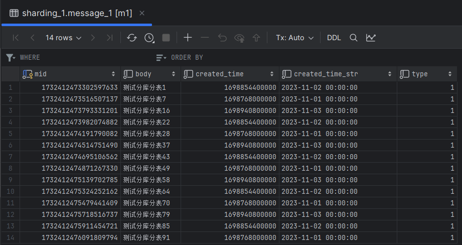

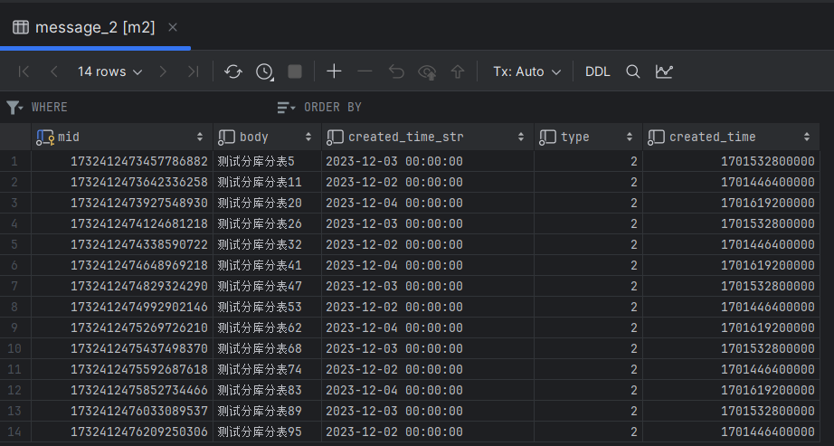

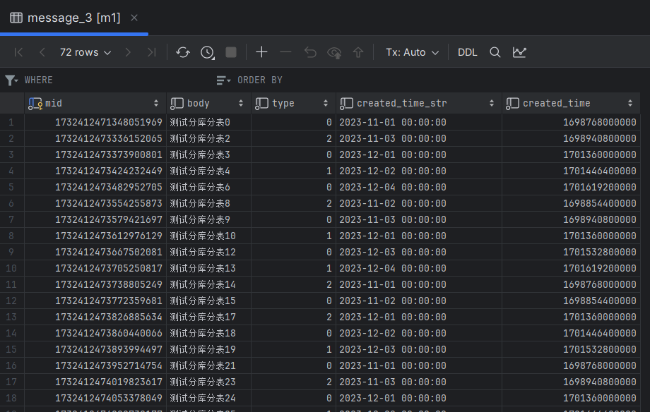

可以看出数据分布复合分片算法设置的规则

### 6. 测试查询

```java
/**
 * 符合规则 1，应该只在 m1:message_1 中查找
 */
@Test
public void queryMessageEq() {
    QueryWrapper<Message> wrapper = new QueryWrapper<>();
    wrapper.eq("type", 1L).eq("created_time", DateUtil.parse("20231102").getTime());
    List<Message> messages = messageMapper.selectList(wrapper);
    for (Message message : messages) {
        System.out.println(message);
    }
}

/**
 * =  和 in 仍然属于精确查找，type = 1 and created_time in (20231102,20231203)
 * 应该在 m1:message_1 和 m1:message_3 查找
 */
@Test
public void queryMessageIn() {
    QueryWrapper<Message> wrapper = new QueryWrapper<>();
    wrapper.eq("type", 1L);
    wrapper.in("created_time", DateUtil.parse("20231102").getTime(), DateUtil.parse("20231203").getTime());
    List<Message> messages = messageMapper.selectList(wrapper);
    for (Message message : messages) {
        System.out.println(message);
    }
}

/**
 * =  和 in 仍然属于精确查找，type = 2 and created_time in (20231102,20231203)
 * 应该在 m2:message_2 和 m1:message_3 查找
 * 但是实际输出的 SQL 是 m1:message_2 m1:messsage_3  m2:message_2 m3:message_3
 * 我猜测他的工作原理如下：
 * 1. 先根据要查找的数据找出数据库： 2 和 20231102 结合得出要在 m1 中查找；2 和 20231203 结合得出要在 m2 中查找
 * 2. 再根据要查找的数据找出表：  2 和 20231102 结合得出要在 message_3 中查找；2 和 20231203 结合得出要在 message_2 中查找
 * 3. [m1 m2] 和 [message_2  message_3] 交叉结合 即： m1:message_2  m1:message_3  m2:message_2 m2:message_3
 * 所以是 4 条 sql。该规则适用于上面 queryMessageIn 方法
 */
@Test
public void queryMessageIn2() {
    QueryWrapper<Message> wrapper = new QueryWrapper<>();
    wrapper.eq("type", 2L);
    wrapper.in("created_time", DateUtil.parse("20231102").getTime(), DateUtil.parse("20231203").getTime());
    List<Message> messages = messageMapper.selectList(wrapper);
    for (Message message : messages) {
        System.out.println(message);
    }
}
```
请读者自行测试

## hint

强制路由策略，不再根据 SQL 来选择分表分库，而是直接有用户指定

### 配置如下：
```properties
# 对 user 表采用强制路由策略
spring.shardingsphere.sharding.tables.user.actual-data-nodes=m$->{1..2}.user_$->{1..2}
spring.shardingsphere.sharding.tables.user.key-generator.column=uid
spring.shardingsphere.sharding.tables.user.key-generator.type=snowflake
spring.shardingsphere.sharding.tables.user.key-generator.props.worker.id=2

# 强制路由策略分片，没有分片键，因为它不再依赖 sql 了。在程序中直接指定
spring.shardingsphere.sharding.tables.user.table-strategy.hint.algorithm-class-name=io.dc.shardingjdbc.algorithm.UserTableHintSharding
spring.shardingsphere.sharding.tables.user.database-strategy.hint.algorithm-class-name=io.dc.shardingjdbc.algorithm.UserDatabaseHintSharding
```

### 创建表，实体类和 Mapper

```sql
drop table if exists user_1;
create table user_1
(
    uid  BIGINT(20) PRIMARY KEY,
    name VARCHAR(10) NOT NULL,
    age  int         NOT NULL,
    sex  tinyint     NOT NULL
);
drop table if exists user_2;
create table user_2
(
    uid  BIGINT(20) PRIMARY KEY,
    name VARCHAR(10) NOT NULL,
    age  int         NOT NULL,
    sex  tinyint     NOT NULL
);
```

```java
package io.dc.shardingjdbc.model;

import com.baomidou.mybatisplus.annotation.TableId;

/**
 * @author dc on 2023/12/6
 */
public class User {
    private Long uid;
    private Integer sex;
    private Integer age;
    private String name;

    public Long getUid() {
        return uid;
    }

    public void setUid(Long uid) {
        this.uid = uid;
    }

    public Integer getSex() {
        return sex;
    }

    public void setSex(Integer sex) {
        this.sex = sex;
    }

    public Integer getAge() {
        return age;
    }

    public void setAge(Integer age) {
        this.age = age;
    }

    public String getName() {
        return name;
    }

    public void setName(String name) {
        this.name = name;
    }

    @Override
    public String toString() {
        return "User{" +
                "uid=" + uid +
                ", sex=" + sex +
                ", age=" + age +
                ", name='" + name + '\'' +
                '}';
    }
}
```

```java
package io.dc.shardingjdbc.mapper;

import com.baomidou.mybatisplus.core.mapper.BaseMapper;
import io.dc.shardingjdbc.model.User;
public interface UserMapper extends BaseMapper<User> {}
```

### 分片算法 

#### 分库
```java
package io.dc.shardingjdbc.algorithm;

import org.apache.shardingsphere.api.sharding.hint.HintShardingAlgorithm;
import org.apache.shardingsphere.api.sharding.hint.HintShardingValue;

import java.util.Collection;
import java.util.Collections;

/**
 * @author dc on 2023/12/8
 */
public class UserDatabaseHintSharding implements HintShardingAlgorithm<Integer> {
    @Override
    public Collection<String> doSharding(Collection<String> collection, HintShardingValue<Integer> hintShardingValue) {
        // 获取用户传指定的库，用户可以传入多个参数，所以是集合，这里只取第一个
        Integer index = (Integer) hintShardingValue.getValues().toArray()[0];
        String database = "m" + index;
        System.out.println("强制路由 选中数据库 " + database);
        if (collection.contains(database)) {
            return Collections.singletonList(database);
        }
        throw new RuntimeException("未知的数据库：" + database);
    }
}

```

#### 分表
```java
package io.dc.shardingjdbc.algorithm;

import org.apache.shardingsphere.api.sharding.hint.HintShardingAlgorithm;
import org.apache.shardingsphere.api.sharding.hint.HintShardingValue;

import java.util.Collection;
import java.util.Collections;

/**
 * @author dc on 2023/12/8
 */
public class UserTableHintSharding implements HintShardingAlgorithm<Integer> {
    @Override
    public Collection<String> doSharding(Collection<String> collection, HintShardingValue<Integer> hintShardingValue) {
        // 获取用户指定的表
        Integer index = (Integer) hintShardingValue.getValues().toArray()[0];
        String table = hintShardingValue.getLogicTableName() + "_" + index;
        if (collection.contains(table)) {
            System.out.println("强制路由 选中表 " + table);
            return Collections.singletonList(table);
        }
        throw new RuntimeException("未知的表：" + table);
    }
}
```

### 测试插入

```java
/**
 * 强制路由策略插入数据 age < 50 的插入 m1:user_1  age >= 50 的插入 m2:user_2
 */
@Test
public void insertUser() {
    HintManager hintManager1 = HintManager.getInstance();
    // 用户直接指定选择哪个库那个表进行插入，查询写法一致，不再编写示例
    hintManager1.addTableShardingValue("user", 1);
    hintManager1.addDatabaseShardingValue("user", 1);
    for (int i = 0; i < 50; i++) {
        User user = new User();
        user.setAge(i % 50 + 1);
        user.setName("测试强制路由_" + i);
        user.setSex(i % 2);

        userMapper.insert(user);
    }
    hintManager1.close();

    HintManager hintManager2 = HintManager.getInstance();
    hintManager2.addTableShardingValue("user", 2);
    hintManager2.addDatabaseShardingValue("user", 2);
    for (int i = 50; i < 100; i++) {
        User user = new User();
        user.setAge(i % 50 + 1);
        user.setName("测试强制路由_" + i);
        user.setSex(i % 2);

        userMapper.insert(user);
    }
    hintManager2.close();
}
```

执行方法，查看数据分布：
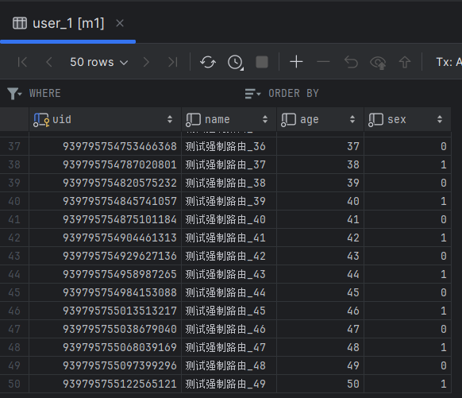

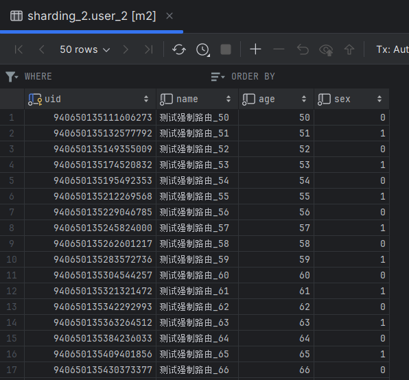


## 广播表
见名思意，就是在所有的数据库中都会存在的表，它一般是字典表。对他写的操作，会同步到所有库中。配置如下:
```properties
# 广播表, 见名思意，就是每个数据库中都会全量存一份的表
# 一般是配置表，表中数据变化比较少，关联次数比较多的表
spring.shardingsphere.sharding.broadcast-tables=dict
# 配置主键生成策略
spring.shardingsphere.sharding.tables.dict.key-generator.column=did
spring.shardingsphere.sharding.tables.dict.key-generator.type=SNOWFLAKE
```
由于比较简单，不再测试

## 总结
至此，几种分片策略已经演示完毕。标准和复合策略在项目中使用的最多。
关于分库分表，尽量在系统设计之初做。如果是现有系统，在现有可用的手段用尽之前（缓存，ES）不要考虑分库分表,带来的维护成本将非常大。


## 读写分离
ShardingSphere 使用读写分离比较简单，只需配置主从关系即可。
### 配置
```properties
# 读写分离配置示例
spring.shardingsphere.datasource.names=m1,s1
spring.shardingsphere.datasource.m1.type=com.alibaba.druid.pool.DruidDataSource
spring.shardingsphere.datasource.m1.driver-class-name=com.mysql.cj.jdbc.Driver
spring.shardingsphere.datasource.m1.url=jdbc:mysql://192.168.11.12:3340/sharding_1?serverTimezone=GMT%2B8
spring.shardingsphere.datasource.m1.username=root
spring.shardingsphere.datasource.m1.password=123456

spring.shardingsphere.datasource.s1.type=com.alibaba.druid.pool.DruidDataSource
spring.shardingsphere.datasource.s1.driver-class-name=com.mysql.cj.jdbc.Driver
spring.shardingsphere.datasource.s1.url=jdbc:mysql://192.168.11.12:3341/sharding_1?serverTimezone=GMT%2B8
spring.shardingsphere.datasource.s1.username=root
spring.shardingsphere.datasource.s1.password=123456


# ds0 是自定义的主从规则, 同时指定了主库是m1
spring.shardingsphere.sharding.master-slave-rules.ds0.master-data-source-name=m1
# 从库可以有多个，这里只配一个s1
spring.shardingsphere.sharding.master-slave-rules.ds0.slave-data-source-names[0]=s1

# 设置需要读写分离的表
spring.shardingsphere.sharding.tables.dict.actual-data-nodes=ds0.dict
# 配置主键生成策略
spring.shardingsphere.sharding.tables.dict.key-generator.column=did
spring.shardingsphere.sharding.tables.dict.key-generator.type=SNOWFLAKE


spring.shardingsphere.props.sql.show = true
spring.main.allow-bean-definition-overriding=true

```

### 测试插入
```java
/**
 * 测试读写分离插入
 */
@Test
public void insertDict() {
    Dict dict = new Dict();
    dict.setType(1);
    dict.setKeyword(1);
    dict.setValue("使用账号密码登录");
    dictMapper.insert(dict);

    dict = new Dict();
    dict.setType(1);
    dict.setKeyword(2);
    dict.setValue("使用短信验证码登录");
    dictMapper.insert(dict);

    dict = new Dict();
    dict.setType(2);
    dict.setKeyword(1);
    dict.setValue("开启设备绑定");
    dictMapper.insert(dict);

    dict = new Dict();
    dict.setType(2);
    dict.setKeyword(2);
    dict.setValue("关闭设备绑定");
    dictMapper.insert(dict);
}
```

运行方法，控制台如下输出:

```txt
2023-12-10 17:21:28.567  INFO 22224 --- [main] ShardingSphere-SQL: Actual SQL: m1 ::: INSERT INTO dict  ( did, type, keyword, value )  VALUES  (?, ?, ?, ?) ::: [1733778949163016193, 1, 1, 使用账号密码登录]
```

可以看到插入只在主库

### 测试查询

```java
/**
 * 测试读写分离查询
 */
@Test
public void queryDict() {
    QueryWrapper<Dict> wrapper = new QueryWrapper<>();
    wrapper.eq("type", 2).eq("keyword", 2);
    List<Dict> dicts = dictMapper.selectList(wrapper);
    for (Dict dict : dicts) {
        System.out.println(dict);
    }
}
```

控制台输出如下:
```txt
2023-12-10 17:23:08.519  INFO 9584 --- [main] ShardingSphere-SQL: Actual SQL: s1 ::: SELECT  did,type,keyword,value  FROM dict WHERE (type = ? AND keyword = ?) ::: [2, 2]

Dict{did=1733778950933012482, type=2, keyword=2, value='关闭设备绑定'}
```
可以看出查询只在从库 s1


> 联系方式: dccmmtop@foxmail.com