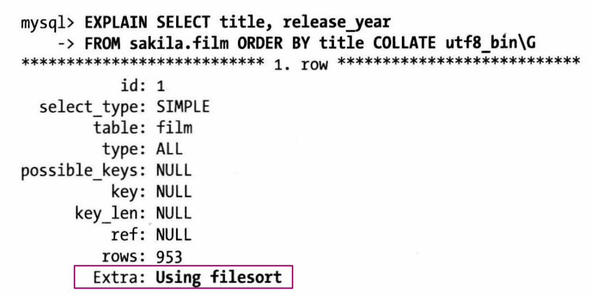

## 什么是字符集，什么是排序规则

字符集是只从二进制编码到某类字符符号的映射，该字符集的排序规则简称校对，
如 ASCII码，一个字节就可以表示一个英文字母，参照ASCII码表

### 为什么需要字符集
因为人类无法直接理解二进制所表示的含义，需要转换

### 多字节字符集

一个字符占用超过一个字节的字符集叫做多字节字符集
例如 UTF-8

### 常见字符集
1，ASCII码：一个英文字母（不分大小写）占一个字节的空间，一个中文汉字占两个字节的空间。

2，UTF-8编码：一个英文字符等于一个字节，一个中文（含繁体）等于三个字节。中文标点占三个字节，英文标点占一个字节

3，Unicode编码：一个英文等于两个字节，一个中文（含繁体）等于两个字节。中文标点占两个字节，英文标点占两个字节

## MySQL 为什么提供那么多的字符集，为什么不统一使用UTF-8
**为了性能**

在某些情况下可以节省空间，提高效率，例如某个字段只有阿拉伯语，直接使用 cp1256 字符集，该字符集只需一个字节就可以存下所有阿拉伯字符。
如果使用UTF-8字符集，会消耗更多的空间

## MySQL 是如何设置字符集的

### 创建对象时（建库、建表、建列）

库 > 表 > 列，每个范围上都有自己的字符集设置，采用的时继承关系。如果没有明确指定字符集，则继承上一级的。

### 客户端和服务器通信时

- 服务器端总是假设客户端是按照character set client设置的字符来传输数据和SQL语句的。
- 当服务器收到客户端的SQL语句时，它先将其转换成字符集character_set_connection。它还使用这个设置来决定如何将数据转换成字符串。
- 当服务器端返回数据或者错误信息给客户端时，它会将其转换成character_set_result。
如图：

### MySQL 如何比较字符串大小
先将字符串转换成相同的字符集，如果字符集不兼容，会抛出错误，在MySQL 5.0 及以后，这个转换动作是自动进行的。

## 字符集对查询的影响

### 可能无法使用索引排序，退化到文件排序
只有排序查询要求的字符集与保存到服务器上数据的字符集相同的时候，才会使用索引排序。
例子：film 表有字段 title, 使用的是 utf8_general_ci 排序规则。现有查询要求 title 字段按照 utf8_bin 排序

这中情况下无法使用索引排序，只能用 文件排序

### 可能无法使用索引进行关联表
为了适应各种字符集，MySQL在查询的时候可能会进行字符集转换，例如，在使用不同字符集的列去关联两张表的时候，mysql会尝试转换其中一个列的字符集，这和在列外面封装一个函数一样，会让mysql无法使用该列上的索引

## 对字符长度的处理

UTF-8 是一种多字节编码，一个字符所占的空间可能是 1、2、3个字节(不是固定的)。但是在MySQL内部，通常使用固定的空间来存储，这样做的目的是希望总是保证缓存中有足够的空间来存储字符串，例如一个 UTF-8的char(10)需要30个字节。
`LENGTH()` >= `CHAR_LENGTH()`,  `LENGTH()` 计算字节长度， `CHAR_LENGTH()` 返回字符的个数