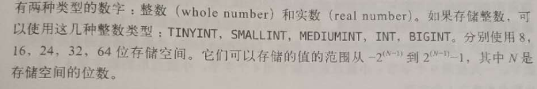
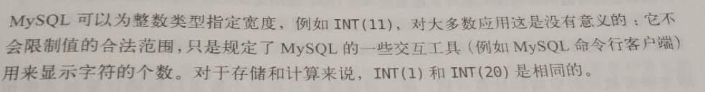

# 基本类型以及范围
## 选择优化的数据类型

MySQL 支持的数据类型非常多，选择正确的数据类型对于获得高性能至关重要。不管
存储哪种类型的数据，下面几个简单的原则都有助于做出更好的选择。

### 更小的通常更好。
一般情况下,应该尽量使用可以正确存储数据的最小数据类型二。更小的数据类型通
常更快，因为它们占用更少的磁盘、内存和 CPU 缓存，并且处理时需要的 CPU 周
期也更少。

但是要确保没有低估需要存储的值的范围，因为在 schema 中的多个地方增加数据类
型的范围是一个非常耗时和痛苦的操作。如果无法确定哪个数据类型是最好的，就
选择你认为不会超过范围的最小类型。(如果系统不是很忙或者存储的数据量不多，
或者是在可以轻易修改设计的早期阶段，那之后修改数据类型也比较容易) 。

### 简单就好
简单数据类型的操作通常需要更少的 CPU 周期。例如，整型比字符操作代价更低，
因为字符集和校对规则 (排序规则)使字符比较比整型比较更复杂。这里有两个例子:
一个是应该使用 MySQL 内建的类型圭 而不是字符串来存储日期和时间，另外一个
是应该用整型存储 卫 地址。稍后我们将专门讨论这个话题。

### 尽量避免 NULL
很多表都包含可为 NULL (空值) 的列，即使应用程序并不需要保存 NULL 也是如此，
这是因为可为 NULL 是列的默认属性主:。通常情况下最好指定列为 NOT NULL, 除非真
的需要存储 NULL值。
如果查询中包含可为 NULL 的列，对 MySQL 来说更难优化，因为可 NULL 的列使
得索引、索引统计和值比较都更复杂。可为 NULL 的列会使用更多的存储空间，在
MySQL 里也需要特殊处理。当可为 NULL 的列被索引时，每个索引记录需要一个额
外的字节，在 MyISAM 里甚至还可能导致固定大小的索引(例如只有一个整数列的
索引) 变成可变大小的索引。
通常把可为 NULL 的列改为 NOT NULL 带来的性能提升比较小，所以 (调优时) 没有
必要首先在现有 schema 中查找并修改掉这种情况，除非确定这会导致问题。但是，
如果计划在列上建索引，就应该尽量避免设计成可为 NULL 的列。
## 整数类型
|   类型    | 存储空间 |      |
| :-------: | :------: | :--: |
|  TINYINT  |    8     |      |
| SMALLINT  |    16    |      |
| MEDIUMINT |    24    |      |
|    INT    |    32    |      |
|  BIGINT   |    64    |      |

## 字符串
### VARCHAR
VARCHAR 类型用于存储可变长字符串，是最常见的字符串数据类型。它比定长类型
更节省空间，因为它仅使用必要的空间 (例如，越短的字符串使用越少的空间) 。有
一种情况例外，如果 MySQL 表使用 ROW_FORMAT=FIXED 创建的话，每一行都会使用
定长存储，这会很浪费空间。

VARCHAR需要使用 1 或 2 个额外字节记录字符串的长度 : 如果列的最大长度小于或
等于 255 字节, 则只使用 1 个字节表示, 否则使用 2 个字节。假设采用 latinl 字符集，
一个 VARCHAR(16) 的列需要 11 个字节的存储空间。**VARCHAR(1069) 的列则需要 1002
个字节，因为需要 2 个字节存储长度信息。**

VARCHAR节省了存储空间，所以对性能也有帮助。但是，由手答是变长的，在
UPDATE 时可能使行变得比原来更长，这就导致需要做额外的工作。如果一个行占用
的空间增长，并且在页内没有更多的空间可以存储，在这种情况下，不同的存储引
人擎的处理方式是不一样的。例如，MyISAM 会将行拆成不同的片段存储，InnoDB
则需要分裂页来使行可以放进页内。其他一些存储引擎也许从不在原数据位置更新
数据。

下面这些情况下使用VARCHAR是合适的 : 字符串列的最大长度比平均长度大很多 ，
列的更新很少，所以碎片不是问题 ， 使用了像 UTF-8 这样复杂的字符集，每个字符
都使用不同的字节数进行存储。

### CHAR                  
CHAR 类型是定长的 : MySQL 总是根据定义的字符串长度分配足够的空间。当存储
[CHAR值时全MYSQI研删除所有的末尾空格上(在 MySQL 4.1 和更老版本中 VARCHAR
也是这样实现的一 也就是说这些版本中 CHAR 和 VARCHAR 在逻辑上是一样的，区
别只是在存储格式上) 。 CHAR值佐根据需要采用空格进行填充以方便比较
EEAR适咎存储很知的字符十|或者所有值都接近同一个长度。例如，CHAR 非常适

合存储密码的 MD5 值，因为这是一个定长的值。对于经常变更的数据，CHAR也比
VARCHAR更好，因为定长的 CHAR 类型不容易产生碎片。对于非常短的列，CHAR 比
VARCHAR 在存储空间上也更有效率。例如用 CHAR(1) 来存储只有 Y 和N的值，如果
采用单字节字符集二 只需要一个字节，但是 VARCHAR(1) 却需要两个字节，因为还有
一个记录长度的额外字节。

## 慷慨是不明智的

使用 VARCHAR(5) 和 VARCHAR(290) 存储“heLLo' 的空间开销是一样的。那么使用更
短的列有什么优势吗?

事实证明有很大的优势。更长的列会消耗更多的内存，因为 MYSQL 通常会分配固
定大小的内存块来保存内部值。尤其是使用内存临时表进行排序或操作时会特别粳
粒。在利用磁盘临时表进行排序时也同样糟楼。

所以最好的策略是只分配真正需要的空间。

## 日期和时间类型

MySQL 可以使用许多类型来保存日期和时间值，例如 YEAR 和 DATE。MySQL 能存储的
最小时间粒度为秒 (MariaDB 支持微秒级别的时间类型) 。但是 MySQL 也可以使用微秒
级的粒度进行临时运算，我们会展示怎么绕开这种存储限制。

大部分时间类型都没有替代品，因此没有什么是最佳选择的问题。唯一的问题是保
存日期和时间的时候需要做什么。MySQL 提供两种相似的日期类型 : DATETIME 和
TIMESTAMP。对于很多应用程序，它们都能工作，但是在某些场景，一个比另一个工作
得好。让我们来看一下。

### DATETIME
这个类型能保存大范围的值，从 1001 年到 9999 年，精度为秒。它把日期和时间封
装到格式为YYYYMMDDHHMMSS 的整数中，与时区无关。使用8 个字节的存储
空间。
默认情况下，MySQL 以一种可排序的、无歧义的格式显示 DATETIME值，例如
“2008-01-16 22:37:08"。这是 ANSI 标准定义的日期和时间表示方法。

### TIMESTAMP
就像它的名字一样，TIMETAMP 类型保存了从 1970 年 1 月 1 日午夜 格林尼治标准
时间) 以来的秒数,它和 UNIX 时间戳相同。TIMESTAMP 只使用 4 个字节的存储空间，
因此它的范围比 DATETIME 小得多 : 只能表示从 1970 年到 2038 年。MySQL 提供了
FROM_UNIXTINME() 函数把 Unix 时间戳转换为日期，并提供了 UNIX_TIMESTAMP() 函
数把日期转换为 Unix 时间发。
MySQL 4.1 以及更新的版本按照 DATETIME 的方式格式化 TIMESTAMP 的值，但是
MySQL 4.0 以及更老的版本不会在各个部分之间显示任何标点符号。这仅仅是显示
格式上的区别，TIMESTAMP 的存储格式在各个版本都是一样的。
TIMESTAMP 显示的值也依赖于时区。MyYSQL 服务器、操作系统，以及客户端连接都
有时区设置。
因此，存储值为 0 的 TIMESTAMP 在美国东部时区显示 “1969-12-31 19:00:00", 45
格林尼治时间差 5 个小时。有必要强调一下这个区别 : 如果在多个时区存储或访问
数据，TIMESTAMP 和 DATETIME 的行为将很不一样。前者提供的值与时区有关系，后
者则保留文本表示的日期和时间。
TIMESTAMP 也有 DATETIME 没有的特殊属性。默认情况下，如果插和人时没有指定第一
个TIMESTAMP 列的值,MySQL 则设置这个列的值为当前时间"。 在插入一行记录时，
MySQL 默认也会更新第一个 TIMESTAMP 列的值 (除非在 UPDATE 语句中明确指定了
值)。你可以配置任何 TIMESTAMP 列的插入和更新行为。最后，TIMESTAMP 列默认为
NOT NULL，这也和其他的数据类型不一样。

除了特殊行为之外, 通常也应该尽量使用 TIMESTAMP，因为它比 DATETIME 空间效率更高。
有时候人们会将 Unix 时间截存储为整数值，但这不会带来任何收益。用整数保存时间
截的格式通常不方便处理，所以我们不推荐这样做。

如果需要存储比秒更小粒度的日期和时间值怎么办? MySQL 目前没有提供合适的数据
类型，但是可以使用自己的存储格式 : 可以使用 BIGINT 类型存储微秒级别的时间截，或
者使用DOUBLE 存储秒之后的小数部分。这两种方式都可以，或者也可以使用 MariaDB

