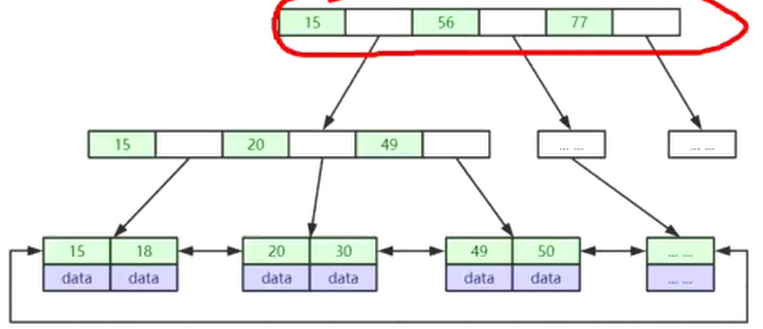
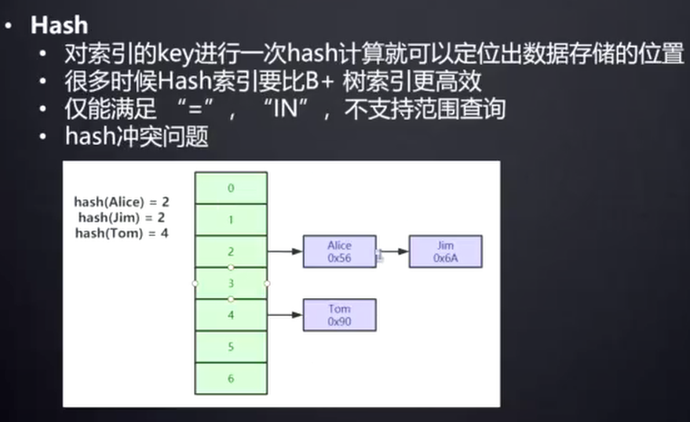
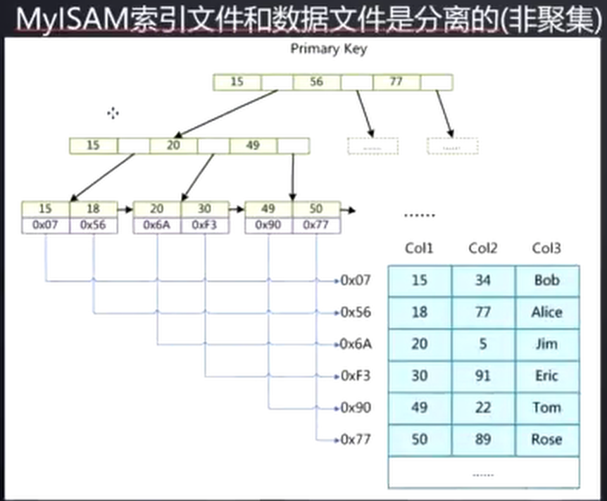
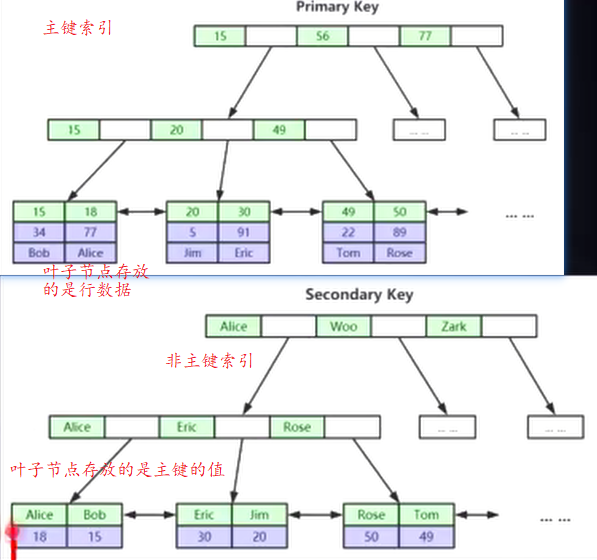

索引是帮助MySQL高效获取数据的排好序的数据结构

索引树的构建， 本质上是控制树的高度

二叉树： 顺序插入时，等同链表

红黑树（平衡二叉树）： 虽然会自动平衡节点位置，但仍然高度不可控。表比较大时会导致书的高度很高。增加查找次数

### 为什么最终选择B+树  而不是B树

B+树将数据全部放到叶子节点，留下更多的空间放 key, key 越多，宽度越宽，同样的数据量，宽度越大，高度越小。查找次数就越小。

在水平方向在内存中使用二分查找的效率远远大于从磁盘中加载一页数据， 所以我们希望树越宽越好，而不是越高越好

存储引擎是在表级别上生效的，不是是数据库级别

B+ 树叶子节点有双向指针，方便范围查询， 只需找到范围的边界，即可快速的便利整个范围

B 树叶子节点没有指针，只能每次都从根节点查找范围内的每一个数据

### Hash 索引

### 数据库文件

#### MyISAM 引擎

- frm:  表结构相关, frame（框架） 缩写`
- MYD: MyISAM Data 表数据
- MYI: MyISAM Index 表索引

索引结构中的叶子节点的 data 存放的是 数据行的位置，及这一行在 MYD 文件的位置， 而不是直接放的真实数据

### InnoDB

- frm 表结构信息
- ibd 表数据加索引
#### 表数据组织形式

表结构本身就是按照 B+ Tree 结构存储， 叶子节点放的是出索引列其他列的数据

### 聚集与非聚集索引

叶子节点直接包含整行数据的叫做聚集索引 (InnoDB 主键索引)
叶子节点不包含整行数据的叫做非聚集索引 (MyISAM 索引)

索引与数据文件分开储存叫做非聚集索引 反之叫做聚集索引

单从索引结构的来看，聚集索引的查找速度高于非聚集索引

InnoDB 只有一个聚集索引，默认是主键索引， 非主键索引的叶子节点存放的是主键的值，如下图

这样做的目的有两个：
- 1. 节约空间，避免将整行的数据存放多份
- 2. 保证数据的一致性，否则每增加一行，对应的每个索引都要维护一份行数据。必须要等到每个索引都更新完，数据才能插入成功

### 为什么建议InnoDB 表必须有主键，并且是整型自增的？

InnoDB 整个表的数据就是用B+ 树组织的，如果存在主键，就用主键为索引，叶子节点存储行数据
如果没有主键，InnoDB 就会找到一个每行数据都不相同的列作为索引来组织整个表的数据
如果没有找到这种列，就会建一个隐藏的列，自动维护值，用这个隐藏的列来组织数据， 
所以我们要主动做这种工作 减少数据库的负担

#### 为什么是整型

因为在查找数据的过程中，需要多次比较大小，整型的比较运算速度大于字符串， 并且占用空间小    

#### 为什么是自增
- 避免叶子节点的分裂
- 避免B+ 树做平衡调整
