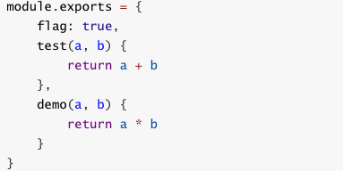
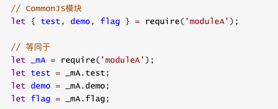
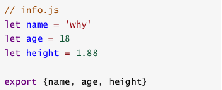
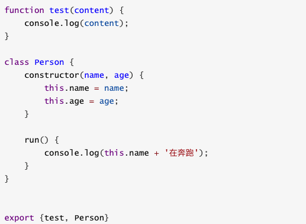
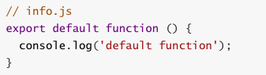
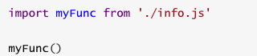
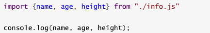
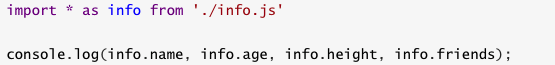

# JS 模块化(导出导入)

## CommonJS

### 导出

### 导入

## es6

### 导出 export  的用法

#### 导出变量

或者

#### 导出函数或类

#### export default

某些情况下，一个模块中包含某个的功能，我们并不希望给这个功能命名，而且让导入者可以自己来命名
这个时候就可以使用export default

我们来到main.js中，这样使用就可以了
这里的myFunc是我自己命名的，你可以根据需要命名它对应的名字

**export default在同一个模块中，不允许同时存在多个**。

### 导入 import 用法

import指令用于导入模块中的内容

如果我们希望某个模块中所有的信息都导入，一个个导入显然有些麻烦：
通过 * 可以导入模块中所有的export变量
但是通常情况下我们需要给 * 起一个别名，方便后续的使用

